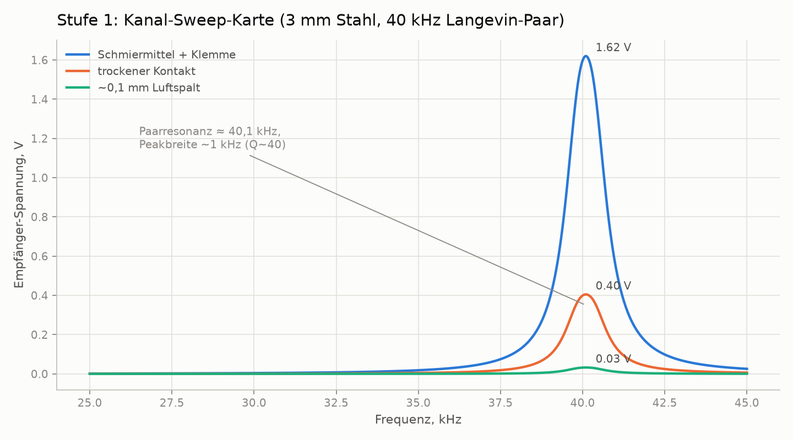
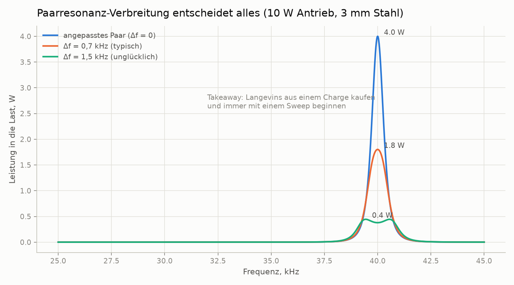
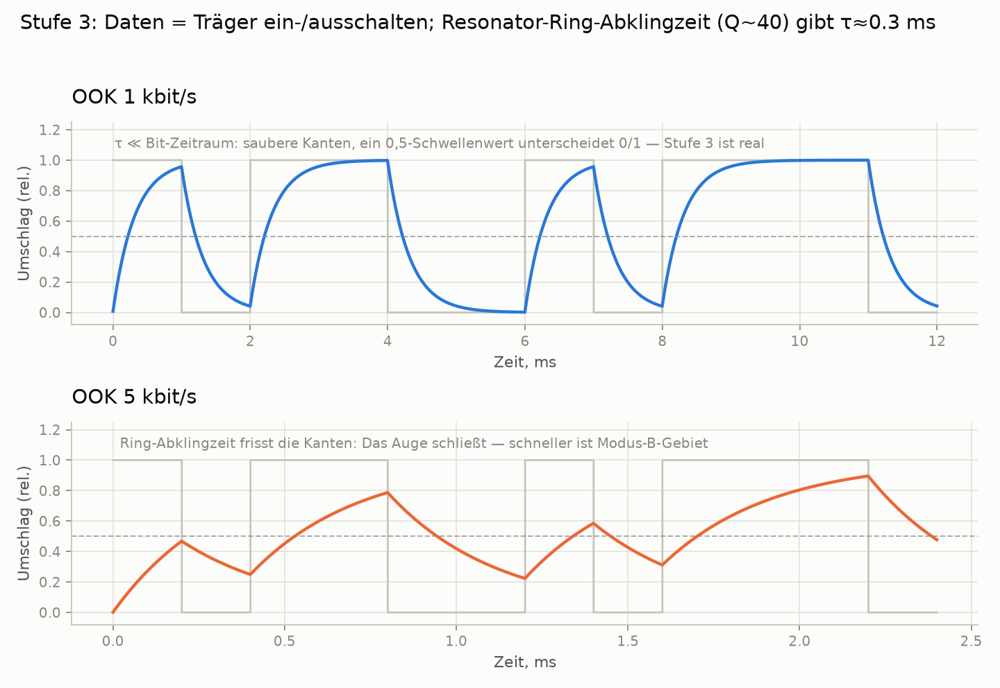
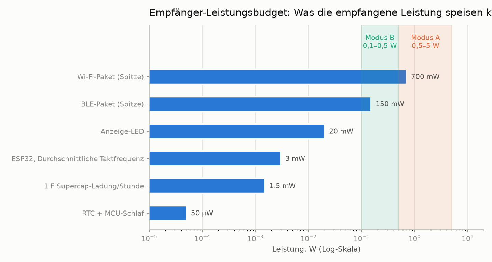

# through-metal-link

> [English (primary)](README.md) · [Русский](README.ru.md) · Deutsch

Eine offene Plattform für die Übertragung von ultrasonischer Energie und Daten durch feste Metallwände — "durch Stahl ohne ein einziges Loch", erstellt mit garage-gradigen Mitteln.

**Status:** Stadium 0 — Vorbereitung · Repository bleibt privat, bis die ersten reproduzierbaren Ergebnisse vorliegen · Einkaufsliste: [QUICKSTART.md](QUICKSTART.md)

[](https://github.com/zeloras/through-metal-link/actions/workflows/ci.yml) [](https://github.com/zeloras/through-metal-link/actions/workflows/reuse.yml)

Dokumente sind zweisprachig: Englisch ist die primäre Sprache, russische Zwillinge leben in `*.ru.md`-Dateien. Bearbeiten Sie entweder die Sprache — CI übersetzt und committet die andere (siehe [CONTRIBUTING.md](CONTRIBUTING.md)).

<p align="center"></p>

## Die Idee in einem Absatz

RadioWellen können nicht durch Metall (Faraday-Käfig) und eine Kabeldurchführung bedeutet ein Loch, ein Siegel und einen Fehlerpunkt. Ultraschall hingegen kann durch Metall ohne Probleme reisen: Ein Piezo-Element auf jeder Seite der Wand verwandelt es in einen Kanal für Energie (Watt durch 3–5 mm Stahl) und Daten (kbit/s). Die Physik ist bewiesen (RPI: 50 W + 12 Mbit/s durch 63 mm Stahl; NASA JPL: ~kW durch 5 mm Titan), die grundlegenden Patente sind abgelaufen und es gibt keine offene Plattform — dieses Repository baut eine auf.

## Roadmap

| Stadium | Lieferbare | Erfolgskriterium | Erwartung |
|---|---|---|---|
| 1. Sweep-Karte | Frequenzantwort des "Langevin–3 mm Stahl–Langevin"-Kanals | Paarresonanz gefunden, Plot in [experiments/001](experiments/001-sweep-map-3mm-steel/README.md) | [sim1](docs/img/sim1-sweep-contacts.de.png), [sim2](docs/img/sim2-pair-mismatch.de.png) |
| 2. Watt | Leistung im Lastkreis bei Resonanz | ≥0,5 W durch 3 mm Stahl | [sim4](docs/img/sim4-power-budget.de.png) |
| 3. Daten | FSK/OOK über das gleiche Paar | ≥1 kbit/s fehlerfrei | [sim5](docs/img/sim5-ook-datarate.de.png) |
| 4. Knoten | ESP32 + Sensor in einer verschweißten Box, powered und telemetriert durch Schall allein | ≥1 h autonome Betrieb | [sim4](docs/img/sim4-power-budget.de.png) |
| 5. Veröffentlichung | Repository wird öffentlich, Artikel/Anleitung | Reproduktion durch eine dritte Partei | — |

## Repository-Karte

Jeder Block unten expandiert: Darin ist eine Zusammenfassung, die ausreicht, um zu arbeiten, plus ein Link zum vollständigen Dokument.

<details>
<summary><b>🛒 Von Null auf einen funktionierenden Rig: Was zu kaufen und in welcher Reihenfolge</b> — <a href="QUICKSTART.md">QUICKSTART.md</a></summary>

**Budget:** ~210 $ Minimum, ~300 $ komfortabel (abziehen ~120 $, wenn Sie bereits einen Pi, einen Lötkolben und eine Labor-Netzgeräte besitzen). Drei Körbe: Werkzeuge (~120 $), Rig-Elektronik (~70 $, [vollständige Stückliste](hardware/bom/bom-stage1.csv)), Mechanik (~20 $). Optional, aber stark empfohlen: ein USB-Oszilloskop (~60–80 $).

**Kritischer Pfad — AliExpress-Versand (3–4 Wochen):** Bestellen Sie die Elektronik am ersten Tag. Schlüsselentscheidung: Kaufen Sie **4 Langevin-Wandler aus dem gleichen Charge** — die Sweep-Karte wählt das beste Paar ([warum](docs/img/sim2-pair-mismatch.de.png)).

**Während es versendet wird:** Durchlaufen Sie die Pipeline ohne Hardware —
```bash
python3 software/sweep-map/sweep_map.py --mock
```
**Der Rig gilt als funktionierend, wenn:** (1) der Sweep-Spitzenwert sich über zwei Durchläufe innerhalb von <200 Hz reproduziert; (2) ≥0,5 W in der Last durch 3 mm Stahl; (3) die LED hinter der Platte leuchtet, Foto in experiments/001.

</details>

<details>
<summary><b>📚 Theorie in einer Minute</b> — <a href="docs/00-theory.md">docs/00-theory.md</a></summary>

Das Piezo-TX wird gegen die Wand gedrückt und treibt eine longitudinale Welle in sie; das Piezo-RX auf der anderen Seite wandelt es zurück in Elektrizität. Geschwindigkeit des Schalls in Stahl: ~5900 m/s.

Zwei Betriebsmodi:

| Modus | Frequenz | Resonanz festgelegt durch | Ertrag | Status |
|---|---|---|---|---|
| **A** — Langevin-Wandler | 40 kHz | das Wandlerpaar (Wand ≪ λ — eine "Membran") | Watt, kbit/s | Startmodus (Stadien 1–4, [ADR-0001](docs/decisions/0001-vybor-chastotnogo-rezhima.md)) |
| **B** — Scheiben | 0,6–1 MHz | Dicke-Resonanz der Wand ([Kamm](docs/img/sim3-thickness-comb.de.png)) | Hunderte von mW, Hunderte von kbit/s | Zweig nach den ersten Watt; benötigt automatische Frequenzverfolgung |

Die Hauptverluste: Resonanzmismatch innerhalb des Paares (±1 kHz für billige Langevin-Wandler), akustische Kontaktqualität (Epoxy > Schmiermittel + Klemme > trockener Druck), Fehlausrichtung, Resonanzdrift mit Temperatur. Die Antwort auf all dies ist dieselbe: **eine Sweep-Karte vor jeder Änderung der Einrichtung**.

</details>

<details>
<summary><b>📈 Was der Rig zeigen sollte: Erwartungsplots vom Simulator</b> — <a href="software/simulator/channel_sim.py">software/simulator/channel_sim.py</a></summary>

Ein semi-empirisches Kanalmodell (nicht FEM — Intuition für "was die Sweep-Karte zeigen und was zu erwarten ist"). Regenerieren mit: `python3 channel_sim.py --out ../../docs/img`.

**Stadium 1 — Sweep.** Ein schmaler Peak nahe ~40 kHz; Schmiermittel + Klemme ergibt ~4× trockenen Druck und ~50× eine Luftlücke. Kein Peak bedeutet ein Problem mit dem Kontakt oder dem Paar:


**Warum 4 Langevin-Wandler, nicht 2.** Ein Resonanzmismatch von 1,5 kHz innerhalb des Paares reduziert die Leistung um den Faktor 10:


**Stadium 3 — Daten.** OOK läuft in Resonator-Klingeln (Q~40 → τ≈0,3 ms): 1 kbit/s ist sauber, bei 5 kbit/s ist das Auge geschlossen. Schneller gehen bedeutet Modus B:


**Empfänger-Leistungsbudget.** Modus A speist alles bis zu Wi-Fi-Spitzen; Modus B speist einen ESP32 mit einem Supercapacitor-Puffer:


**Für später (Modus B).** Die Platte wird transparent bei einer Kamm von Dicken-Resonanzen — die Frequenz muss verfolgt werden:


</details>

<details>
<summary><b>⚠️ Sicherheit — lesen Sie vor dem ersten Einschalten</b> — <a href="docs/02-safety.md">docs/02-safety.md</a></summary>

1. **Hunderte von Volt auf dem Piezo** bei Resonanz — der TVS auf der Empfängerseite geht vor dem ersten Einschalten hinein; halten Sie Ihre Hände von den Leitungen fern.
2. **Netz** — nur durch eine Labor-Netzgeräte / Isolation; Ultraschallreiniger-Steuerbretter sind galvanisch mit dem Netz verbunden.
3. **Ohren** — betreiben Sie Wandler nur, wenn sie gegen Metall gedrückt sind; betreiben Sie nie hochleistungsfähigen Luftultraschall ohne Gehäuse.
4. **Hitze** — ein ungesicherter Langevin-Wandler überhitzt in Minuten; überprüfen Sie die Sicherung vor dem Einschalten.
5. **Splitter** — Piezokeramik ist spröde: ein überzogener Bolzen oder ein Aufprall bedeutet Splitter; tragen Sie Schutzbrille für jede mechanische Arbeit.

Erstes Einschalten des Treibers: Setzen Sie die Strombegrenzung der Labor-Netzgeräte auf 0,2 A.

</details>

<details>
<summary><b>🧭 Vorheriger Stand und Patentreinheit</b> — <a href="docs/01-prior-art.md">docs/01-prior-art.md</a></summary>

Jede technische Entscheidung muss auf eine "freie" Quelle (abgelaufene Patente, Papier) zurückverfolgt werden. Die Grundlage: **US5982297** (Aerospace Corp — das grundlegende Rezept für ein durch die Wand gehendes Piezo-Paar), **US7902943** (Caltech/JPL — Sherrits Feed-through), **US9361877** (Univ. Oklahoma — ein vollständiges Transceiversystem); alle tot. Schlüsselpapiere: Lawry 2013 (50 W + 12,4 Mbit/s durch 63,5 mm Stahl), Sherrit/NASA (eine 100-W-Lampe), Yang 2015 (Überblick).

Nicht zu kopieren, solange sie noch leben (US-only, bis ~2032; Stadien 1–4 benötigen es nicht): RPI-OFDM-Zuweisung, RPI-Voll_duplex-Schema, Drexel-Konformalwandler.

Architektur-Entscheidungen werden in [docs/decisions/](docs/decisions/0001-vybor-chastotnogo-rezhima.md) (ADR) aufgezeichnet.

</details>

<details>
<summary><b>🔌 Hardware und Firmware</b> — hardware/, firmware/</summary>

- [hardware/bom/bom-stage1.csv](hardware/bom/bom-stage1.csv) — Einkaufsliste für Stadium 1.
- [hardware/schematics/](hardware/schematics/README.md) — **Schaltpläne** (generiert aus Code): Treiber, Empfänger, Pi-Pinout, Harvester-Knoten.
- [hardware/driver/](hardware/driver/README.md) — TX-Treiber: IR2110-Halbbrücke + 2×IRF540, passender Transformator (ein Langevin-Wandler ist eine kapazitive Last!). KiCad-Platine kommt nach dem Breadboard-Prototyp.
- [hardware/receiver/](hardware/receiver/README.md) — Empfänger, Schritt für Schritt: Schottky-Brücke → ADC (Stadium 1) → Last (Stadium 2) → LTC3588 + Supercapacitor + ESP32 (Stadium 4).
- [firmware/node-esp32/](firmware/node-esp32/README.md) — Stadium 4-Knoten (Stub): Tiefschlaf, Sensor-Auslesen, BLE-Werbung, Budget von 1–5 mW Durchschnitt.

</details>

<details>
<summary><b>💻 Software: Messungen und Simulator</b> — software/</summary>

- [software/sweep-map/sweep_map.py](software/sweep-map/sweep_map.py) — das Stadium-1-Arbeitspferd: DDS-Sweep → ADC-Auslesen → CSV + Frequenzantwort-Plot. Hat `--mock` für einen Lauf ohne Hardware. Auf dem Pi: `raspi-config` → aktivieren Sie SPI und I2C; `pip install spidev smbus2 matplotlib`.
- [software/simulator/channel_sim.py](software/simulator/channel_sim.py) — Generator der Erwartungsplots (`pip install numpy matplotlib`).
- [data/](data/README.md) — Roh-Logs; CSV/PNG bleiben außerhalb von Git, nur kuratierte Plots gehen in Git innerhalb des Experiment-Verzeichnisses.

</details>

<details>
<summary><b>🗺️ Wo man dies anwenden kann: Barrieren, Kanäle, Nischen</b> — <a href="docs/04-hybrid-channels.md">docs/04</a>, <a href="docs/05-applications-map.md">docs/05</a></summary>

Es gibt keinen universellen Kanal — die Plattform passt die Physik an die Barriere an: piezo-akustisch (primär: Stahl/Aluminium mit Kontakt — Watt und kbit/s), EMAT (schmutziges/heißes Metall, kein Kontakt — Daten), niedrige Frequenz-Magnetik (Vakuum-Sandwich-Wände von Dewars — Bits/s). Ehrliche Sackgassen: gummierte/verbundene Wände, sprudelnde Flüssigkeit im Weg.

Nischen-Priorität: **(1)** Labor-Vakuumkammern und Kryostate — das Open-Source-Hardware-Publikum, keine Zertifizierungen; **(2)** Fermentations-Tanks — ein Beweisgrund innerhalb von Gehweite; **(3)** versiegelte Batterie-Packs — der Flaggschiff-Fall (Thermal-Runaway-Erkennung ohne Penetration in das Pack). Das Empfänger-Entdeckungs- und Auto-Tuning-Protokoll (ein Qi-Analog): [docs/03-discovery-protocol.md](docs/03-discovery-protocol.md).

</details>

<details>
<summary><b>📁 Verzeichnis-Layout</b></summary>

```
docs/            Theorie, Vorheriger Stand, Sicherheit, Anwendungen, Entscheidungs-Log (ADR)
docs/img/        Erwartungsplots (generiert von software/simulator/channel_sim.py)
hardware/        Stückliste, Treiber (Halbbrücke), Empfänger (Gleichrichter/Harvester)
firmware/        Knoten-Firmware (ESP32 — Stub bis Stadium 4)
software/        Messskripte (Frequenzantwort-Sweep-Karte) und Kanal-Simulator
experiments/     Experiment-Protokolle — von der Vorlage, ein Verzeichnis = ein Experiment
data/            Roh-Logs (große Dateien bleiben außerhalb von Git)
```

</details>

## Prinzipien

1. **Reproduzierbarkeit von Null.** Jeder mit einem Lötkolben und ~210 $ kann das Ergebnis aus diesem Repository allein reproduzieren.
2. **Jedes Experiment ist ein Protokoll.** Kein "es funktioniert irgendwie": [experiments/TEMPLATE.md](experiments/TEMPLATE.md) ist obligatorisch.
3. **Patentreinheit.** Wir bauen auf der abgelaufenen Schicht ([docs/01-prior-art.md](docs/01-prior-art.md)); Entscheidungen werden in [docs/decisions/](docs/decisions/0001-vybor-chastotnogo-rezhima.md) aufgezeichnet.
4. **Messung vor Meinung.** Eine Sweep-Karte vor jedem Schluss über den Kanal.

## Lizenzen und Patente

Code — Apache-2.0, Hardware — CERN-OHL-W v2, Dokumentation — CC-BY-4.0; vollständige Texte in [LICENSES/](LICENSES/). Jeder darf forken und auf diesem aufbauen, kommerziell eingeschlossen; Patentschutz kommt von den Grants und Vergeltungsklauseln in den Lizenzen plus einer Prior-Art-Strategie. Das vollständige Schema und das defensive-Veröffentlichungs-Protokoll: [LICENSES.md](LICENSES.md); Beitrag-Regeln: [CONTRIBUTING.md](CONTRIBUTING.md).
