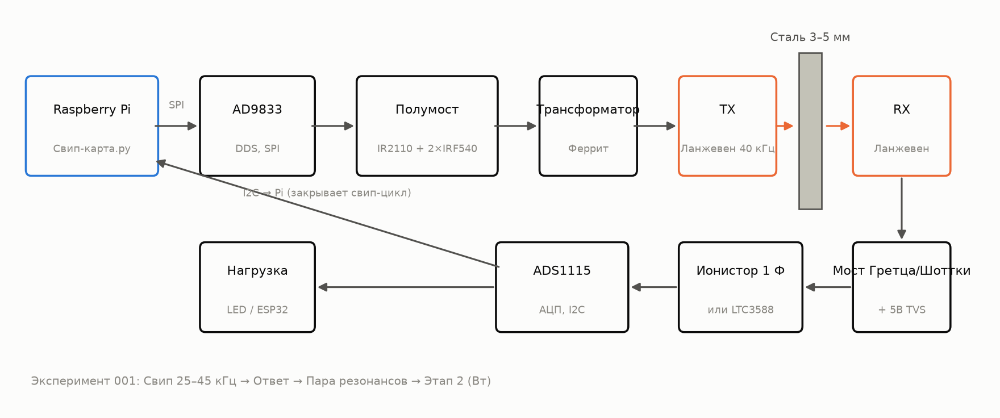
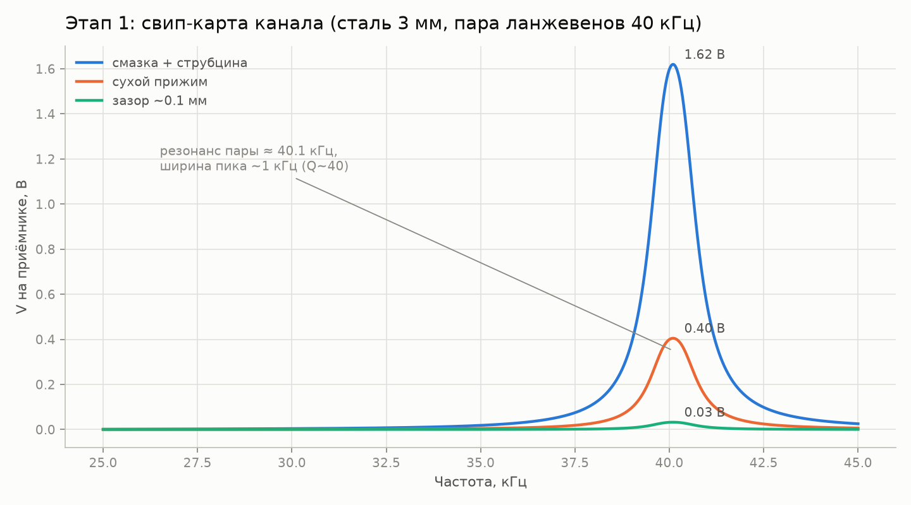
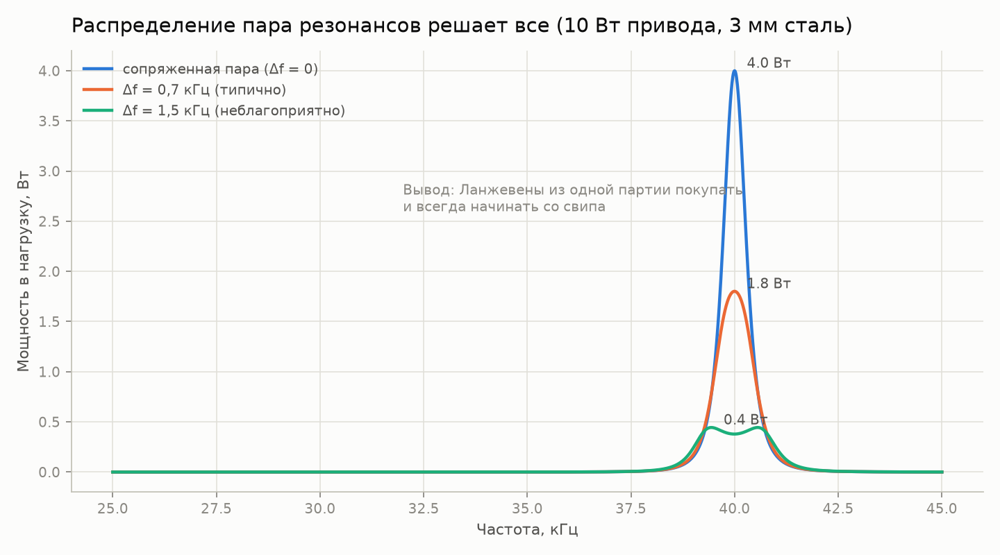
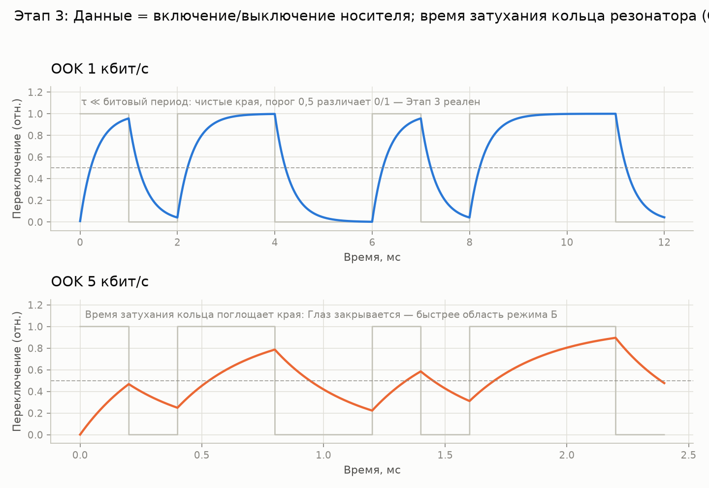
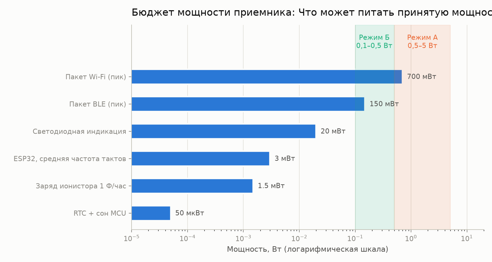
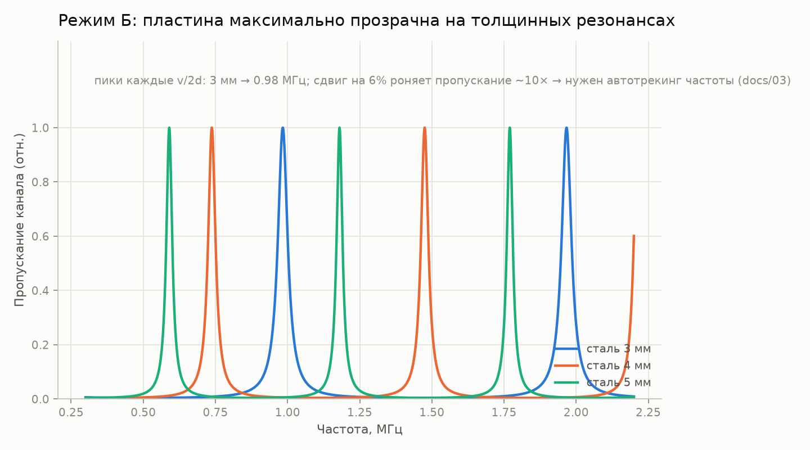

# through-metal-link

> [English (primary)](README.md) · Русский

Открытая платформа передачи энергии и данных ультразвуком через глухие металлические стенки — «сквозь сталь без единого отверстия», в гаражных условиях.

**Статус:** этап 0 — подготовка · репозиторий приватный до первых воспроизводимых результатов · закупка: [QUICKSTART.md](QUICKSTART.ru.md)

[](https://github.com/zeloras/through-metal-link/actions/workflows/ci.yml) [](https://github.com/zeloras/through-metal-link/actions/workflows/reuse.yml)

Доки двуязычны: английский — основной, русские близнецы живут в файлах `*.ru.md`. Правьте любой язык — CI переведёт и закоммитит второй (см. [CONTRIBUTING.ru.md](CONTRIBUTING.ru.md)).

<p align="center"></p>

## Идея в одном абзаце

Радиоволны не проходят через металл (клетка Фарадея), а кабельный ввод — это отверстие, уплотнение и точка отказа. Ультразвук металл проходит отлично: пьезоэлемент с каждой стороны стенки превращает её в канал для энергии (ватты через 3–5 мм стали) и данных (кбит/с). Физика доказана (RPI: 50 Вт + 12 Мбит/с через 63 мм стали; NASA JPL: ~кВт через 5 мм титана), базовые патенты истекли, открытой платформы не существует — этот репозиторий её создаёт.

## Дорожная карта

| Этап | Результат | Критерий успеха | Ожидание |
|---|---|---|---|
| 1. Свип-карта | АЧХ канала «ланжевен–сталь 3 мм–ланжевен» | найден резонанс пары, график в [experiments/001](experiments/001-sweep-map-3mm-steel/README.ru.md) | [sim1](docs/img/sim1-sweep-contacts.ru.png), [sim2](docs/img/sim2-pair-mismatch.ru.png) |
| 2. Ватты | мощность в нагрузку на резонансе | ≥0.5 Вт через 3 мм стали | [sim4](docs/img/sim4-power-budget.ru.png) |
| 3. Данные | FSK/OOK через ту же пару | ≥1 кбит/с без ошибок | [sim5](docs/img/sim5-ook-datarate.ru.png) |
| 4. Узел | ESP32+датчик в заваренной коробке, питание и телеметрия только звуком | автономная работа ≥1 ч | [sim4](docs/img/sim4-power-budget.ru.png) |
| 5. Публикация | открытие репо, статья/инструкция | воспроизведение третьим лицом | — |

## Карта репозитория

Каждый блок ниже раскрывается: внутри — выжимка, достаточная для работы, и ссылка на полный документ.

<details>
<summary><b>🛒 С нуля до стенда: что купить и в каком порядке</b> — <a href="QUICKSTART.ru.md">QUICKSTART.ru.md</a></summary>

**Бюджет:** минимум ~$210, комфорт ~$300 (если уже есть Pi, паяльник и лабораторный БП — минус ~$120). Три корзины: инструменты (~$120), электроника стенда (~$70, [полный BOM](hardware/bom/bom-stage1.csv)), механика (~$20). Опционально, но сильно рекомендуется: USB-осциллограф (~$60–80).

**Критический путь — доставка с Ali (3–4 недели):** электронику заказывать в первый же день. Ключевое решение: ланжевены брать **4 штуки из одной партии** — свип выберет лучшую пару ([почему](docs/img/sim2-pair-mismatch.ru.png)).

**Пока едет:** прогнать пайплайн без железа —

```bash
python3 software/sweep-map/sweep_map.py --mock
```

**Стенд работает, когда:** (1) пик свипа воспроизводится двумя прогонами с точностью <200 Гц; (2) ≥0.5 Вт в нагрузке через 3 мм стали; (3) светодиод за пластиной горит, фото в experiments/001.

</details>

<details>
<summary><b>📚 Теория за минуту</b> — <a href="docs/00-theory.ru.md">docs/00-theory.ru.md</a></summary>

Пьезо-TX прижат к стенке и возбуждает в ней продольную волну; пьезо-RX с другой стороны превращает её обратно в электричество. Скорость звука в стали ~5900 м/с.

Два режима работы:

| Режим | Частота | Резонанс задаёт | Даёт | Статус |
|---|---|---|---|---|
| **А** — ланжевены | 40 кГц | пара трансдьюсеров (стенка ≪ λ — «мембрана») | ватты, кбит/с | стартовый (этапы 1–4, [ADR-0001](docs/decisions/0001-vybor-chastotnogo-rezhima.ru.md)) |
| **Б** — диски | 0.6–1 МГц | толщинный резонанс стенки ([гребёнка](docs/img/sim3-thickness-comb.ru.png)) | сотни мВт, сотни кбит/с | ветка после первых ватт; нужен автотрекинг частоты |

Главные потери: рассовпадение резонансов пары (±1 кГц у дешёвых ланжевенов), качество акустического контакта (эпоксидка > смазка+струбцина > сухой прижим), рассоосность, уход резонанса с температурой. Ответ на всё один: **свип-карта перед каждым изменением сетапа**.

</details>

<details>
<summary><b>📈 Что покажет стенд: графики-ожидания из симулятора</b> — <a href="software/simulator/channel_sim.py">software/simulator/channel_sim.py</a></summary>

Полуэмпирическая модель канала (не FEM — интуиция «что покажет свип и на что рассчитывать»). Перегенерация: `python3 channel_sim.py --out ../../docs/img`.

**Этап 1 — свип.** Узкий пик ~40 кГц; смазка+струбцина даёт ~4× сухого прижима и ~50× зазора. Нет пика — проблема в контакте или паре:



**Почему 4 ланжевена, а не 2.** Рассовпадение резонансов пары на 1.5 кГц роняет мощность в 10 раз:



**Этап 3 — данные.** OOK упирается в звон резонатора (Q~40 → τ≈0.3 мс): 1 кбит/с — чисто, 5 кбит/с — глаз закрыт. Быстрее — только в режиме Б:



**Бюджет приёмника.** Режим А кормит всё вплоть до Wi-Fi-пиков; режим Б — ESP32 с ионисторным буфером:



**На будущее (режим Б).** Пластина прозрачна гребёнкой толщинных резонансов — частоту надо трекать:



</details>

<details>
<summary><b>⚠️ Безопасность — прочитать до первого включения</b> — <a href="docs/02-safety.ru.md">docs/02-safety.ru.md</a></summary>

1. **Сотни вольт на пьезо** на резонансе — TVS на приёмной стороне ставится ДО первого включения, выводы не трогать.
2. **Сеть** — только через лабораторный БП / развязку; драйверы УЗ-ванн гальванически связаны с сетью.
3. **Уши** — работать только с прижатыми к металлу излучателями; мощный воздушный УЗ не включать без корпуса.
4. **Нагрев** — ланжевен без прижима перегревается за минуты; проверять прижим до подачи мощности.
5. **Осколки** — пьезокерамика хрупкая: перетянутый болт или удар = осколки, очки при механических работах.

Первое включение драйвера: ограничение тока БП на 0.2 А.

</details>

<details>
<summary><b>🧭 Prior art и патентная гигиена</b> — <a href="docs/01-prior-art.ru.md">docs/01-prior-art.ru.md</a></summary>

Каждое техническое решение должно прослеживаться к «свободному» источнику (истёкшие патенты, статьи). Фундамент: **US5982297** (Aerospace Corp — базовый рецепт пьезо-пары через стенку), **US7902943** (Caltech/JPL — feed-through Sherrit), **US9361877** (Univ. Oklahoma — полная система трансиверов); все умерли. Ключевые статьи: Lawry 2013 (50 Вт + 12.4 Мбит/с через сталь 63.5 мм), Sherrit/NASA (100-Вт лампа), Yang 2015 (обзор).

Не копируем, пока живо (US-only, до ~2032; этапам 1–4 не нужно): OFDM-расстановка RPI, full-duplex схема RPI, конформные трансдьюсеры Drexel.

Архитектурные решения фиксируются в [docs/decisions/](docs/decisions/0001-vybor-chastotnogo-rezhima.ru.md) (ADR).

</details>

<details>
<summary><b>🔌 Железо и прошивки</b> — hardware/, firmware/</summary>

- [hardware/bom/bom-stage1.csv](hardware/bom/bom-stage1.csv) — закупка этапа 1.
- [hardware/schematics/](hardware/schematics/README.ru.md) — **принципиальные схемы** (генерируются кодом): драйвер, приёмник, пиновка Pi, узел-харвестер.
- [hardware/driver/](hardware/driver/README.ru.md) — драйвер TX: полумост IR2110 + 2×IRF540, согласующий трансформатор (ланжевен — ёмкостная нагрузка!). KiCad-плата — после проверки макета.
- [hardware/receiver/](hardware/receiver/README.ru.md) — приёмник по этапам: мост Шоттки → АЦП (этап 1) → нагрузка (этап 2) → LTC3588 + ионистор + ESP32 (этап 4).
- [firmware/node-esp32/](firmware/node-esp32/README.ru.md) — узел этапа 4 (заглушка): deep sleep, замер датчика, BLE-advertising, бюджет 1–5 мВт средних.

</details>

<details>
<summary><b>💻 Софт: измерения и симулятор</b> — software/</summary>

- [software/sweep-map/sweep_map.py](software/sweep-map/sweep_map.py) — рабочая лошадка этапа 1: свип DDS → замер АЦП → CSV + АЧХ-график. Есть `--mock` для прогона без железа. На Pi: `raspi-config` → включить SPI и I2C; `pip install spidev smbus2 matplotlib`.
- [software/simulator/channel_sim.py](software/simulator/channel_sim.py) — генератор графиков-ожиданий (`pip install numpy matplotlib`).
- [data/](data/README.ru.md) — сырые логи; CSV/PNG вне git, в git идут отобранные графики в каталоге опыта.

</details>

<details>
<summary><b>🗺️ Куда это применять: барьеры, каналы, ниши</b> — <a href="docs/04-hybrid-channels.ru.md">docs/04</a>, <a href="docs/05-applications-map.ru.md">docs/05</a></summary>

Универсального канала не существует — платформа подбирает физику под барьер: пьезо-акустика (основной: сталь/алюминий с контактом — ватты и кбит/с), EMAT (грязный/горячий металл без контакта — данные), НЧ-магнитка (вакуумные сэндвичи дьюаров — биты/с). Честные тупики: обрезиненные/композитные стенки, пузырящаяся жидкость в пути.

Приоритет ниш: **(1)** лабораторные вакуумные камеры и криостаты — аудитория open-source-железа, без сертификаций; **(2)** ферментационные танки — полигон в шаговой доступности; **(3)** герметичные аккумуляторные сборки — флагманский кейс (детекция теплового разгона без врезки в пак). Протокол обнаружения приёмника и автоподстройки (аналог Qi) — [docs/03-discovery-protocol.ru.md](docs/03-discovery-protocol.ru.md).

</details>

<details>
<summary><b>📁 Структура каталогов</b></summary>

```
docs/            теория, prior art, безопасность, применения, журнал решений (ADR)
docs/img/        графики-ожидания (генерирует software/simulator/channel_sim.py)
hardware/        BOM, драйвер (полумост), приёмник (выпрямитель/харвестер)
firmware/        прошивки узлов (ESP32 — заглушка до этапа 4)
software/        скрипты измерений (свип-карта АЧХ) и симулятор канала
experiments/     протоколы экспериментов — по шаблону, один каталог = один опыт
data/            сырые логи (крупные файлы — вне git)
```

</details>

## Принципы

1. **Воспроизводимость с нуля.** Любой человек с паяльником и ~$210 повторяет результат по одному только этому репо.
2. **Каждый опыт — протокол.** Никаких «вроде работало»: [experiments/TEMPLATE.md](experiments/TEMPLATE.ru.md) обязателен.
3. **Патентная гигиена.** Строим от истёкшего слоя ([docs/01-prior-art.ru.md](docs/01-prior-art.ru.md)); решения фиксируем в [docs/decisions/](docs/decisions/0001-vybor-chastotnogo-rezhima.ru.md).
4. **Сначала измерение, потом мнение.** Свип-карта раньше любых выводов о канале.

## Лицензии и патенты

Код — Apache-2.0, железо — CERN-OHL-W v2, документация — CC-BY-4.0; тексты — в [LICENSES/](LICENSES/). Любой может форкнуть и развивать, в том числе коммерчески; патентная защита — гранты и retaliation в лицензиях + стратегия prior art. Полная схема и протокол defensive publication: [LICENSES.ru.md](LICENSES.ru.md), правила вклада: [CONTRIBUTING.ru.md](CONTRIBUTING.ru.md).
