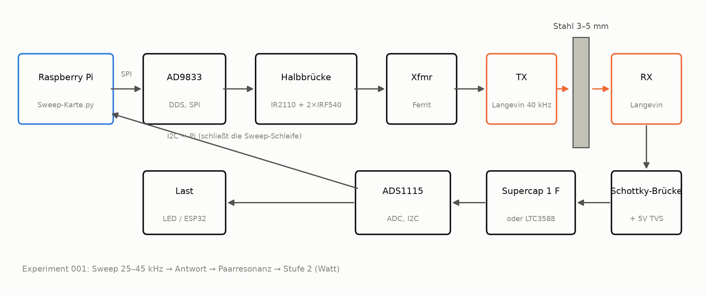
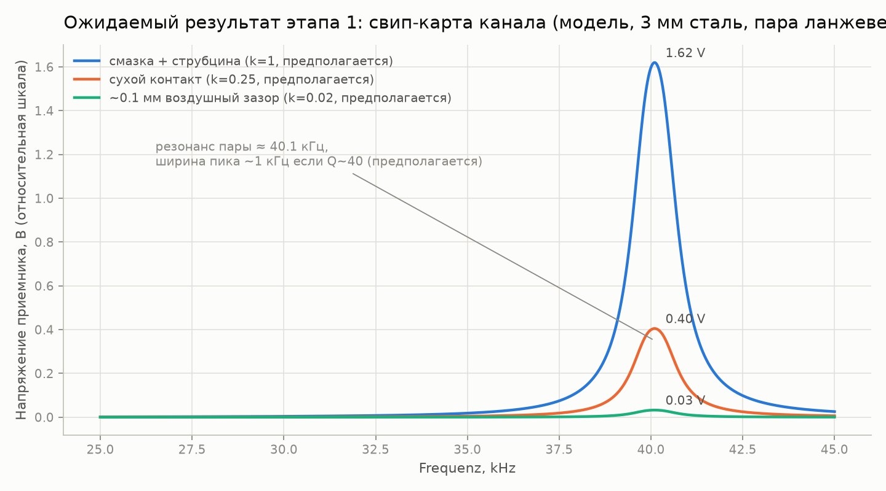
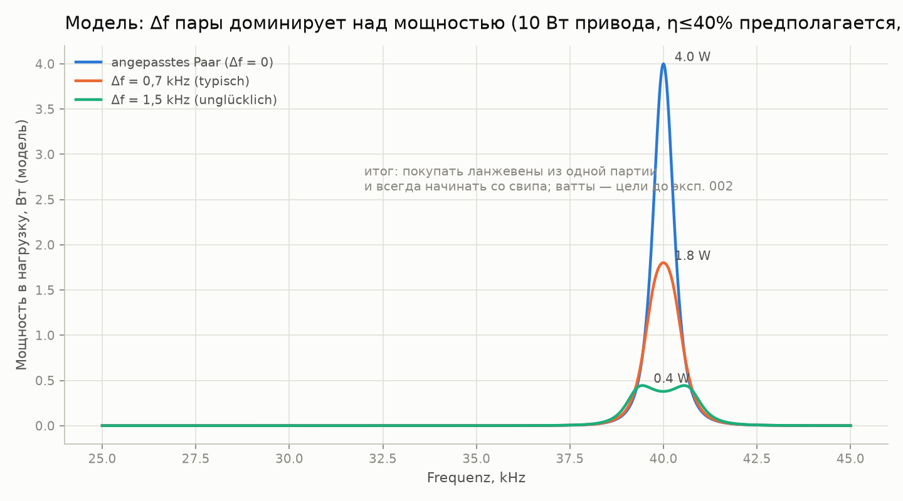
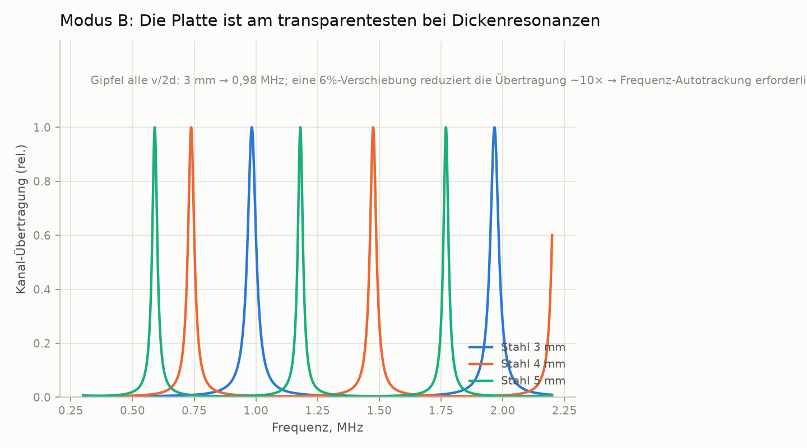

# through-metal-link

> [English (primary)](../../README.md) · [Русский](../ru/README.md) · Deutsch · [Português](../pt/README.md) · [Español](../es/README.md) · [Français](../fr/README.md) · [Italiano](../it/README.md) · [Polski](../pl/README.md) · [Türkçe](../tr/README.md) · [Українська](../uk/README.md) · [Tiếng Việt](../vi/README.md) · [中文](../zh/README.md) · [日本語](../ja/README.md) · [한국어](../ko/README.md) · [हिन्दी](../hi/README.md)

Eine offene Plattform für ultraschallbasierte Energie- und Datenübertragung durch massive Metallwände — „Stahl durchdringen ohne ein einziges Loch", gebaut mit Garage-Mitteln.

**Jetzt ausprobieren (keine Hardware nötig):** `python3 software/sweep-map/sweep_map.py --mock`

**Status:** Stufe 0 — Vorbereitung · 💰 **[$250 Kopfgeld für den ersten unabhängigen Nachbau](https://github.com/zeloras/through-metal-link/issues)** · Einkaufsliste: [QUICKSTART.md](QUICKSTART.md)

[](https://github.com/zeloras/through-metal-link/actions/workflows/ci.yml) [](https://github.com/zeloras/through-metal-link/actions/workflows/reuse.yml) [](CONTRIBUTING.md) [](LICENSES.md)

Die Dokumentation ist mehrsprachig: Englisch ist die Hauptsprache und liegt unter den kanonischen Pfaden; jede andere Sprache spiegelt den Baum unter [translations/](..). Bearbeite eine beliebige Sprache — CI übersetzt und committet den Rest (siehe [CONTRIBUTING.md](CONTRIBUTING.md)).

<p align="center"></p>

## Die Idee in einem Absatz

Funkwellen dringen nicht durch Metall (Faradayscher Käfig), und eine Kabeldurchführung bedeutet ein Loch, eine Dichtung und eine Fehlerquelle. Ultraschall hingegen wandert problemlos durch Metall: ein Piezo-Element auf jeder Seite der Wand verwandelt es in einen Kanal für Strom und Daten. Die Laborliteratur hat die Physik bereits auf beträchtlichen Niveaus bewiesen (RPI: 50 W + 12 Mbit/s durch 63.5 mm Stahl; NASA JPL: bis zu ~kW durch 5 mm Titan) — dies sind Existenzbeweise mit spezieller Hardware, nicht die Garagen-BOM dieses Repos. Die grundlegenden Patente sind abgelaufen, und es existiert bisher keine offene, reproduzierbare Plattform — dieses Repository baut eine, beginnend mit **Leistung im Watt-Bereich und kbit/s Daten durch 3–5 mm Stahl**, sobald Stufe 2 vermessen ist.

## Roadmap

| Phase | Ergebnis | Erfolgskriterium | Erwartung |
|---|---|---|---|
| 1. Sweep-Mappe | Frequenzgang des „Langevin–3 mm Stahl–Langevin"-Kanals | Resonanzpaar gefunden, Plot in [experiments/001](experiments/001-sweep-map-3mm-steel/README.md) | [sim1](docs/img/sim1-sweep-contacts.png), [sim2](docs/img/sim2-pair-mismatch.png) |
| 2. Watt | Leistung in die Last bei Resonanz | ≥0,5 W durch 3 mm Stahl, Protokoll in [experiments/002](experiments/002-watts-3mm-steel/README.md) | [sim4](docs/img/sim4-power-budget.png) |
| 3. Daten | FSK/OOK über dasselbe Paar | ≥1 kbit/s fehlerfrei | [sim5](docs/img/sim5-ook-datarate.png) |
| 4. Knoten | ESP32 + Sensor in einer verschweißten Box, allein per Schall versorgt und telemetriert | ≥1 h autonomer Betrieb | [sim4](docs/img/sim4-power-budget.png) |
| 5. Veröffentlichung | Repo geht public, Artikel/How-to | Reproduktion durch einen Dritten | — |

## Repository-Übersicht

python3 software/sweep-map/sweep_map.py --mock
```

**Fertig, wenn (nach Stufe):** Stufe 1 — Sweep-Peak reproduziert sich über zwei Durchläufe auf <200 Hz genau ([experiments/001](experiments/001-sweep-map-3mm-steel/README.md)); Stufe 2 — ≥0,5 W in eine bekannte Last durch 3 mm Stahl und eine LED leuchtet auf der RX-Seite ([experiments/002](experiments/002-watts-3mm-steel/README.md)).

</details>

<details>
<summary><b>📚 Theorie in einer Minute</b> — <a href="docs/00-theory.md">docs/00-theory.md</a></summary>

Der Piezo-TX wird gegen die Wand gedrückt und treibt eine Longitudinalwelle in sie; der Piezo-RX auf der anderen Seite wandelt sie wieder in Strom um. Schallgeschwindigkeit in Stahl: ~5900 m/s.

Zwei Betriebsmodi:

| Modus | Frequenz | Resonanz bestimmt durch | Liefert | Status |
|---|---|---|---|---|
| **A** — Langevin-Wandler | 40 kHz | das Wandlerpaar (Wand ≪ λ — eine "Membran") | Watt, kbit/s | Startmodus (Stufen 1–4, [ADR-0001](docs/decisions/0001-frequency-mode-choice.md)) |
| **B** — Scheiben | 0.6–1 MHz | Dickenresonanz der Wand ([Kamm](docs/img/sim3-thickness-comb.png)) | Hunderte mW, Hunderte kbit/s | Verzweigung nach den ersten Watt; erfordert automatische Frequenznachführung |

Die Hauptverluste: Resonanzfehlanpassung innerhalb des Paares (±1 kHz bei günstigen Langevin-Wandlern), Qualität des akustischen Kontakts (Epoxid > Fett-Kopplungsmittel + Klemme > trockener Druck), Fehlausrichtung, Resonanzdrift mit der Temperatur. Die Antwort auf all das ist dieselbe: **eine Sweep-Map vor jeder Änderung am Aufbau**.

</details>

<details>
<summary><b>📈 Was der Aufbau zeigen sollte: Erwartungsplots vom Simulator</b> — <a href="software/simulator/channel_sim.py">software/simulator/channel_sim.py</a></summary>

Ein semi-empirisches Kanalmodell (kein FEM, **keine Labordaten** — Intuition für "wie der Sweep aussehen sollte und worauf man abzielt"). Annahmen sind explizit in `channel_sim.py` (geladener Q≈40, Kontakt-k-Faktoren, Ketten-η≤40%). Regenerieren mit: `python3 channel_sim.py --out ../../docs/img`.

**Stufe 1 — Sweep.** Ein schmaler Peak bei ~40 kHz; die Platzhalter-Kontaktmultiplikatoren des Modells sind Fett:trocken:Spalt = 1 : 0.25 : 0.02 (d.h. Fett ≈4× trocken und ≈50× Luftspalt). Kein Peak bedeutet ein Problem mit dem Kontakt oder dem Paar:



**Warum 4 Langevin-Wandler, nicht 2.** Bei Q≈40 senkt eine 1,5-kHz-Resonanzfehlanpassung im Paar die Modellleistung um ~10×:



**Stufe 3 — Daten.** OOK stößt auf Resonator-Klingeln (Modell-Q~40 → τ≈0,3 ms): 1 kbit/s ist sauber, bei 5 kbit/s ist das Auge geschlossen. Schneller geht nur mit Modus B:


**Empfänger-Leistungsbudget.** Schraffierte Bänder sind **Ziele** (Modus A 0,5–5 W, wenn Stufe 2 greift; Modus B niedriger). Realistische erste Lasten sind getaktete ESP32 / BLE / LED; WLAN wird als Spitzenverbrauchsmarker gezeigt, nicht als kontinuierliches Versprechen:


**Für später (Modus B).** Die Platte wird bei einem Kamm von Dickenresonanzen transparent — die Frequenz muss nachgeführt werden:



</details>

<details>
<summary><b>⚠️ Sicherheit — vor dem ersten Einschalten lesen</b> — <a href="docs/02-safety.md">docs/02-safety.md</a></summary>

1. **Zehn bis Hunderte Volt am Piezo**, sobald der Stufe-2-Treiber online ist — die TVS-Diode auf der Empfangsseite kommt VOR dem ersten eingeschalteten Lauf rein; Finger von den Leitungen lassen.
2. **Netzspannung** — nur über ein Labornetzteil / Isolierung; Treiberplatinen von Ultraschallreinigern sind galvanisch mit dem Netz verbunden.
3. **Ohren** — bei nicht trivialer Leistung Wandler gegen Metall gedrückt betreiben; niemals hochfrequenten Luft-Ultraschall ohne Gehäuse betreiben.
4. **Hitze** — ein ungeklemmter Langevin-Wandler überhitzt bei Leistung in Minuten; einklemmen, bevor der Strom erhöht wird (nur kurzer elektrischer Inbetriebnahme-Test mit niedrigem Strom — siehe Treiber-README).
5. **Splitter** — Piezokeramik ist spröde: eine überzogene Schraube oder ein Schlag bedeutet Splitter; bei jeglicher mechanischer Arbeit Schutzbrille tragen.

</details>

docs/            Theorie, Stand der Technik, Sicherheit, Anwendungen, Entscheidungsprotokoll (ADR)
docs/img/        Erwartungsplots (generiert von software/simulator/channel_sim.py)
hardware/        BOM, Treiber (Halbbrücke), Empfänger (Gleichrichter/Harvester)
firmware/        Knoten-Firmware (ESP32 — Stub bis Stufe 4)
software/        Messskripte (Frequenzgang-Sweep-Map) und Kanal-Simulator
experiments/     Experimentprotokolle — aus der Vorlage, ein Verzeichnis = ein Experiment
data/            Rohdaten (große Dateien bleiben außerhalb von git)
```

</details>

## Prinzipien

1. **Reproduzierbarkeit ab null.** Jeder mit einem Lötkolben und ~$210 kann das Ergebnis allein aus diesem Repo nachbauen.
2. **Jedes Experiment ist ein Protokoll.** Kein „hat irgendwie funktioniert“: [experiments/TEMPLATE.md](experiments/TEMPLATE.md) ist verpflichtend.
3. **Patent-Hygiene.** Wir bauen auf der abgelaufenen Schicht auf ([docs/01-prior-art.md](docs/01-prior-art.md)); Entscheidungen werden in [docs/decisions/](docs/decisions/0001-frequency-mode-choice.md) festgehalten.
4. **Messung zuerst, Meinung zweitens.** Eine Sweep-Map, bevor irgendwelche Schlussfolgerungen über den Kanal gezogen werden.

## Lizenzen und Patente

Code — Apache-2.0, Hardware — CERN-OHL-W v2, Dokumentation — CC-BY-4.0; vollständige Texte in [LICENSES/](../../LICENSES). Jeder darf dies forken und darauf aufbauen, auch kommerziell; Patentschutz ergibt sich aus den Gewährungs- und Vergeltungsklauseln der Lizenzen plus einer Prior-Art-Strategie. Das vollständige Schema und das Protokoll zur defensiven Veröffentlichung: [LICENSES.md](LICENSES.md); Beitragsregeln: [CONTRIBUTING.md](CONTRIBUTING.md).
