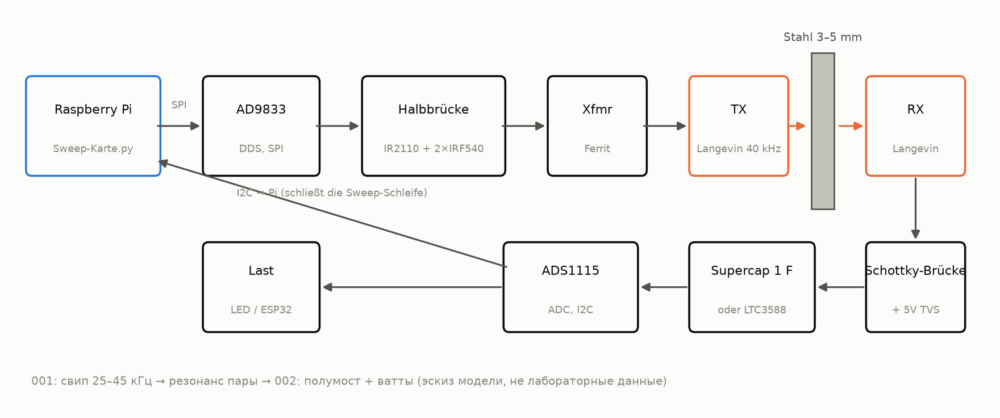
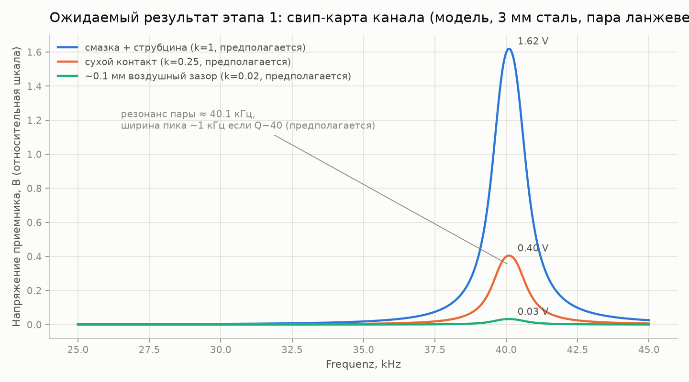
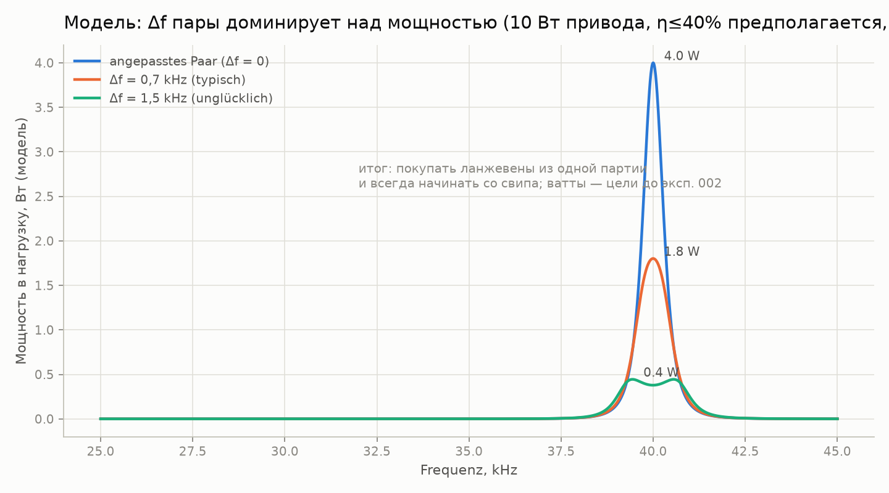
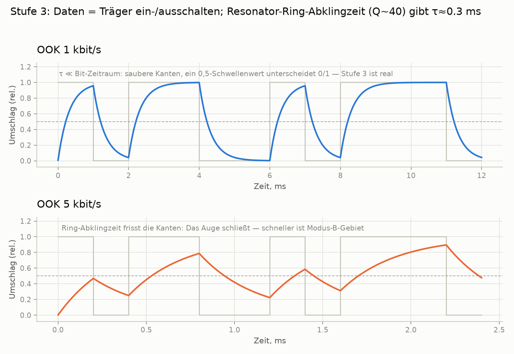
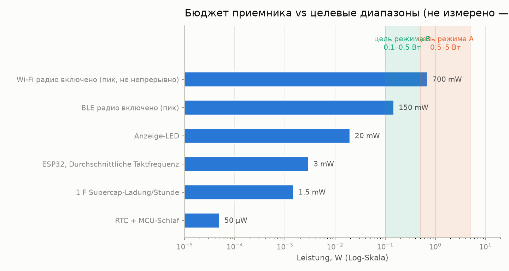
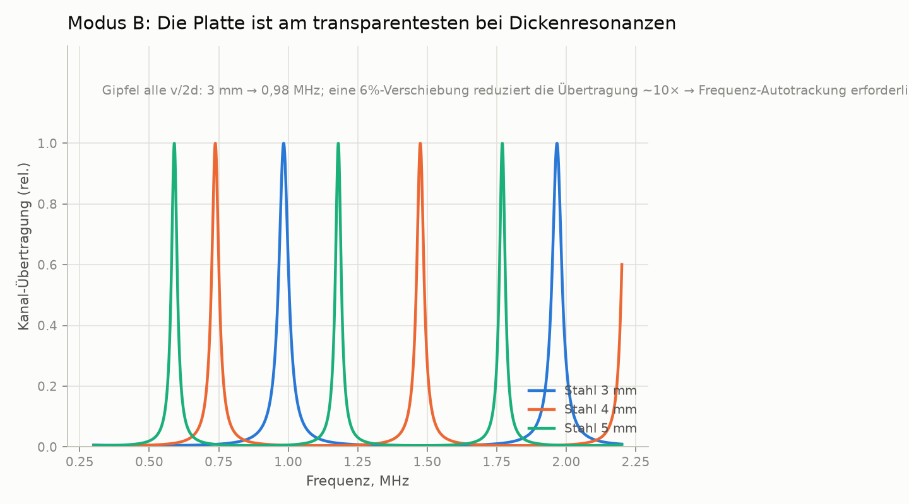

# through-metal-link

> [English (primary)](../../README.md) · [Русский](../ru/README.md) · Deutsch · [Português](../pt/README.md) · [Español](../es/README.md) · [Français](../fr/README.md) · [Italiano](../it/README.md) · [Polski](../pl/README.md) · [Türkçe](../tr/README.md) · [Українська](../uk/README.md) · [Tiếng Việt](../vi/README.md) · [中文](../zh/README.md) · [日本語](../ja/README.md) · [한국어](../ko/README.md) · [हिन्दी](../hi/README.md)

Eine offene Plattform für ultraschallbasierte Energie- und Datenübertragung durch massive Metallwände — „durch Stahl ohne ein einziges Loch", gebaut mit Garage-Mitteln.

**Jetzt ausprobieren (ohne Hardware):** `python3 software/sweep-map/sweep_map.py --mock`

**Pfade rein:**
- **A — Dry-Run:** Mock-Sweep + [Simulator](../../software/simulator/channel_sim.py) (ohne Labor)
- **B — Aufbaustufe 1:** [QUICKSTART.md](QUICKSTART.md) → [experiments/001](experiments/001-sweep-map-3mm-steel/README.md)
- **C — Ohne Hardware beitragen:** Prior-Art / Doku / Übersetzungen / ADR-Kommentare ([CONTRIBUTING.md](CONTRIBUTING.md))

**Status:** Stufe 0 — Vorbereitung · **noch keine Hardware-Validierung** (nur Simulator; Bounty für den ersten Aufbau) · 💰 **[$250 Bounty](https://github.com/zeloras/through-metal-link/issues/5)** · Einkaufsliste: [QUICKSTART.md](QUICKSTART.md)

[](https://github.com/zeloras/through-metal-link/actions/workflows/ci.yml) [](https://github.com/zeloras/through-metal-link/actions/workflows/reuse.yml) [](CONTRIBUTING.md) [](LICENSES.md)

Die Doku ist mehrsprachig: Englisch ist primär und liegt auf den kanonischen Pfaden; jede andere Sprache spiegelt den Baum unter [translations/](..). Beliebige Sprache bearbeiten — CI übersetzt und committet den Rest (siehe [CONTRIBUTING.md](CONTRIBUTING.md)).



## Die Idee in einem Absatz

Radiowellen gehen nicht durch Metall (Faraday-Käfig), und eine Kabeldurchführung bedeutet ein Loch, eine Dichtung und eine Schwachstelle. Ultraschall hingegen wandert problemlos durch Metall: ein Piezo-Element auf jeder Seite der Wand macht sie zu einem Kanal für Energie und Daten. Labortiteratur hat die Physik bereits auf ernsthaften Niveaus bewiesen (RPI: 50 W + 12 Mbit/s durch 63,5 mm Stahl; NASA JPL: bis zu ~kW durch 5 mm Titan) — das sind Existenzbeweise mit Spezialhardware, nicht die Garage-Stückliste dieses Repos. Die grundlegenden Patente sind abgelaufen, und es existiert noch keine offene, reproduzierbare Plattform — dieses Repository baut eine, beginnend bei **Watt-Klasse Energie und kbit/s Daten durch 3–5 mm Stahl**, sobald Stufe 2 vermessen ist.

## Roadmap

| Stufe | Ergebnis | Erfolgskriterium | Erwartung |
|---|---|---|---|
| 1. Sweep-Map | Frequenzgang des „Langevin–3 mm Stahl–Langevin"-Kanals | Paar-Resonanz gefunden, Plot in [experiments/001](experiments/001-sweep-map-3mm-steel/README.md) | [sim1](docs/img/sim1-sweep-contacts.png), [sim2](docs/img/sim2-pair-mismatch.png) |
| 2. Watt | Leistung in die Last bei Resonanz | ≥0,5 W durch 3 mm Stahl, Protokoll in [experiments/002](experiments/002-watts-3mm-steel/README.md) | [sim4](docs/img/sim4-power-budget.png) |
| 3. Daten | FSK/OOK über dasselbe Paar | ≥1 kbit/s fehlerfrei | [sim5](docs/img/sim5-ook-datarate.png) |
| 4. Knoten | ESP32 + Sensor in einem verschweißten Kasten, per Schall allein versorgt und telemetriert | ≥1 h autonomer Betrieb | [sim4](docs/img/sim4-power-budget.png) |
| 5. Publikation | erste unabhängige Replikation + Artikel/How-to + Zenodo-Snapshot | Drittparty-Reproduktion dokumentiert | — |

## Repository-Übersicht

Jeder Block unten ist ein Auszug, der ausreicht, um damit zu arbeiten, plus ein Link zum vollständigen Dokument.

### 🛒 Von null zum funktionierenden Aufbau: was kaufen und in welcher Reihenfolge — [QUICKSTART.md](QUICKSTART.md)

**Budget:** ~$210 Minimum, ~$300 komfortabel (abziehen ~$120, wenn bereits ein Pi, ein Lötkolben und ein Labornetzteil vorhanden). Drei Körbe: Werkzeug (~$120), Aufbau-Elektronik (~$70, [vollständige BOM](hardware/bom/bom-stage1.csv)), Mechanik (~$20). Optional aber dringend empfohlen: ein USB-Oszilloskop (~$60–80).

**Kritischer Pfad — AliExpress-Versand (3–4 Wochen):** Elektronik am ersten Tag bestellen. Schlüsselentscheidung: **4 Langevin-Wandler aus derselben Charge** kaufen — der Sweep wählt das beste Paar ([Warum](docs/img/sim2-pair-mismatch.png)).

**Während es verschickt wird:** die Pipeline ohne Hardware dry-runnen —

```bash
python3 software/sweep-map/sweep_map.py --mock
```

**Fertig wenn (nach Stufe):** Stufe 1 — Sweep-Peak reproduziert über zwei Läufe innerhalb von <200 Hz ([experiments/001](experiments/001-sweep-map-3mm-steel/README.md)); Stufe 2 — ≥0,5 W in eine bekannte Last durch 3 mm Stahl und eine LED leuchtet von der RX-Seite ([experiments/002](experiments/002-watts-3mm-steel/README.md)).

### 📚 Theorie in einer Minute — [docs/00-theory.md](docs/00-theory.md)

Der Piezo-TX wird gegen die Wand gepresst und treibt eine Longitudinalwelle hinein; der Piezo-RX auf der anderen Seite wandelt sie zurück in Elektrizität. Schallgeschwindigkeit in Stahl: ~5900 m/s.

Zwei Betriebsmodi:

| Modus | Frequenz | Resonanz bestimmt durch | Liefert | Status |
|---|---|---|---|---|
| **A** — Langevin-Wandler | 40 kHz | das Wandlerpaar (Wand ≪ λ — eine „Membran") | Watt, kbit/s | Startmodus (Stufen 1–4, [ADR-0001](docs/decisions/0001-frequency-mode-choice.md)) |
| **B** — Scheiben | 0,6–1 MHz | Dickenresonanz der Wand ([Kamm](docs/img/sim3-thickness-comb.png)) | Hunderte mW, Hunderte kbit/s | Abzweig nach den ersten Watt; braucht automatische Frequenznachführung |

Die Hauptverluste: Resonanzfehlanpassung innerhalb des Paars (±1 kHz bei billigen Langevin-Wandlern), Qualität des akustischen Kontakts (Epoxid > Fettkopplung + Klemme > trockener Druck), Fehlausrichtung, Resonanzdrift mit Temperatur. Die Antwort auf alle ist dieselbe: **eine Sweep-Map vor jeder Änderung am Aufbau**.

### 📈 Was der Aufbau zeigen sollte: Erwartungsplots vom Simulator — [software/simulator/channel_sim.py](../../software/simulator/channel_sim.py)

Ein semi-empirisches Kanalmodell (kein FEM, **keine Labordaten** — Intuition für „wie der Sweep aussehen sollte und worauf man zielt"). Annahmen sind explizit in `channel_sim.py` (geladener Q≈40, Kontakt-k-Faktoren, Kette η≤40 %). Regenerieren mit: `python3 channel_sim.py --out ../../docs/img`.

**Stufe 1 — Sweep.** Ein schmaler Peak bei ~40 kHz; die Platzhalter-Kontaktmultiplikatoren des Modells sind Fett:trocken:Spalt = 1 : 0,25 : 0,02 (d. h. Fett ≈4× trocken und ≈50× Luftspalt). Kein Peak bedeutet ein Problem mit dem Kontakt oder dem Paar:



**Warum 4 Langevin-Wandler, nicht 2.** Bei Q≈40 senkt eine 1,5-kHz-Resonanzfehlanpassung im Paar die Modellleistung um ~10×:



**Stufe 3 — Daten.** OOK stößt an das Nachschwingen des Resonators (Modell-Q ~40 → τ≈0,3 ms): 1 kbit/s ist sauber, bei 5 kbit/s ist das Auge geschlossen. Schneller geht nur mit Modus B:



**Empfänger-Energiebudget.** Schattierte Bänder sind **Ziele** (Modus A 0,5–5 W, wenn Stufe 2 greift; Modus B niedriger). Realistische erste Lasten sind getakteter ESP32 / BLE / LED; WLAN ist als Spitzenverbrauchsmarker gezeigt, nicht als kontinuierliches Versprechen:



**Für später (Modus B).** Die Platte wird bei einem Kamm von Dickenresonanzen transparent — die Frequenz muss nachgeführt werden:



### ⚠️ Sicherheit — vor dem ersten Einschalten lesen — [docs/02-safety.md](docs/02-safety.md)

1. **Zehn bis Hunderte Volt am Piezo**, sobald der Stufe-2-Treiber online ist — die TVS auf der Empfängerseite kommt VOR dem ersten bestromten Lauf rein; Hände weg von den Anschlüssen.
2. **Netz** — nur über ein Labornetzteil / Trenntrafo; Ultraschallreiniger-Treiberplatinen sind galvanisch mit dem Netz verbunden.
3. **Ohren** — bei nicht-trivialer Leistung Wandler gegen Metall gepresst betreiben; niemals Hochleistungs-Luftultraschall ohne Gehäuse betreiben.
4. **Hitze** — ein ungeklemmter Langevin-Wandler überhitzt bei Leistung in Minuten; klemmen, bevor der Strom erhöht wird (nur kurzer elektrischer Inbetriebnahme-Lauf mit niedrigem Strom — siehe Treiber-README).
5. **Splitter** — Piezokeramik ist spröde: eine überzogene Schraube oder ein Schlag bedeutet Splitter; bei jeglicher mechanischer Arbeit Schutzbrille tragen.

Erstes Treiber-Einschalten: Labornetzteil-Stromgrenze 0,2 A; vollständige Sequenz in [hardware/driver/](hardware/driver/README.md) und [docs/02-safety.md](docs/02-safety.md).

### 🧭 Prior Art und Patent-Hygiene — [docs/01-prior-art.md](docs/01-prior-art.md)

Jede technische Entscheidung muss auf eine „freie" Quelle (abgelaufene Patente, Paper) zurückführbar sein. Das Fundament: **US5982297** (Aerospace Corp — das Grundrezept für ein durch-Wand-Piezo-Paar), **US7902943** (Caltech/JPL — Sherrits Feed-through), **US9361877** (Univ. Oklahoma — ein vollständiges Transceiver-System); alle tot. Schlüsselpaper: Lawry 2013 (50 W + 12,4 Mbit/s durch 63,5 mm Stahl), Sherrit/NASA (eine 100-W-Lampe), Yang 2015 (Survey).

Nicht zu kopieren, solange noch lebendig: RPIs OFDM-Allokation und Vollduplex-Schema sowie Drexels konforme Wandler (US, bis ~2032–2033 — Stufen 1–4 brauchen keinen davon), plus die Familien, die eine Suche am 2026-08 hinzugefügt hat: **US8594572B1** (US Navy — liest auf den nackten Energiekanal selbst; US, bis 2032; Welle 1997 ist die Prior-Art-Antwort), **EP3723304B1** (ABB — Leistungsspektrum *unterhalb* des Datenspektrums; DE/GB, bis 2039; die geplante Same-Carrier-Lastmodulations-Uplink bleibt außerhalb), **Ultrapower** (In-Pipe-Sensor mit konvexen/konkaven Arrays oder einer Stange durch die Wand; US, bis 2035 — wir verwenden flache Pads und keine Stange). Anspruch-Lesungen, Status und Design-Arounds: [docs/01-prior-art.md](docs/01-prior-art.md).

Architekturentscheidungen sind in [docs/decisions/](docs/decisions/0001-frequency-mode-choice.md) (ADR) festgehalten.

### 🔌 Hardware und Firmware — hardware/, firmware/

- [hardware/bom/bom-stage1.csv](hardware/bom/bom-stage1.csv) — Einkaufsliste Stufe 1.
- [hardware/schematics/](hardware/schematics/README.md) — **Schaltpläne** (aus Code generiert): Treiber, Empfänger, Pi-Pinout, Harvester-Knoten.
- [hardware/driver/](hardware/driver/README.md) — TX-Treiber: IR2110-Halbbrücke + 2×IRF540, Anpassungs-Transformator (ein Langevin-Wandler ist eine kapazitive Last!). KiCad-Platine kommt, nachdem der Breadboard-Prototyp funktioniert.
- [hardware/receiver/](hardware/receiver/README.md) — Empfänger, Stufe für Stufe: Schottky-Brücke → ADC (Stufe 1) → Last (Stufe 2) → LTC3588 + Superkondensator + ESP32 (Stufe 4).
- [firmware/node-esp32/](firmware/node-esp32/README.md) — Stufe-4-Knoten (Stub): Deep Sleep, Sensor-Auslesen, BLE-Advertising, Budget von 1–5 mW Durchschnitt.

### 💻 Software: Messungen und der Simulator — software/

- [software/sweep-map/sweep_map.py](../../software/sweep-map/sweep_map.py) — das Stufe-1-Arbeitstier: DDS-Sweep → ADC-Messwerte → CSV + Frequenzgang-Plot. Hat `--mock` für einen Lauf ohne Hardware. Auf dem Pi: `raspi-config` → SPI und I2C aktivieren; `pip install spidev smbus2 matplotlib`.
- [software/simulator/channel_sim.py](../../software/simulator/channel_sim.py) — Generator der Erwartungsplots (`pip install numpy matplotlib`).
- [software/simulator/material_map.py](../../software/simulator/material_map.py) — dasselbe Kanalmodell über verschiedene Wandmaterialien — Titan, Aluminium, Glas, Keramik, Kunststoffe, Beton; die Studie und Urteile: [docs/06-materials.md](docs/06-materials.md).
- [data/](data/README.md) — Rohdaten; CSV/PNG bleiben aus git raus, nur kuratierte Plots gehen ins git im Verzeichnis des Experiments.

### 🗺️ Wo anwenden: Barrieren, Kanäle, Nischen — [docs/04-hybrid-channels.md](docs/04-hybrid-channels.md), [docs/05](docs/05-applications-map.md)

Es gibt keinen universellen Kanal — die Plattform passt die Physik an die Barriere an: Piezo-Akustik (primär: Stahl/Aluminium mit Kontakt — Watt und kbit/s), EMAT (schmutziges/heißes Metall, kein Kontakt — Daten), niederfrequente Magnetik (Vakuum-Sandwichwände von Dewars — bit/s). Ehrliche Sackgassen: gummierte/Verbund-Wände, blubbernde Flüssigkeit im Pfad.

Nischen-Priorität: **(1)** Lab-Vakuumkammern und Kryostaten — das Open-Source-Hardware-Publikum, keine Zertifizierungen; **(2)** Fermentationstanks — ein Testfeld in Gehweite; **(3)** versiegelte Batteriepacks — der Flagship-Fall (Thermal-Runaway-Erkennung ohne Durchdringung des Packs). Das Empfänger-Discovery- und Auto-Tuning-Protokoll (ein Qi-Analogon): [docs/03-discovery-protocol.md](docs/03-discovery-protocol.md).

### 📁 Verzeichnisstruktur

```
docs/            Theorie, Prior Art, Sicherheit, Anwendungen, Entscheidungslog (ADR)
docs/img/        Erwartungsplots (generiert von software/simulator/channel_sim.py)
hardware/        BOM, Treiber (Halbbrücke), Empfänger (Gleichrichter/Harvester)
firmware/        Knoten-Firmware (ESP32 — Stub bis Stufe 4)
software/        Mess-Skripte (Frequenzgang-Sweep-Map) und Kanal-Simulator
experiments/     Experiment-Protokolle — aus der Vorlage, ein Verzeichnis = ein Experiment
data/            Rohdaten (große Dateien bleiben aus git)
```

## Prinzipien

1. **Reproduzierbarkeit von null.** Jeder mit einem Lötkolben und ~$210 kann das Ergebnis aus diesem Repo allein reproduzieren.
2. **Jedes Experiment ist ein Protokoll.** Kein „hat irgendwie funktioniert": [experiments/TEMPLATE.md](experiments/TEMPLATE.md) ist Pflicht.
3. **Patent-Hygiene.** Wir bauen auf der abgelaufenen Schicht auf ([docs/01-prior-art.md](docs/01-prior-art.md)); Entscheidungen sind in [docs/decisions/](docs/decisions/0001-frequency-mode-choice.md) festgehalten.
4. **Messung zuerst, Meinung zweitens.** Eine Sweep-Map vor jeglichen Schlussfolgerungen über den Kanal.

## Lizenzen und Patente

Code — Apache-2.0, Hardware — CERN-OHL-W v2, Dokumentation — CC-BY-4.0; vollständige Texte in [LICENSES/](../../LICENSES). Jeder darf forken und darauf aufbauen, auch kommerziell; Patentschutz kommt durch die Grants- und Retaliation-Klauseln in den Lizenzen plus einer Prior-Art-Strategie. Das vollständige Schema und das Defensive-Publication-Protokoll: [LICENSES.md](LICENSES.md); Beitragsregeln: [CONTRIBUTING.md](CONTRIBUTING.md).
