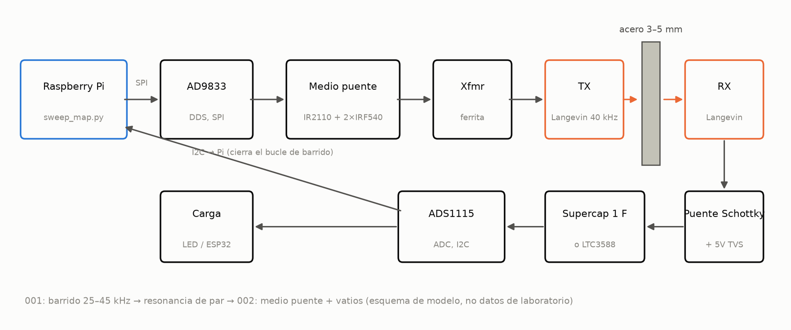
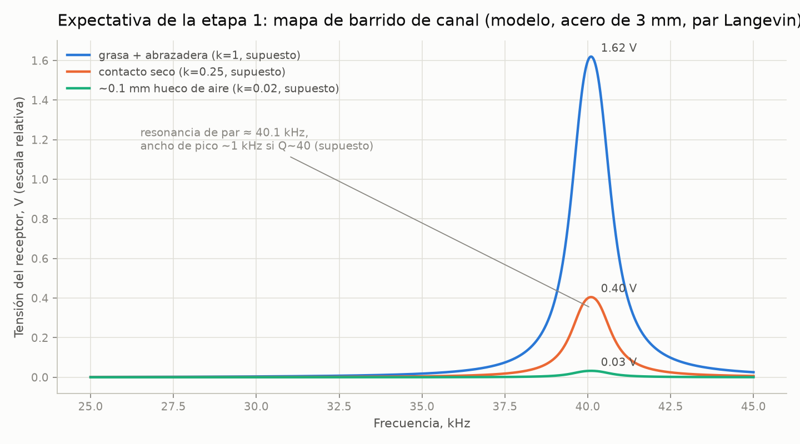
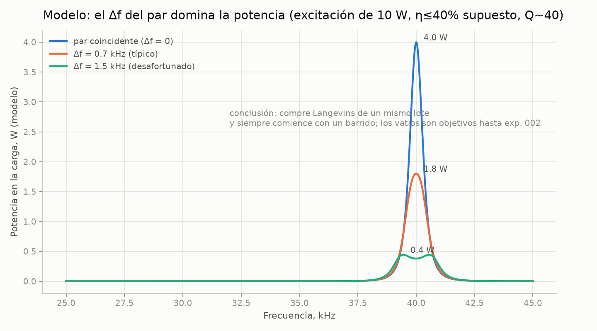
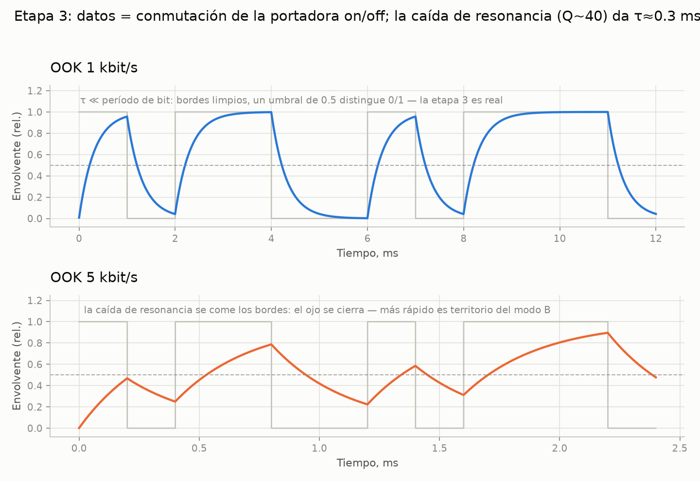
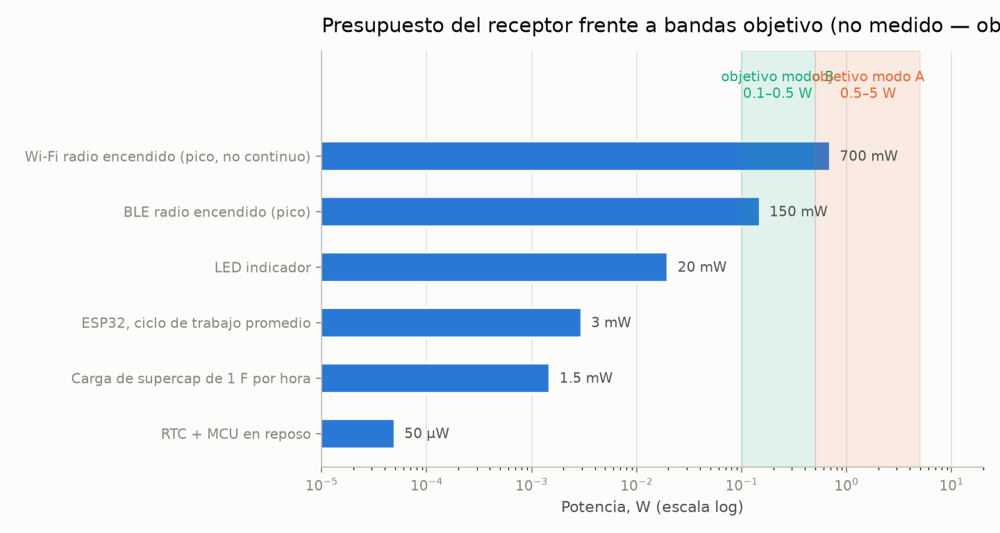
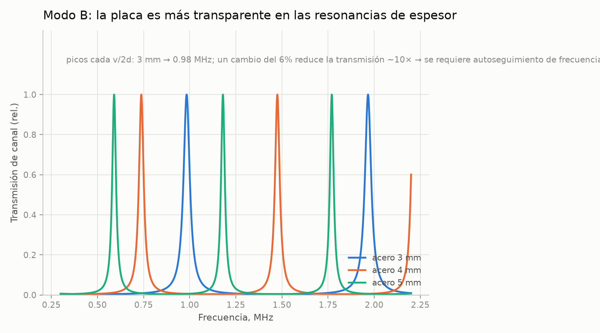

# through-metal-link

> [English (primary)](../../README.md) · [Русский](../ru/README.md) · [Deutsch](../de/README.md) · [Português](../pt/README.md) · Español · [Français](../fr/README.md) · [Italiano](../it/README.md) · [Polski](../pl/README.md) · [Türkçe](../tr/README.md) · [Українська](../uk/README.md) · [Tiếng Việt](../vi/README.md) · [中文](../zh/README.md) · [日本語](../ja/README.md) · [한국어](../ko/README.md) · [हिन्दी](../hi/README.md)

Una plataforma abierta para transferencia ultrasónica de energía y datos a través de paredes metálicas sólidas — "a través del acero sin un solo agujero", construida con medios de garaje.

**Pruébalo ahora (sin hardware):** `python3 software/sweep-map/sweep_map.py --mock`

**Rutas de entrada:**
- **A — simulación:** sweep simulado + [simulador](../../software/simulator/channel_sim.py) (sin banco)
- **B — construcción etapa 1:** [QUICKSTART.md](QUICKSTART.md) → [experiments/001](experiments/001-sweep-map-3mm-steel/README.md)
- **C — contribuir sin hardware:** antecedentes / docs / traducciones / comentarios en ADR ([CONTRIBUTING.md](CONTRIBUTING.md))

**Estado:** etapa 0 — preparación · **sin validación de hardware todavía** (solo simulador; recompensa por la primera construcción) · 💰 **[recompensa de $250](https://github.com/zeloras/through-metal-link/issues/5)** · lista de compras: [QUICKSTART.md](QUICKSTART.md)

[](https://github.com/zeloras/through-metal-link/actions/workflows/ci.yml) [](https://github.com/zeloras/through-metal-link/actions/workflows/reuse.yml) [](CONTRIBUTING.md) [](LICENSES.md)

Los docs son multilingües: el inglés es el idioma principal y vive en las rutas canónicas; todos los demás idiomas reflejan el árbol bajo [translations/](..). Edita cualquier idioma — la CI traduce y confirma el resto (ver [CONTRIBUTING.md](CONTRIBUTING.md)).



## La idea en un párrafo

Las ondas de radio no atraviesan el metal (jaula de Faraday), y una penetración por cable significa un agujero, un sello y un punto de fallo. El ultrasonido, por otro lado, viaja a través del metal sin problemas: un elemento piezoeléctrico a cada lado de la pared lo convierte en un canal para energía y datos. La literatura de laboratorio ya demostró la física a niveles serios (RPI: 50 W + 12 Mbit/s a través de 63,5 mm de acero; NASA JPL: hasta ~kW a través de 5 mm de titanio) — esas son pruebas de existencia con hardware especializado, no la lista de materiales de garaje de este repo. Las patentes fundamentales han expirado, y no existe todavía una plataforma abierta y reproducible — este repositorio está construyendo una, empezando por **energía de orden de vatios y datos de kbit/s a través de 3–5 mm de acero** una vez se midan en la etapa 2.

## Hoja de ruta

| Etapa | Entregable | Criterio de éxito | Expectativa |
|---|---|---|---|
| 1. Mapa de sweep | respuesta en frecuencia del canal "Langevin–3 mm acero–Langevin" | resonancia del par encontrada, gráfica en [experiments/001](experiments/001-sweep-map-3mm-steel/README.md) | [sim1](docs/img/sim1-sweep-contacts.png), [sim2](docs/img/sim2-pair-mismatch.png) |
| 2. Vatios | potencia en la carga en resonancia | ≥0,5 W a través de 3 mm de acero, protocolo en [experiments/002](experiments/002-watts-3mm-steel/README.md) | [sim4](docs/img/sim4-power-budget.png) |
| 3. Datos | FSK/OOK sobre el mismo par | ≥1 kbit/s sin errores | [sim5](docs/img/sim5-ook-datarate.png) |
| 4. Nodo | ESP32 + sensor en una caja soldada hermética, alimentado y telemetreado solo por sonido | ≥1 h de operación autónoma | [sim4](docs/img/sim4-power-budget.png) |
| 5. Publicación | primera replicación independiente + artículo/cómo-hacerlo + instantánea en Zenodo | reproducción por terceros documentada | — |

## Mapa del repositorio

Cada bloque a continuación es un resumen suficiente para trabajar, más un enlace al documento completo.

### 🛒 De cero a un banco funcional: qué comprar y en qué orden — [QUICKSTART.md](QUICKSTART.md)

**Presupuesto:** ~$210 mínimo, ~$300 cómodo (descuenta ~$120 si ya tienes una Pi, un soldador y una fuente de alimentación de banco). Tres cestas: herramientas (~$120), electrónica del banco (~$70, [BOM completo](hardware/bom/bom-stage1.csv)), mecánica (~$20). Opcional pero muy recomendado: un osciloscopio USB (~$60–80).

**Ruta crítica — envío de AliExpress (3–4 semanas):** pide la electrónica el primer día. Decisión clave: compra **4 transductores Langevin del mismo lote** — el sweep elegirá el mejor par ([por qué](docs/img/sim2-pair-mismatch.png)).

**Mientras llega:** simula el pipeline sin hardware —

```bash
python3 software/sweep-map/sweep_map.py --mock
```

**Listo cuando (por etapa):** etapa 1 — el pico del sweep se reproduce entre dos ejecuciones con menos de 200 Hz de diferencia ([experiments/001](experiments/001-sweep-map-3mm-steel/README.md)); etapa 2 — ≥0,5 W en una carga conocida a través de 3 mm de acero y un LED encendido desde el lado RX ([experiments/002](experiments/002-watts-3mm-steel/README.md)).

### 📚 Teoría en un minuto — [docs/00-theory.md](docs/00-theory.md)

El piezo TX se prensa contra la pared e inyecta una onda longitudinal en ella; el piezo RX al otro lado la convierte de nuevo en electricidad. Velocidad del sonido en el acero: ~5900 m/s.

Dos modos de operación:

| Modo | Frecuencia | Resonancia fijada por | Produce | Estado |
|---|---|---|---|---|
| **A** — transductores Langevin | 40 kHz | el par de transductores (pared ≪ λ — una "membrana") | vatios, kbit/s | modo inicial (etapas 1–4, [ADR-0001](docs/decisions/0001-frequency-mode-choice.md)) |
| **B** — discos | 0,6–1 MHz | resonancia de espesor de la pared ([peine](docs/img/sim3-thickness-comb.png)) | cientos de mW, cientos de kbit/s | bifurcación después de los primeros vatios; necesita seguimiento automático de frecuencia |

Las pérdidas principales: desajuste de resonancia dentro del par (±1 kHz para transductores Langevin baratos), calidad del contacto acústico (epoxi > acoplante de grasa + abrazadera > presión en seco), desalineación, deriva de resonancia con la temperatura. La respuesta a todas ellas es la misma: **un mapa de sweep antes de cada cambio en la configuración**.

### 📈 Lo que el banco debería mostrar: gráficas de expectativa del simulador — [software/simulator/channel_sim.py](../../software/simulator/channel_sim.py)

Un modelo de canal semiempírico (no FEM, **no datos de laboratorio** — intuición sobre "cómo debería verse el sweep y a qué apuntar"). Los supuestos son explícitos en `channel_sim.py` (Q cargado≈40, factores-k de contacto, cadena η≤40%). Regenerar con: `python3 channel_sim.py --out ../../docs/img`.

**Etapa 1 — sweep.** Un pico estrecho cerca de ~40 kHz; los multiplicadores de contacto del modelo son grasa:seco:aire = 1 : 0,25 : 0,02 (es decir, grasa ≈4× seco y ≈50× hueco de aire). Sin pico significa un problema con el contacto o el par:



**Por qué 4 transductores Langevin, no 2.** Con Q≈40, un desajuste de resonancia de 1,5 kHz dentro del par reduce la potencia del modelo ~10×:



**Etapa 3 — datos.** OOK choca con el rebote del resonador (modelo Q~40 → τ≈0,3 ms): 1 kbit/s es limpio, a 5 kbit/s el ojo está cerrado. Ir más rápido requiere el modo B:



**Presupuesto de potencia del receptor.** Las bandas sombreadas son **objetivos** (modo A 0,5–5 W si la etapa 2 funciona; modo B menor). Las primeras cargas realistas son ESP32 / BLE / LED con ciclo de trabajo reducido; Wi-Fi se muestra como marcador de pico de consumo, no como promesa continua:



**Para más adelante (modo B).** La placa se vuelve transparente en un peine de resonancias de espesor — la frecuencia hay que rastrearla:



### ⚠️ Seguridad — leer antes del primer encendido — [docs/02-safety.md](docs/02-safety.md)

1. **Decenas a cientos de voltios en el piezo** una vez el driver de la etapa 2 esté activo — el TVS en el lado de recepción va ANTES de la primera prueba con alimentación; mantén las manos lejos de los cables.
2. **Red eléctrica** — solo a través de una fuente de banco / aislamiento; las placas driver de limpiadores ultrasónicos están galvánicamente conectadas a la red.
3. **Oídos** — a potencia no trivial, opera los transductores prensados contra metal; nunca ejecutes ultrasonido de alta potencia en el aire sin una caja cerrada.
4. **Calor** — un transductor Langevin sin abrazadera se sobrecalienta en minutos a potencia; abrazadera antes de subir la corriente (solo puesta en marcha eléctrica breve a baja corriente — ver el README del driver).
5. **Esquirlas** — la piezocerámica es frágil: un tornillo demasiado apretado o un golpe significa esquirlas; usa gafas de seguridad para cualquier trabajo mecánico.

Primer encendido del driver: límite de corriente de la fuente de banco 0,2 A; secuencia completa en [hardware/driver/](hardware/driver/README.md) y [docs/02-safety.md](docs/02-safety.md).

### 🧭 Antecedentes e higiene de patentes — [docs/01-prior-art.md](docs/01-prior-art.md)

Cada decisión técnica debe trazarse a una fuente "libre" (patentes expiradas, artículos). La base: **US5982297** (Aerospace Corp — la receta básica para un par piezo a través de pared), **US7902943** (Caltech/JPL — feed-through de Sherrit), **US9361877** (Univ. Oklahoma — un sistema transceptor completo); todas muertas. Artículos clave: Lawry 2013 (50 W + 12,4 Mbit/s a través de 63,5 mm de acero), Sherrit/NASA (una lámpara de 100 W), Yang 2015 (revisión).

No copiar mientras sigan vivas: la asignación OFDM y el esquema full-duplex de RPI y los transductores conformales de Drexel (EE. UU., hasta ~2032–2033 — las etapas 1–4 no necesitan ninguno), más las familias que una búsqueda de 2026-08 añadió: **US8594572B1** (US Navy — recae sobre el canal de potencia desnudo en sí; EE. UU., hasta 2032; Welle 1997 es la respuesta de antecedentes), **EP3723304B1** (ABB — espectro de potencia *por debajo* del espectro de datos; DE/GB, hasta 2039; la uplink planificada por modulación de carga en el mismo portador se mantiene fuera), **Ultrapower** (sensor en tubería con arreglos convexos/cóncavos, o una varilla a través de la pared; EE. UU., hasta 2035 — usamos almohadillas planas y sin varilla). Lecturas de reivindicaciones, estados y alternativas de diseño: [docs/01-prior-art.md](docs/01-prior-art.md).

Las decisiones de arquitectura se registran en [docs/decisions/](docs/decisions/0001-frequency-mode-choice.md) (ADR).

### 🔌 Hardware y firmware — hardware/, firmware/

- [hardware/bom/bom-stage1.csv](hardware/bom/bom-stage1.csv) — lista de compras de la etapa 1.
- [hardware/schematics/](hardware/schematics/README.md) — **esquemas de circuito** (generados desde código): driver, receptor, pinout de la Pi, nodo recolector.
- [hardware/driver/](hardware/driver/README.md) — driver TX: medio-puente IR2110 + 2×IRF540, transformador de adaptación (¡un transductor Langevin es una carga capacitiva!). La placa KiCad llega después de que el prototipo en breadboard funcione.
- [hardware/receiver/](hardware/receiver/README.md) — receptor, etapa por etapa: puente Schottky → ADC (etapa 1) → carga (etapa 2) → LTC3588 + supercondensador + ESP32 (etapa 4).
- [firmware/node-esp32/](firmware/node-esp32/README.md) — nodo de la etapa 4 (esqueleto): deep sleep, lectura de sensor, advertising BLE, presupuesto de 1–5 mW de media.

### 💻 Software: mediciones y el simulador — software/

- [software/sweep-map/sweep_map.py](../../software/sweep-map/sweep_map.py) — el caballo de batalla de la etapa 1: sweep DDS → lecturas ADC → CSV + gráfica de respuesta en frecuencia. Tiene `--mock` para una ejecución sin hardware. En la Pi: `raspi-config` → habilitar SPI e I2C; `pip install spidev smbus2 matplotlib`.
- [software/simulator/channel_sim.py](../../software/simulator/channel_sim.py) — generador de las gráficas de expectativa (`pip install numpy matplotlib`).
- [software/simulator/material_map.py](../../software/simulator/material_map.py) — el mismo modelo de canal a través de distintos materiales de pared — titanio, aluminio, vidrio, cerámicas, plásticos, hormigón; el estudio y los veredictos: [docs/06-materials.md](docs/06-materials.md).
- [data/](data/README.md) — registros en bruto; los CSV/PNG se mantienen fuera de git, solo las gráficas curadas entran en git dentro del directorio del experimento.

### 🗺️ Dónde aplicar esto: barreras, canales, nichos — [docs/04-hybrid-channels.md](docs/04-hybrid-channels.md), [docs/05](docs/05-applications-map.md)

No existe un canal universal — la plataforma ajusta la física a la barrera: piezo-acústica (principal: acero/aluminio con contacto — vatios y kbit/s), EMAT (metal sucio/caliente, sin contacto — datos), magnéticos de baja frecuencia (paredes sándwich de vacío de dewares — bits/s). Calles sin salida honestas: paredes con revestimiento de goma/composite, líquido burbujeante en el camino.

Prioridad de nichos: **(1)** cámaras de vacío de laboratorio y criostatos — la audiencia de hardware de código abierto, sin certificaciones; **(2)** tanques de fermentación — un campo de prueba a poca distancia; **(3)** paquetes de baterías sellados — el caso insignia (detección de fuga térmica sin penetración en el paquete). El protocolo de descubrimiento y auto-ajuste del receptor (un análogo de Qi): [docs/03-discovery-protocol.md](docs/03-discovery-protocol.md).

### 📁 Estructura de directorios

```
docs/            teoría, antecedentes, seguridad, aplicaciones, registro de decisiones (ADR)
docs/img/        gráficas de expectativa (generadas por software/simulator/channel_sim.py)
hardware/        BOM, driver (medio-puente), receptor (rectificador/recolector)
firmware/        firmware del nodo (ESP32 — esqueleto hasta la etapa 4)
software/        scripts de medición (mapa de sweep de respuesta en frecuencia) y simulador de canal
experiments/     protocolos de experimentos — desde la plantilla, un directorio = un experimento
data/            registros en bruto (archivos grandes fuera de git)
```

## Principios

1. **Reproducibilidad desde cero.** Cualquiera con un soldador y ~$210 puede reproducir el resultado solo desde este repo.
2. **Cada experimento es un protocolo.** Nada de "funcionó más o menos": [experiments/TEMPLATE.md](experiments/TEMPLATE.md) es obligatorio.
3. **Higiene de patentes.** Construimos sobre la capa expirada ([docs/01-prior-art.md](docs/01-prior-art.md)); las decisiones se registran en [docs/decisions/](docs/decisions/0001-frequency-mode-choice.md).
4. **Medición primero, opinión después.** Un mapa de sweep antes de cualquier conclusión sobre el canal.

## Licencias y patentes

Código — Apache-2.0, hardware — CERN-OHL-W v2, documentación — CC-BY-4.0; textos completos en [LICENSES/](../../LICENSES). Cualquiera puede hacer fork y construir sobre esto, incluido comercialmente; la protección de patentes viene de las cláusulas de concesión y represalia en las licencias más una estrategia de antecedentes. El esquema completo y el protocolo de publicación defensiva: [LICENSES.md](LICENSES.md); reglas de contribución: [CONTRIBUTING.md](CONTRIBUTING.md).
