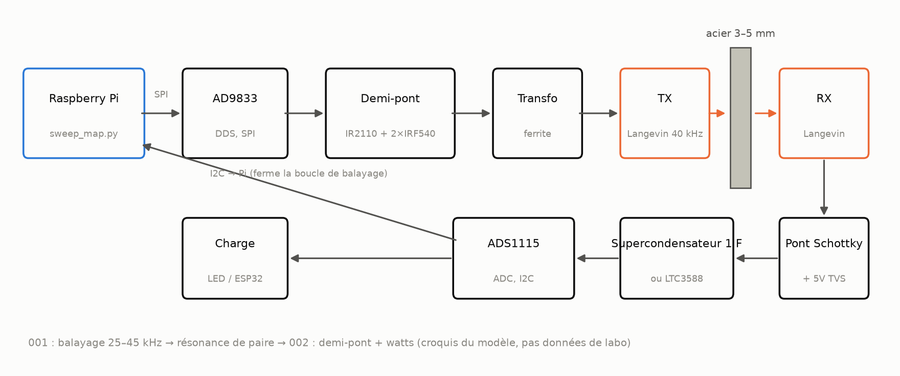
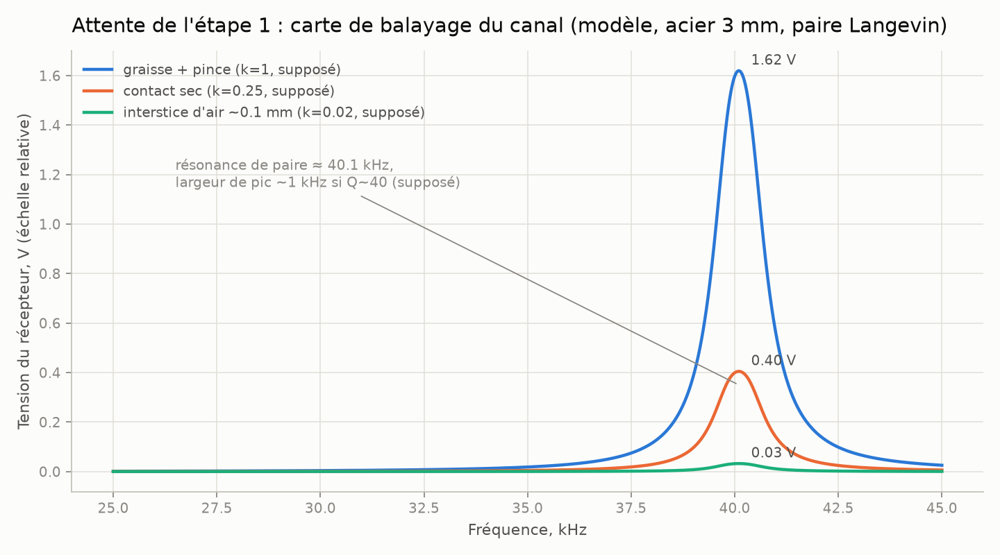
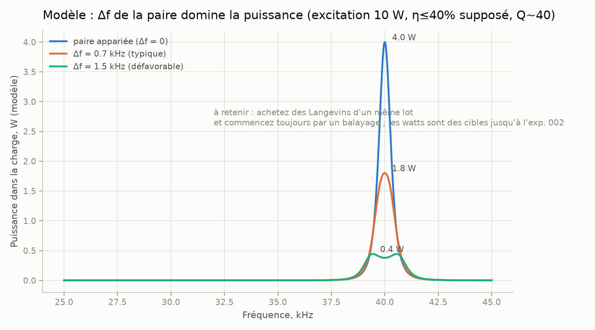
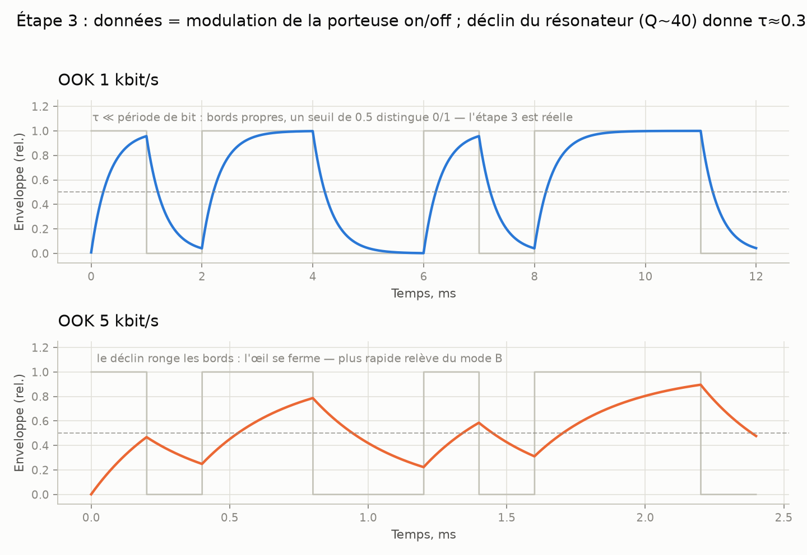
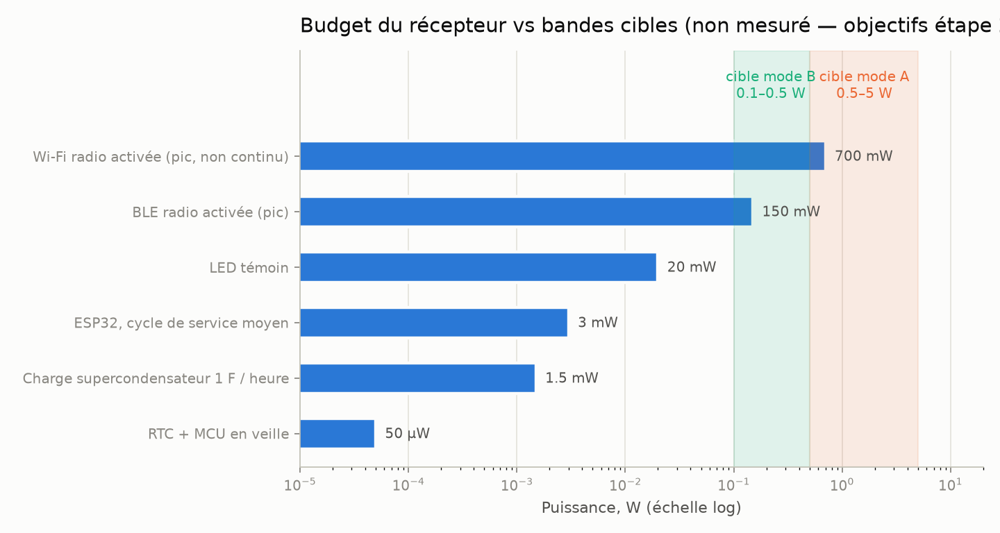
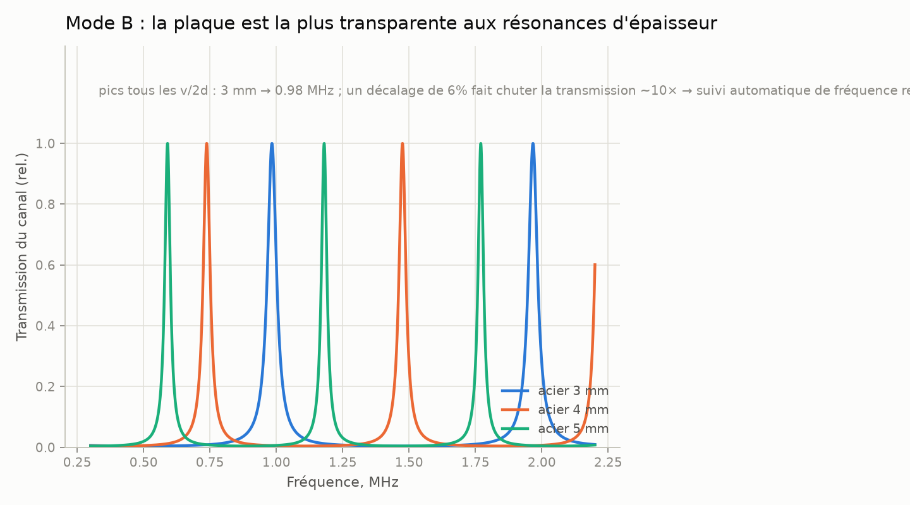

# liaison-à-travers-le-métal

> [English (primary)](../../README.md) · [Русский](../ru/README.md) · [Deutsch](../de/README.md) · [Português](../pt/README.md) · [Español](../es/README.md) · Français · [Italiano](../it/README.md) · [Polski](../pl/README.md) · [Türkçe](../tr/README.md) · [Українська](../uk/README.md) · [Tiếng Việt](../vi/README.md) · [中文](../zh/README.md) · [日本語](../ja/README.md) · [한국어](../ko/README.md) · [हिन्दी](../hi/README.md)

Une plateforme ouverte pour le transfert ultrasonore d'énergie et de données à travers des parois métalliques pleines — « à travers l'acier sans un seul trou », conçue avec des moyens de garage.

**Essayez-le maintenant (sans matériel) :** `python3 software/sweep-map/sweep_map.py --mock`

**Parcours :**
- **A — simulation à sec :** balayage simulé + [simulateur](../../software/simulator/channel_sim.py) (sans banc de test)
- **B — construction étape 1 :** [QUICKSTART.md](QUICKSTART.md) → [experiments/001](experiments/001-sweep-map-3mm-steel/README.md)
- **C — contribuer sans matériel :** état de l'art / docs / traductions / commentaires sur les ADR ([CONTRIBUTING.md](CONTRIBUTING.md))

**Statut :** étape 0 — préparation · **aucune validation matérielle pour l'instant** (simulateur uniquement ; prime pour la première construction) · 💰 **[prime de 250 $](https://github.com/zeloras/through-metal-link/issues/5)** · liste d'achat : [QUICKSTART.md](QUICKSTART.md)

[](https://github.com/zeloras/through-metal-link/actions/workflows/ci.yml) [](https://github.com/zeloras/through-metal-link/actions/workflows/reuse.yml) [](CONTRIBUTING.md) [](LICENSES.md)

Les docs sont multilingues : l'anglais est la langue principale et se trouve aux chemins canoniques ; toutes les autres langues reproduisent l'arborescence sous [translations/](..). Modifiez n'importe quelle langue — le CI traduit et valide le reste (voir [CONTRIBUTING.md](CONTRIBUTING.md)).

<p align="center"></p>

## L'idée en un paragraphe

Les ondes radio ne traversent pas le métal (cage de Faraday), et un passage de câble signifie un trou, un joint, et un point de défaillance. Les ultrasons, en revanche, traversent le métal sans problème : un élément piézo de chaque côté de la paroi en fait un canal pour l'énergie et les données. La littérature de laboratoire a déjà prouvé la physique à des niveaux sérieux (RPI : 50 W + 12 Mbit/s à travers 63,5 mm d'acier ; NASA JPL : jusqu'à ~kW à travers 5 mm de titane) — ce sont des preuves d'existence avec du matériel spécialisé, pas la nomenclature garage de ce dépôt. Les brevets fondamentaux ont expiré, et aucune plateforme ouverte et reproductible n'existe encore — ce dépôt en construit une, en commençant par **une puissance de l'ordre du watt et des données en kbit/s à travers 3–5 mm d'acier** une fois l'étape 2 mesurée.

## Feuille de route

| Étape | Livrable | Critère de réussite | Attente |
|---|---|---|---|
| 1. Cartographie par balayage | réponse en fréquence du canal « Langevin – 3 mm d'acier – Langevin » | paire de résonances trouvée, tracé dans [experiments/001](experiments/001-sweep-map-3mm-steel/README.md) | [sim1](docs/img/sim1-sweep-contacts.png), [sim2](docs/img/sim2-pair-mismatch.png) |
| 2. Watts | puissance dans la charge à la résonance | ≥0,5 W à travers 3 mm d'acier, protocole dans [experiments/002](experiments/002-watts-3mm-steel/README.md) | [sim4](docs/img/sim4-power-budget.png) |
| 3. Données | FSK/OOK sur la même paire | ≥1 kbit/s sans erreur | [sim5](docs/img/sim5-ook-datarate.png) |
| 4. Nœud | ESP32 + capteur dans une boîte soudée hermétiquement, alimenté et télémétré par le son seul | ≥1 h de fonctionnement autonome | [sim4](docs/img/sim4-power-budget.png) |
| 5. Publication | première réplication indépendante + article/how-to + instantané Zenodo | reproduction par un tiers documentée | — |

## Carte du dépôt

python3 software/sweep-map/sweep_map.py --mock
```

**Critère de fin (par étape) :** étape 1 — le pic du sweep se reproduit sur deux passages à moins de <200 Hz près ([experiments/001](experiments/001-sweep-map-3mm-steel/README.md)) ; étape 2 — ≥0,5 W dans une charge connue à travers 3 mm d'acier et une LED allumée côté RX ([experiments/002](experiments/002-watts-3mm-steel/README.md)).

</details>

<details>
<summary><b>📚 La théorie en une minute</b> — <a href="docs/00-theory.md">docs/00-theory.md</a></summary>

Le piézo TX est pressé contre la paroi et y injecte une onde longitudinale ; le piézo RX de l'autre côté la reconvertit en électricité. Vitesse du son dans l'acier : ~5900 m/s.

Deux modes de fonctionnement :

| Mode | Fréquence | Résonance fixée par | Rendement | Statut |
|---|---|---|---|---|
| **A** — transducteurs Langevin | 40 kHz | la paire de transducteurs (paroi ≪ λ — une « membrane ») | watts, kbit/s | mode de départ (étapes 1–4, [ADR-0001](docs/decisions/0001-frequency-mode-choice.md)) |
| **B** — disques | 0,6–1 MHz | résonance d'épaisseur de la paroi ([peigne](docs/img/sim3-thickness-comb.png)) | centaines de mW, centaines de kbit/s | branche après les premiers watts ; nécessite un suivi automatique de fréquence |

Les principales pertes : désaccord de résonance au sein de la paire (±1 kHz pour des transducteurs Langevin bon marché), qualité du contact acoustique (époxy > couplant graisse + serre > pression à sec), désalignement, dérive de résonance avec la température. La réponse à toutes ces causes est la même : **une carte de sweep avant chaque modification du montage**.

</details>

<details>
<summary><b>📈 Ce que le banc doit montrer : courbes d'attente issues du simulateur</b> — <a href="software/simulator/channel_sim.py">software/simulator/channel_sim.py</a></summary>

Un modèle de canal semi-empirique (pas FEM, **pas des données de labo** — une intuition de « à quoi le sweep devrait ressembler et quoi viser »). Les hypothèses sont explicites dans `channel_sim.py` (Q chargé ≈40, facteurs k de contact, rendement de la chaîne η≤40 %). Régénérez avec : `python3 channel_sim.py --out ../../docs/img`.

**Étape 1 — sweep.** Un pic étroit vers ~40 kHz ; les multiplicateurs de contact génériques du modèle sont graisse:sec:air = 1 : 0,25 : 0,02 (soit graisse ≈4× sec et ≈50× air). Aucun pic signifie un problème de contact ou de paire :



**Pourquoi 4 transducteurs Langevin, pas 2.** Avec Q≈40, un désaccord de résonance de 1,5 kHz au sein de la paire fait chuter la puissance du modèle d'un facteur ~10 :



**Étape 3 — données.** L'OOK se heurte au ringing du résonateur (modèle Q~40 → τ≈0,3 ms) : 1 kbit/s est propre, à 5 kbit/s l'œil est fermé. Aller plus vite nécessite le mode B :



**Budget de puissance côté récepteur.** Les bandes ombrées sont des **cibles** (mode A 0,5–5 W si l'étape 2 aboutit ; mode B plus bas). Les premières charges réalistes sont des ESP32 / BLE / LED en duty-cycled ; le Wi-Fi est indiqué comme marqueur de pic de consommation, pas comme promesse continue :



**Pour plus tard (mode B).** La plaque devient transparente à un peigne de résonances d'épaisseur — la fréquence doit être suivie :



</details>

<details>
<summary><b>⚠️ Sécurité — à lire avant la première mise sous tension</b> — <a href="docs/02-safety.md">docs/02-safety.md</a></summary>

1. **Des dizaines à des centaines de volts sur le piézo** dès que le driver de l'étape 2 est actif — le TVS côté réception s'installe AVANT le premier passage sous tension ; ne touchez pas les fils.
2. **Secteur** — uniquement via une alimentation de laboratoire / isolation ; les cartes de driver de nettoyeur ultrasonique sont galvaniquement reliées au secteur.
3. **Oreilles** — à puissance non négligeable, faites fonctionner les transducteurs pressés contre du métal ; ne jamais faire tourner des ultrasons aériens à haute puissance sans enceinte.
4. **Chaleur** — un transducteur Langevin non serré surchauffe en quelques minutes à puissance ; serrez avant d'augmenter le courant (mise en route électrique brève à faible courant uniquement — voir le README du driver).
5. **Éclats** — la piézocéramique est fragile : un boulon trop serré ou un choc provoque des éclats ; portez des lunettes de sécurité pour tout travail mécanique.

</details>

docs/            théorie, antériorité, sécurité, applications, journal de décisions (ADR)
docs/img/        tracés attendus (générés par software/simulator/channel_sim.py)
hardware/        BOM, driver (demi-pont), récepteur (redresseur/récolteur)
firmware/        firmware du nœud (ESP32 — stub jusqu'à l'étape 4)
software/        scripts de mesure (carte de balayage de réponse en fréquence) et simulateur de canal
experiments/     protocoles d'expérimentation — depuis le modèle, un répertoire = une expérience
data/            journaux bruts (les gros fichiers restent hors de git)
```

</details>

## Principes

1. **Reproductibilité depuis zéro.** Quiconque dispose d'un fer à souder et d'environ 210 $ peut reproduire le résultat à partir de ce dépôt seul.
2. **Chaque expérience est un protocole.** Pas de « ça marche à peu près » : [experiments/TEMPLATE.md](experiments/TEMPLATE.md) est obligatoire.
3. **Hygiène brevet.** Nous construisons sur la couche expirée ([docs/01-prior-art.md](docs/01-prior-art.md)) ; les décisions sont consignées dans [docs/decisions/](docs/decisions/0001-frequency-mode-choice.md).
4. **Mesure d'abord, opinion ensuite.** Une carte de balayage avant toute conclusion sur le canal.

## Licences et brevets

Code — Apache-2.0, matériel — CERN-OHL-W v2, documentation — CC-BY-4.0 ; textes complets dans [LICENSES/](../../LICENSES). Quiconque peut forker et bâtir sur ce projet, y compris à des fins commerciales ; la protection par brevet repose sur les clauses de cession et de représailles des licences, complétées par une stratégie d'art antérieur. Le schéma complet et le protocole de publication défensive : [LICENSES.md](LICENSES.md) ; règles de contribution : [CONTRIBUTING.md](CONTRIBUTING.md).
