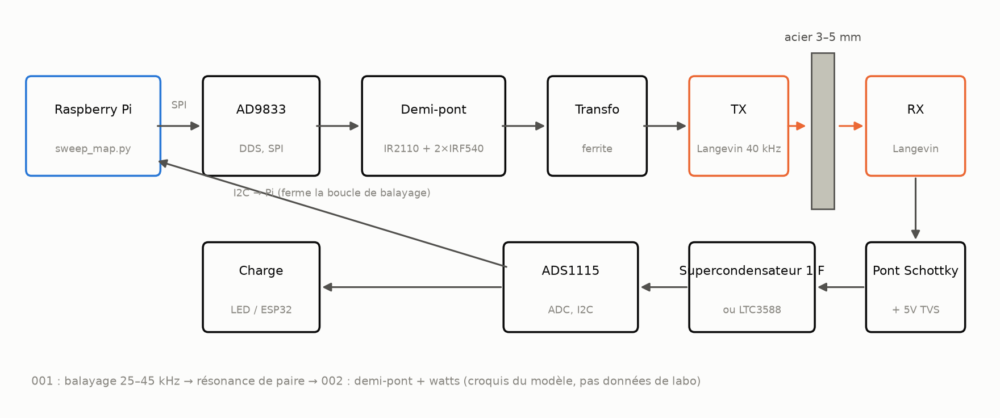
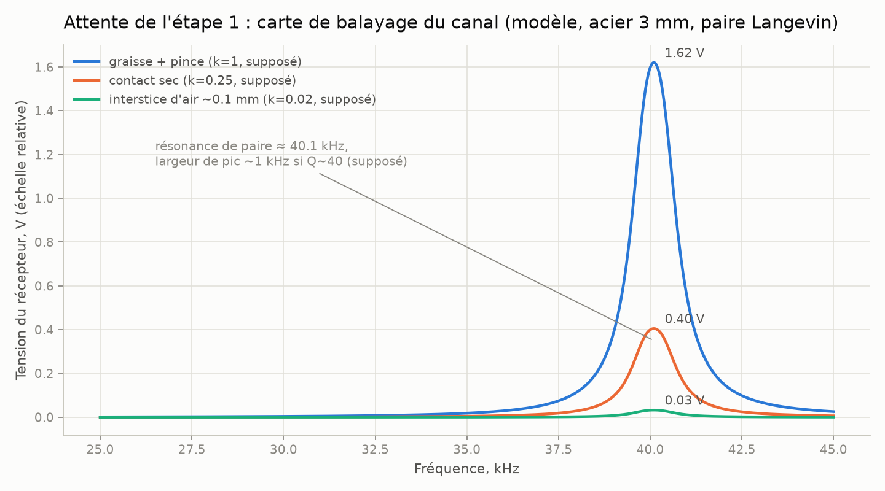
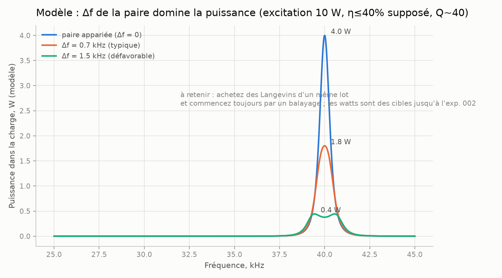
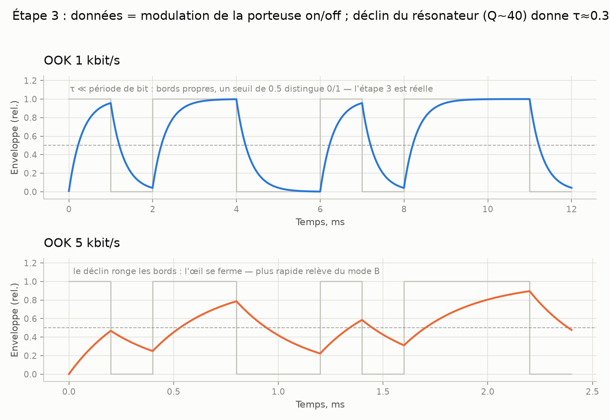
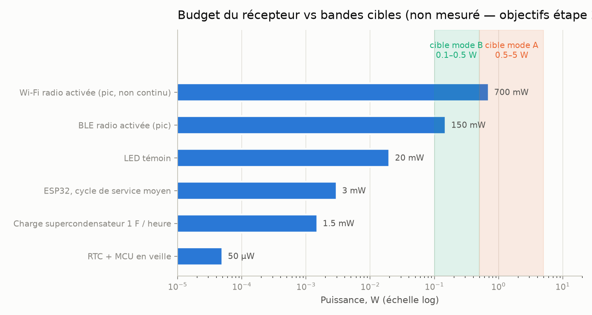
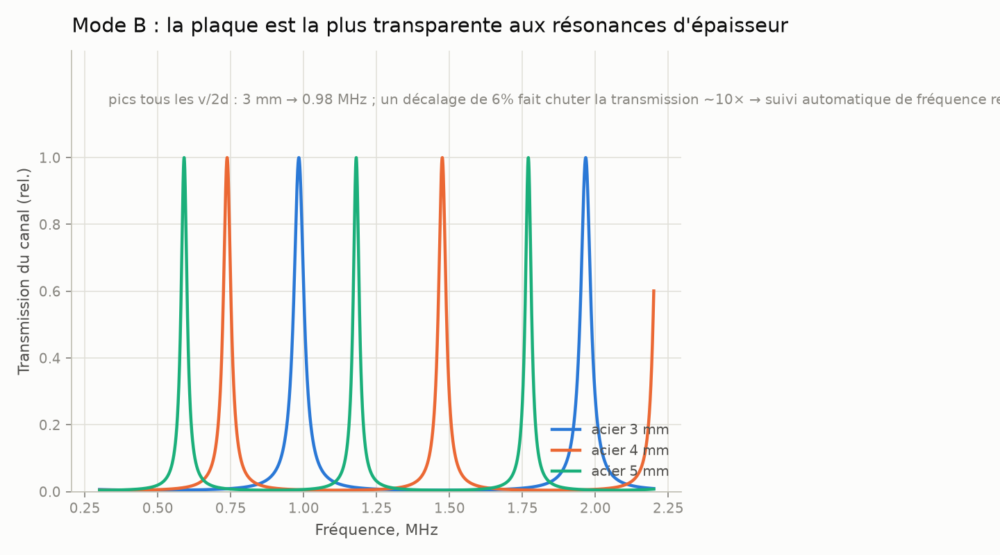

# through-metal-link

> [English (primary)](../../README.md) · [Русский](../ru/README.md) · [Deutsch](../de/README.md) · [Português](../pt/README.md) · [Español](../es/README.md) · Français · [Italiano](../it/README.md) · [Polski](../pl/README.md) · [Türkçe](../tr/README.md) · [Українська](../uk/README.md) · [Tiếng Việt](../vi/README.md) · [中文](../zh/README.md) · [日本語](../ja/README.md) · [한국어](../ko/README.md) · [हिन्दी](../hi/README.md)

Une plateforme ouverte pour le transfert ultrasonique d'énergie et de données à travers des parois métalliques pleines — « à travers l'acier sans un seul trou », construite avec des moyens de garage.

**Essayez-le maintenant (sans matériel) :** `python3 software/sweep-map/sweep_map.py --mock`

**Parcours :**
- **A — simulation à sec :** balayage simulé + [simulateur](../../software/simulator/channel_sim.py) (sans banc)
- **B — construction étape 1 :** [QUICKSTART.md](QUICKSTART.md) → [experiments/001](experiments/001-sweep-map-3mm-steel/README.md)
- **C — contribuer sans matériel :** art antérieur / docs / traductions / commentaires d'ADR ([CONTRIBUTING.md](CONTRIBUTING.md))

**Statut :** étape 0 — préparation · **aucune validation matérielle pour l'instant** (simulateur uniquement ; prime pour la première construction) · 💰 **[prime de 250 $](https://github.com/zeloras/through-metal-link/issues/5)** · liste d'achat : [QUICKSTART.md](QUICKSTART.md)

[](https://github.com/zeloras/through-metal-link/actions/workflows/ci.yml) [](https://github.com/zeloras/through-metal-link/actions/workflows/reuse.yml) [](CONTRIBUTING.md) [](LICENSES.md)

Les docs sont multilingues : l'anglais est la langue primaire et se trouve aux chemins canoniques ; toutes les autres langues reflètent l'arborescence sous [translations/](..). Modifiez n'importe quelle langue — le CI traduit et valide le reste (voir [CONTRIBUTING.md](CONTRIBUTING.md)).



## L'idée en un paragraphe

Les ondes radio ne traversent pas le métal (cage de Faraday), et un passage de câble signifie un trou, un joint, et un point de défaillance. Les ultrasons, en revanche, traversent le métal sans problème : un élément piézoélectrique de chaque côté de la paroi en fait un canal pour l'énergie et les données. La littérature de laboratoire a déjà prouvé la physique à des niveaux sérieux (RPI : 50 W + 12 Mbit/s à travers 63,5 mm d'acier ; NASA JPL : jusqu'à ~kW à travers 5 mm de titane) — ce sont des preuves d'existence avec du matériel spécialisé, pas la nomenclature de garage de ce dépôt. Les brevets fondamentaux ont expiré, et aucune plateforme ouverte et reproductible n'existe encore — ce dépôt en construit une, en visant **une puissance de l'ordre du watt et des données en kbit/s à travers 3–5 mm d'acier** une fois l'étape 2 mesurée.

## Feuille de route

| Étape | Livrable | Critère de réussite | Attente |
|---|---|---|---|
| 1. Carte de balayage | réponse en fréquence du canal « Langevin – 3 mm acier – Langevin » | paire de résonance trouvée, tracé dans [experiments/001](experiments/001-sweep-map-3mm-steel/README.md) | [sim1](docs/img/sim1-sweep-contacts.png), [sim2](docs/img/sim2-pair-mismatch.png) |
| 2. Watts | puissance dans la charge à la résonance | ≥0,5 W à travers 3 mm d'acier, protocole dans [experiments/002](experiments/002-watts-3mm-steel/README.md) | [sim4](docs/img/sim4-power-budget.png) |
| 3. Données | FSK/OOK sur la même paire | ≥1 kbit/s sans erreur | [sim5](docs/img/sim5-ook-datarate.png) |
| 4. Nœud | ESP32 + capteur dans une boîte soudée hermétiquement, alimenté et télémétré par le son seul | ≥1 h de fonctionnement autonome | [sim4](docs/img/sim4-power-budget.png) |
| 5. Publication | première réplication indépendante + article/how-to + instantané Zenodo | reproduction par un tiers documentée | — |

## Carte du dépôt

Chaque bloc ci-dessous est un résumé suffisant pour travailler, avec un lien vers le document complet.

### 🛒 De zéro à un banc fonctionnel : quoi acheter et dans quel ordre — [QUICKSTART.md](QUICKSTART.md)

**Budget :** ~210 $ minimum, ~300 $ confortable (retirez ~120 $ si vous avez déjà un Pi, un fer à souder et une alimentation de laboratoire). Trois paniers : outils (~120 $), électronique du banc (~70 $, [BOM complète](hardware/bom/bom-stage1.csv)), mécanique (~20 $). Optionnel mais fortement recommandé : un oscilloscope USB (~60–80 $).

**Chemin critique — livraison AliExpress (3–4 semaines) :** commandez l'électronique dès le premier jour. Décision clé : achetez **4 transducteurs Langevin du même lot** — le balayage sélectionnera la meilleure paire ([pourquoi](docs/img/sim2-pair-mismatch.png)).

**Pendant la livraison :** simulez le pipeline sans matériel —

```bash
python3 software/sweep-map/sweep_map.py --mock
```

**Terminé quand (par étape) :** étape 1 — le pic de balayage se reproduit sur deux passages à moins de <200 Hz près ([experiments/001](experiments/001-sweep-map-3mm-steel/README.md)) ; étape 2 — ≥0,5 W dans une charge connue à travers 3 mm d'acier et une LED allumée côté RX ([experiments/002](experiments/002-watts-3mm-steel/README.md)).

### 📚 La théorie en une minute — [docs/00-theory.md](docs/00-theory.md)

Le piézo TX est pressé contre la paroi et y injecte une onde longitudinale ; le piézo RX de l'autre côté la reconvertit en électricité. Vitesse du son dans l'acier : ~5900 m/s.

Deux modes de fonctionnement :

| Mode | Fréquence | Résonance fixée par | Donne | Statut |
|---|---|---|---|---|
| **A** — transducteurs Langevin | 40 kHz | la paire de transducteurs (paroi ≪ λ — une « membrane ») | watts, kbit/s | mode de départ (étapes 1–4, [ADR-0001](docs/decisions/0001-frequency-mode-choice.md)) |
| **B** — disques | 0,6–1 MHz | résonance d'épaisseur de la paroi ([peigne](docs/img/sim3-thickness-comb.png)) | centaines de mW, centaines de kbit/s | branche après les premiers watts ; nécessite un suivi automatique de fréquence |

Les principales pertes : désaccord de résonance au sein de la paire (±1 kHz pour des transducteurs Langevin bon marché), qualité du contact acoustique (époxy > couplant graisse + serre > pression à sec), désalignement, dérive de résonance avec la température. La réponse à toutes : **une carte de balayage avant chaque modification du montage**.

### 📈 Ce que le banc devrait montrer : tracés d'attente du simulateur — [software/simulator/channel_sim.py](../../software/simulator/channel_sim.py)

Un modèle de canal semi-empirique (pas FEM, **pas des données de labo** — de l'intuition pour « à quoi devrait ressembler le balayage et quoi viser »). Les hypothèses sont explicites dans `channel_sim.py` (Q chargé ≈40, facteurs de contact, rendement de la chaîne η≤40 %). Régénérez avec : `python3 channel_sim.py --out ../../docs/img`.

**Étape 1 — balayage.** Un pic étroit vers ~40 kHz ; les multiplicateurs de contact fictifs du modèle sont graisse:sec:vide = 1 : 0,25 : 0,02 (c.-à-d. graisse ≈4× sec et ≈50× vide d'air). Pas de pic = un problème de contact ou de paire :



**Pourquoi 4 transducteurs Langevin, pas 2.** Avec Q≈40, un désaccord de résonance de 1,5 kHz au sein de la paire fait chuter la puissance du modèle d'un facteur ~10 :



**Étape 3 — données.** OOK se heurte au ringing du résonateur (modèle Q~40 → τ≈0,3 ms) : 1 kbit/s est propre, à 5 kbit/s l'œil est fermé. Aller plus vite nécessite le mode B :



**Budget de puissance du récepteur.** Les bandes ombrées sont des **cibles** (mode A 0,5–5 W si l'étape 2 aboutit ; mode B plus bas). Les premières charges réalistes sont des ESP32 / BLE / LED à cycle de service ; le Wi-Fi est indiqué comme marqueur de pic de consommation, pas comme promesse continue :



**Pour plus tard (mode B).** La plaque devient transparente à un peigne de résonances d'épaisseur — la fréquence doit être suivie :



### ⚠️ Sécurité — à lire avant la première mise sous tension — [docs/02-safety.md](docs/02-safety.md)

1. **Des dizaines à des centaines de volts sur le piézo** dès que le pilote de l'étape 2 est actif — le TVS côté réception se met en place AVANT la première mise sous tension ; ne touchez pas les fils.
2. **Secteur** — uniquement via une alimentation de laboratoire / isolation ; les cartes de pilote de nettoyeur ultrasonique sont reliées galvaniquement au secteur.
3. **Oreilles** — à puissance non négligeable, utilisez les transducteurs pressés contre le métal ; ne faites jamais fonctionner des ultrasons aériens à haute puissance sans enceinte.
4. **Chaleur** — un transducteur Langevin non serré surchauffe en quelques minutes à pleine puissance ; serrez avant d'augmenter le courant (mise en route électrique à bas courant brève uniquement — voir le README du pilote).
5. **Éclats** — la piézocéramique est fragile : un boulon trop serré ou un choc signifie des éclats ; portez des lunettes de sécurité pour tout travail mécanique.

Première mise sous tension du pilote : limite de courant de l'alimentation de labo à 0,2 A ; séquence complète dans [hardware/driver/](hardware/driver/README.md) et [docs/02-safety.md](docs/02-safety.md).

### 🧭 Art antérieur et hygiène des brevets — [docs/01-prior-art.md](docs/01-prior-art.md)

Chaque décision technique doit remonter à une source « libre » (brevets expirés, articles). Les fondations : **US5982297** (Aerospace Corp — la recette de base d'une paire piézo à travers paroi), **US7902943** (Caltech/JPL — feed-through de Sherrit), **US9361877** (Univ. Oklahoma — un système émetteur-récepteur complet) ; tous morts. Articles clés : Lawry 2013 (50 W + 12,4 Mbit/s à travers 63,5 mm d'acier), Sherrit/NASA (une lampe de 100 W), Yang 2015 (synthèse).

À ne pas copier tant qu'ils sont vivants : l'allocation OFDM et le schéma full-duplex de RPI et les transducteurs conformes de Drexel (US, jusqu'à ~2032–2033 — les étapes 1–4 n'en ont besoin d'aucun), plus les familles qu'une recherche d'août 2026 a ajoutées : **US8594572B1** (US Navy — porte sur le canal d'énergie nu lui-même ; US, jusqu'en 2032 ; Welle 1997 est la réponse en art antérieur), **EP3723304B1** (ABB — spectre de puissance *en dessous* du spectre de données ; DE/GB, jusqu'en 2039 ; la liaison montante planifiée par modulation de charge sur même porteuse reste en dehors), **Ultrapower** (capteur dans tuyau avec réseaux convexes/concaves, ou une tige à travers la paroi ; US, jusqu'en 2035 — nous utilisons des pastilles plates et pas de tige). Lectures des revendications, statuts et contournements : [docs/01-prior-art.md](docs/01-prior-art.md).

Les décisions d'architecture sont consignées dans [docs/decisions/](docs/decisions/0001-frequency-mode-choice.md) (ADR).

### 🔌 Matériel et firmware — hardware/, firmware/

- [hardware/bom/bom-stage1.csv](hardware/bom/bom-stage1.csv) — liste d'achat étape 1.
- [hardware/schematics/](hardware/schematics/README.md) — **schémas de circuit** (générés depuis le code) : pilote, récepteur, brochage Pi, nœud récolteur.
- [hardware/driver/](hardware/driver/README.md) — pilote TX : demi-pont IR2110 + 2×IRF540, transformateur d'adaptation (un transducteur Langevin est une charge capacitive !). La carte KiCad arrive après que le prototype sur breadboard ait été validé.
- [hardware/receiver/](hardware/receiver/README.md) — récepteur, étape par étape : pont Schottky → ADC (étape 1) → charge (étape 2) → LTC3588 + supercondensateur + ESP32 (étape 4).
- [firmware/node-esp32/](firmware/node-esp32/README.md) — nœud étape 4 (stub) : sommeil profond, lecture de capteur, publicité BLE, budget de 1–5 mW en moyenne.

### 💻 Logiciel : mesures et simulateur — software/

- [software/sweep-map/sweep_map.py](../../software/sweep-map/sweep_map.py) — le cheval de trait de l'étape 1 : balayage DDS → lectures ADC → CSV + tracé de réponse en fréquence. Possède `--mock` pour un passage sans matériel. Sur le Pi : `raspi-config` → activer SPI et I2C ; `pip install spidev smbus2 matplotlib`.
- [software/simulator/channel_sim.py](../../software/simulator/channel_sim.py) — générateur des tracés d'attente (`pip install numpy matplotlib`).
- [software/simulator/material_map.py](../../software/simulator/material_map.py) — le même modèle de canal à travers différents matériaux de paroi — titane, aluminium, verre, céramiques, plastiques, béton ; l'étude et les verdicts : [docs/06-materials.md](docs/06-materials.md).
- [data/](data/README.md) — journaux bruts ; les CSV/PNG restent hors de git, seuls les tracés sélectionnés entrent dans git dans le répertoire de l'expérience.

### 🗺️ Où appliquer cela : barrières, canaux, niches — [docs/04-hybrid-channels.md](docs/04-hybrid-channels.md), [docs/05](docs/05-applications-map.md)

Il n'y a pas de canal universel — la plateforme adapte la physique à la barrière : piézo-acoustique (principal : acier/aluminium avec contact — watts et kbit/s), EMAT (métal sale/chaud, sans contact — données), magnétiques basse fréquence (parois sandwich sous vide des dewars — bits/s). Impasses honnêtes : parois revêtues de caoutchouc/composites, liquide en ébullition sur le trajet.

Priorité des niches : **(1)** chambres à vide de laboratoire et cryostats — le public matériel open-source, pas de certifications ; **(2)** cuves de fermentation — un terrain d'essai à distance de marche ; **(3)** packs de batteries scellés — le cas phare (détection d'emballement thermique sans pénétration dans le pack). Le protocole de découverte et d'auto-accord du récepteur (un analogue de Qi) : [docs/03-discovery-protocol.md](docs/03-discovery-protocol.md).

### 📁 Structure des répertoires

```
docs/            théorie, art antérieur, sécurité, applications, journal de décisions (ADR)
docs/img/        tracés d'attente (générés par software/simulator/channel_sim.py)
hardware/        BOM, pilote (demi-pont), récepteur (redresseur/récolteur)
firmware/        firmware du nœud (ESP32 — stub jusqu'à l'étape 4)
software/        scripts de mesure (carte de balayage en fréquence) et simulateur de canal
experiments/     protocoles d'expérience — depuis le modèle, un répertoire = une expérience
data/            journaux bruts (les gros fichiers restent hors de git)
```

## Principes

1. **Reproductibilité depuis zéro.** Quiconque possède un fer à souder et ~210 $ peut reproduire le résultat depuis ce dépôt seul.
2. **Chaque expérience est un protocole.** Pas de « ça marche à peu près » : [experiments/TEMPLATE.md](experiments/TEMPLATE.md) est obligatoire.
3. **Hygiène des brevets.** Nous construisons sur la couche expirée ([docs/01-prior-art.md](docs/01-prior-art.md)) ; les décisions sont consignées dans [docs/decisions/](docs/decisions/0001-frequency-mode-choice.md).
4. **Mesure d'abord, opinion ensuite.** Une carte de balayage avant toute conclusion sur le canal.

## Licences et brevets

Code — Apache-2.0, matériel — CERN-OHL-W v2, documentation — CC-BY-4.0 ; textes complets dans [LICENSES/](../../LICENSES). Quiconque peut forker et construire sur cette base, y compris commercialement ; la protection par brevet vient des clauses de concession et de représailles des licences, plus une stratégie d'art antérieur. Le schéma complet et le protocole de publication défensive : [LICENSES.md](LICENSES.md) ; règles de contribution : [CONTRIBUTING.md](CONTRIBUTING.md).
