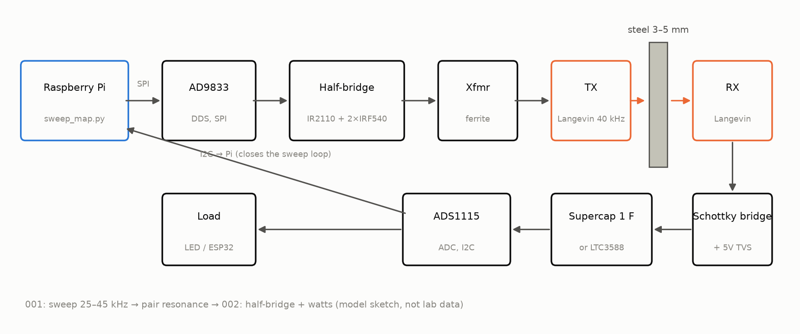
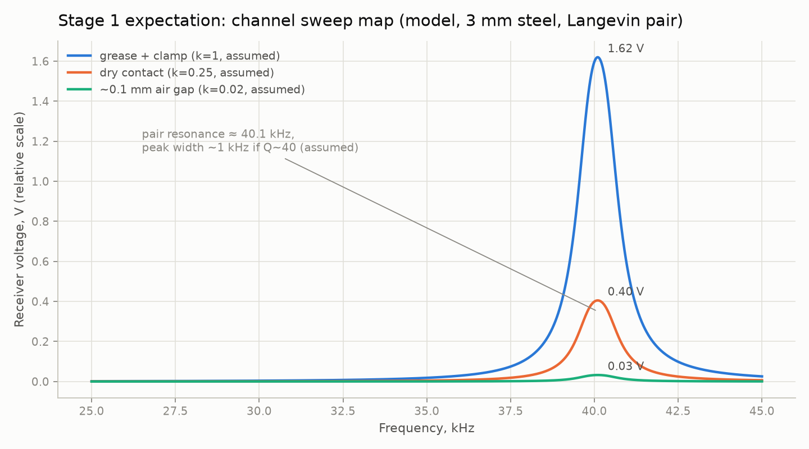
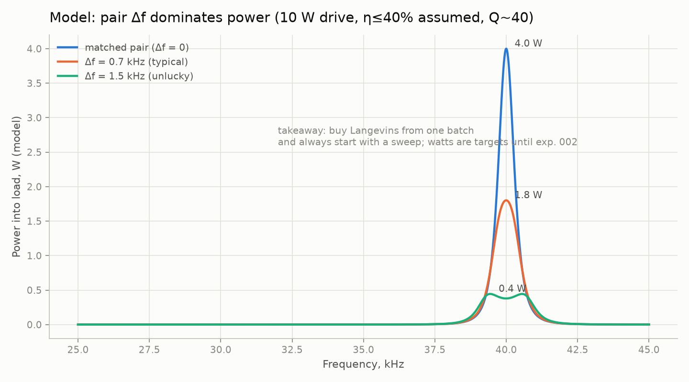
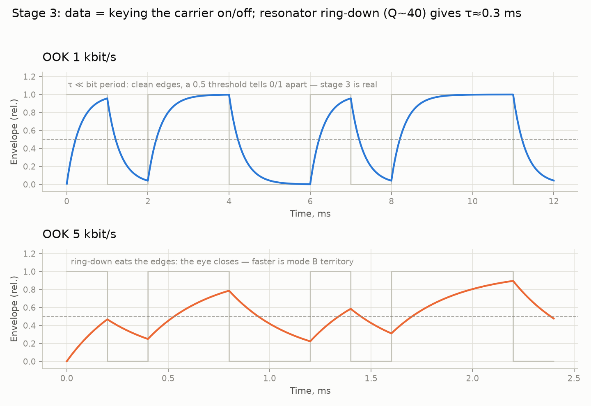
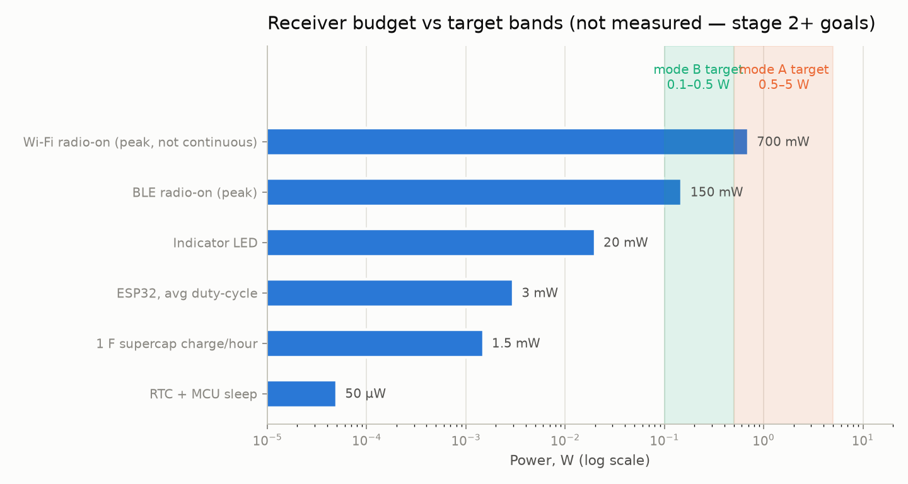
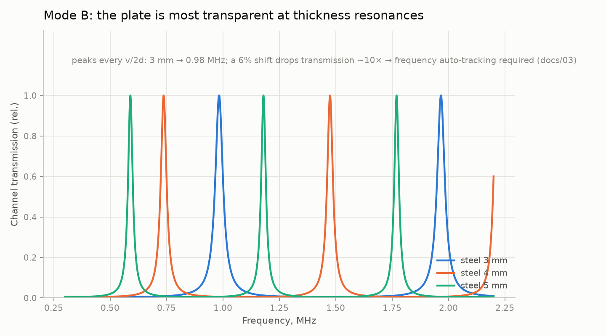

# through-metal-link

> [English (primary)](../../README.md) · [Русский](../ru/README.md) · [Deutsch](../de/README.md) · [Português](../pt/README.md) · [Español](../es/README.md) · [Français](../fr/README.md) · [Italiano](../it/README.md) · [Polski](../pl/README.md) · [Türkçe](../tr/README.md) · [Українська](../uk/README.md) · [Tiếng Việt](../vi/README.md) · [中文](../zh/README.md) · [日本語](../ja/README.md) · [한국어](../ko/README.md) · हिन्दी

ठोस धातु की दीवारों के पार अल्ट्रासोनिक बिजली और डेटा स्थानांतरण के लिए एक खुला मंच — "एक छेद के बिना स्टील के पार", गैरेज-स्तरीय साधनों से बना।

**अभी आज़माएँ (हार्डवेयर की ज़रूरत नहीं):** `python3 software/sweep-map/sweep_map.py --mock`

**शामिल होने के रास्ते:**
- **A — ड्राई-रन:** मॉक स्वीप + [सिम्युलेटर](../../software/simulator/channel_sim.py) (बेंच नहीं)
- **B — बिल्ड चरण 1:** [QUICKSTART.md](QUICKSTART.md) → [experiments/001](experiments/001-sweep-map-3mm-steel/README.md)
- **C — हार्डवेयर के बिना योगदान:** पूर्व-कला / दस्तावेज़ / अनुवाद / ADR टिप्पणियाँ ([CONTRIBUTING.md](CONTRIBUTING.md))

**स्थिति:** चरण 0 — तैयारी · **अभी तक कोई हार्डवेयर सत्यापन नहीं** (केवल सिम्युलेटर; पहले बिल्ड के लिए बाउंटी) · 💰 **[$250 बाउंटी](https://github.com/zeloras/through-metal-link/issues/5)** · खरीद सूची: [QUICKSTART.md](QUICKSTART.md)

[](https://github.com/zeloras/through-metal-link/actions/workflows/ci.yml) [](https://github.com/zeloras/through-metal-link/actions/workflows/reuse.yml) [](CONTRIBUTING.md) [](LICENSES.md)

दस्तावेज़ बहुभाषी हैं: अंग्रेज़ी मुख्य है और मानक पथों पर रहती है; हर दूसरी भाषा [translations/](..) के अंतर्गत ट्री का प्रतिबिंब है। किसी भी भाषा में संपादन करें — CI बाकी का अनुवाद करके कमिट कर देता है (देखें [CONTRIBUTING.md](CONTRIBUTING.md))।



## एक पैरा में विचार

रेडियो तरंगें धातु से नहीं गुज़रतीं (फैराडे पिंजरा), और केबल प्रवेश का मतलब है एक छेद, एक सील, और एक विफलता बिंदु। दूसरी ओर, अल्ट्रासाउंड धातु से बिल्कुल ठीक से गुज़रता है: दीवार के हर पार्श्व पर एक पीज़ो तत्व इसे बिजली और डेटा के लिए एक चैनल में बदल देता है। प्रयोगशाला साहित्य ने पहले ही गंभीर स्तरों पर भौतिकी सिद्ध कर दी है (RPI: 50 W + 12 Mbit/s 63.5 mm स्टील के पार; NASA JPL: ~kW तक 5 mm टाइटेनियम के पार) — ये विशेषीकृत हार्डवेयर के साथ अस्तित्व प्रमाण हैं, इस रेपो की गैरेज BOM नहीं। आधारभूत पेटेंट समाप्त हो चुके हैं, और अभी तक कोई खुला, प्रजनन-योग्य मंच मौजूद नहीं है — यह रिपॉज़िटरी एक बना रही है, **3–5 mm स्टील के पार वाट-श्रेणी की बिजली और kbit/s डेटा** से शुरू, एक बार चरण 2 मापा जाए।

## रोडमैप

| चरण | डिलीवरेबल | सफलता मानदंड | अपेक्षा |
|---|---|---|---|
| 1. स्वीप मैप | "Langevin–3 mm स्टील–Langevin" चैनल की आवृत्ति प्रतिक्रिया | युग्म अनुनाद मिला, [experiments/001](experiments/001-sweep-map-3mm-steel/README.md) में प्लॉट | [sim1](../../docs/img/sim1-sweep-contacts.png), [sim2](../../docs/img/sim2-pair-mismatch.png) |
| 2. वाट | अनुनाद पर लोड में बिजली | 3 mm स्टील के पार ≥0.5 W, [experiments/002](experiments/002-watts-3mm-steel/README.md) में प्रोटोकॉल | [sim4](../../docs/img/sim4-power-budget.png) |
| 3. डेटा | उसी युग्म पर FSK/OOK | ≥1 kbit/s त्रुटि-मुक्त | [sim5](../../docs/img/sim5-ook-datarate.png) |
| 4. नोड | वेल्डेड-बंद बॉक्स में ESP32 + सेंसर, केवल ध्वनि से बिजली और टेलीमेट्री | ≥1 घंटा स्वायत्त संचालन | [sim4](../../docs/img/sim4-power-budget.png) |
| 5. प्रकाशन | पहली स्वतंत्र प्रतिकृति + लेख/कैसे-करें + Zenodo स्नैपशॉट | तृतीय-पक्ष प्रजनन दस्तावेज़ित | — |

## रिपॉज़िटरी मानचित्र

नीचे हर ब्लॉक एक सारांश है जो आगे काम करने के लिए पर्याप्त है, साथ ही पूरे दस्तावेज़ का लिंक।

### 🛒 शून्य से काम करने वाले रिग तक: क्या खरीदें और किस क्रम में — [QUICKSTART.md](QUICKSTART.md)

**बजट:** ~$210 न्यूनतम, ~$300 आरामदायक (यदि आपके पास पहले से Pi, सोल्डरिंग आयरन, और बेंच पावर सप्लाई है तो ~$120 कम)। तीन टोकरियाँ: औज़ार (~$120), रिग इलेक्ट्रॉनिक्स (~$70, [पूरी BOM](hardware/bom/bom-stage1.csv)), यांत्रिकी (~$20)। वैकल्पिक लेकिन दृढ़ता से अनुशंसित: USB ऑसिलोस्कोप (~$60–80)।

**महत्वपूर्ण पथ — AliExpress शिपिंग (3–4 सप्ताह):** पहले दिन इलेक्ट्रॉनिक्स ऑर्डर करें। मुख्य निर्णय: **एक ही बैच के 4 Langevin ट्रांसड्यूसर** खरीदें — स्वीप सबसे अच्छा युग्म चुनेगा ([क्यों](../../docs/img/sim2-pair-mismatch.png))।

**शिप होते समय:** बिना हार्डवेयर के पाइपलाइन ड्राई-रन करें —

```bash
python3 software/sweep-map/sweep_map.py --mock
```

**पूरा होने पर (चरण अनुसार):** चरण 1 — स्वीप पीक दो रन में <200 Hz के भीतर प्रजनन करता है ([experiments/001](experiments/001-sweep-map-3mm-steel/README.md)); चरण 2 — 3 mm स्टील के पार एक ज्ञात लोड में ≥0.5 W और RX पक्ष से जलती हुई LED ([experiments/002](experiments/002-watts-3mm-steel/README.md))।

### 📚 एक मिनट में सिद्धांत — [docs/00-theory.md](docs/00-theory.md)

पीज़ो TX दीवार से दबाया जाता है और उसमें एक अनुदैर्ध्य तरंग भेजता है; दूसरी ओर का पीज़ो RX इसे वापस बिजली में बदलता है। स्टील में ध्वनि की गति: ~5900 m/s।

दो संचालन मोड:

| मोड | आवृत्ति | अनुनाद निर्धारित करता है | प्रदान करता है | स्थिति |
|---|---|---|---|---|
| **A** — Langevin ट्रांसड्यूसर | 40 kHz | ट्रांसड्यूसर युग्म (दीवार ≪ λ — एक "झिल्ली") | वाट, kbit/s | शुरुआती मोड (चरण 1–4, [ADR-0001](docs/decisions/0001-frequency-mode-choice.md)) |
| **B** — डिस्क | 0.6–1 MHz | दीवार का मोटाई अनुनाद ([कंघी](../../docs/img/sim3-thickness-comb.png)) | सैकड़ों mW, सैकड़ों kbit/s | पहले वाट के बाद शाखा; स्वचालित आवृत्ति ट्रैकिंग चाहिए |

मुख्य हानियाँ: युग्म के भीतर अनुनाद बेमेल (सस्ते Langevin ट्रांसड्यूसर के लिए ±1 kHz), ध्वनिक संपर्क गुणवत्ता (इपॉक्सी > ग्रीस कपलैंट + क्लैंप > शुष्क दबाव), गलत संरेखण, तापमान के साथ अनुनाद बहाव। इन सभी का उत्तर एक ही है: **सेटअप में हर बदलाव से पहले एक स्वीप मैप**।

### 📈 रिग को क्या दिखाना चाहिए: सिम्युलेटर से अपेक्षा प्लॉट — [software/simulator/channel_sim.py](../../software/simulator/channel_sim.py)

एक अर्ध-अनुभवजन्य चैनल मॉडल (FEM नहीं, **प्रयोगशाला डेटा नहीं** — "स्वीप कैसा दिखना चाहिए और किस पर निशाना लगाना चाहिए" के लिए अंतर्ज्ञान)। मान्यताएँ `channel_sim.py` में स्पष्ट हैं (लोड किया गया Q≈40, संपर्क k-फैक्टर, श्रृंखला η≤40%)। पुनः उत्पन्न करें: `python3 channel_sim.py --out ../../docs/img`।

**चरण 1 — स्वीप।** ~40 kHz के पास एक संकरा पीक; मॉडल के प्लेसहोल्डर संपर्क गुणक ग्रीस:शुष्क:अंतराल = 1 : 0.25 : 0.02 हैं (अर्थात ग्रीस ≈4× शुष्क और ≈50× वायु अंतराल)। कोई पीक न होने का मतलब संपर्क या युग्म में समस्या है:



**4 Langevin ट्रांसड्यूसर क्यों, 2 नहीं।** Q≈40 के अंतर्गत, युग्म के भीतर 1.5 kHz अनुनाद बेमेल मॉडल बिजली ~10× गिरा देता है:



**चरण 3 — डेटा।** OOK अनुनादक रिंगिंग में फँसता है (मॉडल Q~40 → τ≈0.3 ms): 1 kbit/s साफ़ है, 5 kbit/s पर आँख बंद है। तेज़ जाने के लिए मोड B चाहिए:



**रिसीवर बिजली बजट।** छायांकित बैंड **लक्ष्य** हैं (मोड A 0.5–5 W यदि चरण 2 सफल; मोड B निम्न)। यथार्थवादी पहले लोड ड्यूटी-साइकिल ESP32 / BLE / LED हैं; Wi-Fi एक पीक-ड्रा मार्कर के रूप में दिखाया गया है, निरंतर वादे के रूप में नहीं:



**बाद के लिए (मोड B)।** प्लेट मोटाई अनुनादों की एक कंघी पर पारदर्शी हो जाती है — आवृत्ति को ट्रैक करना होगा:



### ⚠️ सुरक्षा — पहली बार बिजली चालू करने से पहले पढ़ें — [docs/02-safety.md](docs/02-safety.md)

1. **पीज़ो पर दहाई से सैकड़ों वोल्ट** एक बार चरण-2 ड्राइवर ऑनलाइन होता है — रिसीव पक्ष पर TVS पहले बिजली-युक्त रन से पहले लगाया जाता है; लीड्स से हाथ दूर रखें।
2. **मेन्स** — केवल बेंच पावर सप्लाई / आइसोलेशन के माध्यम से; अल्ट्रासोनिक-क्लीनर ड्राइवर बोर्ड मेन्स से गैल्वेनिक रूप से जुड़े होते हैं।
3. **कान** — गैर-तुच्छ बिजली पर, ट्रांसड्यूसर को धातु से दबाकर संचालित करें; बिना आवरण के उच्च-बिजली वायुजनित अल्ट्रासाउंड कभी न चलाएँ।
4. **गरमी** — बिना क्लैंप का Langevin ट्रांसड्यूसर बिजली पर मिनटों में ज़्यादा गरम हो जाता है; करंट बढ़ाने से पहले क्लैंप करें (केवल संक्षिप्त निम्न-करंट विद्युत ब्रिंग-अप — ड्राइवर README देखें)।
5. **टुकड़े** — पीज़ोसिरामिक भंगुर है: ज़्यादा कसा हुआ बोल्ट या टक्कर का मतलब टुकड़े; किसी भी यांत्रिक काम के लिए सुरक्षा चश्मे पहनें।

पहली ड्राइवर बिजली चालू: बेंच सप्लाई करंट सीमा 0.2 A; पूरा क्रम [hardware/driver/](hardware/driver/README.md) और [docs/02-safety.md](docs/02-safety.md) में।

### 🧭 पूर्व-कला और पेटेंट स्वच्छता — [docs/01-prior-art.md](docs/01-prior-art.md)

हर तकनीकी निर्णय एक "मुक्त" स्रोत (समाप्त पेटेंट, पत्र) तक ज़रूर जुड़ना चाहिए। आधार: **US5982297** (Aerospace Corp — दीवार-पार पीज़ो युग्म की मूल रेसिपी), **US7902943** (Caltech/JPL — Sherrit का फीड-थ्रू), **US9361877** (Univ. Oklahoma — एक पूर्ण ट्रांसीवर प्रणाली); सभी मृत। मुख्य पत्र: Lawry 2013 (50 W + 12.4 Mbit/s 63.5 mm स्टील के पार), Sherrit/NASA (एक 100 W लैंप), Yang 2015 (सर्वेक्षण)।

अभी जीवित रहने तक नकल नहीं करना: RPI का OFDM आवंटन और फुल-डुप्लेक्स योजना और Drexel के अनुरूप ट्रांसड्यूसर (US, ~2032–2033 तक — चरण 1–4 को इनमें से किसी की ज़रूरत नहीं), साथ ही 2026-08 खोज द्वारा जोड़े गए परिवार: **US8594572B1** (US Navy — खाली बिजली चैनल पर ही पढ़ता है; US, 2032 तक; Welle 1997 पूर्व-कला उत्तर है), **EP3723304B1** (ABB — बिजली स्पेक्ट्रम डेटा स्पेक्ट्रम *से नीचे*; DE/GB, 2039 तक; योजनित समान-वाहक लोड-मॉड्युलेशन अपलिंक इसके बाहर रहता है), **Ultrapower** (पाइप-भीतर सेंसर उत्तल/अवतल सरणियों के साथ, या दीवार के पार एक छड़; US, 2035 तक — हम सपाट पैड और कोई छड़ नहीं उपयोग करते)। दावा पठन, स्थितियाँ और डिज़ाइन-अराउंड: [docs/01-prior-art.md](docs/01-prior-art.md)।

आर्किटेक्चर निर्णय [docs/decisions/](docs/decisions/0001-frequency-mode-choice.md) (ADR) में दर्ज हैं।

### 🔌 हार्डवेयर और फ़र्मवेयर — hardware/, firmware/

- [hardware/bom/bom-stage1.csv](hardware/bom/bom-stage1.csv) — चरण 1 खरीद सूची।
- [hardware/schematics/](hardware/schematics/README.md) — **सर्किट स्कीमैटिक्स** (कोड से उत्पन्न): ड्राइवर, रिसीवर, Pi पिनआउट, हार्वेस्टर नोड।
- [hardware/driver/](hardware/driver/README.md) — TX ड्राइवर: IR2110 हाफ-ब्रिज + 2×IRF540, मैचिंग ट्रांसफार्मर (Langevin ट्रांसड्यूसर एक संधारित्रीय लोड है!)। ब्रेडबोर्ड प्रोटोटाइप जाँच के बाद KiCad बोर्ड आता है।
- [hardware/receiver/](hardware/receiver/README.md) — रिसीवर, चरण-दर-चरण: Schottky ब्रिज → ADC (चरण 1) → लोड (चरण 2) → LTC3588 + सुपरकैपेसिटर + ESP32 (चरण 4)।
- [firmware/node-esp32/](firmware/node-esp32/README.md) — चरण 4 नोड (स्टब): डीप स्लीप, सेंसर रीडआउट, BLE एडवर्टाइज़िंग, 1–5 mW औसत बजट।

### 💻 सॉफ़्टवेयर: माप और सिम्युलेटर — software/

- [software/sweep-map/sweep_map.py](../../software/sweep-map/sweep_map.py) — चरण 1 का कार्यघोड़ा: DDS स्वीप → ADC रीडिंग → CSV + आवृत्ति-प्रतिक्रिया प्लॉट। हार्डवेयर के बिना रन के लिए `--mock` है। Pi पर: `raspi-config` → SPI और I2C सक्षम करें; `pip install spidev smbus2 matplotlib`।
- [software/simulator/channel_sim.py](../../software/simulator/channel_sim.py) — अपेक्षा प्लॉट का जनरेटर (`pip install numpy matplotlib`)।
- [software/simulator/material_map.py](../../software/simulator/material_map.py) — दीवार सामग्रियों पर वही चैनल मॉडल — टाइटेनियम, एल्युमिनियम, काँच, सिरेमिक, प्लास्टिक, कंक्रीट; अध्ययन और निर्णय: [docs/06-materials.md](docs/06-materials.md)।
- [data/](data/README.md) — कच्चे लॉग; CSV/PNG git से बाहर रहते हैं, केवल चुने हुए प्लॉट प्रयोग की निर्देशिका में git में जाते हैं।

### 🗺️ इसे कहाँ लागू करें: अवरोध, चैनल, आले — [docs/04-hybrid-channels.md](docs/04-hybrid-channels.md), [docs/05](docs/05-applications-map.md)

कोई सार्वभौमिक चैनल नहीं है — मंच भौतिकी को अवरोध से मिलाता है: पीज़ो-ध्वनिकी (मुख्य: संपर्क के साथ स्टील/एल्युमिनियम — वाट और kbit/s), EMAT (गंदा/गरम धातु, संपर्क नहीं — डेटा), निम्न-आवृत्ति चुंबकीय (ड्यूअर की निर्वात सैंडविच दीवारें — bits/s)। ईमानदार मृत सिरे: रबर-अस्तरित/मिश्रित दीवारें, पथ में बुलबुले वाला तरल।

आला प्राथमिकता: **(1)** प्रयोगशाला निर्वात कक्ष और क्रायोस्टेट — ओपन-सोर्स-हार्डवेयर श्रोता, कोई प्रमाणन नहीं; **(2)** किण्वन टैंक — पैदल चलने की दूरी के भीतर एक परीक्षण का मैदान; **(3)** सीलबंद बैटरी पैक — फ्लैगशिप मामला (पैक में प्रवेश के बिना थर्मल-रनअवे पहचान)। रिसीवर खोज और ऑटो-ट्यूनिंग प्रोटोकॉल (Qi का एनालॉग): [docs/03-discovery-protocol.md](docs/03-discovery-protocol.md)।

### 📁 निर्देशिका लेआउट

```
docs/            सिद्धांत, पूर्व-कला, सुरक्षा, अनुप्रयोग, निर्णय लॉग (ADR)
docs/img/        अपेक्षा प्लॉट (software/simulator/channel_sim.py द्वारा उत्पन्न)
hardware/        BOM, ड्राइवर (हाफ-ब्रिज), रिसीवर (रेक्टिफायर/हार्वेस्टर)
firmware/        नोड फ़र्मवेयर (ESP32 — चरण 4 तक स्टब)
software/        माप स्क्रिप्ट (आवृत्ति-प्रतिक्रिया स्वीप मैप) और चैनल सिम्युलेटर
experiments/     प्रयोग प्रोटोकॉल — टेम्पलेट से, एक निर्देशिका = एक प्रयोग
data/            कच्चे लॉग (बड़ी फ़ाइलें git से बाहर)
```

## सिद्धांत

1. **शून्य से प्रजनन-योग्यता।** सोल्डरिंग आयरन और ~$210 वाला कोई भी व्यक्ति केवल इस रेपो से परिणाम प्रजनित कर सकता है।
2. **हर प्रयोग एक प्रोटोकॉल है।** कोई "यह काम कर गया जैसा": [experiments/TEMPLATE.md](experiments/TEMPLATE.md) अनिवार्य है।
3. **पेटेंट स्वच्छता।** हम समाप्त परत पर निर्माण करते हैं ([docs/01-prior-art.md](docs/01-prior-art.md)); निर्णय [docs/decisions/](docs/decisions/0001-frequency-mode-choice.md) में दर्ज हैं।
4. **माप पहले, राय बाद में।** चैनल के बारे में किसी निष्कर्ष से पहले एक स्वीप मैप।

## लाइसेंस और पेटेंट

कोड — Apache-2.0, हार्डवेयर — CERN-OHL-W v2, दस्तावेज़ीकरण — CC-BY-4.0; पूरे पाठ [LICENSES/](../../LICENSES) में। कोई भी इसे फोर्क और बना सकता है, व्यावसायिक रूप से भी; पेटेंट सुरक्षा लाइसेंस के अनुदान और प्रतिशोध खंडों से और एक पूर्व-कला रणनीति से आती है। पूरी योजना और रक्षात्मक-प्रकाशन प्रोटोकॉल: [LICENSES.md](LICENSES.md); योगदान नियम: [CONTRIBUTING.md](CONTRIBUTING.md)।
