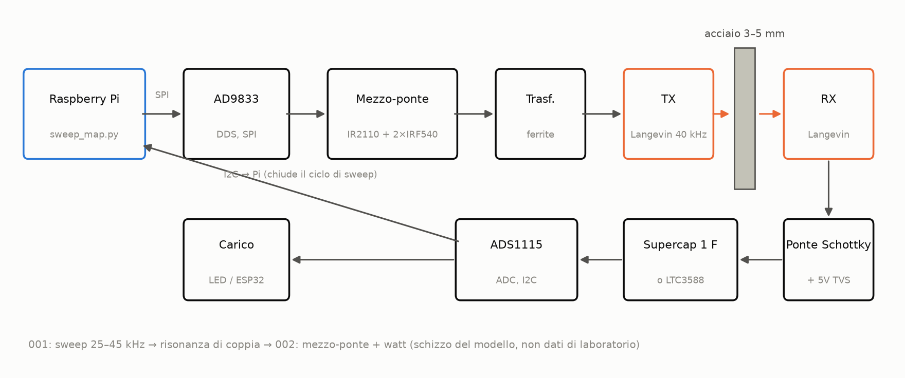
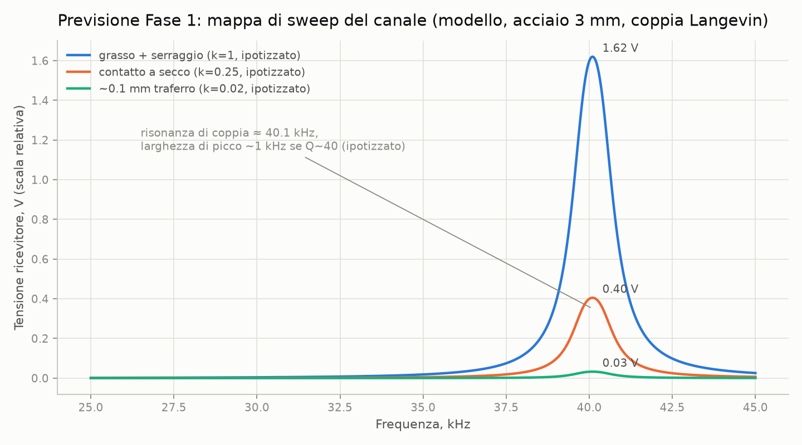
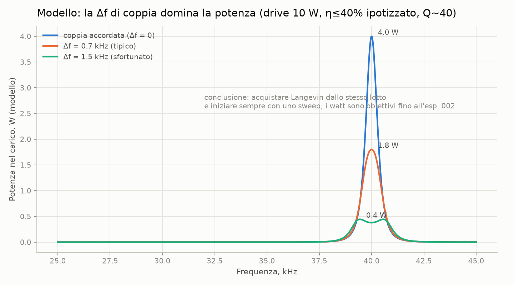
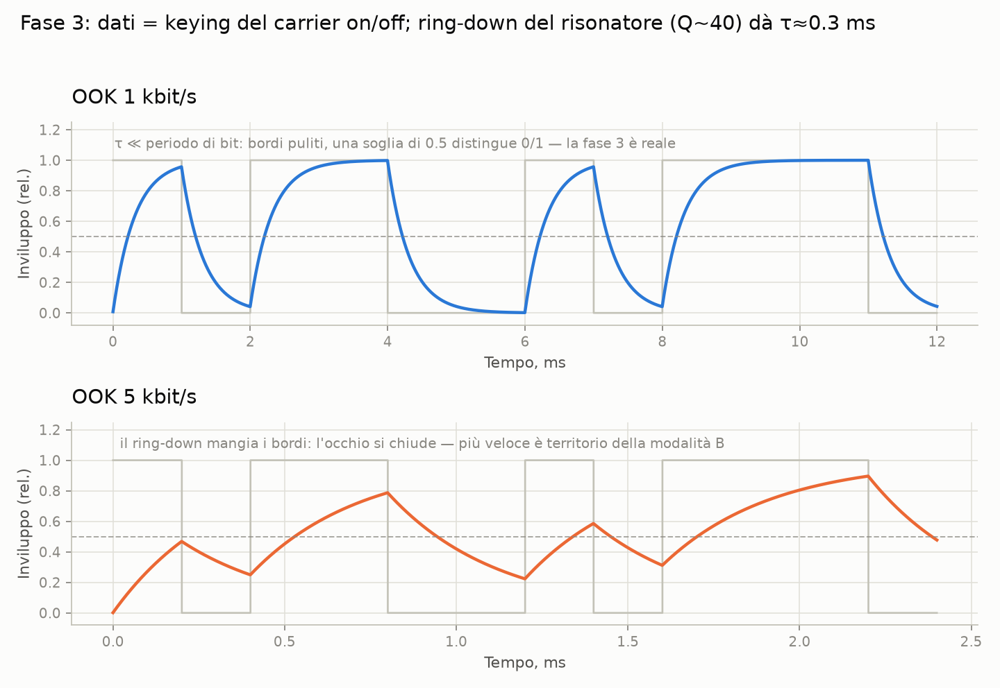
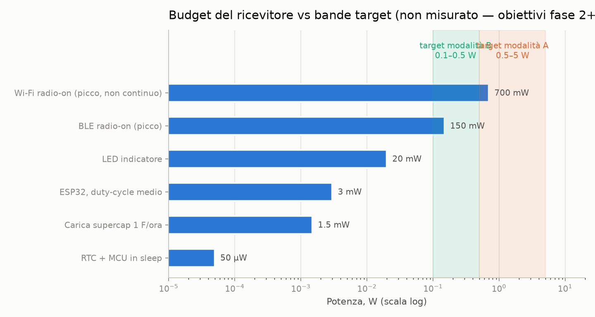
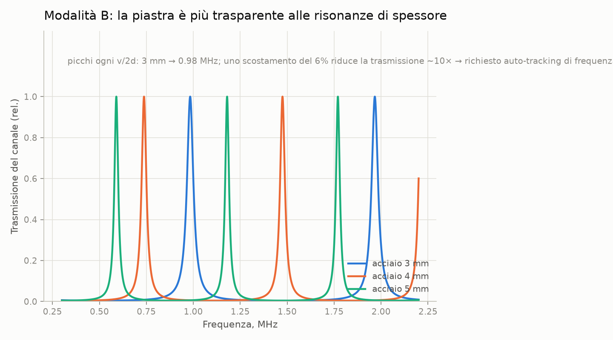

# link-attraverso-il-metallo

> [English (primary)](../../README.md) · [Русский](../ru/README.md) · [Deutsch](../de/README.md) · [Português](../pt/README.md) · [Español](../es/README.md) · [Français](../fr/README.md) · Italiano · [Polski](../pl/README.md) · [Türkçe](../tr/README.md) · [Українська](../uk/README.md) · [Tiếng Việt](../vi/README.md) · [中文](../zh/README.md) · [日本語](../ja/README.md) · [한국어](../ko/README.md) · [हिन्दी](../hi/README.md)

Una piattaforma aperta per il trasferimento di potenza e dati ultrasonici attraverso pareti metalliche solide — "attraverso l'acciaio senza un solo foro", realizzata con mezzi da garage.

**Provalo ora (senza hardware):** `python3 software/sweep-map/sweep_map.py --mock`

**Stato:** fase 0 — preparazione · 💰 **[bounty di $250 per la prima build indipendente](https://github.com/zeloras/through-metal-link/issues)** · lista della spesa: [QUICKSTART.md](QUICKSTART.md)

[](https://github.com/zeloras/through-metal-link/actions/workflows/ci.yml) [](https://github.com/zeloras/through-metal-link/actions/workflows/reuse.yml) [](CONTRIBUTING.md) [](LICENSES.md)

I documenti sono multilingua: l'inglese è la lingua principale e si trova nei percorsi canonici; ogni altra lingua rispecchia l'albero sotto [translations/](..). Modifica qualsiasi lingua — la CI traduce e fa il commit delle altre (vedi [CONTRIBUTING.md](CONTRIBUTING.md)).

<p align="center"></p>

## L'idea in un paragrafo

Le onde radio non attraversano il metallo (gabbia di Faraday), e una penetrazione via cavo significa un foro, una tenuta e un punto di guasto. Gli ultrasuoni, d'altra parte, attraversano il metallo senza problemi: un elemento piezo su ciascun lato della parete lo trasforma in un canale per alimentazione e dati. La letteratura di laboratorio ha già dimostrato la fisica a livelli significativi (RPI: 50 W + 12 Mbit/s attraverso 63,5 mm di acciaio; NASA JPL: fino a ~kW attraverso 5 mm di titanio) — queste sono prove di esistenza con hardware specializzato, non la BOM da garage di questo repo. I brevetti fondamentali sono scaduti, e non esiste ancora una piattaforma aperta e riproducibile — questo repository ne sta costruendo una, a partire da **alimentazione di classe watt e dati in kbit/s attraverso 3–5 mm di acciaio** una volta misurato lo stadio 2.

## Roadmap

| Fase | Deliverable | Criterio di successo | Aspettativa |
|---|---|---|---|
| 1. Mappa di sweep | risposta in frequenza del canale "Langevin–3 mm acciaio–Langevin" | coppia di risonanze trovata, grafico in [experiments/001](experiments/001-sweep-map-3mm-steel/README.md) | [sim1](docs/img/sim1-sweep-contacts.png), [sim2](docs/img/sim2-pair-mismatch.png) |
| 2. Watt | potenza nel carico a risonanza | ≥0,5 W attraverso 3 mm di acciaio, protocollo in [experiments/002](experiments/002-watts-3mm-steel/README.md) | [sim4](docs/img/sim4-power-budget.png) |
| 3. Dati | FSK/OOK sulla stessa coppia | ≥1 kbit/s senza errori | [sim5](docs/img/sim5-ook-datarate.png) |
| 4. Nodo | ESP32 + sensore in una scatola saldata, alimentato e telemetrato solo tramite suono | ≥1 h di funzionamento autonomo | [sim4](docs/img/sim4-power-budget.png) |
| 5. Pubblicazione | il repo diventa pubblico, articolo/how-to | riproduzione da parte di terzi | — |

## Mappa del repository

python3 software/sweep-map/sweep_map.py --mock
```

**Fatto quando (per stadio):** stadio 1 — il picco dello sweep si riproduce su due esecuzioni entro <200 Hz ([experiments/001](experiments/001-sweep-map-3mm-steel/README.md)); stadio 2 — ≥0.5 W in un carico noto attraverso 3 mm di acciaio e un LED acceso dal lato RX ([experiments/002](experiments/002-watts-3mm-steel/README.md)).

</details>

<details>
<summary><b>📚 Teoria in un minuto</b> — <a href="docs/00-theory.md">docs/00-theory.md</a></summary>

Il piezo TX è premuto contro la parete e vi guida un'onda longitudinale; il piezo RX dall'altra parte la riconverte in elettricità. Velocità del suono nell'acciaio: ~5900 m/s.

Due modalità di funzionamento:

| Modalità | Frequenza | Risonanza impostata da | Produce | Stato |
|---|---|---|---|---|
| **A** — trasduttori Langevin | 40 kHz | la coppia di trasduttori (parete ≪ λ — una "membrana") | watt, kbit/s | modalità iniziale (stadi 1–4, [ADR-0001](docs/decisions/0001-frequency-mode-choice.md)) |
| **B** — dischi | 0.6–1 MHz | risonanza di spessore della parete ([pettine](docs/img/sim3-thickness-comb.png)) | centinaia di mW, centinaia di kbit/s | ramo dopo i primi watt; richiede tracciamento automatico della frequenza |

Le perdite principali: disallineamento di risonanza nella coppia (±1 kHz per i Langevin economici), qualità del contatto acustico (epossidica > accoppiante grasso + morsetto > pressione a secco), disallineamento, deriva di risonanza con la temperatura. La risposta a tutte è la stessa: **una mappa di sweep prima di ogni modifica alla configurazione**.

</details>

<details>
<summary><b>📈 Cosa dovrebbe mostrare il rig: grafici di attesa dal simulatore</b> — <a href="software/simulator/channel_sim.py">software/simulator/channel_sim.py</a></summary>

Un modello di canale semi-empirico (non FEM, **non dati di laboratorio** — intuizione per "come dovrebbe apparire lo sweep e a cosa mirare"). Le assunzioni sono esplicite in `channel_sim.py` (Q caricato ≈40, fattori-k di contatto, catena η≤40%). Rigenera con: `python3 channel_sim.py --out ../../docs/img`.

**Stadio 1 — sweep.** Un picco stretto vicino a ~40 kHz; i moltiplicatori di contatto segnaposto del modello sono grasso:secco:gap = 1 : 0.25 : 0.02 (cioè grasso ≈4× secco e ≈50× gap d'aria). Nessun picco significa un problema con il contatto o la coppia:



**Perché 4 trasduttori Langevin, non 2.** Con Q≈40, un disallineamento di risonanza di 1.5 kHz nella coppia fa cadere la potenza del modello di ~10×:



**Stadio 3 — dati.** OOK si scontra con il ringing del risonatore (modello Q~40 → τ≈0.3 ms): 1 kbit/s è pulito, a 5 kbit/s l'occhio è chiuso. Andare più veloce richiede la modalità B:



**Budget di potenza del ricevitore.** Le bande ombreggiate sono **obiettivi** (modalità A 0.5–5 W se lo stadio 2 va a buon fine; modalità B inferiore). I primi carichi realistici sono ESP32 / BLE / LED in duty-cycle; il Wi-Fi è mostrato come indicatore di picco, non come promessa continua:



**Per dopo (modalità B).** La piastra diventa trasparente a un pettine di risonanze di spessore — la frequenza deve essere tracciata:



</details>

<details>
<summary><b>⚠️ Sicurezza — leggere prima della prima accensione</b> — <a href="docs/02-safety.md">docs/02-safety.md</a></summary>

1. **Decine o centinaia di volt sul piezo** una volta che il driver dello stadio 2 è attivo — il TVS sul lato ricevitore va inserito PRIMA della prima esecuzione alimentata; tieni le mani lontane dai contatti.
2. **Rete elettrica** — solo tramite alimentatore da banco / isolamento; le schede driver dei pulitori ultrasonici sono collegate galvanicamente alla rete.
3. **Orecchie** — a potenza non banale, opera i trasduttori premuti contro il metallo; non far mai mai funzionare ultrasuoni ad alta potenza in aria senza un involucro.
4. **Calore** — un trasduttore Langevin senza morsetto si surriscalda in minuti a potenza; morsetta prima di aumentare la corrente (solo messa a punto elettrica a bassa corrente e breve — vedi il README del driver).
5. **Schegge** — la piezoceramica è fragile: un bullone troppo stretto o un urto significa schegge; indossa occhiali di sicurezza per qualsiasi lavoro meccanico.

</details>

docs/            teoria, prior art, sicurezza, applicazioni, log delle decisioni (ADR)
docs/img/        grafici di attesa (generati da software/simulator/channel_sim.py)
hardware/        BOM, driver (half-bridge), ricevitore (raddrizzatore/harvester)
firmware/        firmware del nodo (ESP32 — stub fino alla fase 4)
software/        script di misurazione (mappa sweep di risposta in frequenza) e simulatore del canale
experiments/     protocolli sperimentali — dal template, una directory = un esperimento
data/            log grezzi (i file grandi restano fuori da git)
```

</details>

## Principi

1. **Riproducibilità da zero.** Chiunque con un saldatore e ~$210 può riprodurre il risultato usando solo questo repo.
2. **Ogni esperimento è un protocollo.** Niente "ha funzionato alla lontana": [experiments/TEMPLATE.md](experiments/TEMPLATE.md) è obbligatorio.
3. **Igiene da brevetti.** Costruiamo sullo strato scaduto ([docs/01-prior-art.md](docs/01-prior-art.md)); le decisioni sono registrate in [docs/decisions/](docs/decisions/0001-frequency-mode-choice.md).
4. **Prima la misurazione, poi l'opinione.** Una mappa di sweep prima di qualsiasi conclusione sul canale.

## Licenze e brevetti

Codice — Apache-2.0, hardware — CERN-OHL-W v2, documentazione — CC-BY-4.0; testi completi in [LICENSES/](../../LICENSES). Chiunque può fare fork e sviluppare su questo progetto, anche commercialmente; la protezione brevettuale deriva dalle concessioni e dalle clausole di ritorsione nelle licenze, oltre a una strategia di arte precedente. Lo schema completo e il protocollo di pubblicazione difensiva: [LICENSES.md](LICENSES.md); regole di contribuzione: [CONTRIBUTING.md](CONTRIBUTING.md).
