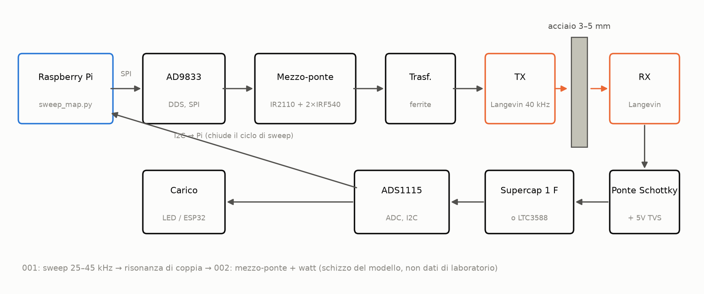
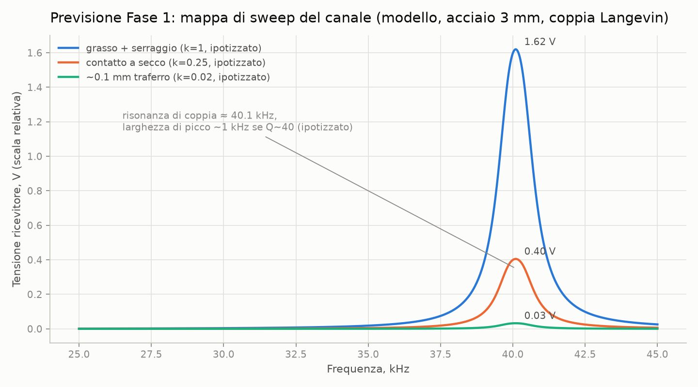
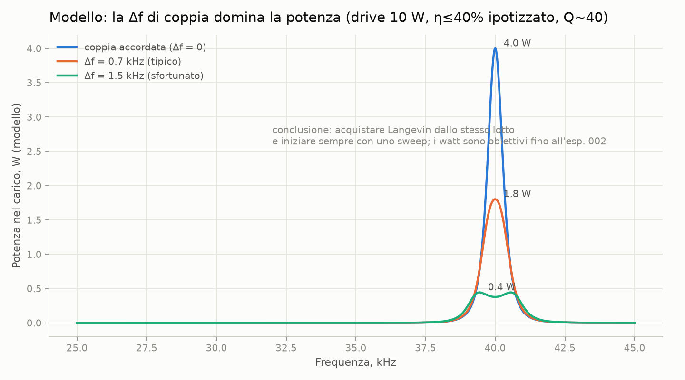
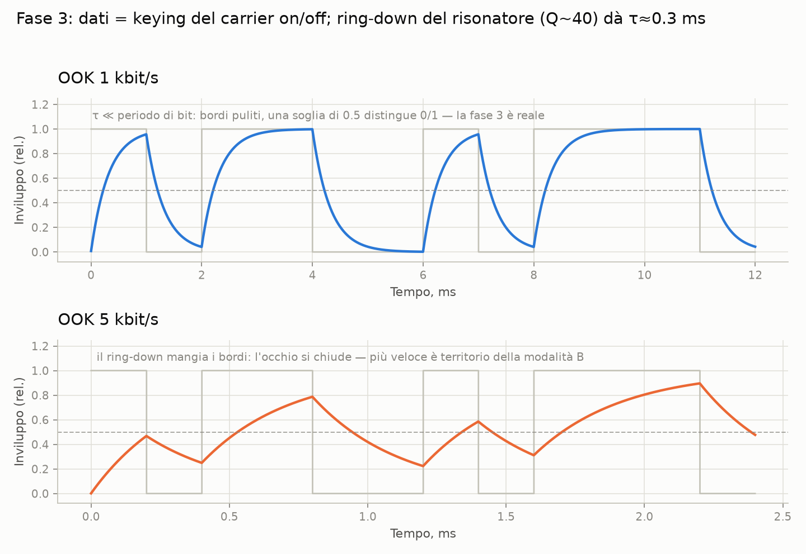
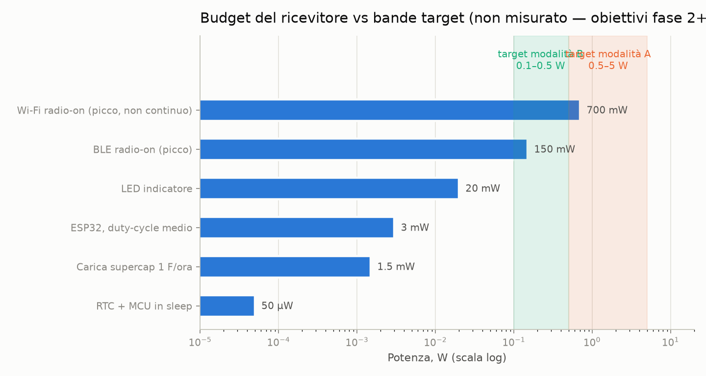
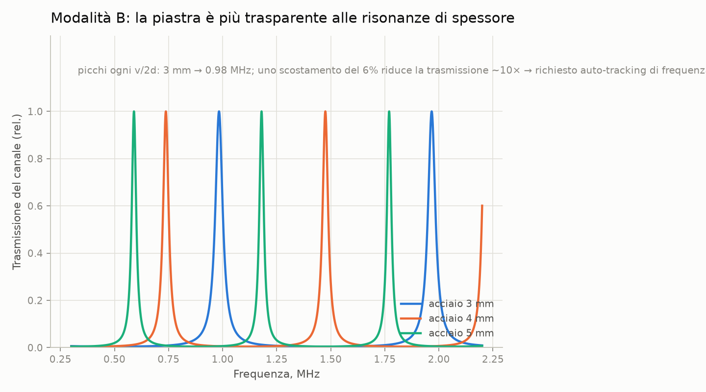

# through-metal-link

> [English (primary)](../../README.md) · [Русский](../ru/README.md) · [Deutsch](../de/README.md) · [Português](../pt/README.md) · [Español](../es/README.md) · [Français](../fr/README.md) · Italiano · [Polski](../pl/README.md) · [Türkçe](../tr/README.md) · [Українська](../uk/README.md) · [Tiếng Việt](../vi/README.md) · [中文](../zh/README.md) · [日本語](../ja/README.md) · [한국어](../ko/README.md) · [हिन्दी](../hi/README.md)

Una piattaforma aperta per il trasferimento di potenza e dati ultrasonici attraverso pareti metalliche solide — "attraverso l'acciaio senza un solo foro", costruita con mezzi da garage.

**Provalo subito (senza hardware):** `python3 software/sweep-map/sweep_map.py --mock`

**Percorsi di ingresso:**
- **A — dry-run:** sweep simulato + [simulatore](../../software/simulator/channel_sim.py) (senza banco)
- **B — costruzione fase 1:** [QUICKSTART.md](QUICKSTART.md) → [experiments/001](experiments/001-sweep-map-3mm-steel/README.md)
- **C — contribuire senza hardware:** prior-art / docs / traduzioni / commenti ADR ([CONTRIBUTING.md](CONTRIBUTING.md))

**Stato:** fase 0 — preparazione · **nessuna validazione hardware ancora** (solo simulatore; bounty per la prima build) · 💰 **[$250 bounty](https://github.com/zeloras/through-metal-link/issues/5)** · lista della spesa: [QUICKSTART.md](QUICKSTART.md)

[](https://github.com/zeloras/through-metal-link/actions/workflows/ci.yml) [](https://github.com/zeloras/through-metal-link/actions/workflows/reuse.yml) [](CONTRIBUTING.md) [](LICENSES.md)

I documenti sono multilingua: l'inglese è la lingua primaria e si trova nei percorsi canonici; ogni altra lingua rispecchia l'albero sotto [translations/](..). Modifica qualsiasi lingua — la CI traduce e committa le altre (vedi [CONTRIBUTING.md](CONTRIBUTING.md)).



## L'idea in un paragrafo

Le onde radio non attraversano il metallo (gabbia di Faraday), e una penetrazione via cavo significa un foro, una tenuta e un punto di guasto. Gli ultrasuoni, d'altra parte, attraversano il metallo senza problemi: un elemento piezo su ciascun lato della parete lo trasforma in un canale per potenza e dati. La letteratura di laboratorio ha già dimostrato la fisica a livelli seri (RPI: 50 W + 12 Mbit/s attraverso 63,5 mm di acciaio; NASA JPL: fino a ~kW attraverso 5 mm di titanio) — queste sono prove di esistenza con hardware specializzato, non la BOM da garage di questo repo. I brevetti fondamentali sono scaduti, e non esiste ancora una piattaforma aperta e riproducibile — questo repository ne sta costruendo una, a partire da **potenza di classe watt e dati kbit/s attraverso acciaio di 3–5 mm** una volta misurata la fase 2.

## Roadmap

| Fase | Deliverable | Criterio di successo | Aspettativa |
|---|---|---|---|
| 1. Sweep map | risposta in frequenza del canale "Langevin–3 mm acciaio–Langevin" | risonanza di coppia trovata, grafico in [experiments/001](experiments/001-sweep-map-3mm-steel/README.md) | [sim1](docs/img/sim1-sweep-contacts.png), [sim2](docs/img/sim2-pair-mismatch.png) |
| 2. Watt | potenza nel carico a risonanza | ≥0,5 W attraverso 3 mm di acciaio, protocollo in [experiments/002](experiments/002-watts-3mm-steel/README.md) | [sim4](docs/img/sim4-power-budget.png) |
| 3. Dati | FSK/OOK sulla stessa coppia | ≥1 kbit/s senza errori | [sim5](docs/img/sim5-ook-datarate.png) |
| 4. Nodo | ESP32 + sensore in una scatola saldata, alimentato e telemetrato solo col suono | ≥1 h di funzionamento autonomo | [sim4](docs/img/sim4-power-budget.png) |
| 5. Pubblicazione | prima replica indipendente + articolo/how-to + snapshot Zenodo | riproduzione di terzi documentata | — |

## Mappa del repository

Ogni blocco qui sotto è un digest sufficiente per lavorare, più un link al documento completo.

### 🛒 Da zero a un banco funzionante: cosa comprare e in che ordine — [QUICKSTART.md](QUICKSTART.md)

**Budget:** ~$210 minimo, ~$300 confortevole (risparmia ~$120 se hai già un Pi, un saldatore e un alimentatore da banco). Tre cesti: strumenti (~$120), elettronica del banco (~$70, [BOM completa](hardware/bom/bom-stage1.csv)), meccanica (~$20). Opzionale ma fortemente raccomandato: un oscilloscopio USB (~$60–80).

**Percorso critico — spedizione AliExpress (3–4 settimane):** ordina l'elettronica il primo giorno. Decisione chiave: compra **4 trasduttori Langevin dallo stesso lotto** — lo sweep sceglierà la coppia migliore ([perché](docs/img/sim2-pair-mismatch.png)).

**Mentre è in spedizione:** dry-run della pipeline senza hardware —

```bash
python3 software/sweep-map/sweep_map.py --mock
```

**Fatto quando (per fase):** fase 1 — il picco dello sweep si riproduce su due esecuzioni entro <200 Hz ([experiments/001](experiments/001-sweep-map-3mm-steel/README.md)); fase 2 — ≥0,5 W in un carico noto attraverso 3 mm di acciaio e un LED acceso dal lato RX ([experiments/002](experiments/002-watts-3mm-steel/README.md)).

### 📚 Teoria in un minuto — [docs/00-theory.md](docs/00-theory.md)

Il piezo TX è premuto contro la parete e guida in essa un'onda longitudinale; il piezo RX dall'altra parte la riconverte in elettricità. Velocità del suono nell'acciaio: ~5900 m/s.

Due modalità di funzionamento:

| Modalità | Frequenza | Risonanza determinata da | Produce | Stato |
|---|---|---|---|---|
| **A** — trasduttori Langevin | 40 kHz | la coppia di trasduttori (parete ≪ λ — una "membrana") | watt, kbit/s | modalità di partenza (fasi 1–4, [ADR-0001](docs/decisions/0001-frequency-mode-choice.md)) |
| **B** — dischi | 0,6–1 MHz | risonanza di spessore della parete ([pettine](docs/img/sim3-thickness-comb.png)) | centinaia di mW, centinaia di kbit/s | ramo dopo i primi watt; richiede tracciamento automatico della frequenza |

Le perdite principali: disallineamento di risonanza nella coppia (±1 kHz per trasduttori Langevin economici), qualità del contatto acustico (epoxy > accoppiante grasso + morsetto > pressione a secco), disallineamento, deriva di risonanza con la temperatura. La risposta a tutte è la stessa: **una sweep map prima di ogni modifica alla configurazione**.

### 📈 Cosa dovrebbe mostrare il banco: grafici di aspettativa dal simulatore — [software/simulator/channel_sim.py](../../software/simulator/channel_sim.py)

Un modello di canale semi-empirico (non FEM, **non dati di laboratorio** — intuizione per "come dovrebbe apparire lo sweep e a cosa mirare"). Le assunzioni sono esplicite in `channel_sim.py` (Q caricato≈40, fattori k di contatto, catena η≤40%). Rigenera con: `python3 channel_sim.py --out ../../docs/img`.

**Fase 1 — sweep.** Un picco stretto vicino a ~40 kHz; i moltiplicatori di contatto segnaposto del modello sono grasso:secco:gap = 1 : 0,25 : 0,02 (cioè grasso ≈4× secco e ≈50× gap d'aria). Nessun picco significa un problema col contatto o la coppia:



**Perché 4 trasduttori Langevin, non 2.** Con Q≈40, un disallineamento di risonanza di 1,5 kHz nella coppia riduce la potenza del modello di ~10×:



**Fase 3 — dati.** OOK si scontra col ringing del risonatore (modello Q~40 → τ≈0,3 ms): 1 kbit/s è pulito, a 5 kbit/s l'occhio è chiuso. Andare più veloci richiede la modalità B:



**Budget di potenza del ricevitore.** Le bande ombreggiate sono **obiettivi** (modalità A 0,5–5 W se la fase 2 riesce; modalità B più bassa). I primi carichi realistici sono ESP32 / BLE / LED duty-ciclati; il Wi-Fi è mostrato come indicatore di picco, non come promessa continua:



**Per dopo (modalità B).** La piastra diventa trasparente a un pettine di risonanze di spessore — la frequenza deve essere tracciata:



### ⚠️ Sicurezza — leggi prima della prima accensione — [docs/02-safety.md](docs/02-safety.md)

1. **Decine o centinaia di volt sul piezo** appena il driver di fase 2 è attivo — il TVS sul lato ricevitore va montato PRIMA della prima esecuzione alimentata; tieni le mani lontane dai contatti.
2. **Rete elettrica** — solo tramite alimentatore da banco / isolamento; le schede driver dei pulitori a ultrasuoni sono collegate galvanicamente alla rete.
3. **Orecchie** — a potenza non banale, opera con i trasduttori premuti contro il metallo; non far mai funzionare ultrasuoni ad alta potenza in aria senza un contenitore.
4. **Calore** — un trasduttore Langevin senza morsetto si surriscalda in pochi minuti a potenza; morsetta prima di alzare la corrente (solo breve bring-up elettrico a bassa corrente — vedi il README del driver).
5. **Schegge** — la piezoceramica è fragile: un bullone troppo stretto o un urto significa schegge; indossa occhiali di sicurezza per qualsiasi lavoro meccanico.

Prima accensione del driver: limite di corrente dell'alimentatore da banco 0,2 A; sequenza completa in [hardware/driver/](hardware/driver/README.md) e [docs/02-safety.md](docs/02-safety.md).

### 🧭 Prior art e igiene dei brevetti — [docs/01-prior-art.md](docs/01-prior-art.md)

Ogni decisione tecnica deve risalire a una fonte "libera" (brevetti scaduti, paper). Le fondamenta: **US5982297** (Aerospace Corp — la ricetta base per una coppia piezo through-wall), **US7902943** (Caltech/JPL — feed-through di Sherrit), **US9361877** (Univ. Oklahoma — un sistema transceiver completo); tutti scaduti. Paper chiave: Lawry 2013 (50 W + 12,4 Mbit/s attraverso 63,5 mm di acciaio), Sherrit/NASA (una lampada da 100 W), Yang 2015 (survey).

Da non copiare mentre ancora vivi: l'allocazione OFDM e lo schema full-duplex di RPI e i trasduttori conformali di Drexel (US, fino a ~2032–2033 — le fasi 1–4 non ne hanno bisogno), più le famiglie aggiunte da una ricerca del 2026-08: **US8594572B1** (US Navy — legge sul canale di potenza nudo; US, fino al 2032; Welle 1997 è la risposta prior-art), **EP3723304B1** (ABB — spettro di potenza *sotto* lo spettro dati; DE/GB, fino al 2039; la uplink pianificata a modulazione di carico sulla stessa portante resta fuori), **Ultrapower** (sensore in-tubo con array convessi/concavi, o un'asta attraverso la parete; US, fino al 2035 — noi usiamo pad piatti e nessun'asta). Letture dei claim, stati e design-around: [docs/01-prior-art.md](docs/01-prior-art.md).

Le decisioni architetturali sono registrate in [docs/decisions/](docs/decisions/0001-frequency-mode-choice.md) (ADR).

### 🔌 Hardware e firmware — hardware/, firmware/

- [hardware/bom/bom-stage1.csv](hardware/bom/bom-stage1.csv) — lista della spesa fase 1.
- [hardware/schematics/](hardware/schematics/README.md) — **schemi elettrici** (generati da codice): driver, ricevitore, pinout Pi, nodo harvester.
- [hardware/driver/](hardware/driver/README.md) — driver TX: half-bridge IR2110 + 2×IRF540, trasformatore di adattamento (un trasduttore Langevin è un carico capacitivo!). La scheda KiCad arriva dopo che il prototipo su breadboard è validato.
- [hardware/receiver/](hardware/receiver/README.md) — ricevitore, fase per fase: bridge Schottky → ADC (fase 1) → carico (fase 2) → LTC3588 + supercondensatore + ESP32 (fase 4).
- [firmware/node-esp32/](firmware/node-esp32/README.md) — nodo fase 4 (stub): deep sleep, lettura sensore, advertising BLE, budget di 1–5 mW medi.

### 💻 Software: misurazioni e simulatore — software/

- [software/sweep-map/sweep_map.py](../../software/sweep-map/sweep_map.py) — il workhorse della fase 1: sweep DDS → letture ADC → CSV + grafico di risposta in frequenza. Ha `--mock` per un'esecuzione senza hardware. Sul Pi: `raspi-config` → abilita SPI e I2C; `pip install spidev smbus2 matplotlib`.
- [software/simulator/channel_sim.py](../../software/simulator/channel_sim.py) — generatore dei grafici di aspettativa (`pip install numpy matplotlib`).
- [software/simulator/material_map.py](../../software/simulator/material_map.py) — lo stesso modello di canale attraverso diversi materiali da parete — titanio, alluminio, vetro, ceramica, plastiche, calcestruzzo; lo studio e i verdetti: [docs/06-materials.md](docs/06-materials.md).
- [data/](data/README.md) — log grezzi; CSV/PNG restano fuori da git, solo i grafici curati entrano in git nella directory dell'esperimento.

### 🗺️ Dove applicarlo: barriere, canali, nicchie — [docs/04-hybrid-channels.md](docs/04-hybrid-channels.md), [docs/05](docs/05-applications-map.md)

Non esiste un canale universale — la piattaforma adatta la fisica alla barriera: piezo-acustica (primario: acciaio/alluminio con contatto — watt e kbit/s), EMAT (metallo sporco/caldo, senza contatto — dati), magnetica a bassa frequenza (pareti sandwich vuoto delle dewar — bit/s). Vicoli ciechi onesti: pareti rivestite di gomma/composite, liquido gorgogliante nel percorso.

Priorità di nicchia: **(1)** camere da vuoto da laboratorio e criostati — il pubblico open-source-hardware, nessuna certificazione; **(2)** serbatoi di fermentazione — un banco di prova a portata di passeggiata; **(3)** pack di batterie sigillati — il caso flagship (rilevamento di thermal-runaway senza una penetrazione nel pack). Il protocollo di discovery e auto-tuning del ricevitore (un analogo di Qi): [docs/03-discovery-protocol.md](docs/03-discovery-protocol.md).

### 📁 Struttura delle directory

```
docs/            teoria, prior art, sicurezza, applicazioni, log delle decisioni (ADR)
docs/img/        grafici di aspettativa (generati da software/simulator/channel_sim.py)
hardware/        BOM, driver (half-bridge), ricevitore (raddrizzatore/harvester)
firmware/        firmware del nodo (ESP32 — stub fino alla fase 4)
software/        script di misurazione (sweep map di risposta in frequenza) e simulatore di canale
experiments/     protocolli di esperimento — dal template, una directory = un esperimento
data/            log grezzi (file grandi restano fuori da git)
```

## Principi

1. **Riproducibilità da zero.** Chiunque con un saldatore e ~$210 può riprodurre il risultato da solo questo repo.
2. **Ogni esperimento è un protocollo.** Niente "ha funzionato più o meno": [experiments/TEMPLATE.md](experiments/TEMPLATE.md) è obbligatorio.
3. **Igiene dei brevetti.** Costruiamo sullo strato scaduto ([docs/01-prior-art.md](docs/01-prior-art.md)); le decisioni sono registrate in [docs/decisions/](docs/decisions/0001-frequency-mode-choice.md).
4. **Prima la misurazione, poi l'opinione.** Una sweep map prima di ogni conclusione sul canale.

## Licenze e brevetti

Codice — Apache-2.0, hardware — CERN-OHL-W v2, documentazione — CC-BY-4.0; testi completi in [LICENSES/](../../LICENSES). Chiunque può fare fork e costruire su questo, commercialmente incluso; la protezione brevettuale deriva dalle clausole di concessione e ritorsione nelle licenze più una strategia di prior-art. Lo schema completo e il protocollo di pubblicazione difensiva: [LICENSES.md](LICENSES.md); regole di contribuzione: [CONTRIBUTING.md](CONTRIBUTING.md).
