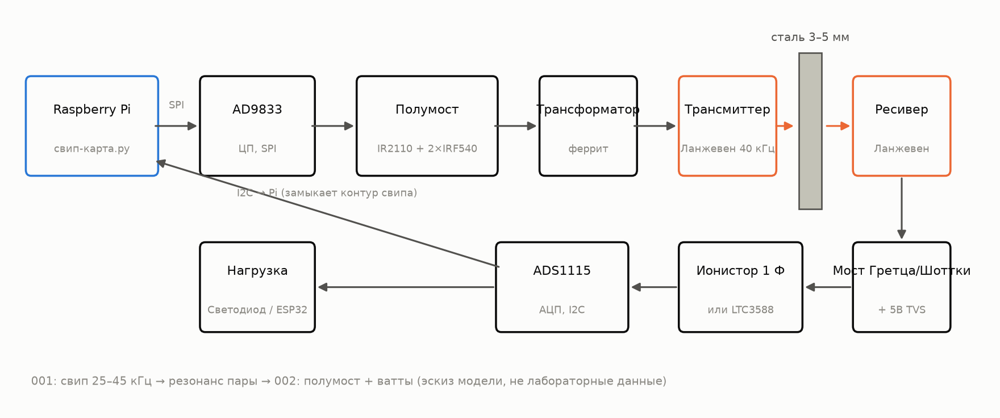
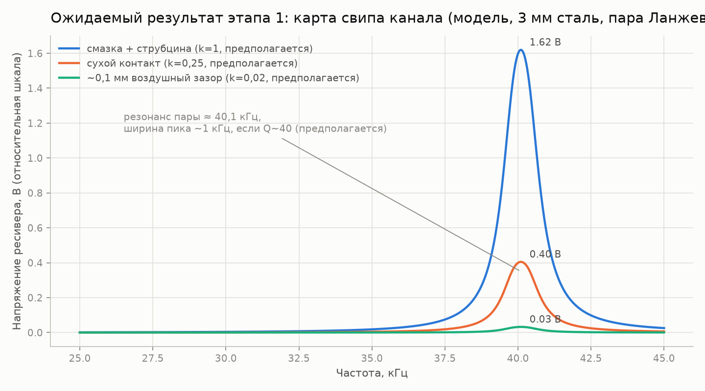
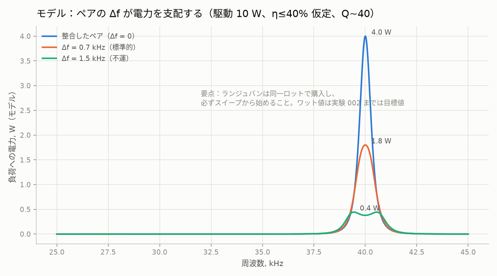
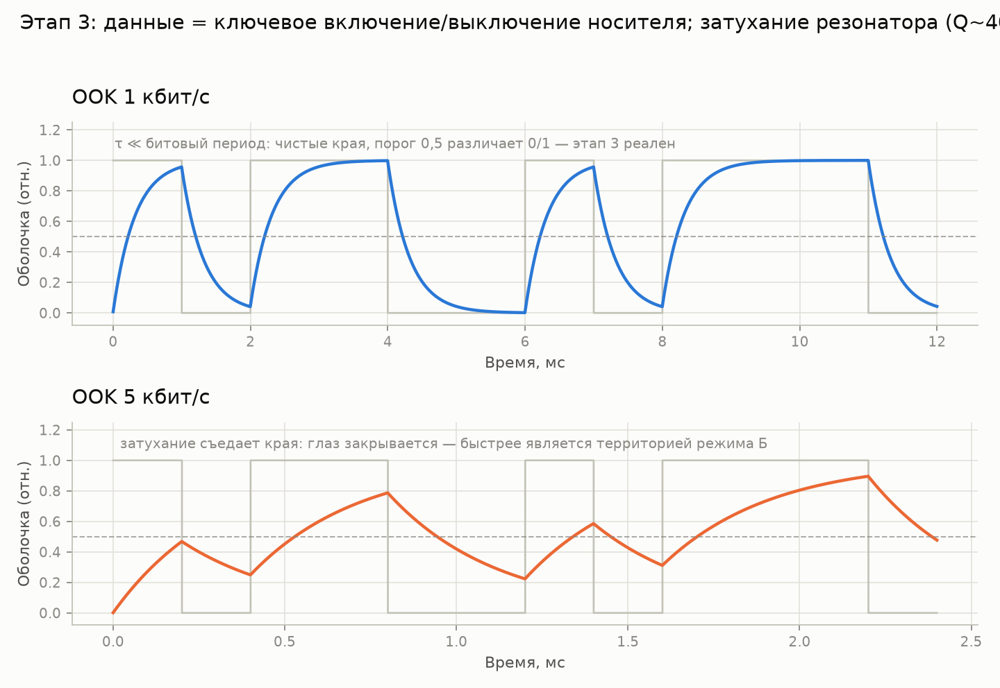
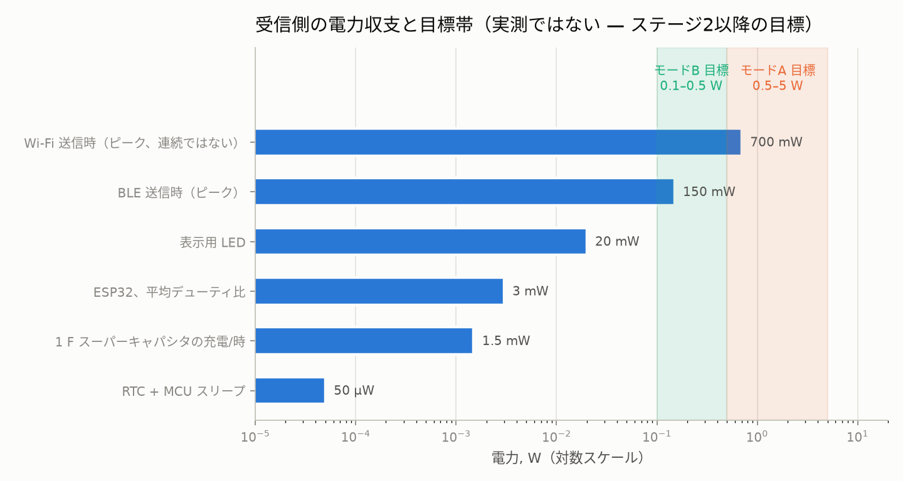
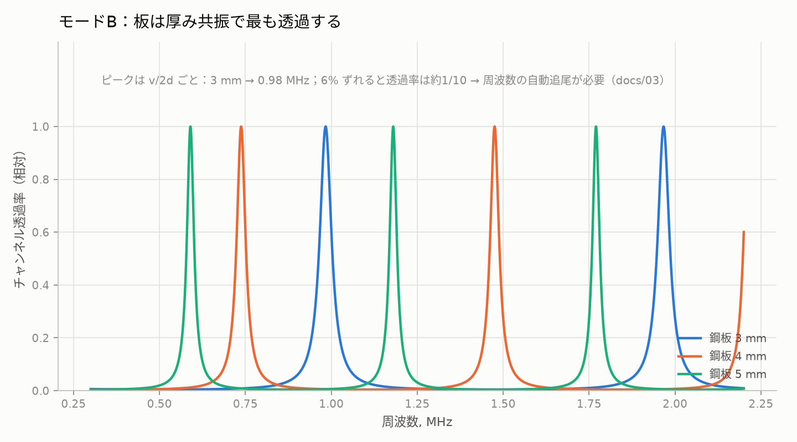

# 金属貫通リンク

> [English (primary)](../../README.md) · [Русский](../ru/README.md) · [Deutsch](../de/README.md) · [Português](../pt/README.md) · [Español](../es/README.md) · [Français](../fr/README.md) · [Italiano](../it/README.md) · [Polski](../pl/README.md) · [Türkçe](../tr/README.md) · [Українська](../uk/README.md) · [Tiếng Việt](../vi/README.md) · [中文](../zh/README.md) · 日本語 · [한국어](../ko/README.md) · [हिन्दी](../hi/README.md)

固体金属壁を通じた超音波での電力・データ転送のためのオープンプラットフォーム — 「鋼板を一つの穴も開けずに貫通」、ガレージレベルの手段で構築。

**今すぐ試す（ハードウェア不要）:** `python3 software/sweep-map/sweep_map.py --mock`

**ステータス:** ステージ 0 — 準備段階 · 💰 **[最初の独立ビルドに$250の報奨金](https://github.com/zeloras/through-metal-link/issues)** · 買い物リスト: [QUICKSTART.md](QUICKSTART.md)

[](https://github.com/zeloras/through-metal-link/actions/workflows/ci.yml) [](https://github.com/zeloras/through-metal-link/actions/workflows/reuse.yml) [](CONTRIBUTING.md) [](LICENSES.md)

ドキュメントは多言語対応です: 英語が一次言語であり正規のパスに配置されています。その他の言語はすべて [translations/](..) 配下にツリー構造をミラーリングしています。どの言語でも編集可能 — CIが翻訳して残りの言語をコミットします（[CONTRIBUTING.md](CONTRIBUTING.md) を参照）。

<p align="center"></p>

## 1段落でのアイデア

電波は金属を透過しません（ファラデーケージ）。また、ケーブルの貫通は穴、シール、そして故障点を意味します。一方、超音波は金属を問題なく通過します。壁の両側に圧電素子を配置すれば、それが電力とデータのチャネルになります。実験室の文献では、すでに本格的なレベルで物理が証明されています（RPI：63.5 mmの鋼鉄を通して50 W + 12 Mbit/s、NASA JPL：5 mmのチタンを通して最大〜kW）。これらは専用ハードウェアによる存在証明であり、このリポジトリのガレージレベルのBOMではありません。基礎特許はすでに失効しており、オープンで再現可能なプラットフォームはまだ存在しません。このリポジトリは、ステージ2の測定が完了次第、**3〜5 mmの鋼鉄を通したワット級の電力とkbit/sのデータ**から始まるプラットフォームを構築しています。

## ロードマップ

| ステージ | 成果物 | 成功基準 | 期待値 |
|---|---|---|---|
| 1. スイープマップ | 「ランジュバン–3 mm鋼板–ランジュバン」チャネルの周波数応答 | ペア共振を発見、プロットは[experiments/001](experiments/001-sweep-map-3mm-steel/README.md)に掲載 | [sim1](docs/img/sim1-sweep-contacts.png), [sim2](docs/img/sim2-pair-mismatch.png) |
| 2. ワット | 共振時の負荷への電力 | 3 mm鋼板を通じて ≥0.5 W、プロトコルは[experiments/002](experiments/002-watts-3mm-steel/README.md) | [sim4](docs/img/sim4-power-budget.png) |
| 3. データ | 同一ペアでのFSK/OOK | ≥1 kbit/s のエラーフリー通信 | [sim5](docs/img/sim5-ook-datarate.png) |
| 4. ノード | 溶接密閉ボックス内のESP32 + センサー、音響単独で給電・テレメトリ | ≥1 h の自律動作 | [sim4](docs/img/sim4-power-budget.png) |
| 5. 公開 | リポジトリ公開、記事/ハウツー | 第三者による再現 | — |

## リポジトリマップ

python3 software/sweep-map/sweep_map.py --mock
```

**完了の定義 (ステージ別):** ステージ1 — スイープのピークが2回の実行で<200 Hz以内に再現される ([experiments/001](experiments/001-sweep-map-3mm-steel/README.md)); ステージ2 — 3 mmの鋼板を通して既知の負荷に≥0.5 Wが供給され、RX側からLEDが点灯する ([experiments/002](experiments/002-watts-3mm-steel/README.md))。

</details>

<details>
<summary><b>📚 1分でわかる理論</b> — <a href="docs/00-theory.md">docs/00-theory.md</a></summary>

圧電TXは壁に押し当てられ、縦波を壁に送り込みます。反対側の圧電RXがそれを再び電気に変換します。鋼材中の音速: 約5900 m/s。

2つの動作モード:

| モード | 周波数 | 共振の決定要因 | 出力 | ステータス |
|---|---|---|---|---|
| **A** — Langevinトランスデューサ | 40 kHz | トランスデューサのペア (壁 ≪ λ — 「膜」) | ワット、kbit/s | 開始モード (ステージ1〜4、[ADR-0001](docs/decisions/0001-frequency-mode-choice.md)) |
| **B** — ディスク | 0.6–1 MHz | 壁の厚み共振 ([コム](docs/img/sim3-thickness-comb.png)) | 数百mW、数百kbit/s | 最初のワット以降の分岐; 自動周波数追尾が必要 |

主な損失: ペア内の共振の不一致 (安価なLangevinトランスデューサで±1 kHz)、音響接触の品質 (エポキシ > グリスカップラント + クランプ > ドライ圧接)、位置ずれ、温度による共振ドリフト。これらすべてに対する答えは同じです: **セットアップを変更するたびにスイープマップを作成する**。

</details>

<details>
<summary><b>📈 装置が示すべきもの: シミュレータからの期待値プロット</b> — <a href="software/simulator/channel_sim.py">software/simulator/channel_sim.py</a></summary>

半経験的チャネルモデル (FEMではなく、**実験室データでもない** — 「スイープがどのように見えるべきか、何を狙うべきか」の直感)。仮定は `channel_sim.py` に明記されています (負荷時Q≈40、接触kファクター、チェーンη≤40%)。次のコマンドで再生成します: `python3 channel_sim.py --out ../../docs/img`。

**ステージ1 — スイープ。** 約40 kHz付近の狭いピーク。モデルのプレースホルダ接触乗数は グリス:ドライ:ギャップ = 1 : 0.25 : 0.02 です (つまり、グリスはドライの約4倍、エアギャップの約50倍)。ピークがない場合は、接触またはペアに問題があります:



**なぜLangevinトランスデューサが2つではなく4つなのか。** Q≈40では、ペア内で1.5 kHzの共振不一致があると、モデル上の電力が約10分の1に低下します:



**ステージ3 — データ。** OOKは共振器のリンギングに直面します (モデルQ~40 → τ≈0.3 ms): 1 kbit/sはクリーンですが、5 kbit/sではアイが閉じます。より高速にするにはモードBが必要です:



**受信側の電力バジェット。** 影付きのバンドは**ターゲット**です (ステージ2が成功すればモードAは0.5〜5 W、モードBはそれ以下)。現実的な初期負荷はデューティサイクル駆動のESP32 / BLE / LEDです。Wi-Fiは連続的な保証ではなく、ピーク消費マーカーとして表示されています:



**後日用 (モードB)。** 厚み共振のコムにおいてプレートが透過します — 周波数を追尾する必要があります:



</details>

<details>
<summary><b>⚠️ 安全 — 最初の電源投入前に読むこと</b> — <a href="docs/02-safety.md">docs/02-safety.md</a></summary>

1. ステージ2のドライバがオンラインになると、**圧電素子に数十から数百ボルトがかかる** — 受信側のTVSは最初の通電実行の前に挿入すること。リード線には手を触れないでください。
2. **商用電源** — 直流安定化電源 / 絶縁トランスを通してのみ接続。超音波洗浄機のドライバ基板は商用電源にガルバニック接続されています。
3. **耳** — かなりの電力の場合、金属に押し当てた状態でトランスデューサを動作させる。筐体なしで高出力の空中超音波を絶対に動作させないこと。
4. **熱** — クランプされていないLangevinトランスデューサは、電力をかけると数分で過熱します。電流を上げる前にクランプすること (短時間の低電流での電気的なブリングアップのみ — ドライバのREADMEを参照)。
5. **破片** — 圧電セラミックは脆い: ボルトの締めすぎや衝撃は破片を生じさせます。機械的な作業には安全メガネを着用してください。

</details>

docs/            理論、先行技術、安全性、アプリケーション、決定ログ (ADR)
docs/img/        期待値プロット (software/simulator/channel_sim.py で生成)
hardware/        BOM、ドライバ (ハーフブリッジ)、レシーバ (レクチファイア/ハーベスタ)
firmware/        ノードファームウェア (ESP32 — ステージ4までスタブ)
software/        測定スクリプト (周波数応答スイープマップ) およびチャネルシミュレータ
experiments/     実験プロトコル — テンプレートから作成、1ディレクトリ = 1実験
data/            生ログ (大きなファイルはgitに含めない)
```

</details>

## 原則

1. **ゼロからの再現性。** はんだごてと約210ドルがあれば、誰でもこのリポジトリ単独で結果を再現できる。
2. **すべての実験はプロトコル。** 「なんとなく動いた」は不可：[experiments/TEMPLATE.md](experiments/TEMPLATE.md) が必須。
3. **特許の健全性。** 期限切れレイヤー ([docs/01-prior-art.md](docs/01-prior-art.md)) の上に構築し、決定は [docs/decisions/](docs/decisions/0001-frequency-mode-choice.md) に記録する。
4. **測定優先、意見はその次。** チャネルに関する結論を出す前に、スイープマップを先に。

## ライセンスと特許

コード — Apache-2.0、ハードウェア — CERN-OHL-W v2、ドキュメント — CC-BY-4.0。全文は [LICENSES/](../../LICENSES) にあります。誰でもフォークして本プロジェクトを基に構築でき、商用利用も含まれます。特許保護は、ライセンスの付与条項および報復条項に加え、先行技術戦略によって担保されます。完全なスキームおよび防御的公開プロトコル: [LICENSES.md](LICENSES.md)。コントリビューションルール: [CONTRIBUTING.md](CONTRIBUTING.md)。
