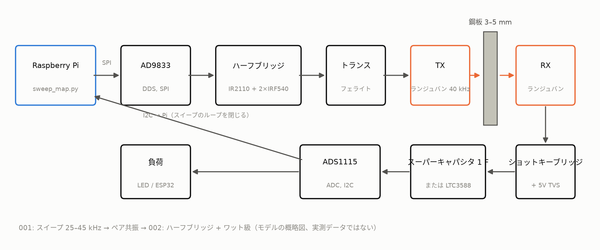
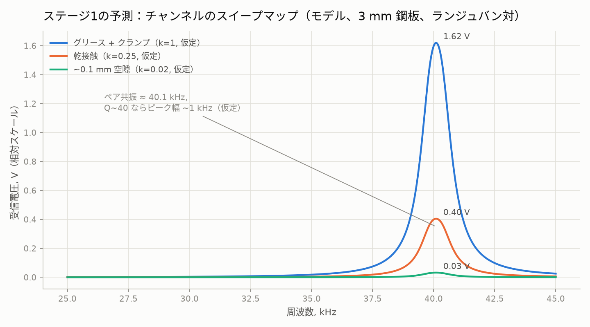
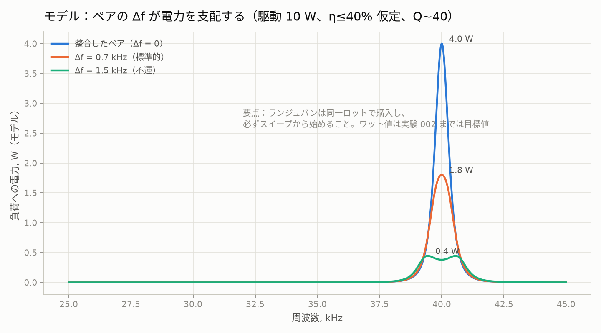
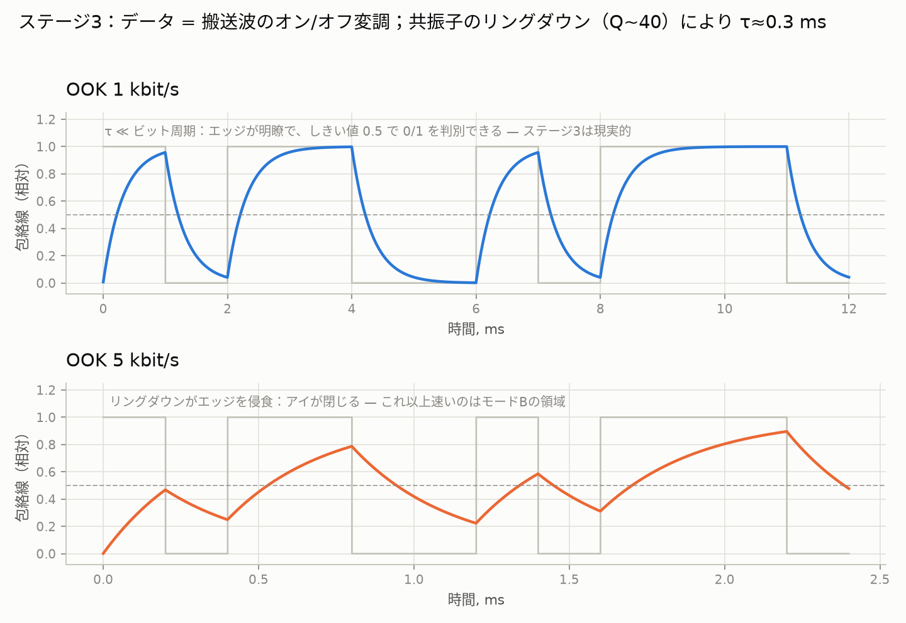
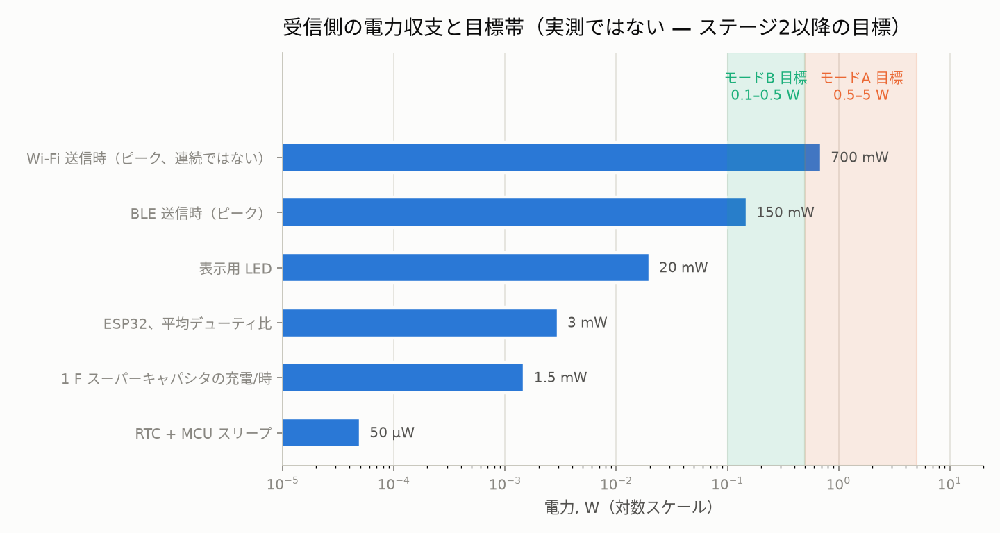
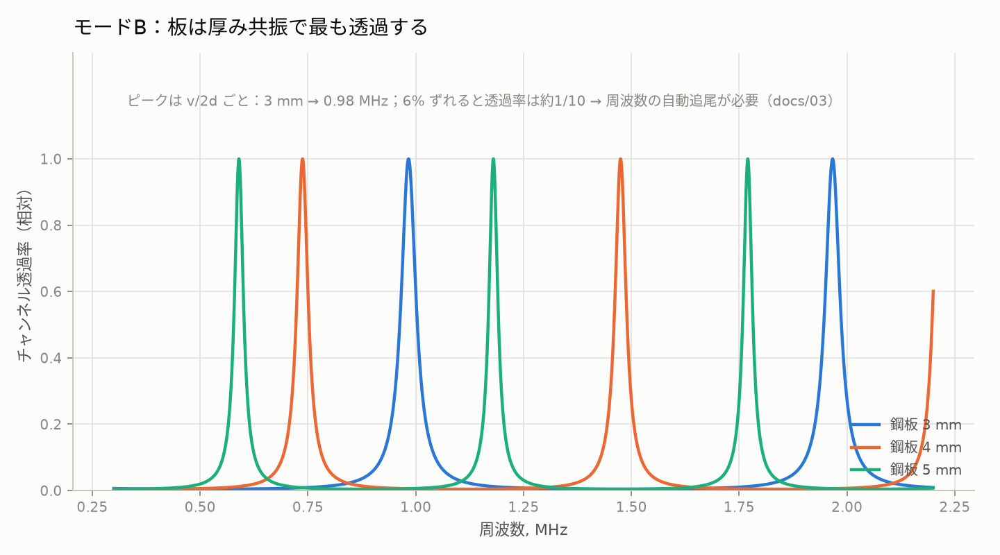

# through-metal-link

> [English (primary)](../../README.md) · [Русский](../ru/README.md) · [Deutsch](../de/README.md) · [Português](../pt/README.md) · [Español](../es/README.md) · [Français](../fr/README.md) · [Italiano](../it/README.md) · [Polski](../pl/README.md) · [Türkçe](../tr/README.md) · [Українська](../uk/README.md) · [Tiếng Việt](../vi/README.md) · [中文](../zh/README.md) · 日本語 · [한국어](../ko/README.md) · [हिन्दी](../hi/README.md)

固体金属壁を通じた超音波での電力・データ転送のためのオープンプラットフォーム — 「鋼板に穴を開けずに貫通」、ガレージレベルの手段で構築。

**今すぐ試す（ハードウェア不要）：** `python3 software/sweep-map/sweep_map.py --mock`

**参加ルート：**
- **A — ドライラン：** モックスイープ + [シミュレータ](../../software/simulator/channel_sim.py)（ベンチ不要）
- **B — ビルドステージ1：** [QUICKSTART.md](QUICKSTART.md) → [experiments/001](experiments/001-sweep-map-3mm-steel/README.md)
- **C — ハードウェアなしで貢献：** 先行技術 / ドキュメント / 翻訳 / ADRコメント（[CONTRIBUTING.md](CONTRIBUTING.md)）

**ステータス：** ステージ0 — 準備中 · **ハードウェア検証はまだなし**（シミュレータのみ；最初のビルドに懸賞金） · 💰 **[$250懸賞金](https://github.com/zeloras/through-metal-link/issues/5)** · 買い物リスト：[QUICKSTART.md](QUICKSTART.md)

[](https://github.com/zeloras/through-metal-link/actions/workflows/ci.yml) [](https://github.com/zeloras/through-metal-link/actions/workflows/reuse.yml) [](CONTRIBUTING.md) [](LICENSES.md)

ドキュメントは多言語対応：英語が一次言語で正規パスに配置、その他の言語はすべて[translations/](..)配下にツリーをミラーリング。どの言語でも編集可能 — CIが翻訳して残りをコミットします（[CONTRIBUTING.md](CONTRIBUTING.md)を参照）。



## 一段落でわかるアイデア

電波は金属を通らない（ファラデーケージ）、そしてケーブル貫通は穴、シール、そして故障点を意味する。一方、超音波は金属の中を問題なく伝わる：壁の両側に圧電素子を配置すれば、電力とデータのチャネルになる。実験室の文献ではすでに本格的なレベルで物理が実証されている（RPI：63.5 mmの鋼板を通じて50 W + 12 Mbit/s；NASA JPL：5 mmのチタンを通じて最大〜kW）— これらは特殊ハードウェアによる存在証明であり、このリポジトリのガレージBOMではない。基礎特許はすでに失効しており、オープンで再現可能なプラットフォームはまだ存在しない — このリポジトリはそれを構築中で、ステージ2の測定後には**3〜5 mmの鋼板を通じてワット級の電力とkbit/sのデータ**から始める。

## ロードマップ

| ステージ | 成果物 | 成功基準 | 期待値 |
|---|---|---|---|
| 1. スイープマップ | 「ランジュバン—3 mm鋼板—ランジュバン」チャネルの周波数応答 | ペアの共振を発見、プロットを[experiments/001](experiments/001-sweep-map-3mm-steel/README.md)に掲載 | [sim1](docs/img/sim1-sweep-contacts.png), [sim2](docs/img/sim2-pair-mismatch.png) |
| 2. ワット | 共振時の負荷への電力 | 3 mmの鋼板を通じて≥0.5 W、プロトコルは[experiments/002](experiments/002-watts-3mm-steel/README.md) | [sim4](docs/img/sim4-power-budget.png) |
| 3. データ | 同一ペアでのFSK/OOK | ≥1 kbit/sエラーフリー | [sim5](docs/img/sim5-ook-datarate.png) |
| 4. ノード | 溶接密閉箱内のESP32 + センサ、音だけで駆動・テレメトリ | ≥1時間の自律動作 | [sim4](docs/img/sim4-power-budget.png) |
| 5. 出版 | 最初の独立再現 + 記事/ハウツー + Zenodoスナップショット | 第三者による再現が文書化されている | — |

## リポジトリマップ

以下の各ブロックは作業に十分な要約と、完全ドキュメントへのリンクです。

### 🛒 ゼロから稼働リグまで：何を、どの順番で買うか — [QUICKSTART.md](QUICKSTART.md)

**予算：** 最小〜$210、快適〜$300（Pi、はんだごて、ベンチ電源をすでに持っていれば〜$120引き）。三つのバスケット：ツール（〜$120）、リグ電子部品（〜$70、[完全BOM](hardware/bom/bom-stage1.csv)）、機械部品（〜$20）。オプションだが強く推奨：USBオシロスコープ（〜$60–80）。

**クリティカルパス — AliExpress配送（3〜4週間）：** 電子部品は初日に発注。重要な決定：**同じロットのランジュバントランスデューサを4個購入** — スイープで最良のペアを選ぶ（[理由](docs/img/sim2-pair-mismatch.png)）。

**配送待ちの間：** ハードウェアなしでパイプラインをドライラン —

```bash
python3 software/sweep-map/sweep_map.py --mock
```

**完了条件（ステージ別）：** ステージ1 — スイープのピークが2回の実行で<200 Hz以内で再現（[experiments/001](experiments/001-sweep-map-3mm-steel/README.md)）；ステージ2 — 3 mmの鋼板を通じて既知の負荷に≥0.5 W、RX側からLED点灯（[experiments/002](experiments/002-watts-3mm-steel/README.md)）。

### 📚 一分でわかる理論 — [docs/00-theory.md](docs/00-theory.md)

圧電TXを壁に押し当てて縦波を壁に入射；反対側の圧電RXがそれを電気に戻す。鋼板中の音速：〜5900 m/s。

二つの動作モード：

| モード | 周波数 | 共振の決定要因 | 得られるもの | ステータス |
|---|---|---|---|---|
| **A** — ランジュバントランスデューサ | 40 kHz | トランスデューサペア（壁≪λ — 「膜」） | ワット、kbit/s | 開始モード（ステージ1–4、[ADR-0001](docs/decisions/0001-frequency-mode-choice.md)） |
| **B** — ディスク | 0.6–1 MHz | 壁の厚み共振（[コム](docs/img/sim3-thickness-comb.png)） | 数百mW、数百kbit/s | 最初のワット後に分岐；自動周波数追尾が必要 |

主な損失：ペア内の共振ミスマッチ（安価なランジュバントランスデューサで±1 kHz）、音響接触の品質（エポキシ > グリースカップラント+クランプ > ドライ加圧）、ミスアライメント、温度による共振ドリフト。これらすべてに対する答えは同じ：**セットアップの変更ごとにスイープマップを作成**。

### 📈 リグが示すべきもの：シミュレータからの期待値プロット — [software/simulator/channel_sim.py](../../software/simulator/channel_sim.py)

半経験的チャネルモデル（FEMではなく、**実験室データでもない** — 「スイープがどう見えるべきか、何を狙うべきか」の直感用）。前提は`channel_sim.py`に明示（ロードされたQ≈40、接触kファクタ、チェーンη≤40%）。再生成：`python3 channel_sim.py --out ../../docs/img`。

**ステージ1 — スイープ。** 〜40 kHz付近の狭いピーク；モデルのプレースホルダ接触乗数はグリース:ドライ:ギャップ = 1 : 0.25 : 0.02（つまりグリース≈ドライの4倍、エアギャップの≈50倍）。ピークがない場合は接触またはペアに問題あり：



**なぜランジュバントランスデューサを2個ではなく4個か。** Q≈40では、ペア内の1.5 kHzの共振ミスマッチがモデル電力を〜10倍低下させる：



**ステージ3 — データ。** OOKは共振器のリンギングに直面する（モデルQ〜40 → τ≈0.3 ms）：1 kbit/sはクリーン、5 kbit/sでアイが閉じる。より高速にはモードBが必要：



**受信側電力予算。** 影付きバンドは**ターゲット**（モードA 0.5–5 W、ステージ2が成功すれば；モードBはより低い）。現実的な初期負荷はデューティサイクル駆動のESP32 / BLE / LED；Wi-Fiは連続的な約束ではなくピーク消費マーカーとして表示：



**後日用（モードB）。** 厚み共振のコムでプレートが透過になる — 周波数を追尾する必要あり：



### ⚠️ 安全 — 初回通電前に必読 — [docs/02-safety.md](docs/02-safety.md)

1. **圧電素子に数十〜数百ボルト** — ステージ2ドライバが稼働すると — 受信側のTVSは最初の通電前に挿入すること；リード線に手を触れないこと。
2. **商用電源** — ベンチ電源 / 絶縁経由のみ；超音波洗浄機ドライバボードは商用電源にガルバニック接続されている。
3. **耳** — 非自明な電力では、トランスデューサを金属に押し当てて操作；密閉なしの空中超音波を高出力で駆動しないこと。
4. **熱** — クランプされていないランジュバントランスデューサは電力印加で数分で過熱；電流を上げる前にクランプ（短時間の低電流電気ブリングアップのみ — ドライバREADMEを参照）。
5. **破片** — 圧電セラミックは脆い：締めすぎたボルトや衝撃は破片を生む；機械作業時には保護メガネを着用。

初回ドライバ通電：ベンチ電源電流制限0.2 A；完全な手順は[hardware/driver/](hardware/driver/README.md)および[docs/02-safety.md](docs/02-safety.md)に記載。

### 🧭 先行技術と特許衛生 — [docs/01-prior-art.md](docs/01-prior-art.md)

すべての技術的決定は「フリー」なソース（失効特許、論文）に追溯到可能。基盤：**US5982297**（Aerospace Corp — 貫通壁圧電ペアの基本レシピ）、**US7902943**（Caltech/JPL — Sherritのフィードスルー）、**US9361877**（Oklahoma大学 — 完全なトランシーバシステム）；すべて失効。主要論文：Lawry 2013（63.5 mmの鋼板を通じて50 W + 12.4 Mbit/s）、Sherrit/NASA（100 Wランプ）、Yang 2015（サーベイ）。

まだ存命中でコピーすべきでないもの：RPIのOFDM割り当てと全二重方式、Drexelの適合型トランスデューサ（米国、〜2032–2033まで — ステージ1–4には不要）、および2026-08検索で追加されたファミリ：**US8594572B1**（米海軍 — 裸の電力チャネル自体に該当；米国、2032まで；Welle 1997が先行技術の回答）、**EP3723304B1**（ABB — データスペクトル*より下*の電力スペクトル；DE/GB、2039まで；計画中の同一キャリア負荷変調アップリンクはその外側）、**Ultrapower**（凸/凹アレイを用いた配管内センサ、または壁を貫通するロッド；米国、2035まで — 当方はフラットパッドを使用しロッドなし）。クレーム解釈、ステータス、設計回避：[docs/01-prior-art.md](docs/01-prior-art.md)。

アーキテクチャ決定は[docs/decisions/](docs/decisions/0001-frequency-mode-choice.md)（ADR）に記録。

### 🔌 ハードウェアとファームウェア — hardware/, firmware/

- [hardware/bom/bom-stage1.csv](hardware/bom/bom-stage1.csv) — ステージ1買い物リスト。
- [hardware/schematics/](hardware/schematics/README.md) — **回路図**（コードから生成）：ドライバ、レシーバ、Piピンアウト、ハーベスタノード。
- [hardware/driver/](hardware/driver/README.md) — TXドライバ：IR2110ハーフブリッジ + 2×IRF540、マッチングトランス（ランジュバントランスデューサは容量性負荷！）。KiCadボードはブレッドボードプロトタイプが確認後に作成。
- [hardware/receiver/](hardware/receiver/README.md) — レシーバ、ステージ別：ショットキーブリッジ → ADC（ステージ1）→ 負荷（ステージ2）→ LTC3588 + スーパーキャパシタ + ESP32（ステージ4）。
- [firmware/node-esp32/](firmware/node-esp32/README.md) — ステージ4ノード（スタブ）：ディープスリープ、センサ読み取り、BLEアドバタイズ、平均1–5 mWの予算。

### 💻 ソフトウェア：測定とシミュレータ — software/

- [software/sweep-map/sweep_map.py](../../software/sweep-map/sweep_map.py) — ステージ1の主役：DDSスイープ → ADC読み取り → CSV + 周波数応答プロット。ハードウェアなしの実行用`--mock`あり。Pi上では：`raspi-config` → SPIとI2Cを有効化；`pip install spidev smbus2 matplotlib`。
- [software/simulator/channel_sim.py](../../software/simulator/channel_sim.py) — 期待値プロットのジェネレータ（`pip install numpy matplotlib`）。
- [software/simulator/material_map.py](../../software/simulator/material_map.py) — 同一チャネルモデルで壁材質を横断 — チタン、アルミニウム、ガラス、セラミック、プラスチック、コンクリート；研究と評価：[docs/06-materials.md](docs/06-materials.md)。
- [data/](data/README.md) — 生ログ；CSV/PNGはgitに含めず、キュレーションされたプロットのみ実験ディレクトリ内にgitに格納。

### 🗺️ 適用先：バリア、チャネル、ニッチ — [docs/04-hybrid-channels.md](docs/04-hybrid-channels.md), [docs/05](docs/05-applications-map.md)

万能なチャネルは存在しない — プラットフォームは物理をバリアに合わせる：圧電音響（主：接触ありの鋼/アルミ — ワットとkbit/s）、EMAT（汚れ/高温金属、非接触 — データ）、低周波磁気（デュワーの真空サンドイッチ壁 — bits/s）。正直な行き止まり：ゴムライニング/複合壁、経路内の気泡液体。

ニッチ優先度：**(1)** 実験室真空チャンバとクライオスタット — オープンソースハードウェアの対象者、認証不要；**(2)** 発酵タンク — 徒歩圏内の実証場；**(3)** 密閉バッテリーパック — フラッグシップケース（パックへの貫通なしの熱暴走検出）。レシーバ発見・自動チューニングプロトコル（Qiのアナログ）：[docs/03-discovery-protocol.md](docs/03-discovery-protocol.md)。

### 📁 ディレクトリレイアウト

```
docs/            理論、先行技術、安全、応用、決定ログ（ADR）
docs/img/        期待値プロット（software/simulator/channel_sim.pyで生成）
hardware/        BOM、ドライバ（ハーフブリッジ）、レシーバ（整流/ハーベスト）
firmware/        ノードファームウェア（ESP32 — ステージ4までスタブ）
software/        測定スクリプト（周波数応答スイープマップ）およびチャネルシミュレータ
experiments/     実験プロトコル — テンプレートから、1ディレクトリ = 1実験
data/            生ログ（大きなファイルはgitに含めない）
```

## 原則

1. **ゼロからの再現性。** はんだごてと〜$210があれば、このリポジトリだけで結果を再現できる。
2. **すべての実験はプロトコル。** 「なんとなく動いた」なし：[experiments/TEMPLATE.md](experiments/TEMPLATE.md)が必須。
3. **特許衛生。** 失効レイヤーの上に構築（[docs/01-prior-art.md](docs/01-prior-art.md)）；決定は[docs/decisions/](docs/decisions/0001-frequency-mode-choice.md)に記録。
4. **測定第一、意見第二。** チャネルに関する結論の前にスイープマップを。

## ライセンスと特許

コード — Apache-2.0、ハードウェア — CERN-OHL-W v2、ドキュメント — CC-BY-4.0；全文は[LICENSES/](../../LICENSES)。商用利用を含め誰でもフォークして構築可能；特許保護はライセンスの付与条項と報復条項、および先行技術戦略による。完全なスキームと防御的公開プロトコル：[LICENSES.md](LICENSES.md)；貢献ルール：[CONTRIBUTING.md](CONTRIBUTING.md)。
