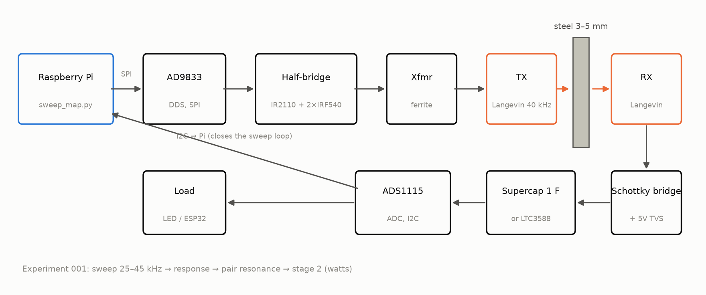
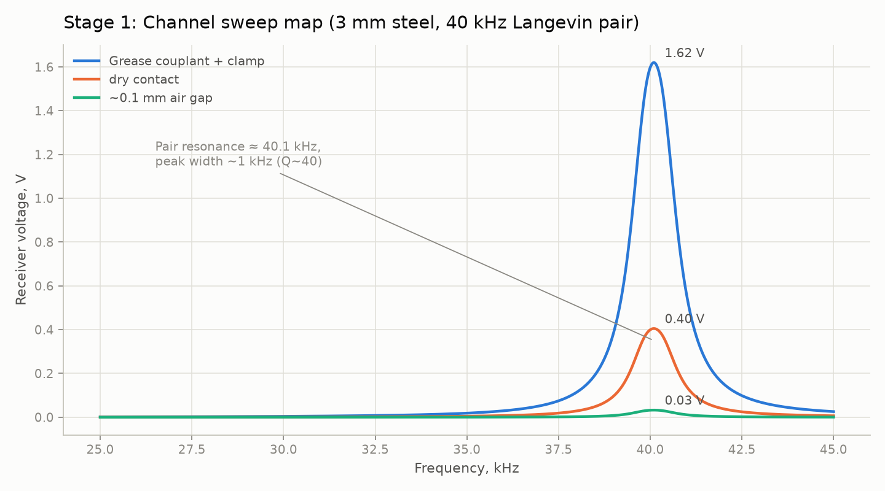
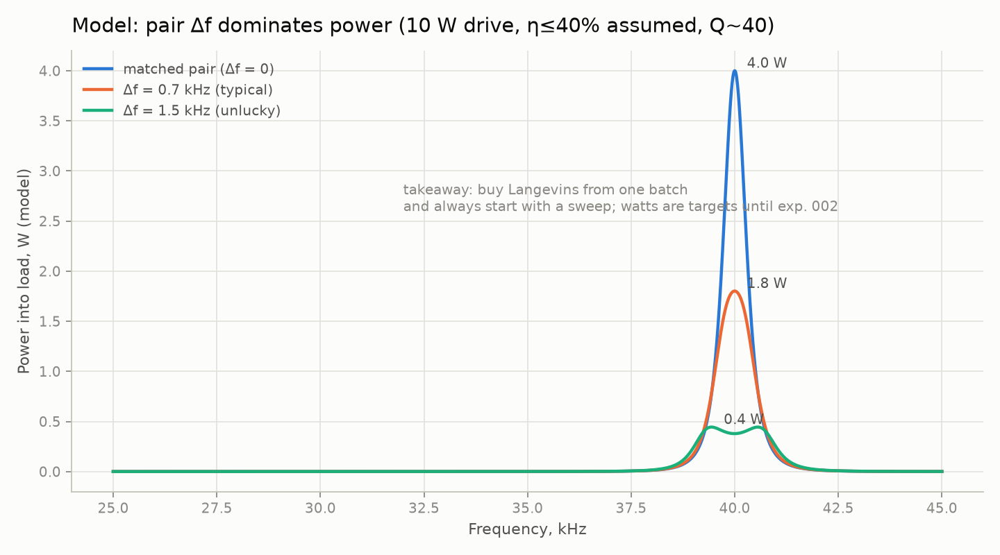
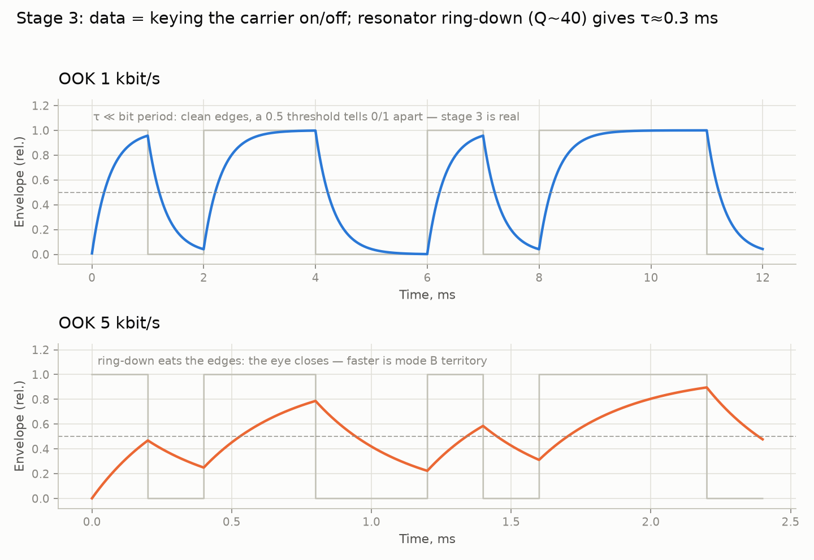
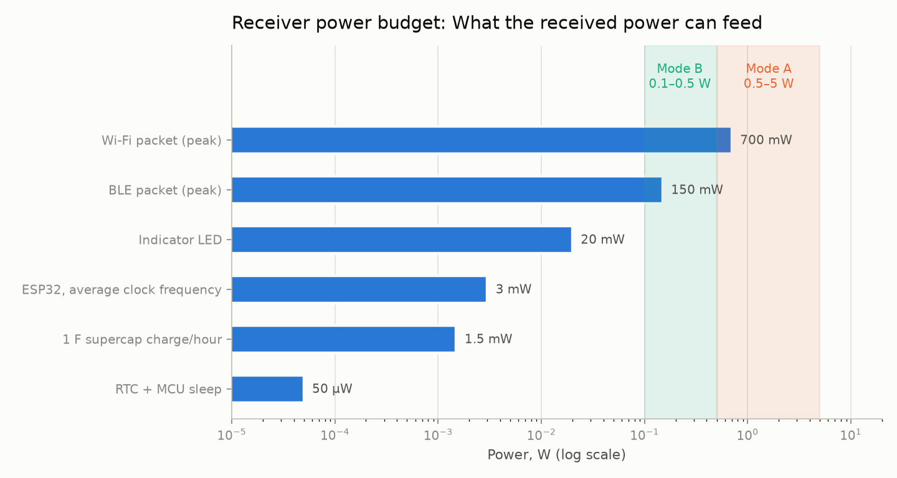
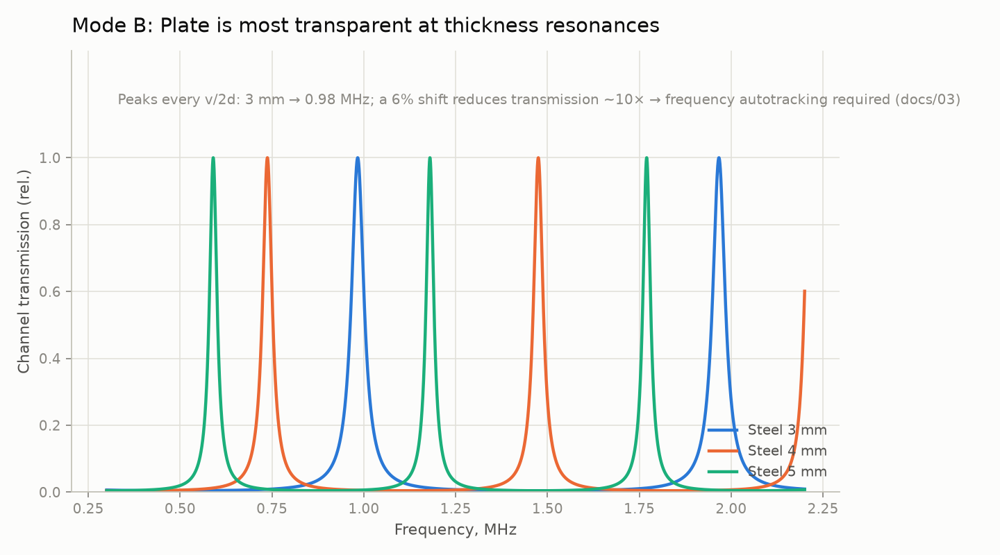

# 금속-관통-링크

> [English (primary)](../../README.md) · [Русский](../ru/README.md) · [Deutsch](../de/README.md) · [Português](../pt/README.md) · [Español](../es/README.md) · [Français](../fr/README.md) · [Italiano](../it/README.md) · [Polski](../pl/README.md) · [Türkçe](../tr/README.md) · [Українська](../uk/README.md) · [Tiếng Việt](../vi/README.md) · [中文](../zh/README.md) · [日本語](../ja/README.md) · 한국어 · [हिन्दी](../hi/README.md)

고체 금속 벽을 통한 초음파 전력 및 데이터 전송을 위한 오픈 플랫폼 — "구멍 하나 없이 강철을 통과", 차고 수준의 수단으로 제작.

**지금 바로 체험하기 (하드웨어 불필요):** `python3 software/sweep-map/sweep_map.py --mock`

**상태:** 단계 0 — 준비 중 · 💰 **[최초 독립 빌드에 $250 현상금](https://github.com/zeloras/through-metal-link/issues)** · 쇼핑 목록: [QUICKSTART.md](QUICKSTART.md)

[](https://github.com/zeloras/through-metal-link/actions/workflows/ci.yml) [](https://github.com/zeloras/through-metal-link/actions/workflows/reuse.yml) [](CONTRIBUTING.md) [](LICENSES.md)

문서는 다국어로 제공됩니다: 영어가 기본이며 정식 경로에 위치합니다; 다른 모든 언어는 [translations/](..) 아래에 트리를 미러링합니다. 어떤 언어든 편집하면 CI가 나머지 언어를 번역하고 커밋합니다 ([CONTRIBUTING.md](CONTRIBUTING.md) 참조).

<p align="center"></p>

## 한 단락으로 요약한 아이디어

전파는 금속을 통과하지 못하고(패러데이 새시), 케이블 관통은 곧 구멍, 실링, 그리고 고장 지점을 의미한다. 반면 초음파는 금속을 아주 잘 통과한다: 벽 양쪽에 압전 소자를 하나씩 붙이면 그 벽이 전력과 데이터를 실어 나르는 통로가 된다. 실험실 문헌은 이미 상당한 수준에서 물리학을 증명했다(RPI: 63.5 mm 강철을 통해 50 W + 12 Mbit/s; NASA JPL: 5 mm 티타늄을 통해 최대 ~kW) — 이들은 특수 하드웨어로 보여준 존재 증명이지, 이 저장소의 가라지 BOM이 아니다. 기초 특허는 만료되었고, 아직 공개되고 재현 가능한 플랫폼은 존재하지 않는다 — 이 저장소는 그런 플랫폼을 구축 중이며, 2단계 측정이 끝나면 **3–5 mm 강철을 통한 와트급 전력과 kbit/s 데이터**부터 시작한다.

## 로드맵

| 단계 | 산출물 | 성공 기준 | 예상 |
|---|---|---|---|
| 1. 스윕 맵 | "Langevin–3 mm 강철–Langevin" 채널의 주파수 응답 | 공진 쌍 발견, [experiments/001](experiments/001-sweep-map-3mm-steel/README.md)에 플롯 | [sim1](../../docs/img/sim1-sweep-contacts.png), [sim2](../../docs/img/sim2-pair-mismatch.png) |
| 2. 전력 | 공진 시 부하로 전달되는 전력 | 3 mm 강철을 통해 ≥0.5 W, [experiments/002](experiments/002-watts-3mm-steel/README.md)의 프로토콜 | [sim4](../../docs/img/sim4-power-budget.png) |
| 3. 데이터 | 동일한 쌍을 통한 FSK/OOK | ≥1 kbit/s 무오류 | [sim5](../../docs/img/sim5-ook-datarate.png) |
| 4. 노드 | 용접 밀폐 박스 내 ESP32 + 센서, 소리만으로 전원 공급 및 원격 측정 | ≥1 h 자율 동작 | [sim4](../../docs/img/sim4-power-budget.png) |
| 5. 공개 | 저장소 공개, 기사/사용법 | 제3자에 의한 재현 | — |

## 리포지토리 맵

python3 software/sweep-map/sweep_map.py --mock
```

**완료 조건 (단계별):** 1단계 — 스윕 피크가 두 번의 실행에서 <200 Hz 오차 내로 재현됨 ([experiments/001](experiments/001-sweep-map-3mm-steel/README.md)); 2단계 — 3mm 강철을 통해 알려진 부하로 ≥0.5 W 전달 및 RX 측에서 LED 점등 ([experiments/002](experiments/002-watts-3mm-steel/README.md)).

</details>

<details>
<summary><b>📚 1분 이론</b> — <a href="docs/00-theory.md">docs/00-theory.md</a></summary>

압전 TX는 벽에 밀착되어 종파를 벽 안으로 구동합니다; 반대편의 압전 RX는 이를 다시 전기로 변환합니다. 강철에서의 음속: ~5900 m/s.

두 가지 작동 모드:

| 모드 | 주파수 | 공진 설정 | 산출 | 상태 |
|---|---|---|---|---|
| **A** — Langevin 트랜스듀서 | 40 kHz | 트랜스듀서 페어 (벽 ≪ λ — "멤브레인") | 와트, kbit/s | 시작 모드 (1–4단계, [ADR-0001](docs/decisions/0001-frequency-mode-choice.md)) |
| **B** — 디스크 | 0.6–1 MHz | 벽의 두께 공진 ([빗살](../../docs/img/sim3-thickness-comb.png)) | 수백 mW, 수백 kbit/s | 첫 와트 달성 후 분기; 자동 주파수 추적 필요 |

주요 손실: 페어 내의 공진 불일치 (저렴한 Langevin 트랜스듀서의 경우 ±1 kHz), 음향 접촉 품질 (에폭시 > 그리스 커플런트 + 클램프 > 드라이 압력), 정렬 불량, 온도에 따른 공진 드리프트. 이 모든 것에 대한 해답은 동일합니다: **설정을 변경할 때마다 스윕 맵 작성**.

</details>

<details>
<summary><b>📈 장비가 보여줄 것: 시뮬레이터의 기대 플롯</b> — <a href="software/simulator/channel_sim.py">software/simulator/channel_sim.py</a></summary>

반경험적 채널 모델 (FEM이 아니며, **실제 실험실 데이터도 아님** — "스윕이 어떻게 보여야 하고 무엇을 목표로 해야 하는가"에 대한 직관 제공). 가정 사항은 `channel_sim.py`에 명시되어 있습니다 (loaded Q≈40, 접촉 k-팩터, 체인 η≤40%). 다음 명령으로 재생성: `python3 channel_sim.py --out ../../docs/img`.

**1단계 — 스윕.** ~40 kHz 부근의 좁은 피크; 모델의 플레이스홀더 접촉 승수는 그리스:드라이:갭 = 1 : 0.25 : 0.02 입니다 (즉, 그리스는 드라이의 ≈4배, 에어 갭의 ≈50배). 피크가 없다는 것은 접촉이나 페어에 문제가 있음을 의미합니다:



**Langevin 트랜스듀서를 2개가 아닌 4개 사는 이유.** Q≈40에서 페어 내 1.5 kHz 공진 불일치는 모델 파워를 ~10× 떨어뜨립니다:



**3단계 — 데이터.** OOK는 공진기 링잉(ringing)에 부딪힙니다 (모델 Q~40 → τ≈0.3 ms): 1 kbit/s는 깨끗하지만, 5 kbit/s에서는 아이가 닫힙니다. 더 빠르게 가려면 모드 B가 필요합니다:



**수신기 전력 예산.** 음영 처리된 밴드는 **목표치**입니다 (2단계가 성공하면 모드 A 0.5–5 W; 모드 B는 더 낮음). 현실적인 초기 부하는 듀티 사이클이 적용된 ESP32 / BLE / LED입니다; Wi-Fi는 연속적인 보장이 아닌 피크 전력 소비 마커로 표시됩니다:



**나중을 위해 (모드 B).** 판은 두께 공진의 빗살에서 투명해집니다 — 주파수를 추적해야 합니다:



</details>

<details>
<summary><b>⚠️ 안전 — 첫 전원 인가 전에 읽으세요</b> — <a href="docs/02-safety.md">docs/02-safety.md</a></summary>

1. 2단계 드라이버가 켜지면 **압전 소자에 수십에서 수백 볼트의 전압**이 인가됩니다 — 첫 전원 인가 실행 전에 수신 측에 TVS를 연결하세요; 리드 선에 손을 대지 마세요.
2. **상용 전원** — 벤치 전원 공급 장치 / 절연을 통해서만 연결; 초음파 세척기 드라이버 보드는 상용 전원에 직접 연결되어 있습니다.
3. **귀** — 출력이 큰 경우, 트랜스듀서를 금속에 밀착시켜 작동시키세요; 외함 없이 고출력 공기 중 초음파를 절대 작동시키지 마세요.
4. **열** — 클램프되지 않은 Langevin 트랜스듀서는 전원 인가 시 몇 분 안에 과열됩니다; 전류를 올리기 전에 클램프하세요 (짧은 저전류 전기적 초기 구동만 허용 — 드라이버 README 참조).
5. **파편** — 압전 세라믹은 깨지기 쉽습니다: 볼트를 너무 조이거나 충격을 주면 파편이 튑니다; 모든 기계적 작업 시 안전 고글을 착용하세요.

</details>

docs/            이론, 선행 기술, 안전, 응용 분야, 결정 로그 (ADR)
docs/img/        예상 플롯 (software/simulator/channel_sim.py에 의해 생성됨)
hardware/        BOM, 드라이버 (하프 브리지), 수신기 (정류기/하베스터)
firmware/        노드 펌웨어 (ESP32 — 4단계까지 스텁)
software/        측정 스크립트 (주파수 응답 스윕 맵) 및 채널 시뮬레이터
experiments/     실험 프로토콜 — 템플릿에서, 하나의 디렉토리 = 하나의 실험
data/            원시 로그 (대용량 파일은 git에 보관하지 않음)
```

</details>

## 원리

1. **제로에서의 재현성.** 인두기와 약 $210만 있으면 이 저장소만으로 누구나 결과를 재현할 수 있다.
2. **모든 실험은 프로토콜이다.** "대충 작동했다"는 금지: [experiments/TEMPLATE.md](experiments/TEMPLATE.md)는 필수다.
3. **특허 위생.** 우리는 만료된 계층 위에 구축한다([docs/01-prior-art.md](docs/01-prior-art.md)); 결정 사항은 [docs/decisions/](docs/decisions/0001-frequency-mode-choice.md)에 기록된다.
4. **측정이 먼저, 의견은 그 다음.** 채널에 대한 어떤 결론보다 먼저 스윕 맵을 작성한다.

## 라이선스 및 특허

코드 — Apache-2.0, 하드웨어 — CERN-OHL-W v2, 문서 — CC-BY-4.0; 전체 텍스트는 [LICENSES/](../../LICENSES)에 있습니다. 누구나 포크하여 이를 기반으로 구축할 수 있으며, 상업적 이용도 포함됩니다; 특정 보호는 라이선스의 부여 및 보복 조항과 선행 기술 전략을 통해 제공됩니다. 전체 체계 및 방어적 공개 프로토콜: [LICENSES.md](LICENSES.md); 기여 규칙: [CONTRIBUTING.md](CONTRIBUTING.md).
