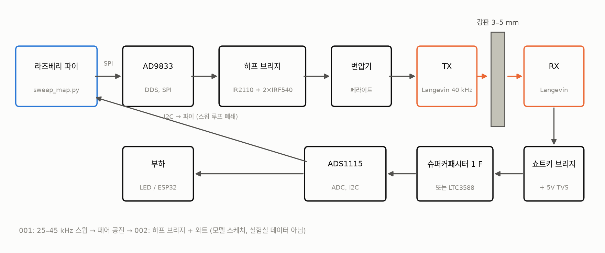
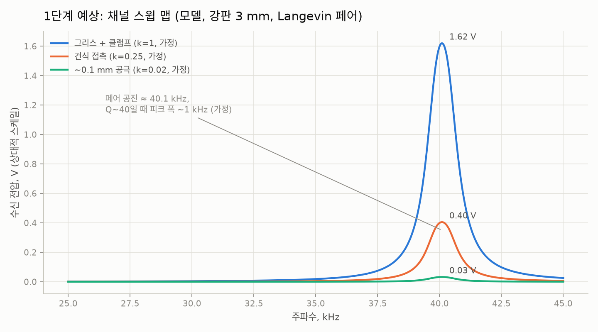
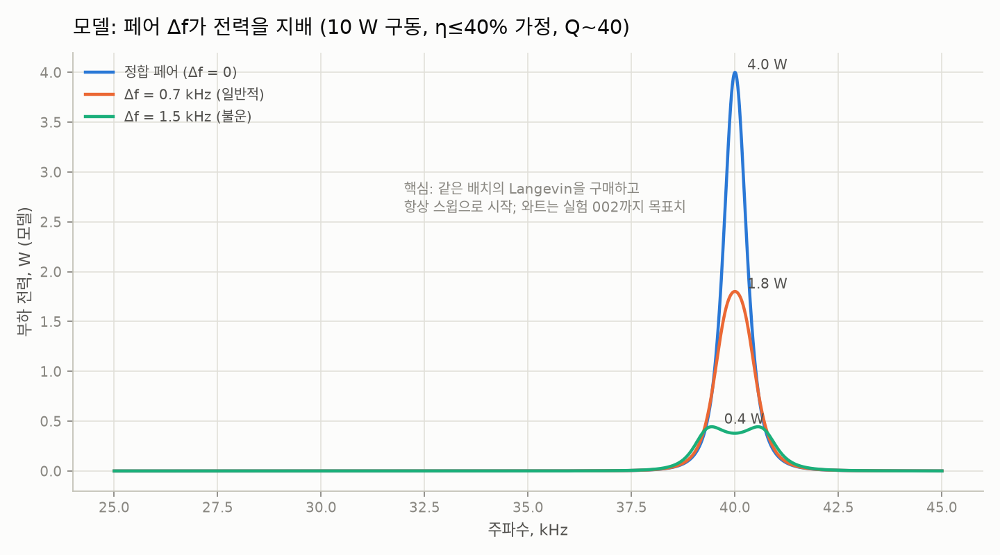
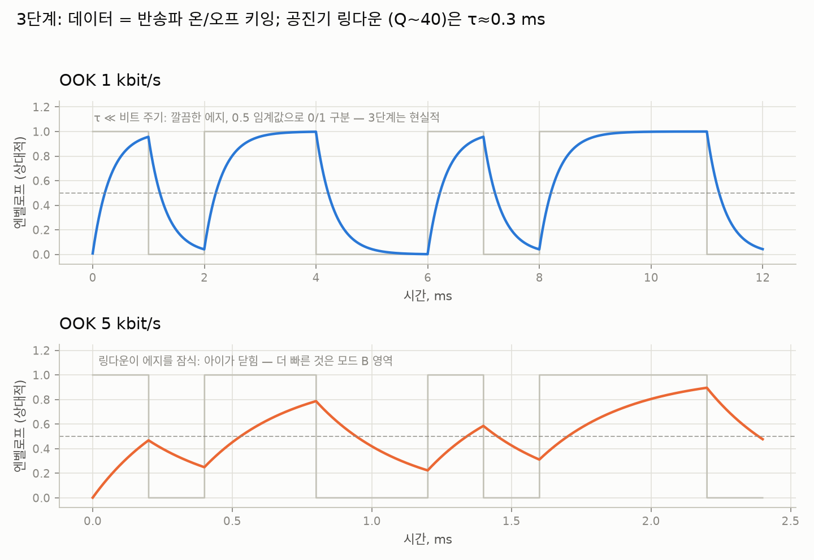
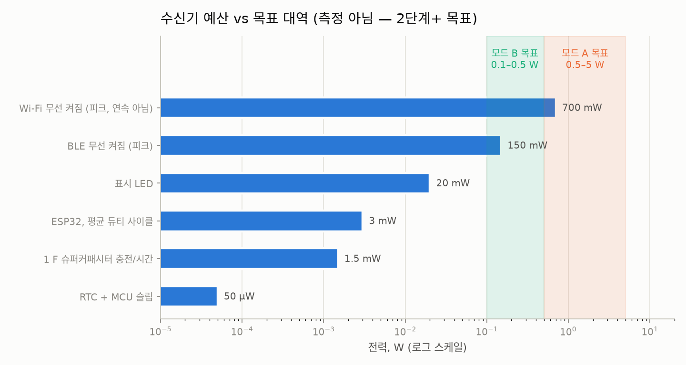
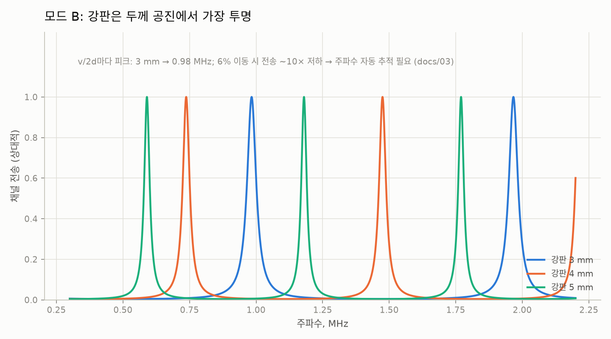

# through-metal-link

> [English (primary)](../../README.md) · [Русский](../ru/README.md) · [Deutsch](../de/README.md) · [Português](../pt/README.md) · [Español](../es/README.md) · [Français](../fr/README.md) · [Italiano](../it/README.md) · [Polski](../pl/README.md) · [Türkçe](../tr/README.md) · [Українська](../uk/README.md) · [Tiếng Việt](../vi/README.md) · [中文](../zh/README.md) · [日本語](../ja/README.md) · 한국어 · [हिन्दी](../hi/README.md)

고체 금속 벽을 통한 초음파 전력 및 데이터 전송을 위한 오픈 플랫폼 — "구멍 하나 없이 강철을 통과", 가라지 수준의 수단으로 구축됨.

**지금 바로 시도 (하드웨어 불필요):** `python3 software/sweep-map/sweep_map.py --mock`

**진입 경로:**
- **A — 드라이 런:** 목 스윕 + [시뮬레이터](../../software/simulator/channel_sim.py) (벤치 없음)
- **B — 빌드 단계 1:** [QUICKSTART.md](QUICKSTART.md) → [experiments/001](experiments/001-sweep-map-3mm-steel/README.md)
- **C — 하드웨어 없이 기여:** 선행 기술 / 문서 / 번역 / ADR 댓글 ([CONTRIBUTING.md](CONTRIBUTING.md))

**상태:** 단계 0 — 준비 · **하드웨어 검증 아직 없음** (시뮬레이터 전용; 첫 빌드에 현상금) · 💰 **[$250 현상금](https://github.com/zeloras/through-metal-link/issues/5)** · 쇼핑 리스트: [QUICKSTART.md](QUICKSTART.md)

[](https://github.com/zeloras/through-metal-link/actions/workflows/ci.yml) [](https://github.com/zeloras/through-metal-link/actions/workflows/reuse.yml) [](CONTRIBUTING.md) [](LICENSES.md)

문서는 다국어입니다: English가 주 언어이며 정식 경로에 위치합니다; 다른 모든 언어는 [translations/](..) 아래에 트리를 미러링합니다. 어떤 언어든 편집하면 — CI가 나머지를 번역하고 커밋합니다 ([CONTRIBUTING.md](CONTRIBUTING.md) 참조).



## 한 단락으로 요약한 아이디어

전파는 금속을 통과하지 못하고(패러데이 새장), 케이블 관통은 구멍, 밀봉, 그리고 고장 지점을 의미한다. 반면 초음파는 금속을 아주 잘 통과한다: 벽 양쪽에 압전 소자를 붙이면 전력과 데이터를 위한 채널로 바뀐다. 실험실 문헌은 이미 상당한 수준에서 물리를 증명했다 (RPI: 63.5 mm 강철을 통해 50 W + 12 Mbit/s; NASA JPL: 5 mm 티타늄을 통해 최대 ~kW) — 이들은 전문 하드웨어를 사용한 존재 증명이지, 이 저장소의 가라지 BOM이 아니다. 기초 특허는 만료되었고, 아직 오픈되고 재현 가능한 플랫폼은 존재하지 않는다 — 이 저장소는 그것을 구축 중이며, 단계 2가 측정되면 **3–5 mm 강철을 통한 와트급 전력과 kbit/s 데이터**에서 시작한다.

## 로드맵

| 단계 | 산출물 | 성공 기준 | 예상 |
|---|---|---|---|
| 1. 스윕 맵 | "Langevin–3 mm 강철–Langevin" 채널의 주파수 응답 | 쌍 공진 발견, [experiments/001](experiments/001-sweep-map-3mm-steel/README.md)에 플롯 | [sim1](docs/img/sim1-sweep-contacts.png), [sim2](docs/img/sim2-pair-mismatch.png) |
| 2. 와트 | 공진 시 부하로 전달되는 전력 | 3 mm 강철을 통해 ≥0.5 W, [experiments/002](experiments/002-watts-3mm-steel/README.md)에 프로토콜 | [sim4](docs/img/sim4-power-budget.png) |
| 3. 데이터 | 동일한 쌍 위에서 FSK/OOK | ≥1 kbit/s 무오류 | [sim5](docs/img/sim5-ook-datarate.png) |
| 4. 노드 | 용접 밀폐 박스 안의 ESP32 + 센서, 소리만으로 전력 공급 및 원격 측정 | ≥1 h 자율 운영 | [sim4](docs/img/sim4-power-budget.png) |
| 5. 출판 | 첫 독립 복제 + 기사/하우투 + Zenodo 스냅샷 | 제3자 재현 문서화 | — |

## 저장소 맵

아래 각 블록은 작업에 충분한 요약이며, 전체 문서로의 링크를 포함한다.

### 🛒 제로에서 작동하는 장비까지: 무엇을, 어떤 순서로 살 것인가 — [QUICKSTART.md](QUICKSTART.md)

**예산:** 최소 ~$210, 여유 있게 ~$300 (이미 Pi, 납땜 인두, 벤치 전원 공급기를 가지고 있다면 ~$120 절감). 세 가지 바구니: 도구 (~$120), 장비 전자부품 (~$70, [전체 BOM](hardware/bom/bom-stage1.csv)), 기계 부품 (~$20). 선택이지만 강력 권장: USB 오실로스코프 (~$60–80).

**중요 경로 — AliExpress 배송 (3–4주):** 전자부품을 1일 차에 주문하라. 핵심 결정: **같은 배치의 Langevin 트랜스듀서 4개 구매** — 스윕이 최적의 쌍을 선택한다 ([이유](docs/img/sim2-pair-mismatch.png)).

**배송 중인 동안:** 하드웨어 없이 파이프라인 드라이 런 —

```bash
python3 software/sweep-map/sweep_map.py --mock
```

**완료 조건 (단계별):** 단계 1 — 스윕 피크가 두 번 실행에서 <200 Hz 이내로 재현 ([experiments/001](experiments/001-sweep-map-3mm-steel/README.md)); 단계 2 — 3 mm 강철을 통해 알려진 부하로 ≥0.5 W 전달 및 RX 측에서 LED 점등 ([experiments/002](experiments/002-watts-3mm-steel/README.md)).

### 📚 1분 이론 — [docs/00-theory.md](docs/00-theory.md)

압전 TX는 벽에 밀착되어 종파를 구동한다; 반대편의 압전 RX는 이를 다시 전기로 변환한다. 강철에서의 음속: ~5900 m/s.

두 가지 동작 모드:

| 모드 | 주파수 | 공진 결정 | 산출 | 상태 |
|---|---|---|---|---|
| **A** — Langevin 트랜스듀서 | 40 kHz | 트랜스듀서 쌍 (벽 ≪ λ — "멤브레인") | 와트, kbit/s | 시작 모드 (단계 1–4, [ADR-0001](docs/decisions/0001-frequency-mode-choice.md)) |
| **B** — 디스크 | 0.6–1 MHz | 벽의 두께 공진 ([comb](docs/img/sim3-thickness-comb.png)) | 수백 mW, 수백 kbit/s | 첫 와트 이후 분기; 자동 주파수 추적 필요 |

주요 손실: 쌍 내 공진 불일치 (저가 Langevin 트랜스듀서 ±1 kHz), 음향 접촉 품질 (에폭시 > 그리스 커플런트 + 클램프 > 드라이 가압), 정렬 불량, 온도에 따른 공진 드리프트. 이 모든 것에 대한 답은 동일하다: **설정 변경 전마다 스윕 맵 작성**.

### 📈 장비가 보여줄 것: 시뮬레이터의 예상 플롯 — [software/simulator/channel_sim.py](../../software/simulator/channel_sim.py)

반경험적 채널 모델 (FEM이 아님, **실험실 데이터도 아님** — "스윕이 어떤 모양이어야 하고 무엇을 겨냥해야 하는가"에 대한 직관). 가정은 `channel_sim.py`에 명시되어 있다 (loaded Q≈40, 접촉 k-팩터, 체인 η≤40%). 재생성: `python3 channel_sim.py --out ../../docs/img`.

**단계 1 — 스윕.** ~40 kHz 부근의 좁은 피크; 모델의 플레이스홀더 접촉 승수는 그리스:드라이:갭 = 1 : 0.25 : 0.02 (즉, 그리스 ≈4× 드라이, ≈50× 공기 갭). 피크가 없으면 접촉 또는 쌍에 문제가 있음:



**Langevin 트랜스듀서 4개, 2개가 아닌 이유.** Q≈40에서 쌍 내 1.5 kHz 공진 불일치가 모델 전력을 ~10× 감소시킨다:



**단계 3 — 데이터.** OOK는 공진기 링잉에 부딪힌다 (모델 Q~40 → τ≈0.3 ms): 1 kbit/s는 깨끗하고, 5 kbit/s에서는 아이가 닫힌다. 더 빠르려면 모드 B가 필요:



**수신기 전력 예산.** 음영 영역은 **목표** (모드 A 0.5–5 W, 단계 2가 성공하면; 모드 B는 더 낮음). 현실적인 첫 부하는 듀티 사이클 ESP32 / BLE / LED; Wi-Fi는 연속 보장이 아닌 피크 소비 마커로 표시:



**나중을 위해 (모드 B).** 판이 두께 공진의 빗 모양에서 투명해진다 — 주파수를 추적해야 한다:



### ⚠️ 안전 — 첫 전원 인가 전에 읽을 것 — [docs/02-safety.md](docs/02-safety.md)

1. **압전 소자에 수십~수백 볼트** — 단계 2 드라이버가 온라인이 되면 — 수신 측의 TVS는 첫 전원 인가 전에 들어간다; 리드에서 손을 떼라.
2. **상용 전원** — 벤치 전원 공급기 / 절연을 통해서만; 초음파 세척기 드라이버 보드는 상용 전원에 직접 연결되어 있다.
3. **귀** — 상당한 전력에서는 트랜스듀서를 금속에 밀착하여 작동; 인클로저 없이 고전력 공기 전달 초음파를 작동시키지 마라.
4. **열** — 클램프되지 않은 Langevin 트랜스듀서는 전력 인가 시 수 분 내에 과열; 전류를 올리기 전에 클램프 (간단한 저전류 전기 브링업만 — 드라이버 README 참조).
5. **파편** — 압전 세라믹은 깨지기 쉽다: 과도하게 조인 볼트나 충격은 파편을 의미; 모든 기계 작업에 안전 고글을 착용하라.

첫 드라이버 전원 인가: 벤치 전원 공급기 전류 제한 0.2 A; 전체 시퀀스는 [hardware/driver/](hardware/driver/README.md) 및 [docs/02-safety.md](docs/02-safety.md)에.

### 🧭 선행 기술 및 특허 위생 — [docs/01-prior-art.md](docs/01-prior-art.md)

모든 기술적 결정은 "자유로운" 출처(만료된 특허, 논문)로 추적 가능해야 한다. 기반: **US5982297** (Aerospace Corp — 벽 관통 압전 쌍의 기본 레시피), **US7902943** (Caltech/JPL — Sherrit의 피드스루), **US9361877** (Oklahoma 대학 — 완전한 트랜시버 시스템); 모두 사망. 주요 논문: Lawry 2013 (63.5 mm 강철을 통해 50 W + 12.4 Mbit/s), Sherrit/NASA (100 W 램프), Yang 2015 (서베이).

아직 살아있어 복사하지 말 것: RPI의 OFDM 할당 및 전이중 방식, Drexel의 적합형 트랜스듀서 (US, ~2032–2033까지 — 단계 1–4는 이들 중 어느 것도 필요 없음), 더불어 2026-08 검색이 추가한 패밀리: **US8594572B1** (US Navy — 베어 전력 채널 자체에 해당; US, 2032까지; Welle 1997이 선행 기술 답), **EP3723304B1** (ABB — 데이터 스펙트럼 *아래* 전력 스펙트럼; DE/GB, 2039까지; 계획된 동일 캐리어 부하 변조 업링크는 그 밖에 유지), **Ultrapower** (볼록/오목 어레이를 가진 파이프 내 센서, 또는 벽을 통과하는 로드; US, 2035까지 — 우리는 평면 패드를 사용하고 로드 없음). 청구 해석, 상태 및 회피 설계: [docs/01-prior-art.md](docs/01-prior-art.md).

아키텍처 결정은 [docs/decisions/](docs/decisions/0001-frequency-mode-choice.md) (ADR)에 기록되어 있다.

### 🔌 하드웨어 및 펌웨어 — hardware/, firmware/

- [hardware/bom/bom-stage1.csv](hardware/bom/bom-stage1.csv) — 단계 1 쇼핑 리스트.
- [hardware/schematics/](hardware/schematics/README.md) — **회로도** (코드에서 생성): 드라이버, 수신기, Pi 핀아웃, 하베스터 노드.
- [hardware/driver/](hardware/driver/README.md) — TX 드라이버: IR2110 하프 브리지 + 2×IRF540, 정합 변압기 (Langevin 트랜스듀서는 용량성 부하!). KiCad 보드는 브레드보드 프로토타입이 확인된 후.
- [hardware/receiver/](hardware/receiver/README.md) — 수신기, 단계별: 쇼트키 브리지 → ADC (단계 1) → 부하 (단계 2) → LTC3588 + 슈퍼커패시터 + ESP32 (단계 4).
- [firmware/node-esp32/](firmware/node-esp32/README.md) — 단계 4 노드 (스텁): 딥 슬립, 센서 판독, BLE 광고, 평균 1–5 mW 예산.

### 💻 소프트웨어: 측정 및 시뮬레이터 — software/

- [software/sweep-map/sweep_map.py](../../software/sweep-map/sweep_map.py) — 단계 1 핵심 도구: DDS 스윕 → ADC 판독 → CSV + 주파수 응답 플롯. 하드웨어 없는 실행을 위한 `--mock` 포함. Pi에서: `raspi-config` → SPI 및 I2C 활성화; `pip install spidev smbus2 matplotlib`.
- [software/simulator/channel_sim.py](../../software/simulator/channel_sim.py) — 예상 플롯 생성기 (`pip install numpy matplotlib`).
- [software/simulator/material_map.py](../../software/simulator/material_map.py) — 동일한 채널 모델을 다양한 벽 재질에 적용 — 티타늄, 알루미늄, 유리, 세라믹, 플라스틱, 콘크리트; 연구 및 평결: [docs/06-materials.md](docs/06-materials.md).
- [data/](data/README.md) — 원시 로그; CSV/PNG는 git에서 제외, 큐레이션된 플롯만 실험 디렉토리 내 git에 포함.

### 🗺️ 어디에 적용할 것인가: 장벽, 채널, 니치 — [docs/04-hybrid-channels.md](docs/04-hybrid-channels.md), [docs/05](docs/05-applications-map.md)

보편적 채널은 없다 — 플랫폼은 물리를 장벽에 맞춘다: 압전 음향 (주: 접촉식 강철/알루미늄 — 와트 및 kbit/s), EMAT (오염/고온 금속, 비접촉 — 데이터), 저주파 자기 (듀어의 진공 샌드위치 벽 — bits/s). 정직한 막다른 길: 고무 라이닝/복합 벽, 경로 내 기포 액체.

니치 우선순위: **(1)** 실험실 진공 챔버 및 크라이오스탯 — 오픈소스 하드웨어 청중, 인증 불필요; **(2)** 발효 탱크 — 도보 거리 내의 증명 무대; **(3)** 밀폐 배터리 팩 — 플래그십 사례 (팩 관통 없는 열폭주 감지). 수신기 발견 및 자동 튜닝 프로토콜 (Qi 아날로그): [docs/03-discovery-protocol.md](docs/03-discovery-protocol.md).

### 📁 디렉토리 구조

```
docs/            이론, 선행 기술, 안전, 응용, 결정 로그 (ADR)
docs/img/        예상 플롯 (software/simulator/channel_sim.py로 생성)
hardware/        BOM, 드라이버 (하프 브리지), 수신기 (정류기/하베스터)
firmware/        노드 펌웨어 (ESP32 — 단계 4까지 스텁)
software/        측정 스크립트 (주파수 응답 스윕 맵) 및 채널 시뮬레이터
experiments/     실험 프로토콜 — 템플릿에서, 하나의 디렉토리 = 하나의 실험
data/            원시 로그 (대용량 파일은 git에서 제외)
```

## 원칙

1. **제로에서의 재현성.** 납땜 인두와 ~$210이 있는 누구나 이 저장소만으로 결과를 재현할 수 있다.
2. **모든 실험은 프로토콜.** "대충 작동했다" 없음: [experiments/TEMPLATE.md](experiments/TEMPLATE.md)는 필수.
3. **특허 위생.** 만료된 계층 위에 구축 ([docs/01-prior-art.md](docs/01-prior-art.md)); 결정은 [docs/decisions/](docs/decisions/0001-frequency-mode-choice.md)에 기록.
4. **측정 우선, 의견은 그 다음.** 채널에 대한 어떤 결론보다 먼저 스윕 맵.

## 라이선스 및 특허

코드 — Apache-2.0, 하드웨어 — CERN-OHL-W v2, 문서 — CC-BY-4.0; 전체 텍스트는 [LICENSES/](../../LICENSES)에. 누구나 포크하여 상업적 용도를 포함해 이 위에 구축할 수 있다; 특허 보호는 라이선스의 부여 및 보복 조항과 선행 기술 전략에서 비롯된다. 전체 방안 및 방어적 공개 프로토콜: [LICENSES.md](LICENSES.md); 기여 규칙: [CONTRIBUTING.md](CONTRIBUTING.md).
