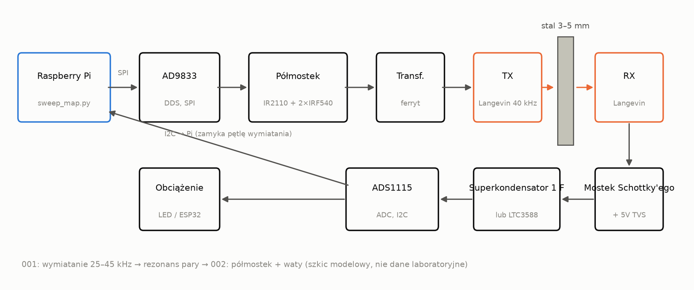
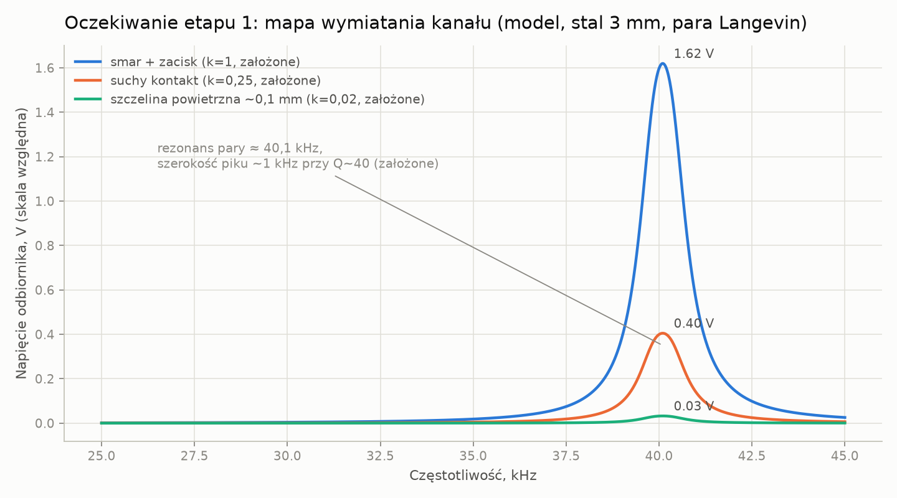
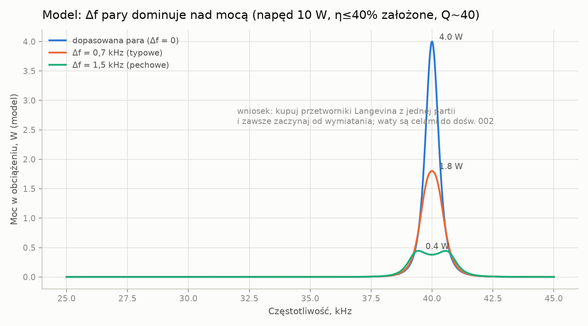
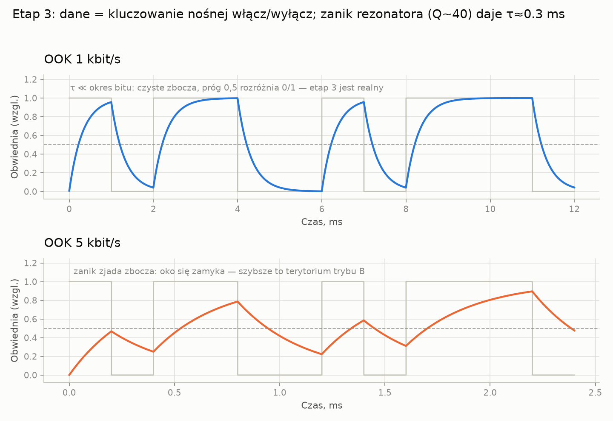
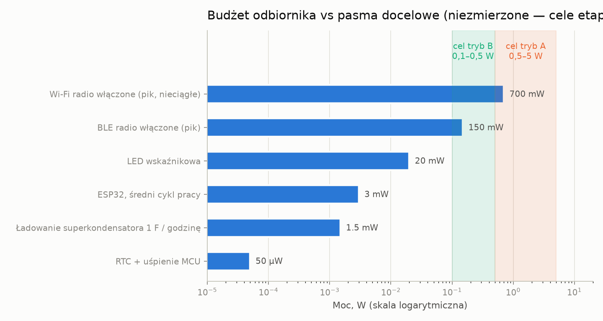
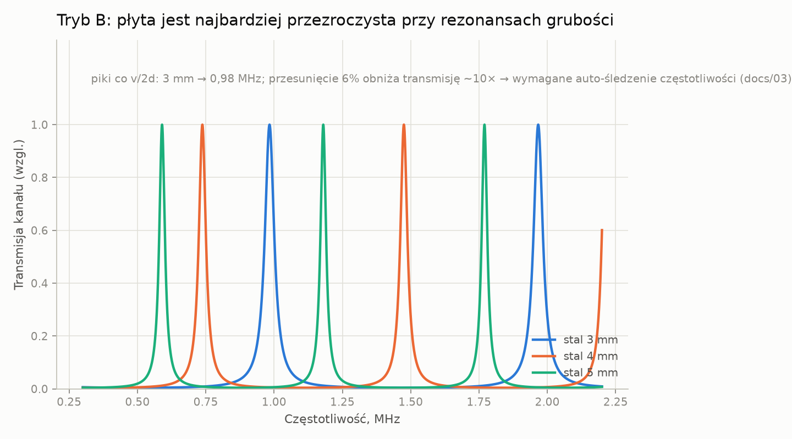

# przez-łącznik-metalowy

> [English (primary)](../../README.md) · [Русский](../ru/README.md) · [Deutsch](../de/README.md) · [Português](../pt/README.md) · [Español](../es/README.md) · [Français](../fr/README.md) · [Italiano](../it/README.md) · Polski · [Türkçe](../tr/README.md) · [Українська](../uk/README.md) · [Tiếng Việt](../vi/README.md) · [中文](../zh/README.md) · [日本語](../ja/README.md) · [한국어](../ko/README.md) · [हिन्दी](../hi/README.md)

Otwarta platforma do ultradźwiękowego transferu energii i danych przez lite metalowe ściany — „przez stal bez ani jednego otworu", zbudowana garażowymi środkami.

**Wypróbuj teraz (bez sprzętu):** `python3 software/sweep-map/sweep_map.py --mock`

**Status:** etap 0 — przygotowania · 💰 **[$250 nagrody za pierwszą niezależną budowę](https://github.com/zeloras/through-metal-link/issues)** · lista zakupów: [QUICKSTART.md](QUICKSTART.md)

[](https://github.com/zeloras/through-metal-link/actions/workflows/ci.yml) [](https://github.com/zeloras/through-metal-link/actions/workflows/reuse.yml) [](CONTRIBUTING.md) [](LICENSES.md)

Dokumentacja jest wielojęzyczna: angielski jest językiem podstawowym i znajduje się w kanonicznych ścieżkach; każdy inny język odzwierciedla drzewo w [translations/](..). Edytuj dowolny język — CI przetłumaczy i zatwierdi resztę (zob. [CONTRIBUTING.md](CONTRIBUTING.md)).

<p align="center"></p>

## Idea w jednym akapicie

Fale radiowe nie przenikają przez metal (klatka Faradaya), a przeniknięcie kabla oznacza dziurę, uszczelnienie i punkt awarii. Ultradźwięki z kolei przenikają przez metal bez problemu: element piezoelektryczny po każdej stronie ściany zamienia go w kanał do przesyłu energii i danych. Literatura laboratoryjna udowodniła już fizykę na poważnym poziomie (RPI: 50 W + 12 Mbit/s przez 63.5 mm stali; NASA JPL: do ~kW przez 5 mm tytanu) — to dowody na istnienie z użyciem specjalistycznego sprzętu, a nie garażowego BOM-a z tego repozytorium. Podstawowe patenty wygasły, a nie istnieje jeszcze żadna otwarta, odtwarzalna platforma — to repozytorium buduje taką platformę, zaczynając od **mocy rzędu watów i danych rzędu kbit/s przez stal o grubości 3–5 mm**, gdy tylko etap 2 zostanie zmierzony.

## Harmonogram

| Etap | Rezultat | Kryterium sukcesu | Oczekiwanie |
|---|---|---|---|
| 1. Mapa przemiatania | odpowiedź częstotliwościowa kanału „Langevin–3 mm stali–Langevin” | znaleziona rezonansowa para, wykres w [experiments/001](experiments/001-sweep-map-3mm-steel/README.md) | [sim1](docs/img/sim1-sweep-contacts.png), [sim2](docs/img/sim2-pair-mismatch.png) |
| 2. Waty | moc w obciążeniu przy rezonansie | ≥0,5 W przez 3 mm stali, protokół w [experiments/002](experiments/002-watts-3mm-steel/README.md) | [sim4](docs/img/sim4-power-budget.png) |
| 3. Dane | FSK/OOK przez tę samą parę | ≥1 kbit/s bez błędów | [sim5](docs/img/sim5-ook-datarate.png) |
| 4. Węzeł | ESP32 + czujnik w zespawanej szczelnie obudowie, zasilany i telemetrowany wyłącznie dźwiękiem | ≥1 h autonomicznej pracy | [sim4](docs/img/sim4-power-budget.png) |
| 5. Publikacja | repozytorium staje się publiczne, artykuł/how-to | odtworzenie przez stronę trzecią | — |

## Mapa repozytorium

python3 software/sweep-map/sweep_map.py --mock
```

**Gotowe, gdy (według etapu):** etap 1 — pik skanu powtarza się w dwóch przebiegach w zakresie <200 Hz ([experiments/001](experiments/001-sweep-map-3mm-steel/README.md)); etap 2 — ≥0,5 W w znane obciążenie przez 3 mm stali i zapalona LED po stronie RX ([experiments/002](experiments/002-watts-3mm-steel/README.md)).

</details>

<details>
<summary><b>📚 Teoria w minutę</b> — <a href="docs/00-theory.md">docs/00-theory.md</a></summary>

Piezoelektryczny TX jest dociskany do ściany i wzbudza w niej falę podłużną; piezoelektryczny RX po drugiej stronie zamienia ją z powrotem na prąd. Prędkość dźwięku w stali: ~5900 m/s.

Dwa tryby pracy:

| Tryb | Częstotliwość | Rezonans wyznaczany przez | Daje | Status |
|---|---|---|---|---|
| **A** — przetworniki Langevina | 40 kHz | para przetworników (ściana ≪ λ — „membrana") | waty, kbit/s | tryb startowy (etapy 1–4, [ADR-0001](docs/decisions/0001-frequency-mode-choice.md)) |
| **B** — dyski | 0,6–1 MHz | rezonans grubościowy ściany ([grzebień](docs/img/sim3-thickness-comb.png)) | setki mW, setki kbit/s | gałąź po pierwszych watach; wymaga automatycznego śledzenia częstotliwości |

Główne straty: niedopasowanie rezonansu w obrębie pary (±1 kHz dla tanich przetworników Langevina), jakość kontaktu akustycznego (epoksyd > smar sprzęgający + zacisk > suchy docisk), odchylenie osi, dryf rezonansu z temperaturą. Odpowiedź na wszystkie jest ta sama: **mapa skanu przed każdą zmianą konfiguracji**.

</details>

<details>
<summary><b>📈 Co stanowisko powinno pokazać: wykresy oczekiwane z symulatora</b> — <a href="software/simulator/channel_sim.py">software/simulator/channel_sim.py</a></summary>

Półempiryczny model kanału (nie FEM, **nie dane laboratoryjne** — intuicja dla „jak skan powinien wyglądać i w co celować"). Założenia są jawne w `channel_sim.py` (obciążone Q≈40, k-faktory kontaktu, η łańcucha ≤40%). Regeneruj przez: `python3 channel_sim.py --out ../../docs/img`.

**Etap 1 — skan.** Wąski pik w okolicach ~40 kHz; zastępcze mnożniki kontaktu w modelu to smar:suchy:szczelina = 1 : 0,25 : 0,02 (czyli smar ≈4× suchy i ≈50× szczelina powietrzna). Brak piku oznacza problem z kontaktem lub parą:



**Dlaczego 4 przetworniki Langevina, a nie 2.** Przy Q≈40 niedopasowanie rezonansu 1,5 kHz w obrębie pary obniża moc z modelu ~10×:



**Etap 3 — dane.** OOK natrafia na dzwonienie rezonatora (model Q~40 → τ≈0,3 ms): 1 kbit/s jest czysty, przy 5 kbit/s oko jest zamknięte. Szybciej wymaga trybu B:



**Budżet mocy odbiornika.** Zacieniowane pasma to **cele** (tryb A 0,5–5 W, jeśli etap 2 się uda; tryb B mniej). Realistyczne pierwsze obciążenia to pracujące w cyklach ESP32 / BLE / LED; Wi-Fi pokazany jako znacznik szczytowego poboru, nie ciągła obietnica:



**Na później (tryb B).** Płyta staje się przezroczysta przy grzebniu rezonansów grubościowych — częstotliwość musi być śledzona:



</details>

<details>
<summary><b>⚠️ Bezpieczeństwo — przeczytaj przed pierwszym włączeniem</b> — <a href="docs/02-safety.md">docs/02-safety.md</a></summary>

1. **Dziesiątki do setek woltów na piezoelektryku**, gdy sterownik etapu 2 ruszy — TVS po stronie odbiorczej wchodzi PRZED pierwszym zasilonym przebiegiem; nie dotykaj przewodów.
2. **Sieć** — tylko przez zasilacz laboratoryjny / separację; płyty sterowników z myjek ultradźwiękowych są galwanicznie połączone z siecią.
3. **Uszy** — przy niebanalnej mocy pracuj z przetwornikami dociskanymi do metalu; nigdy nie uruchamiaj wysokomocowego ultradźwięku w powietrzu bez obudowy.
4. **Ciepło** — niezaciśnięty przetwornik Langevina przegrzewa się w kilka minut przy mocy; zaciśnij przed zwiększeniem prądu (tylko krótkie, niskoprądowe uruchomienie elektryczne — patrz README sterownika).
5. **Odrobiny** — piezoceramika jest krucha: zbyt mocno dokręcona śruba lub uderzenie oznacza odrobiny; noś okulary ochronne przy każdej pracy mechanicznej.

</details>

docs/            teoria, stan techniki, bezpieczeństwo, zastosowania, dziennik decyzji (ADR)
docs/img/        wykresy oczekiwane (generowane przez software/simulator/channel_sim.py)
hardware/        BOM, sterownik (półmostek), odbiornik (prostownik/harvester)
firmware/        firmware węzła (ESP32 — stub do etapu 4)
software/        skrypty pomiarowe (mapa sweep odpowiedzi częstotliwościowej) i symulator kanału
experiments/     protokoły eksperymentów — z szablonu, jeden katalog = jeden eksperyment
data/            surowe logi (duże pliki nie trafiają do gita)
```

</details>

## Zasady

1. **Powtarzalność od zera.** Każdy z lutownicą i ~210 $ może odtworzyć wynik wyłącznie na podstawie tego repozytorium.
2. **Każdy eksperyment to protokół.** Żadnego "jakoś działało": [experiments/TEMPLATE.md](experiments/TEMPLATE.md) jest obowiązkowy.
3. **Higiena patentowa.** Budujemy na wygasłej warstwie ([docs/01-prior-art.md](docs/01-prior-art.md)); decyzje są zapisywane w [docs/decisions/](docs/decisions/0001-frequency-mode-choice.md).
4. **Najpierw pomiary, potem opinie.** Mapa przeszukiwań przed jakimikolwiek wnioskami o kanale.

## Licencje i patenty

Kod — Apache-2.0, sprzęt — CERN-OHL-W v2, dokumentacja — CC-BY-4.0; pełne teksty w [LICENSES/](../../LICENSES). Każdy może forkać i rozwijać ten projekt, również komercyjnie; ochrona patentowa wynika z upoważnień i klauzul odwetowych w licencjach oraz ze strategii sztuki poprzedzającej. Pełny schemat i protokół publikacji defensywnej: [LICENSES.md](LICENSES.md); zasady współtworzenia: [CONTRIBUTING.md](CONTRIBUTING.md).
