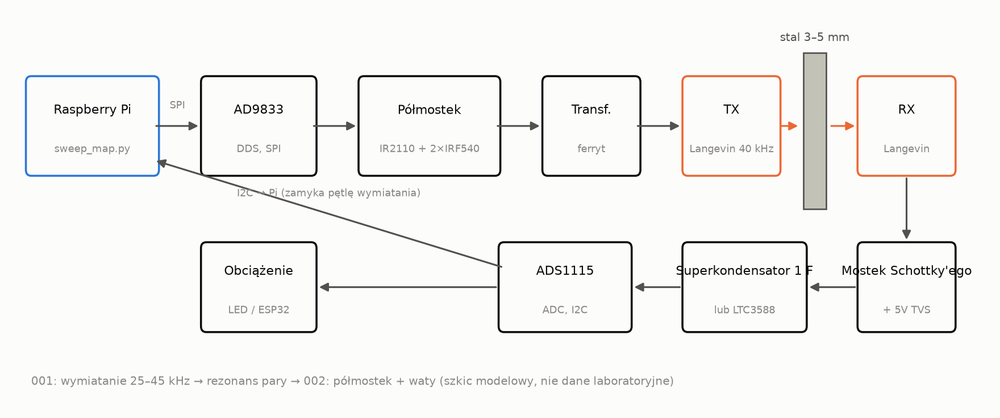
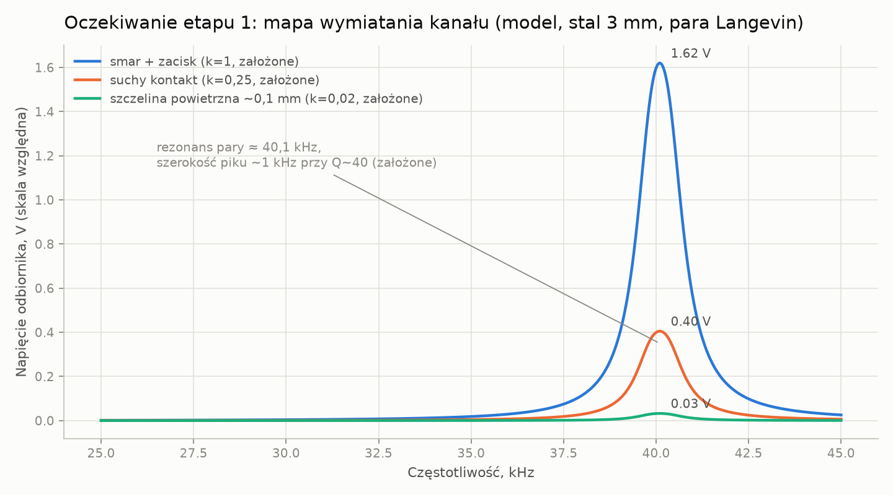
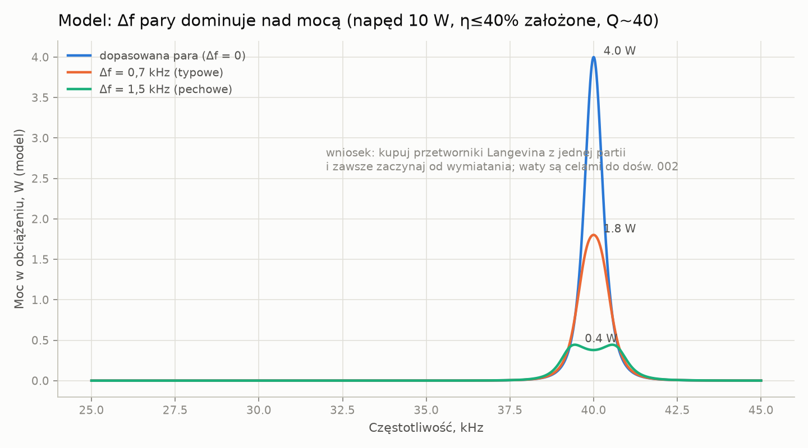
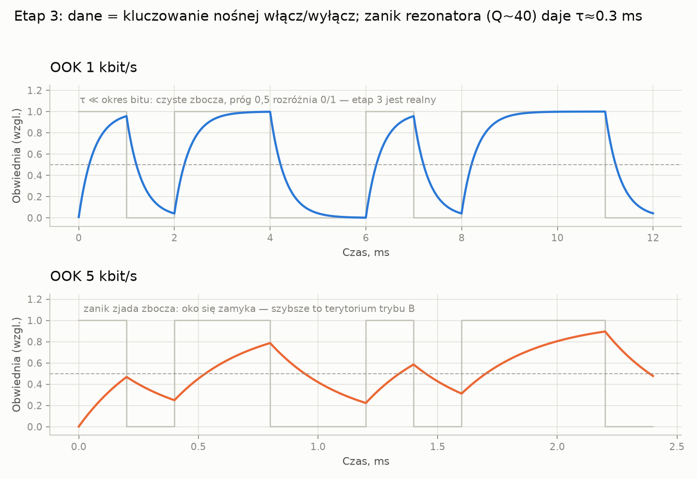
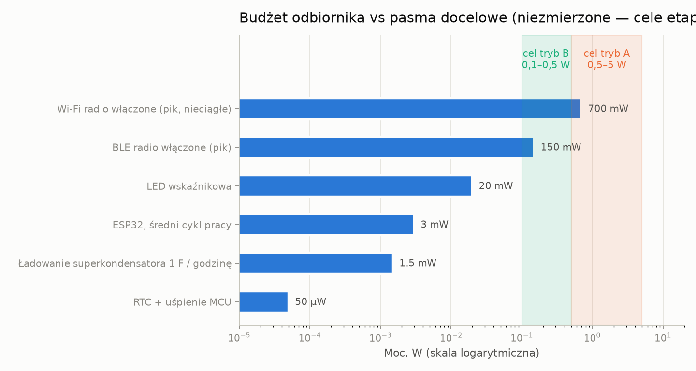
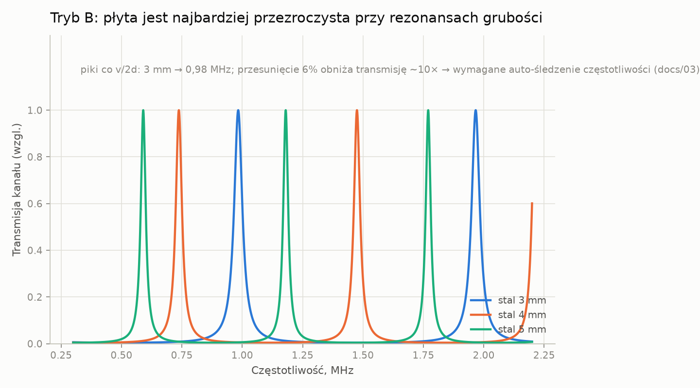

# through-metal-link

> [English (primary)](../../README.md) · [Русский](../ru/README.md) · [Deutsch](../de/README.md) · [Português](../pt/README.md) · [Español](../es/README.md) · [Français](../fr/README.md) · [Italiano](../it/README.md) · Polski · [Türkçe](../tr/README.md) · [Українська](../uk/README.md) · [Tiếng Việt](../vi/README.md) · [中文](../zh/README.md) · [日本語](../ja/README.md) · [한국어](../ko/README.md) · [हिन्दी](../hi/README.md)

Otwarta platforma do ultradźwiękowego przesyłu energii i danych przez lite ściany metalowe — „przez stal bez ani jednego otworu", zbudowana środkami warsztatowymi.

**Wypróbuj teraz (bez sprzętu):** `python3 software/sweep-map/sweep_map.py --mock`

**Ścieżki wejścia:**
- **A — dry-run:** symulacja sweep + [symulator](../../software/simulator/channel_sim.py) (bez stanowiska)
- **B — budowa etapu 1:** [QUICKSTART.md](QUICKSTART.md) → [experiments/001](experiments/001-sweep-map-3mm-steel/README.md)
- **C — wkład bez sprzętu:** prior-art / dokumentacja / tłumaczenia / komentarze ADR ([CONTRIBUTING.md](CONTRIBUTING.md))

**Status:** etap 0 — przygotowania · **brak walidacji sprzętowej** (tylko symulator; nagroda za pierwszą budowę) · 💰 **[$250 nagrody](https://github.com/zeloras/through-metal-link/issues/5)** · lista zakupów: [QUICKSTART.md](QUICKSTART.md)

[](https://github.com/zeloras/through-metal-link/actions/workflows/ci.yml) [](https://github.com/zeloras/through-metal-link/actions/workflows/reuse.yml) [](CONTRIBUTING.md) [](LICENSES.md)

Dokumentacja jest wielojęzyczna: angielski jest językiem podstawowym i znajduje się w ścieżkach kanonicznych; każdy inny język odzwierciedla drzewo w [translations/](..). Edytuj w dowolnym języku — CI tłumaczy i commituje resztę (patrz [CONTRIBUTING.md](CONTRIBUTING.md)).



## Pomysł w jednym akapicie

Fale radiowe nie przenikają przez metal (klatka Faradaya), a wprowadzenie kabla oznacza otwór, uszczelnienie i punkt awarii. Ultradźwięki z kolei przechodzą przez metal bez problemu: element piezoelektryczny po każdej stronie ściany zamienia ją w kanał dla energii i danych. Literatura laboratoryjna udowodniła już fizykę na poważnych poziomach (RPI: 50 W + 12 Mbit/s przez 63,5 mm stali; NASA JPL: do ~kW przez 5 mm tytanu) — to dowody istnienia z użyciem specjalistycznego sprzętu, a nie warsztatowy BOM tego repozytorium. Podstawowe patenty wygasły, a nie istnieje jeszcze żadna otwarta, odtwarzalna platforma — to repozytorium taką buduje, zaczynając od **mocy rzędu watów i danych kbit/s przez stal 3–5 mm** po zakończeniu pomiarów etapu 2.

## Roadmapa

| Etap | Rezultat | Kryterium sukcesu | Oczekiwanie |
|---|---|---|---|
| 1. Sweep map | odpowiedź częstotliwościowa kanału „Langevin–3 mm stali–Langevin" | znaleziona rezonans pary, wykres w [experiments/001](experiments/001-sweep-map-3mm-steel/README.md) | [sim1](docs/img/sim1-sweep-contacts.png), [sim2](docs/img/sim2-pair-mismatch.png) |
| 2. Waty | moc w obciążeniu przy rezonansie | ≥0,5 W przez 3 mm stali, protokół w [experiments/002](experiments/002-watts-3mm-steel/README.md) | [sim4](docs/img/sim4-power-budget.png) |
| 3. Dane | FSK/OOK przez tę samą parę | ≥1 kbit/s bez błędów | [sim5](docs/img/sim5-ook-datarate.png) |
| 4. Węzeł | ESP32 + czujnik w zespawanej szczelnie skrzynce, zasilany i telemetrowany samym dźwiękiem | ≥1 h pracy autonomicznej | [sim4](docs/img/sim4-power-budget.png) |
| 5. Publikacja | pierwsza niezależna replikacja + artykuł/how-to + zrzut Zenodo | udokumentowana reprodukcja przez stronę trzecią | — |

## Mapa repozytorium

Każdy blok poniżej to streszczenie wystarczające do pracy, plus link do pełnego dokumentu.

### 🛒 Od zera do działającego stanowiska: co kupić i w jakiej kolejności — [QUICKSTART.md](QUICKSTART.md)

**Budżet:** ~$210 minimum, ~$300 komfortowo (odlicz ~$120, jeśli masz już Pi, lutownicę i zasilacz laboratoryjny). Trzy koszyki: narzędzia (~$120), elektronika stanowiska (~$70, [pełny BOM](hardware/bom/bom-stage1.csv)), mechanika (~$20). Opcjonalne, ale bardzo zalecane: oscyloskop USB (~$60–80).

**Ścieżka krytyczna — wysyłka z AliExpress (3–4 tygodnie):** zamów elektronikę pierwszego dnia. Kluczowa decyzja: kup **4 przetworniki Langevina z tej samej partii** — sweep wybierze najlepszą parę ([dlaczego](docs/img/sim2-pair-mismatch.png)).

**Podczas wysyłki:** zrób dry-run potoku bez sprzętu —

```bash
python3 software/sweep-map/sweep_map.py --mock
```

**Gotowe, gdy (według etapu):** etap 1 — pik sweep odtwarza się między dwoma przebiegami z dokładnością <200 Hz ([experiments/001](experiments/001-sweep-map-3mm-steel/README.md)); etap 2 — ≥0,5 W w znanym obciążeniu przez 3 mm stali i zapalona LED od strony RX ([experiments/002](experiments/002-watts-3mm-steel/README.md)).

### 📚 Teoria w minutę — [docs/00-theory.md](docs/00-theory.md)

Piezo TX jest dociśnięte do ściany i wprowadza w nią falę podłużną; piezo RX po drugiej stronie zamienia ją z powrotem na prąd. Prędkość dźwięku w stali: ~5900 m/s.

Dwa tryby pracy:

| Tryb | Częstotliwość | Rezonans wyznaczony przez | Daje | Status |
|---|---|---|---|---|
| **A** — przetworniki Langevina | 40 kHz | para przetworników (ściana ≪ λ — „membrana") | waty, kbit/s | tryb startowy (etapy 1–4, [ADR-0001](docs/decisions/0001-frequency-mode-choice.md)) |
| **B** — dyski | 0,6–1 MHz | rezonans grubościowy ściany ([grzebień](docs/img/sim3-thickness-comb.png)) | setki mW, setki kbit/s | odgałęzienie po pierwszych watach; wymaga automatycznego śledzenia częstotliwości |

Główne straty: niedopasowanie rezonansu w parze (±1 kHz dla tanich przetworników Langevina), jakość kontaktu akustycznego (epoksyd > smar sprzęgający + zacisk > suche docisk), niedokładność ustawienia, dryf rezonansu z temperaturą. Odpowiedź na wszystkie jest ta sama: **sweep map przed każdą zmianą konfiguracji**.

### 📈 Co stanowisko powinno pokazać: wykresy oczekiwane z symulatora — [software/simulator/channel_sim.py](../../software/simulator/channel_sim.py)

Pół-empiryczny model kanału (nie FEM, **nie dane laboratoryjne** — intuicja dla „jak powinien wyglądać sweep i w co celować"). Założenia są jawne w `channel_sim.py` (obciążone Q≈40, k-faktory kontaktu, łańcuch η≤40%). Regeneruj przez: `python3 channel_sim.py --out ../../docs/img`.

**Etap 1 — sweep.** Wąski pik w okolicach ~40 kHz; mnożniki kontaktu placeholder w modelu to smar:suche:szczelina = 1 : 0,25 : 0,02 (tzn. smar ≈4× suche i ≈50× szczelina powietrzna). Brak piku oznacza problem z kontaktem lub parą:



**Dlaczego 4 przetworniki Langevina, nie 2.** Przy Q≈40 niedopasowanie rezonansu 1,5 kHz w parze obniża moc z modelu ~10×:



**Etap 3 — dane.** OOK napotyka na dzwonienie rezonatora (model Q~40 → τ≈0,3 ms): 1 kbit/s jest czysty, przy 5 kbit/s oko jest zamknięte. Szybciej wymaga trybu B:



**Budżet mocy odbiornika.** Zacieniowane pasma to **cele** (tryb A 0,5–5 W jeśli etap 2 się uda; tryb B niżej). Realistyczne pierwsze obciążenia to cyklicznie uśpiony ESP32 / BLE / LED; Wi-Fi pokazany jako znacznik szczytowego poboru, nie ciągła obietnica:



**Na później (tryb B).** Płyta staje się przezroczysta przy grzebieniu rezonansów grubościowych — częstotliwość musi być śledzona:



### ⚠️ Bezpieczeństwo — przeczytaj przed pierwszym włączeniem — [docs/02-safety.md](docs/02-safety.md)

1. **Dziesiątki do setek woltów na piezo** gdy sterownik etapu 2 jest włączony — TVS po stronie odbioru idzie PRZED pierwszym włączonym przebiegiem; nie dotykaj przewodów.
2. **Sieć** — tylko przez zasilacz laboratoryjny / izolację; płyty sterowników z myjek ultradźwiękowych są galwanicznie połączone z siecią.
3. **Uszy** — przy nieprzebranej mocy pracuj z przetwornikami dociśniętymi do metalu; nigdy nie uruchamiaj ultradźwięków dużej mocy w powietrzu bez obudowy.
4. **Ciepło** — niezaciśnięty przetwornik Langevina przegrzewa się w minuty przy mocy; zaciśnij przed podniesieniem prądu (tylko krótkie niskoprądowe uruchomienie elektryczne — patrz README sterownika).
5. **Odłamki** — piezoceramika jest krucha: zbyt mocno dokręcona śruba lub uderzenie oznacza odłamki; noś okulary ochronne przy każdej pracy mechanicznej.

Pierwsze włączenie sterownika: limit prądu zasilacza laboratoryjnego 0,2 A; pełna sekwencja w [hardware/driver/](hardware/driver/README.md) i [docs/02-safety.md](docs/02-safety.md).

### 🧭 Prior art i higiena patentowa — [docs/01-prior-art.md](docs/01-prior-art.md)

Każda decyzja techniczna musi odsyłać do „wolnego" źródła (wygasłe patenty, publikacje). Fundament: **US5982297** (Aerospace Corp — podstawowy przepis na parę piezo przez ścianę), **US7902943** (Caltech/JPL — feed-through Sherrita), **US9361877** (Univ. Oklahoma — kompletny system transceivera); wszystkie wygasłe. Kluczowe publikacje: Lawry 2013 (50 W + 12,4 Mbit/s przez 63,5 mm stali), Sherrit/NASA (lampa 100 W), Yang 2015 (przegląd).

Nie do kopiowania, dopóki żywe: alokacja OFDM i schemat full-duplex RPI oraz przetworniki konformalne Drexel (US, do ~2032–2033 — etapy 1–4 nie potrzebują żadnego z nich), plus rodziny dodane przez wyszukiwanie z 2026-08: **US8594572B1** (US Navy — obejmuje sam kanał zasilania; US, do 2032; Welle 1997 jest odpowiedzią prior-art), **EP3723304B1** (ABB — widmo mocy *poniżej* widma danych; DE/GB, do 2039; planowany uplink z modulacją obciążenia na tym samym nośnym pozostaje poza nim), **Ultrapower** (czujnik w rurze z tablicami wypukłymi/wklęsłymi lub pręt przez ścianę; US, do 2035 — używamy płaskich podkładek i bez pręta). Odczytywania roszczeń, statusy i obejścia: [docs/01-prior-art.md](docs/01-prior-art.md).

Decyzje architektoniczne są zapisane w [docs/decisions/](docs/decisions/0001-frequency-mode-choice.md) (ADR).

### 🔌 Sprzęt i firmware — hardware/, firmware/

- [hardware/bom/bom-stage1.csv](hardware/bom/bom-stage1.csv) — lista zakupów etapu 1.
- [hardware/schematics/](hardware/schematics/README.md) — **schematy obwodów** (generowane z kodu): sterownik, odbiornik, pinout Pi, węzeł harvester.
- [hardware/driver/](hardware/driver/README.md) — sterownik TX: pół-mostek IR2110 + 2×IRF540, transformator dopasowujący (przetwornik Langevina jest obciążeniem pojemnościowym!). Płytka KiCad powstaje po sprawdzeniu prototypu na płytce stykowej.
- [hardware/receiver/](hardware/receiver/README.md) — odbiornik, etap po etapie: mostek Schottky'ego → ADC (etap 1) → obciążenie (etap 2) → LTC3588 + superkondensator + ESP32 (etap 4).
- [firmware/node-esp32/](firmware/node-esp32/README.md) — węzeł etapu 4 (stub): deep sleep, odczyt czujnika, BLE advertising, budżet 1–5 mW średnio.

### 💻 Oprogramowanie: pomiary i symulator — software/

- [software/sweep-map/sweep_map.py](../../software/sweep-map/sweep_map.py) — koń roboczy etapu 1: sweep DDS → odczyty ADC → CSV + wykres odpowiedzi częstotliwościowej. Ma `--mock` do uruchomienia bez sprzętu. Na Pi: `raspi-config` → włącz SPI i I2C; `pip install spidev smbus2 matplotlib`.
- [software/simulator/channel_sim.py](../../software/simulator/channel_sim.py) — generator wykresów oczekiwanych (`pip install numpy matplotlib`).
- [software/simulator/material_map.py](../../software/simulator/material_map.py) — ten sam model kanału dla różnych materiałów ściany — tytan, aluminium, szkło, ceramika, tworzywa sztuczne, beton; studium i werdykty: [docs/06-materials.md](docs/06-materials.md).
- [data/](data/README.md) — surowe logi; CSV/PNG nie trafiają do git, tylko wyselekcjonowane wykresy idą do git w katalogu eksperymentu.

### 🗺️ Gdzie to zastosować: bariery, kanały, nisze — [docs/04-hybrid-channels.md](docs/04-hybrid-channels.md), [docs/05](docs/05-applications-map.md)

Nie ma uniwersalnego kanału — platforma dopasowuje fizykę do bariery: piezo-akustyka (podstawowe: stal/aluminium z kontaktem — waty i kbit/s), EMAT (brudny/gorący metal, bez kontaktu — dane), niskoczęstotliwościowe magnetyka (ściany próżniowe sandwich dewarów — bity/s). Uczciwe ślepe zaułki: ściany gumowane/kompozytowe, bulgoczący płyn na drodze.

Priorytet nisz: **(1)** laboratoryjne komory próżniowe i kriostaty — publiczność open-source-hardware, bez certyfikacji; **(2)** tanki fermentacyjne — poligon w zasięgu spaceru; **(3)** zamknięte pakiety baterii — przypadek flagowy (wykrywanie ucieczki termicznej bez penetracji pakietu). Protokół odkrywania odbiornika i auto-tuningu (analog Qi): [docs/03-discovery-protocol.md](docs/03-discovery-protocol.md).

### 📁 Układ katalogów

```
docs/            teoria, prior art, bezpieczeństwo, zastosowania, dziennik decyzji (ADR)
docs/img/        wykresy oczekiwane (generowane przez software/simulator/channel_sim.py)
hardware/        BOM, sterownik (pół-mostek), odbiornik (prostownik/harvester)
firmware/        firmware węzła (ESP32 — stub do etapu 4)
software/        skrypty pomiarowe (sweep map odpowiedzi częstotliwościowej) i symulator kanału
experiments/     protokoły eksperymentów — z szablonu, jeden katalog = jeden eksperyment
data/            surowe logi (duże pliki nie trafiają do git)
```

## Zasady

1. **Odtwarzalność od zera.** Każdy z lutownicą i ~$210 może odtworzyć wynik z samego tego repozytorium.
2. **Każdy eksperyment to protokół.** Bez „jakoś działało": [experiments/TEMPLATE.md](experiments/TEMPLATE.md) jest obowiązkowy.
3. **Higiena patentowa.** Budujemy na wygasłej warstwie ([docs/01-prior-art.md](docs/01-prior-art.md)); decyzje są zapisane w [docs/decisions/](docs/decisions/0001-frequency-mode-choice.md).
4. **Najpierw pomiar, potem opinia.** Sweep map przed jakimikolwiek wnioskami o kanale.

## Licencje i patenty

Kod — Apache-2.0, sprzęt — CERN-OHL-W v2, dokumentacja — CC-BY-4.0; pełne teksty w [LICENSES/](../../LICENSES). Każdy może forknąć i budować na tym, również komercyjnie; ochrona patentowa pochodzi z grantów i klauzul odwetowych w licencjach plus strategii prior-art. Pełny schemat i protokół publikacji obronnej: [LICENSES.md](LICENSES.md); zasady współtworzenia: [CONTRIBUTING.md](CONTRIBUTING.md).
