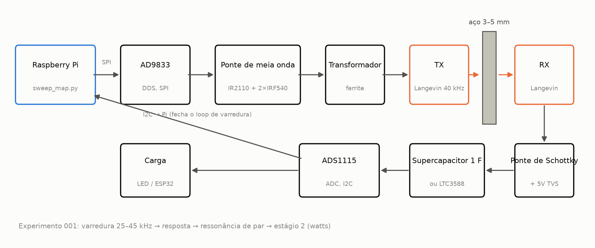
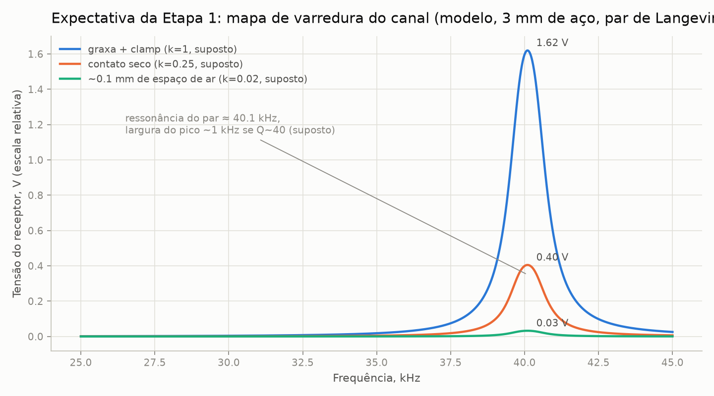
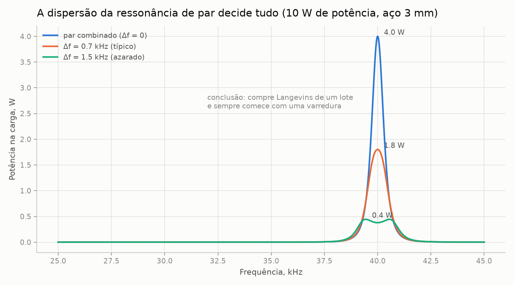
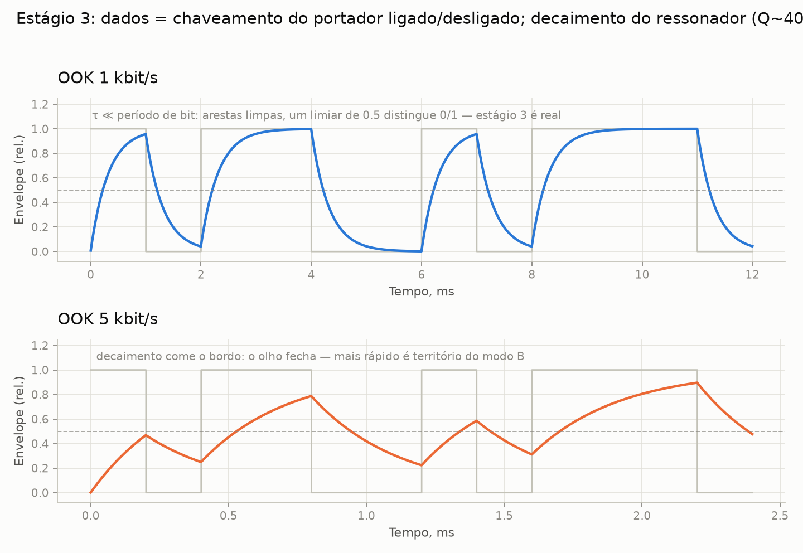
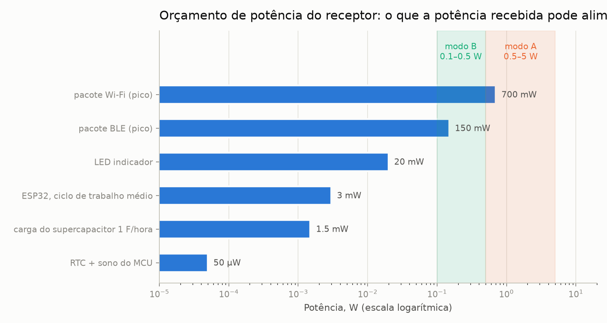
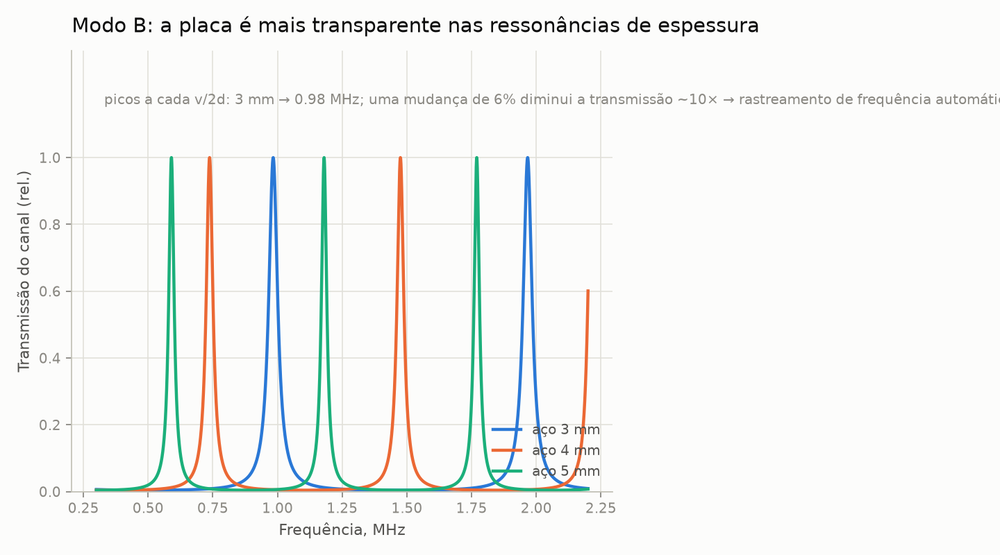

# ligação-através-do-metal

> [English (primary)](../../README.md) · [Русский](../ru/README.md) · [Deutsch](../de/README.md) · Português · [Español](../es/README.md) · [Français](../fr/README.md) · [Italiano](../it/README.md) · [Polski](../pl/README.md) · [Türkçe](../tr/README.md) · [Українська](../uk/README.md) · [Tiếng Việt](../vi/README.md) · [中文](../zh/README.md) · [日本語](../ja/README.md) · [한국어](../ko/README.md) · [हिन्दी](../hi/README.md)

Uma plataforma aberta para transferência ultrassônica de energia e dados através de paredes de metal sólido — "através do aço sem um único furo", construída com meios de nível de garagem.

**Experimente agora (sem hardware):** `python3 software/sweep-map/sweep_map.py --mock`

**Status:** estágio 0 — preparação · 💰 **[recompensa de $250 para a primeira montagem independente](https://github.com/zeloras/through-metal-link/issues)** · lista de compras: [QUICKSTART.md](QUICKSTART.md)

[](https://github.com/zeloras/through-metal-link/actions/workflows/ci.yml) [](https://github.com/zeloras/through-metal-link/actions/workflows/reuse.yml) [](CONTRIBUTING.md) [](LICENSES.md)

A documentação é multilíngue: o inglês é o idioma principal e está nos caminhos canônicos; todos os outros idiomas espelham a árvore sob [translations/](..). Edite qualquer idioma — a CI traduz e faz commit dos demais (veja [CONTRIBUTING.md](CONTRIBUTING.md)).

<p align="center"></p>

## A ideia em um parágrafo

As ondas de rádio não atravessam metal (gaiola de Faraday), e uma penetração por cabo significa um furo, uma vedação e um ponto de falha. O ultrassom, por outro lado, viaja pelo metal sem problemas: um elemento piezo em cada lado da parede o transforma em um canal para energia e dados. A literatura de laboratório já comprovou a física em níveis sérios (RPI: 50 W + 12 Mbit/s através de 63,5 mm de aço; NASA JPL: até ~kW através de 5 mm de titânio) — essas são provas de existência com hardware especializado, não a BOM de garagem deste repo. As patentes fundamentais já expiraram, e ainda não existe nenhuma plataforma aberta e reprodutível — este repositório está construindo uma, começando em **energia na faixa de watts e dados em kbit/s através de 3–5 mm de aço** assim que o estágio 2 for medido.

## Roteiro

| Etapa | Entregável | Critério de sucesso | Expectativa |
|---|---|---|---|
| 1. Mapa de varredura | resposta em frequência do canal "Langevin–3 mm aço–Langevin" | par de ressonância encontrado, gráfico em [experiments/001](experiments/001-sweep-map-3mm-steel/README.md) | [sim1](docs/img/sim1-sweep-contacts.png), [sim2](docs/img/sim2-pair-mismatch.png) |
| 2. Watts | potência na carga em ressonância | ≥0,5 W através de 3 mm de aço, protocolo em [experiments/002](experiments/002-watts-3mm-steel/README.md) | [sim4](docs/img/sim4-power-budget.png) |
| 3. Dados | FSK/OOK pelo mesmo par | ≥1 kbit/s sem erros | [sim5](docs/img/sim5-ook-datarate.png) |
| 4. Nó | ESP32 + sensor em uma caixa soldada fechada, alimentado e telemetria apenas por som | ≥1 h de operação autônoma | [sim4](docs/img/sim4-power-budget.png) |
| 5. Publicação | repositório fica público, artigo/how-to | reprodução por terceiros | — |

## Mapa do repositório

python3 software/sweep-map/sweep_map.py --mock
```

**Pronto quando (por estágio):** estágio 1 — pico do sweep se reproduz em duas execuções com margem <200 Hz ([experiments/001](experiments/001-sweep-map-3mm-steel/README.md)); estágio 2 — ≥0.5 W em uma carga conhecida através de 3 mm de aço e um LED aceso no lado do RX ([experiments/002](experiments/002-watts-3mm-steel/README.md)).

</details>

<details>
<summary><b>📚 Teoria em um minuto</b> — <a href="docs/00-theory.md">docs/00-theory.md</a></summary>

O piezo TX é pressionado contra a parede e conduz uma onda longitudinal nela; o piezo RX do outro lado a transforma de volta em eletricidade. Velocidade do som no aço: ~5900 m/s.

Dois modos de operação:

| Modo | Frequência | Ressonância definida por | Gera | Status |
|---|---|---|---|---|
| **A** — Transdutores Langevin | 40 kHz | o par de transdutores (parede ≪ λ — uma "membrana") | watts, kbit/s | modo inicial (estágios 1–4, [ADR-0001](docs/decisions/0001-frequency-mode-choice.md)) |
| **B** — discos | 0.6–1 MHz | ressonância de espessura da parede ([pente](docs/img/sim3-thickness-comb.png)) | centenas de mW, centenas de kbit/s | ramo após os primeiros watts; precisa de rastreamento automático de frequência |

As principais perdas: incompatibilidade de ressonância dentro do par (±1 kHz para transdutores Langevin baratos), qualidade do contato acústico (epóxi > acoplante de graxa + grampo > pressão a seco), desalinhamento, desvio de ressonância com a temperatura. A resposta para todas elas é a mesma: **um mapa de sweep antes de cada mudança na configuração**.

</details>

<details>
<summary><b>📈 O que o rig deve mostrar: gráficos de expectativa do simulador</b> — <a href="software/simulator/channel_sim.py">software/simulator/channel_sim.py</a></summary>

Um modelo de canal semi-empírico (não FEM, **não dados de laboratório** — intuição para "como o sweep deve parecer e no que mirar"). As suposições são explícitas em `channel_sim.py` (Q carregado ≈40, k-fatores de contato, η da cadeia ≤40%). Regenere com: `python3 channel_sim.py --out ../../docs/img`.

**Estágio 1 — sweep.** Um pico estreito perto de ~40 kHz; os multiplicadores de contato de espaço reservado do modelo são graxa:seco:gap = 1 : 0.25 : 0.02 (ou seja, graxa ≈4× seco e ≈50× gap de ar). Sem pico significa um problema com o contato ou o par:



**Por que 4 transdutores Langevin, e não 2.** Sob Q≈40, uma incompatibilidade de ressonância de 1.5 kHz dentro do par reduz a potência do modelo em ~10×:



**Estágio 3 — dados.** OOK esbarra no ringing do ressonador (modelo Q~40 → τ≈0.3 ms): 1 kbit/s é limpo, a 5 kbit/s o olho está fechado. Para ir mais rápido é preciso o modo B:



**Orçamento de potência do receptor.** As faixas sombreadas são **metas** (modo A 0.5–5 W se o estágio 2 der certo; modo B é menor). As primeiras cargas realistas são ESP32 / BLE / LED com ciclo de trabalho; o Wi-Fi é mostrado como um marcador de pico de consumo, não uma promessa contínua:



**Para depois (modo B).** A placa se torna transparente em um pente de ressonâncias de espessura — a frequência precisa ser rastreada:



</details>

<details>
<summary><b>⚠️ Segurança — leia antes da primeira energização</b> — <a href="docs/02-safety.md">docs/02-safety.md</a></summary>

1. **Dezenas a centenas de volts no piezo** assim que o driver do estágio 2 estiver online — o TVS no lado receptor entra ANTES da primeira execução energizada; mantenha as mãos longe dos fios.
2. **Rede elétrica** — apenas através de uma fonte de bancada / isolamento; placas de driver de limpa-ultrassônicos são ligadas galvanicamente à rede.
3. **Ouvidos** — em potência não trivial, opere os transdutores pressionados contra o metal; nunca execute ultrassom aéreo de alta potência sem um invólucro.
4. **Calor** — um transdutor Langevin sem grampo superaquece em minutos com potência; grampeie antes de aumentar a corrente (apenas um breve bring-up elétrico de baixa corrente — veja o README do driver).
5. **Cacos** — a piezocerâmica é frágil: um parafuso apertado demais ou um impacto significa cacos; use óculos de segurança para qualquer trabalho mecânico.

</details>

docs/            teoria, técnica anterior, segurança, aplicações, registo de decisões (ADR)
docs/img/        gráficos de expectativa (gerados por software/simulator/channel_sim.py)
hardware/        BOM, driver (meio-ponte), recetor (retificador/coletor)
firmware/        firmware do nó (ESP32 — stub até ao estágio 4)
software/        scripts de medição (mapa de varredura de resposta em frequência) e simulador de canal
experiments/     protocolos de experimento — a partir do modelo, um diretório = um experimento
data/            logs brutos (ficheiros grandes ficam de fora do git)
```

</details>

## Princípios

1. **Reprodutibilidade do zero.** Qualquer pessoa com um ferro de solda e ~$210 pode reproduzir o resultado apenas a partir deste repositório.
2. **Cada experimento é um protocolo.** Nada de "funcionou mais ou menos": [experiments/TEMPLATE.md](experiments/TEMPLATE.md) é obrigatório.
3. **Higiene de patentes.** Construímos sobre a camada expirada ([docs/01-prior-art.md](docs/01-prior-art.md)); decisões são registradas em [docs/decisions/](docs/decisions/0001-frequency-mode-choice.md).
4. **Medição primeiro, opinição depois.** Um mapa de varredura antes de qualquer conclusão sobre o canal.

## Licenças e patentes

Código — Apache-2.0, hardware — CERN-OHL-W v2, documentação — CC-BY-4.0; textos completos em [LICENSES/](../../LICENSES). Qualquer um pode fazer um fork e construir sobre isso, inclusive comercialmente; a proteção de patentes vem das concessões e cláusulas de retaliação nas licenças, além de uma estratégia de técnica anterior. O esquema completo e o protocolo de publicação defensiva: [LICENSES.md](LICENSES.md); regras de contribuição: [CONTRIBUTING.md](CONTRIBUTING.md).
