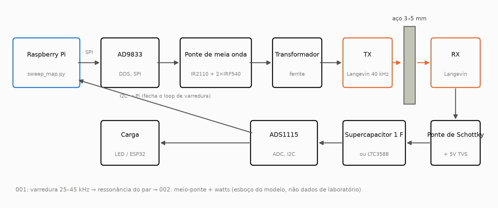
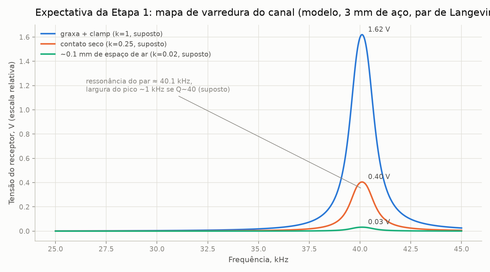
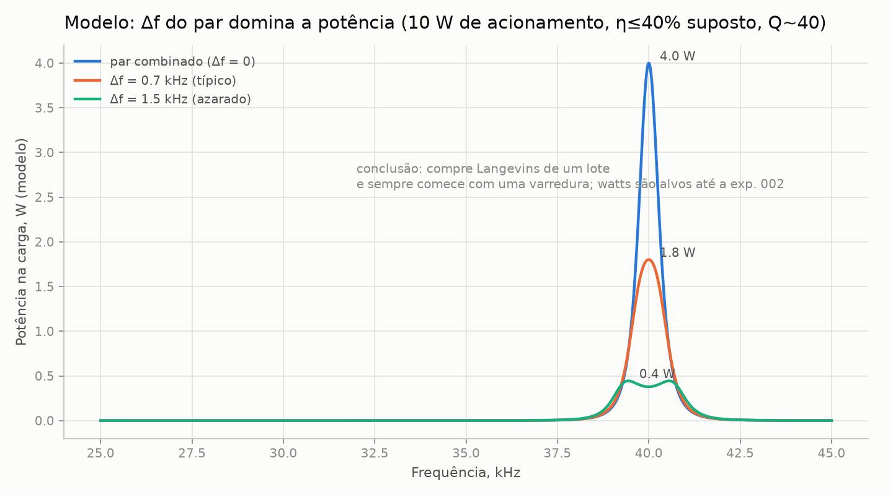
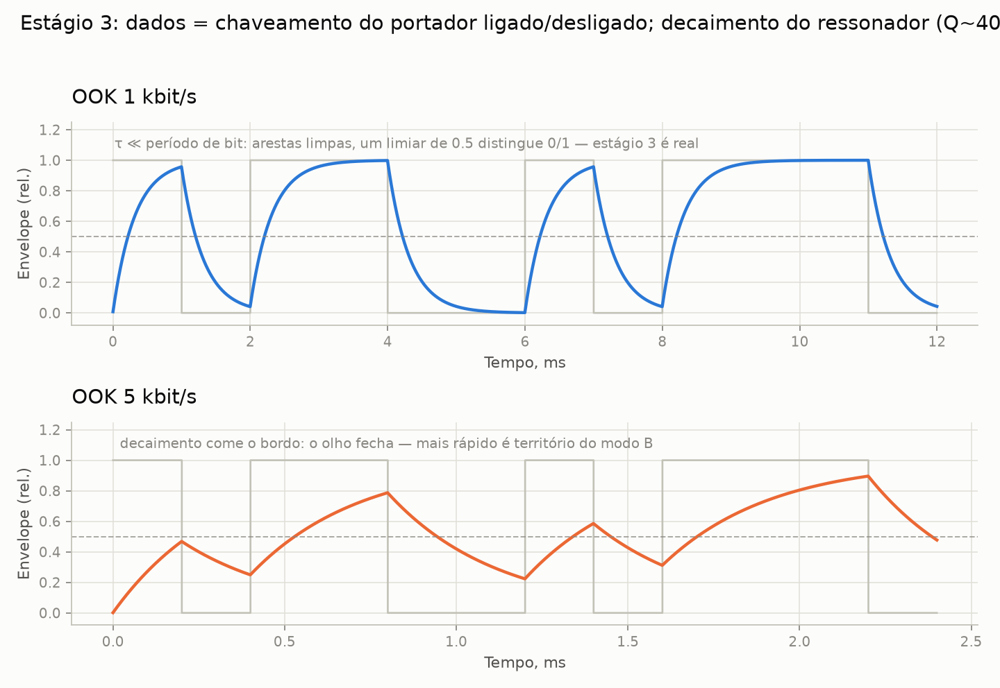
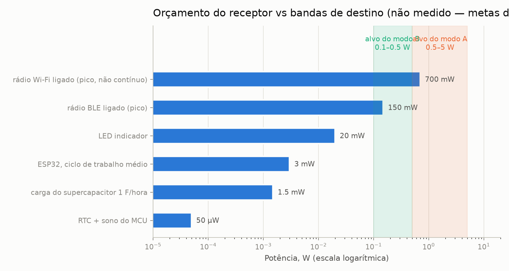
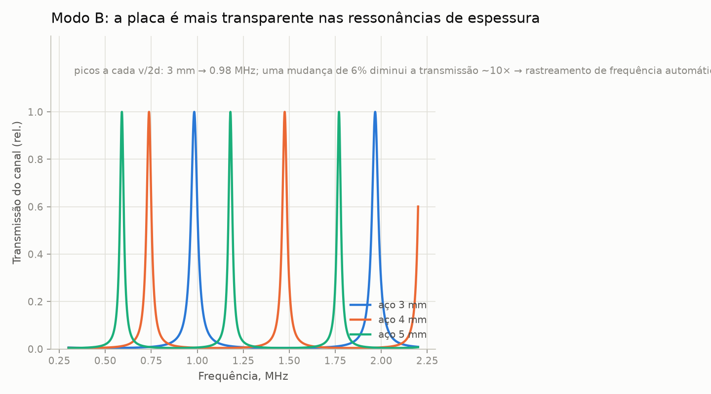

# through-metal-link

> [English (primary)](../../README.md) · [Русский](../ru/README.md) · [Deutsch](../de/README.md) · Português · [Español](../es/README.md) · [Français](../fr/README.md) · [Italiano](../it/README.md) · [Polski](../pl/README.md) · [Türkçe](../tr/README.md) · [Українська](../uk/README.md) · [Tiếng Việt](../vi/README.md) · [中文](../zh/README.md) · [日本語](../ja/README.md) · [한국어](../ko/README.md) · [हिन्दी](../hi/README.md)

Uma plataforma aberta para transferência de potência e dados por ultrassom através de paredes de metal sólido — "através do aço sem um único furo", construída com meios de nível de garagem.

**Experimente agora (sem hardware):** `python3 software/sweep-map/sweep_map.py --mock`

**Caminhos de entrada:**
- **A — simulação:** sweep simulado + [simulador](../../software/simulator/channel_sim.py) (sem bancada)
- **B — construção estágio 1:** [QUICKSTART.md](QUICKSTART.md) → [experiments/001](experiments/001-sweep-map-3mm-steel/README.md)
- **C — contribuir sem hardware:** estado da técnica / docs / traduções / comentários em ADR ([CONTRIBUTING.md](CONTRIBUTING.md))

**Status:** estágio 0 — preparação · **sem validação em hardware ainda** (apenas simulador; recompensa para a primeira construção) · 💰 **[recompensa de $250](https://github.com/zeloras/through-metal-link/issues/5)** · lista de compras: [QUICKSTART.md](QUICKSTART.md)

[](https://github.com/zeloras/through-metal-link/actions/workflows/ci.yml) [](https://github.com/zeloras/through-metal-link/actions/workflows/reuse.yml) [](CONTRIBUTING.md) [](LICENSES.md)

Os docs são multilíngues: o inglês é o idioma principal e vive nos caminhos canônicos; todos os outros idiomas espelham a árvore sob [translations/](..). Edite em qualquer idioma — a CI traduz e faz commit do resto (veja [CONTRIBUTING.md](CONTRIBUTING.md)).



## A ideia em um parágrafo

Ondas de rádio não atravessam metal (gaiola de Faraday), e uma penetração por cabo significa um furo, uma vedação e um ponto de falha. Ultrassom, por outro lado, viaja através do metal sem problemas: um elemento piezoelétrico de cada lado da parede a transforma em um canal para potência e dados. A literatura de laboratório já comprovou a física em níveis sérios (RPI: 50 W + 12 Mbit/s através de 63,5 mm de aço; NASA JPL: até ~kW através de 5 mm de titânio) — essas são provas de existência com hardware especializado, não a BOM de garagem deste repositório. As patentes fundamentais expiraram, e nenhuma plataforma aberta e reprodutível existe ainda — este repositório está construindo uma, começando em **potência na faixa de watts e dados em kbit/s através de aço de 3–5 mm** assim que o estágio 2 for medido.

## Roadmap

| Estágio | Entregável | Critério de sucesso | Expectativa |
|---|---|---|---|
| 1. Sweep map | resposta em frequência do canal "Langevin–3 mm aço–Langevin" | ressonância do par encontrada, gráfico em [experiments/001](experiments/001-sweep-map-3mm-steel/README.md) | [sim1](docs/img/sim1-sweep-contacts.png), [sim2](docs/img/sim2-pair-mismatch.png) |
| 2. Watts | potência na carga em ressonância | ≥0,5 W através de 3 mm de aço, protocolo em [experiments/002](experiments/002-watts-3mm-steel/README.md) | [sim4](docs/img/sim4-power-budget.png) |
| 3. Dados | FSK/OOK sobre o mesmo par | ≥1 kbit/s sem erros | [sim5](docs/img/sim5-ook-datarate.png) |
| 4. Nó | ESP32 + sensor em uma caixa soldada e fechada, alimentado e telemetria apenas por som | ≥1 h de operação autônoma | [sim4](docs/img/sim4-power-budget.png) |
| 5. Publicação | primeira replicação independente + artigo/how-to + snapshot no Zenodo | reprodução por terceiros documentada | — |

## Mapa do repositório

Cada bloco abaixo é um resumo suficiente para trabalhar, além de um link para o documento completo.

### 🛒 Do zero a uma bancada funcional: o que comprar e em que ordem — [QUICKSTART.md](QUICKSTART.md)

**Orçamento:** ~$210 mínimo, ~$300 confortável (desconte ~$120 se você já tem um Pi, um ferro de solda e uma fonte de bancada). Três cestas: ferramentas (~$120), eletrônica da bancada (~$70, [BOM completa](hardware/bom/bom-stage1.csv)), mecânica (~$20). Opcional, mas fortemente recomendado: um osciloscópio USB (~$60–80).

**Caminho crítico — envio da AliExpress (3–4 semanas):** peça a eletrônica no primeiro dia. Decisão-chave: compre **4 transdutores Langevin do mesmo lote** — o sweep vai escolher o melhor par ([por quê](docs/img/sim2-pair-mismatch.png)).

**Enquanto chega:** simule o pipeline sem hardware —

```bash
python3 software/sweep-map/sweep_map.py --mock
```

**Pronto quando (por estágio):** estágio 1 — pico do sweep se reproduz entre duas execuções dentro de <200 Hz ([experiments/001](experiments/001-sweep-map-3mm-steel/README.md)); estágio 2 — ≥0,5 W em uma carga conhecida através de 3 mm de aço e um LED aceso a partir do lado RX ([experiments/002](experiments/002-watts-3mm-steel/README.md)).

### 📚 Teoria em um minuto — [docs/00-theory.md](docs/00-theory.md)

O piezo TX é pressionado contra a parede e injeta uma onda longitudinal nela; o piezo RX do outro lado a converte de volta em eletricidade. Velocidade do som no aço: ~5900 m/s.

Dois modos de operação:

| Modo | Frequência | Ressonância definida por | Gera | Status |
|---|---|---|---|---|
| **A** — transdutores Langevin | 40 kHz | o par de transdutores (parede ≪ λ — uma "membrana") | watts, kbit/s | modo inicial (estágios 1–4, [ADR-0001](docs/decisions/0001-frequency-mode-choice.md)) |
| **B** — discos | 0,6–1 MHz | ressonância de espessura da parede ([pente](docs/img/sim3-thickness-comb.png)) | centenas de mW, centenas de kbit/s | ramo após os primeiros watts; exige rastreamento automático de frequência |

As principais perdas: desalinhamento de ressonância dentro do par (±1 kHz para transdutores Langevin baratos), qualidade do contato acústico (epóxi > acoplante graxa + grampo > pressão a seco), desalinhamento mecânico, deriva de ressonância com a temperatura. A resposta para todas elas é a mesma: **um sweep map antes de cada mudança na configuração**.

### 📈 O que a bancada deve mostrar: gráficos de expectativa do simulador — [software/simulator/channel_sim.py](../../software/simulator/channel_sim.py)

Um modelo de canal semi-empírico (não FEM, **não dados de laboratório** — intuição sobre "como o sweep deve parecer e no que mirar"). As premissas são explícitas em `channel_sim.py` (Q carregado ≈40, fatores-k de contato, η da cadeia ≤40%). Regenere com: `python3 channel_sim.py --out ../../docs/img`.

**Estágio 1 — sweep.** Um pico estreito perto de ~40 kHz; os multiplicadores de contato do modelo são graxa:seco:gap = 1 : 0,25 : 0,02 (ou seja, graxa ≈4× seco e ≈50× gap de ar). Sem pico significa problema no contato ou no par:



**Por que 4 transdutores Langevin, não 2.** Sob Q≈40, um desalinhamento de ressonância de 1,5 kHz dentro do par derruba a potência do modelo ~10×:



**Estágio 3 — dados.** OOK esbarra no ringing do ressonador (modelo Q~40 → τ≈0,3 ms): 1 kbit/s é limpo, a 5 kbit/s o olho está fechado. Ir mais rápido exige o modo B:



**Orçamento de potência do receptor.** Faixas sombreadas são **metas** (modo A 0,5–5 W se o estágio 2 der certo; modo B mais baixo). Primeiras cargas realistas são ESP32 / BLE / LED em duty-cycle; Wi-Fi é mostrado como marcador de pico de consumo, não como promessa contínua:



**Para depois (modo B).** A placa fica transparente num pente de ressonâncias de espessura — a frequência precisa ser rastreada:



### ⚠️ Segurança — leia antes do primeiro power-up — [docs/02-safety.md](docs/02-safety.md)

1. **Dezenas a centenas de volts no piezo** assim que o driver do estágio 2 estiver ativo — o TVS no lado de receptor entra ANTES da primeira execução energizada; mantenha as mãos longe dos fios.
2. **Rede elétrica** — apenas através de fonte de bancada / isolamento; placas de driver de limpa-ultrassônica são galvanicamente ligadas à rede.
3. **Ouvidos** — em potência não trivial, opere transdutores pressionados contra metal; nunca rode ultrassom aéreo de alta potência sem um encapsulamento.
4. **Calor** — um transdutor Langevin sem grampo superaquece em minutos em potência; grampeie antes de aumentar a corrente (apenas um bring-up elétrico breve de baixa corrente — veja o README do driver).
5. **Estilhaços** — piezocerâmica é frágil: um parafuso apertado demais ou um impacto significa estilhaços; use óculos de segurança para qualquer trabalho mecânico.

Primeiro power-up do driver: limite de corrente da fonte de bancada em 0,2 A; sequência completa em [hardware/driver/](hardware/driver/README.md) e [docs/02-safety.md](docs/02-safety.md).

### 🧭 Estado da técnica e higiene de patentes — [docs/01-prior-art.md](docs/01-prior-art.md)

Cada decisão técnica deve rastrear até uma fonte "livre" (patentes expiradas, artigos). A fundação: **US5982297** (Aerospace Corp — a receita básica para um par piezo através de parede), **US7902943** (Caltech/JPL — feed-through de Sherrit), **US9361877** (Univ. Oklahoma — um sistema transceptor completo); todas mortas. Artigos-chave: Lawry 2013 (50 W + 12,4 Mbit/s através de 63,5 mm de aço), Sherrit/NASA (uma lâmpada de 100 W), Yang 2015 (survey).

Não copiar enquanto ainda vivas: alocação OFDM e esquema full-duplex da RPI e transdutores conformais da Drexel (EUA, até ~2032–2033 — estágios 1–4 não precisam de nenhum deles), mais as famílias que uma busca em 2026-08 adicionou: **US8594572B1** (Marinha dos EUA — recai sobre o canal de potência em si; EUA, até 2032; Welle 1997 é a resposta de estado da técnica), **EP3723304B1** (ABB — espectro de potência *abaixo* do espectro de dados; DE/GB, até 2039; a uplink planejada por modulação de carga no mesmo portador fica fora dela), **Ultrapower** (sensor in-pipe com arrays convexos/côncavos, ou uma haste através da parede; EUA, até 2035 — usamos pads planos e sem haste). Leituras de claims, status e design-arounds: [docs/01-prior-art.md](docs/01-prior-art.md).

Decisões de arquitetura são registradas em [docs/decisions/](docs/decisions/0001-frequency-mode-choice.md) (ADR).

### 🔌 Hardware e firmware — hardware/, firmware/

- [hardware/bom/bom-stage1.csv](hardware/bom/bom-stage1.csv) — lista de compras do estágio 1.
- [hardware/schematics/](hardware/schematics/README.md) — **esquemas de circuito** (gerados a partir de código): driver, receptor, pinout do Pi, nó coletor.
- [hardware/driver/](hardware/driver/README.md) — driver TX: meia-ponte IR2110 + 2×IRF540, transformador de casamento (um transdutor Langevin é uma carga capacitiva!). Placa KiCad vem depois do protótipo na breadboard ser validado.
- [hardware/receiver/](hardware/receiver/README.md) — receptor, estágio por estágio: ponte Schottky → ADC (estágio 1) → carga (estágio 2) → LTC3588 + supercapacitor + ESP32 (estágio 4).
- [firmware/node-esp32/](firmware/node-esp32/README.md) — nó do estágio 4 (stub): deep sleep, leitura de sensor, advertising BLE, orçamento de 1–5 mW médio.

### 💻 Software: medições e o simulador — software/

- [software/sweep-map/sweep_map.py](../../software/sweep-map/sweep_map.py) — o cavalo de batalha do estágio 1: sweep DDS → leituras de ADC → CSV + gráfico de resposta em frequência. Tem `--mock` para uma execução sem hardware. No Pi: `raspi-config` → habilite SPI e I2C; `pip install spidev smbus2 matplotlib`.
- [software/simulator/channel_sim.py](../../software/simulator/channel_sim.py) — gerador dos gráficos de expectativa (`pip install numpy matplotlib`).
- [software/simulator/material_map.py](../../software/simulator/material_map.py) — o mesmo modelo de canal através de diferentes materiais de parede — titânio, alumínio, vidro, cerâmicas, plásticos, concreto; o estudo e os veredictos: [docs/06-materials.md](docs/06-materials.md).
- [data/](data/README.md) — logs brutos; CSV/PNG ficam fora do git, apenas gráficos curados entram no git dentro do diretório do experimento.

### 🗺️ Onde aplicar isto: barreiras, canais, nichos — [docs/04-hybrid-channels.md](docs/04-hybrid-channels.md), [docs/05](docs/05-applications-map.md)

Não existe canal universal — a plataforma casou a física com a barreira: piezo-acústica (primário: aço/alumínio com contato — watts e kbit/s), EMAT (metal sujo/quente, sem contato — dados), magnética de baixa frequência (paredes sanduíche a vácuo de dewars — bits/s). Becos sem saída honestos: paredes revestidas de borracha/composite, líquido borbulhante no caminho.

Prioridade de nicho: **(1)** câmaras de vácuo de laboratório e criostatos — o público de hardware open-source, sem certificações; **(2)** tanques de fermentação — um campo de prova a uma caminhada de distância; **(3)** pacotes de bateria selados — o caso emblemático (detecção de thermal-runaway sem uma penetração no pacote). O protocolo de descoberta e auto-afinação do receptor (um análogo do Qi): [docs/03-discovery-protocol.md](docs/03-discovery-protocol.md).

### 📁 Layout de diretórios

```
docs/            teoria, estado da técnica, segurança, aplicações, log de decisões (ADR)
docs/img/        gráficos de expectativa (gerados por software/simulator/channel_sim.py)
hardware/        BOM, driver (meia-ponte), receptor (retificador/coletor)
firmware/        firmware do nó (ESP32 — stub até o estágio 4)
software/        scripts de medição (sweep map de resposta em frequência) e simulador de canal
experiments/     protocolos de experimento — a partir do template, um diretório = um experimento
data/            logs brutos (arquivos grandes ficam fora do git)
```

## Princípios

1. **Reprodutibilidade do zero.** Qualquer pessoa com um ferro de solda e ~$210 pode reproduzir o resultado apenas a partir deste repositório.
2. **Cada experimento é um protocolo.** Sem "funcionou mais ou menos": [experiments/TEMPLATE.md](experiments/TEMPLATE.md) é obrigatório.
3. **Higiene de patentes.** Construímos sobre a camada expirada ([docs/01-prior-art.md](docs/01-prior-art.md)); decisões são registradas em [docs/decisions/](docs/decisions/0001-frequency-mode-choice.md).
4. **Medição primeiro, opinição depois.** Um sweep map antes de qualquer conclusão sobre o canal.

## Licenças e patentes

Código — Apache-2.0, hardware — CERN-OHL-W v2, documentação — CC-BY-4.0; textos completos em [LICENSES/](../../LICENSES). Qualquer um pode fazer fork e construir sobre isto, inclusive comercialmente; proteção de patente vem das cláusulas de concessão e retaliação nas licenças mais uma estratégia de estado da técnica. O esquema completo e o protocolo de publicação defensiva: [LICENSES.md](LICENSES.md); regras de contribuição: [CONTRIBUTING.md](CONTRIBUTING.md).
