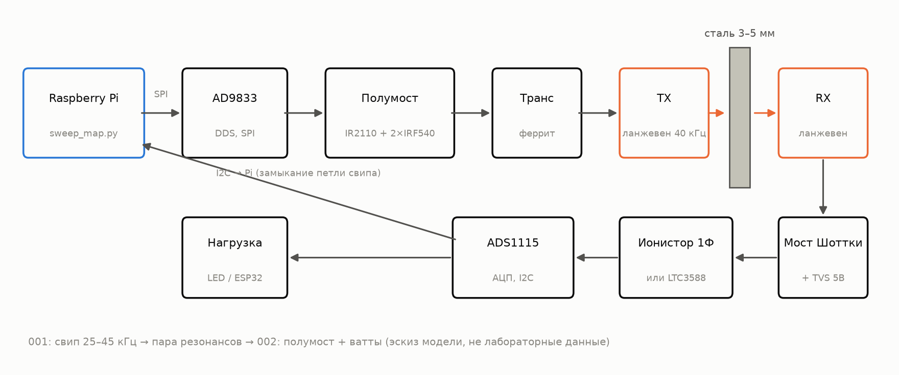
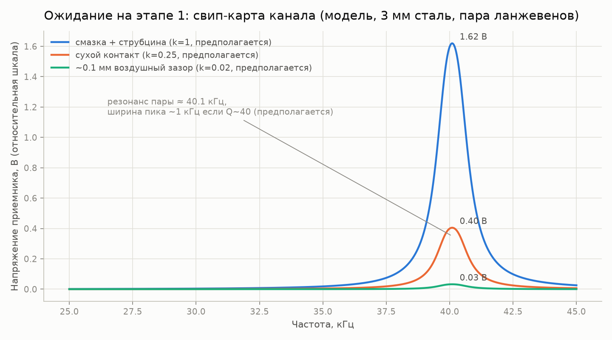
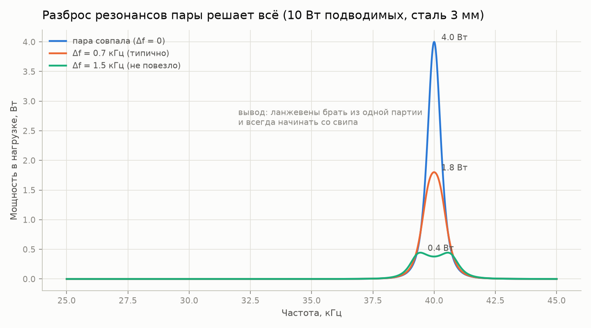
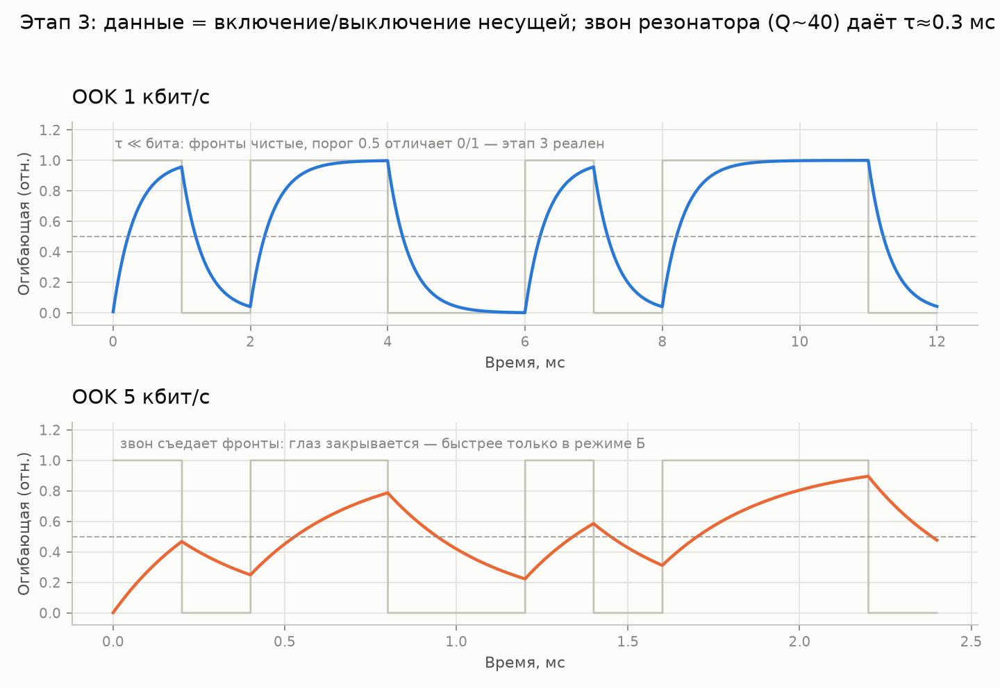
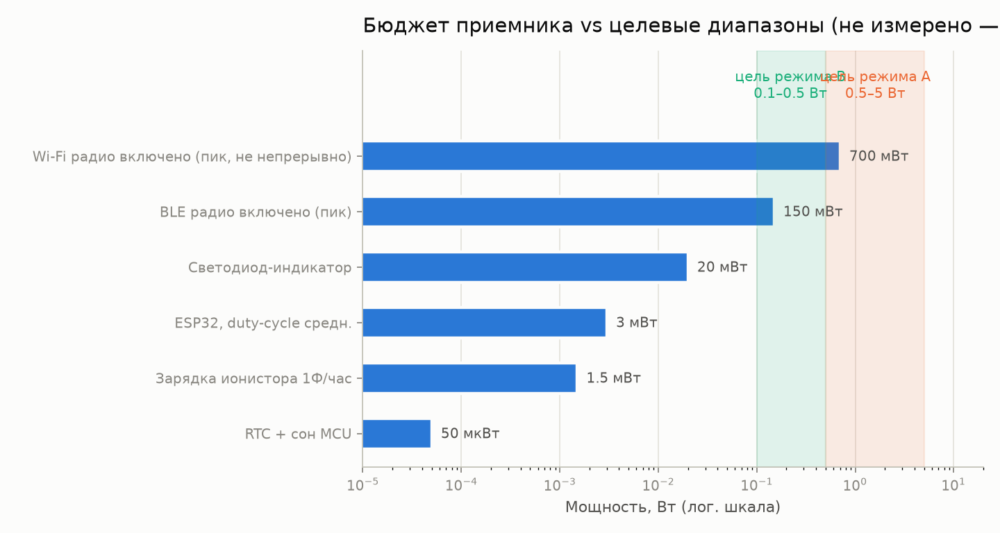

# связь-через-металл

> [English (primary)](../../README.md) · Русский · [Deutsch](../de/README.md) · [Português](../pt/README.md) · [Español](../es/README.md) · [Français](../fr/README.md) · [Italiano](../it/README.md) · [Polski](../pl/README.md) · [Türkçe](../tr/README.md) · [Українська](../uk/README.md) · [Tiếng Việt](../vi/README.md) · [中文](../zh/README.md) · [日本語](../ja/README.md) · [한국어](../ko/README.md) · [हिन्दी](../hi/README.md)

Открытая платформа для ультразвуковой передачи энергии и данных через сплошные металлические стенки — «сквозь сталь без единого отверстия», построенная гаражными средствами.

**Попробуйте прямо сейчас (без железа):** `python3 software/sweep-map/sweep_map.py --mock`

**Статус:** этап 0 — подготовка · 💰 **[награда $250 за первую независимую сборку](https://github.com/zeloras/through-metal-link/issues)** · список покупок: [QUICKSTART.md](QUICKSTART.md)

[](https://github.com/zeloras/through-metal-link/actions/workflows/ci.yml) [](https://github.com/zeloras/through-metal-link/actions/workflows/reuse.yml) [](CONTRIBUTING.md) [](LICENSES.md)

Документация многоязычная: английский — основной язык и находится по каноническим путям; каждый другой язык зеркалит дерево в [translations/](..). Редактируйте любой язык — CI переведёт и закоммитит остальные (см. [CONTRIBUTING.md](CONTRIBUTING.md)).

<p align="center"></p>

## Идея в одном абзаце

Радиоволны не проходят через металл (клетка Фарадея), а кабельная врезка означает отверстие, уплотнение и точку отказа. Ультразвук, напротив, прекрасно распространяется через металл: пьезоэлемент на каждой стороне стены превращает её в канал для питания и данных. Лабораторная литература уже доказала физику на серьёзных уровнях (RPI: 50 Вт + 12 Мбит/с через 63,5 мм стали; NASA JPL: до ~кВт через 5 мм титана) — это доказательства реализуемости на специализированном оборудовании, а не на гаражной спецификации этого репозитория. Базовые патенты истекли, и пока не существует открытой воспроизводимой платформы — этот репозиторий создаёт её, начиная с **мощности класса ватт и данных на кбит/с через 3–5 мм стали** после измерений на этапе 2.

## Дорожная карта

| Этап | Результат | Критерий успеха | Ожидание |
|---|---|---|---|
| 1. Свип-карта | АЧХ канала «ланжевен — 3 мм сталь — ланжевен» | найден парный резонанс, график в [experiments/001](experiments/001-sweep-map-3mm-steel/README.md) | [sim1](docs/img/sim1-sweep-contacts.png), [sim2](docs/img/sim2-pair-mismatch.png) |
| 2. Ватты | мощность в нагрузку на резонансе | ≥0,5 Вт через 3 мм стали, протокол в [experiments/002](experiments/002-watts-3mm-steel/README.md) | [sim4](docs/img/sim4-power-budget.png) |
| 3. Данные | FSK/OOK через ту же пару | ≥1 кбит/с без ошибок | [sim5](docs/img/sim5-ook-datarate.png) |
| 4. Узел | ESP32 + датчик в заваренной коробке, питание и телеметрия только звуком | ≥1 ч автономной работы | [sim4](docs/img/sim4-power-budget.png) |
| 5. Публикация | репозиторий становится публичным, статья/how-to | воспроизведение третьей стороной | — |

## Карта репозитория

python3 software/sweep-map/sweep_map.py --mock
```

**Готово, когда (по этапам):** этап 1 — пик свипа воспроизводится на двух прогонах с точностью до <200 Гц ([experiments/001](experiments/001-sweep-map-3mm-steel/README.md)); этап 2 — ≥0.5 Вт в известную нагрузку через 3 мм стали и горящий светодиод на стороне приёмника ([experiments/002](experiments/002-watts-3mm-steel/README.md)).

</details>

<details>
<summary><b>📚 Теория за минуту</b> — <a href="docs/00-theory.md">docs/00-theory.md</a></summary>

Пьезо-передатчик (TX) прижимается к стенке и излучает в неё продольную волну; пьезо-приёмник (RX) на другой стороне превращает её обратно в электричество. Скорость звука в стали: ~5900 м/с.

Два режима работы:

| Режим | Частота | Резонанс задаётся | Даёт | Статус |
|---|---|---|---|---|
| **A** — ланжевены | 40 кГц | парой преобразователей (стенка ≪ λ — «мембрана») | ватты, кбит/с | стартовый режим (этапы 1–4, [ADR-0001](docs/decisions/0001-frequency-mode-choice.md)) |
| **B** — диски | 0.6–1 МГц | толщинным резонансом стенки ([гребёнка](docs/img/sim3-thickness-comb.png)) | сотни мВт, сотни кбит/с | ветка после первых ватт; требует автоматического слежения за частотой |

Основные потери: расстройка резонанса внутри пары (±1 кГц для дешёвых ланжевенов), качество акустического контакта (эпоксид > смазка + струбцина > сухой прижим), перекос, температурный дрейф резонанса. Ответ на всё это один и тот же: **свип-карта перед каждым изменением сетапа**.

</details>

<details>
<summary><b>📈 Что должен показать стенд: графики ожиданий от симулятора</b> — <a href="software/simulator/channel_sim.py">software/simulator/channel_sim.py</a></summary>

Полуэмпирическая модель канала (не FEM, **не лабораторные данные** — интуиция для «как должен выглядеть свип и к чему стремиться»). Допущения прописаны в `channel_sim.py` (нагруженная добротность Q≈40, коэффициенты контакта, КПД цепи η≤40%). Регенерация: `python3 channel_sim.py --out ../../docs/img`.

**Этап 1 — свип.** Узкий пик около ~40 кГц; placeholder-коэффициенты контакта в модели для смазка:сухо:зазор = 1 : 0.25 : 0.02 (т.е. смазка даёт ≈4× от сухого и ≈50× от воздушного зазора). Отсутствие пика означает проблему с контактом или парой:



**Почему 4 ланжевена, а не 2.** При Q≈40 расстройка резонанса внутри пары на 1.5 кГц снижает мощность в модели примерно в 10×:



**Этап 3 — данные.** OOK сталкивается с звоном резонатора (модель Q~40 → τ≈0.3 мс): 1 кбит/с чисто, на 5 кбит/с глаз закрыт. Для большей скорости нужен режим B:



**Бюджет мощности приёмника.** Заштрихованные полосы — **цели** (режим A 0.5–5 Вт, если этап 2 удастся; режим B ниже). Реалистичные первые нагрузки — это ESP32 / BLE / LED в дежурном режиме; Wi-Fi показан как маркер пикового потребления, а не как непрерывное обещание:



**На будущее (режим B).** Пластина становится прозрачной на гребёнке толщинных резонансов — частоту нужно отслеживать:


</details>

<details>
<summary><b>⚠️ Безопасность — прочтите перед первым включением</b> — <a href="docs/02-safety.md">docs/02-safety.md</a></summary>

1. **Десятки и сотни вольт на пьезо** сразу после включения драйвера этапа 2 — TVS-диод на стороне приёмника ставится ДО первого включения питания; не трогайте выводы руками.
2. **Сеть** — только через лабораторный блок питания / изоляцию; платы драйверов от ультразвуковых моек гальванически связаны с сетью.
3. **Уши** — при значительной мощности работайте с преобразователями, прижатыми к металлу; никогда не запускайте высокомощный ультразвук в воздухе без кожуха.
4. **Нагрев** — незакреплённый ланжевен перегревается за минуты при мощности; зажмите в струбцину перед повышением тока (кратковременная электрическая отладка на малом токе — см. README драйвера).
5. **Осколки** — пьезокерамика хрупкая: перетянутый болт или удар означают осколки; надевайте защитные очки для любых механических работ.

docs/            теория, предшествующий уровень, безопасность, применения, журнал решений (ADR)
docs/img/        графики ожидания (генерируются software/simulator/channel_sim.py)
hardware/        BOM, драйвер (полумост), приемник (выпрямитель/харвестер)
firmware/        прошивка узла (ESP32 — заглушка до этапа 4)
software/        скрипты измерений (свип-карта АЧХ) и симулятор канала
experiments/     протоколы экспериментов — из шаблона, одна директория = один эксперимент
data/            необработанные логи (большие файлы не попадают в git)
```

</details>

## Принципы

1. **Воспроизводимость с нуля.** Любой, у кого есть паяльник и ~$210, может воспроизвести результат, используя только этот репозиторий.
2. **Каждый эксперимент — это протокол.** Никаких «вроде заработало»: [experiments/TEMPLATE.md](experiments/TEMPLATE.md) обязателен.
3. **Патентная гигиена.** Мы строим на слое истёкшихся патентов ([docs/01-prior-art.md](docs/01-prior-art.md)); решения фиксируются в [docs/decisions/](docs/decisions/0001-frequency-mode-choice.md).
4. **Сначала измерения, потом мнения.** Свип-карта до любых выводов о канале.

## Лицензии и патенты

Код — Apache-2.0, аппаратное обеспечение — CERN-OHL-W v2, документация — CC-BY-4.0; полные тексты в [LICENSES/](../../LICENSES). Любой может форкнуть и развивать проект, в том числе коммерчески; патентная защита обеспечивается грантами и клаузулами реталиации в лицензиях, а также стратегией предшествующего уровня техники. Полная схема и протокол оборонительной публикации: [LICENSES.md](LICENSES.md); правила участия: [CONTRIBUTING.md](CONTRIBUTING.md).
