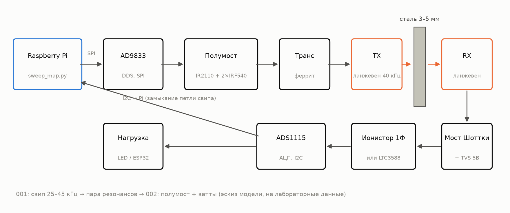
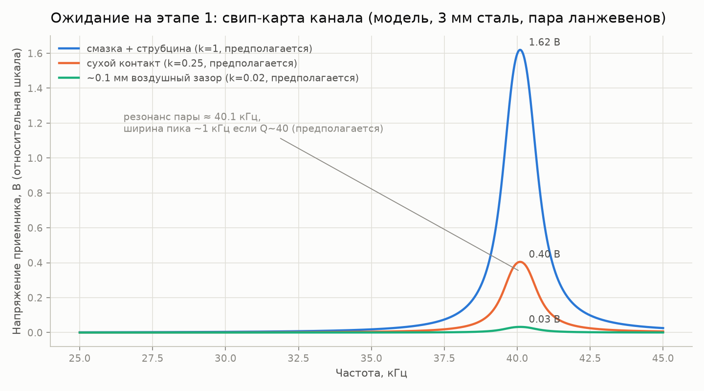
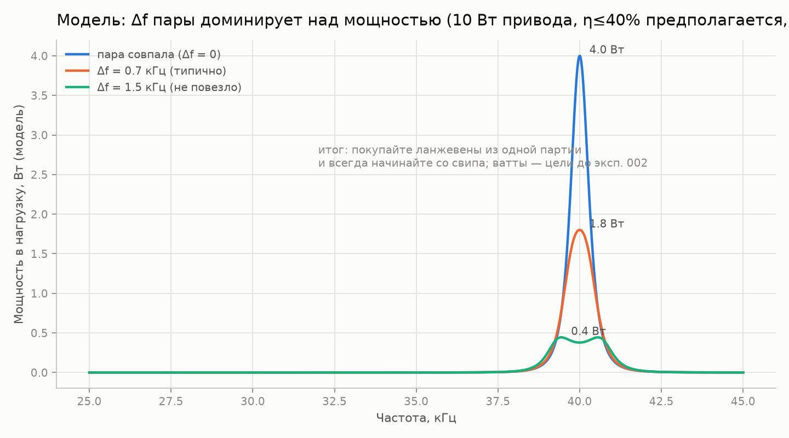
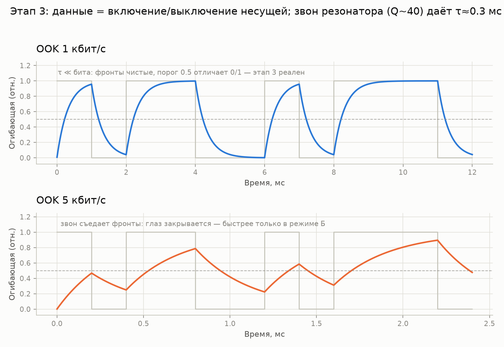
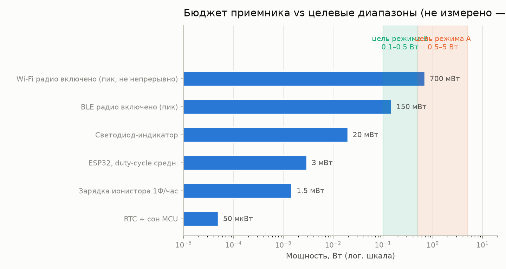
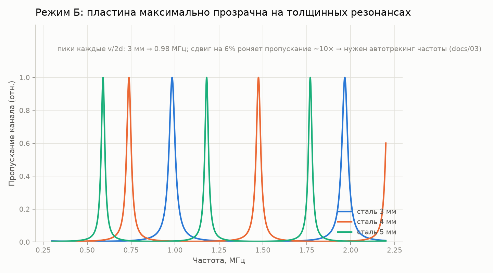

# through-metal-link

> [English (primary)](../../README.md) · Русский · [Deutsch](../de/README.md) · [Português](../pt/README.md) · [Español](../es/README.md) · [Français](../fr/README.md) · [Italiano](../it/README.md) · [Polski](../pl/README.md) · [Türkçe](../tr/README.md) · [Українська](../uk/README.md) · [Tiếng Việt](../vi/README.md) · [中文](../zh/README.md) · [日本語](../ja/README.md) · [한국어](../ko/README.md) · [हिन्दी](../hi/README.md)

Открытая платформа для ультразвуковой передачи энергии и данных через сплошные металлические стенки — «сквозь сталь без единого отверстия», построенная гаражными средствами.

**Попробуйте прямо сейчас (без железа):** `python3 software/sweep-map/sweep_map.py --mock`

**Пути вовлечения:**
- **A — сухой прогон:** свип-карта на макете + [симулятор](../../software/simulator/channel_sim.py) (без стенда)
- **B — сборка стадии 1:** [QUICKSTART.md](QUICKSTART.md) → [experiments/001](experiments/001-sweep-map-3mm-steel/README.md)
- **C — вклад без железа:** prior-art / документация / переводы / комментарии к ADR ([CONTRIBUTING.md](CONTRIBUTING.md))

**Статус:** стадия 0 — подготовка · **аппаратной валидации пока нет** (только симулятор; баунти за первую сборку) · 💰 **[$250 баунти](https://github.com/zeloras/through-metal-link/issues/5)** · список покупок: [QUICKSTART.md](QUICKSTART.md)

[](https://github.com/zeloras/through-metal-link/actions/workflows/ci.yml) [](https://github.com/zeloras/through-metal-link/actions/workflows/reuse.yml) [](CONTRIBUTING.md) [](LICENSES.md)

Документация многоязычна: английский — основной и живёт по каноническим путям; каждый другой язык зеркалит дерево в [translations/](..). Редактируйте любой язык — CI переведёт и закоммитит остальные (см. [CONTRIBUTING.md](CONTRIBUTING.md)).



## Идея в одном абзаце

Радиоволны не проходят через металл (клетка Фарадея), а кабельная врезка означает отверстие, уплотнение и точку отказа. Ультразвук, напротив, проходит через металл без проблем: пьезоэлемент на каждой стороне стенки превращает её в канал для энергии и данных. Лабораторная литература уже доказала физику на серьёзных уровнях (RPI: 50 Вт + 12 Мбит/с через 63.5 мм стали; NASA JPL: вплоть до ~кВт через 5 мм титана) — это доказательства существования на специализированном оборудовании, а не гаражный BOM этого репозитория. Базовые патенты истекли, и открытой воспроизводимой платформы пока не существует — этот репозиторий строит её, начиная с **мощности порядка ватт и данных на кбит/с через 3–5 мм стали** после измерений на стадии 2.

## Дорожная карта

| Стадия | Результат | Критерий успеха | Ожидание |
|---|---|---|---|
| 1. Свип-карта | АЧХ канала «ланжевен — 3 мм стали — ланжевен» | найден резонанс пары, график в [experiments/001](experiments/001-sweep-map-3mm-steel/README.md) | [sim1](docs/img/sim1-sweep-contacts.png), [sim2](docs/img/sim2-pair-mismatch.png) |
| 2. Ватты | мощность в нагрузке на резонансе | ≥0.5 Вт через 3 мм стали, протокол в [experiments/002](experiments/002-watts-3mm-steel/README.md) | [sim4](docs/img/sim4-power-budget.png) |
| 3. Данные | FSK/OOK на той же паре | ≥1 кбит/с без ошибок | [sim5](docs/img/sim5-ook-datarate.png) |
| 4. Узел | ESP32 + датчик в заваренной коробке, питание и телеметрия только звуком | ≥1 ч автономной работы | [sim4](docs/img/sim4-power-budget.png) |
| 5. Публикация | первое независимое воспроизведение + статья/how-to + снимок Zenodo | задокументировано стороннее воспроизведение | — |

## Карта репозитория

Каждый блок ниже — выжимка, достаточная для работы, плюс ссылка на полный документ.

### 🛒 От нуля до рабочего стенда: что покупать и в каком порядке — [QUICKSTART.md](QUICKSTART.md)

**Бюджет:** ~$210 минимум, ~$300 комфортно (вычтите ~$120, если у вас уже есть Pi, паяльник и лабораторный блок питания). Три корзины: инструменты (~$120), электроника стенда (~$70, [полный BOM](hardware/bom/bom-stage1.csv)), механика (~$20). Опционально, но настоятельно рекомендуется: USB-осциллограф (~$60–80).

**Критический путь — доставка с AliExpress (3–4 недели):** заказывайте электронику в первый же день. Ключевое решение: купите **4 ланжевена из одной партии** — свип-карта выберет лучшую пару ([почему](docs/img/sim2-pair-mismatch.png)).

**Пока едет:** прогоните пайплайн без железа —

```bash
python3 software/sweep-map/sweep_map.py --mock
```

**Готово, когда (по стадиям):** стадия 1 — пик свип-карты воспроизводится между двумя прогонами с точностью <200 Гц ([experiments/001](experiments/001-sweep-map-3mm-steel/README.md)); стадия 2 — ≥0.5 Вт в известную нагрузку через 3 мм стали и горящий светодиод со стороны RX ([experiments/002](experiments/002-watts-3mm-steel/README.md)).

### 📚 Теория за минуту — [docs/00-theory.md](docs/00-theory.md)

Пьезо TX прижат к стенке и возбуждает в ней продольную волну; пьезо RX на другой стороне превращает её обратно в электричество. Скорость звука в стали: ~5900 м/с.

Два режима работы:

| Режим | Частота | Резонанс задаётся | Даёт | Статус |
|---|---|---|---|---|
| **A** — ланжевены | 40 кГц | парой преобразователей (стенка ≪ λ — «мембрана») | ватты, кбит/с | стартовый режим (стадии 1–4, [ADR-0001](docs/decisions/0001-frequency-mode-choice.md)) |
| **B** — диски | 0.6–1 МГц | толщинным резонансом стенки ([гребёнка](docs/img/sim3-thickness-comb.png)) | сотни мВт, сотни кбит/с | ответвление после первых ватт; нужен автоматический поиск частоты |

Основные потери: расстройка резонанса внутри пары (±1 кГц для дешёвых ланжевенов), качество акустического контакта (эпоксид > смазка + струбцина > сухой прижим), перекос осей, дрейф резонанса с температурой. Ответ на всё один: **свип-карта перед каждым изменением сетапа**.

### 📈 Что должен показать стенд: графики ожидания из симулятора — [software/simulator/channel_sim.py](../../software/simulator/channel_sim.py)

Полуэмпирическая модель канала (не FEM, **не лабораторные данные** — интуиция о том, «как должна выглядеть свип-карта и куда целиться»). Допущения прописаны в `channel_sim.py` (нагруженная Q≈40, коэффициенты контакта, КПД цепи η≤40%). Регенерация: `python3 channel_sim.py --out ../../docs/img`.

**Стадия 1 — свип.** Узкий пик около ~40 кГц; модельные множители контакта в заглушке — смазка:сухо:зазор = 1 : 0.25 : 0.02 (т.е. смазка ≈4× сухого и ≈50× воздушного зазора). Нет пика — проблема с контактом или парой:



**Почему 4 ланжевена, а не 2.** При Q≈40 расстройка резонанса внутри пары на 1.5 кГц падает мощность в модели ~в 10 раз:



**Стадия 3 — данные.** OOK натыкается на звон резонатора (модель Q~40 → τ≈0.3 мс): 1 кбит/с чисто, на 5 кбит/с глаз закрыт. Быстрее — это режим B:



**Энергобюджет приёмника.** Заштрихованные полосы — **цели** (режим A 0.5–5 Вт, если стадия 2 получится; режим B ниже). Реалистичные первые нагрузки — ESP32 / BLE / светодиод в дежурном режиме; Wi-Fi показан как маркер пикового потребления, а не как непрерывное обещание:



**На потом (режим B).** Пластина становится прозрачной на гребёнке толщинных резонансов — частоту нужно отслеживать:



### ⚠️ Безопасность — прочтите перед первым включением — [docs/02-safety.md](docs/02-safety.md)

1. **От десятков до сотен вольт на пьезо** после запуска драйвера стадии 2 — TVS на стороне приёмника ставится ДО первого включения; не трогайте выводы руками.
2. **Сеть** — только через лабораторный блок питания / изоляцию; платы драйверов от ультразвуковых моек гальванически связаны с сетью.
3. **Уши** — при значительной мощности работайте с преобразователями, прижатыми к металлу; никогда не запускайте мощный воздушный ультразвук без кожуха.
4. **Нагрев** — незажатый ланжевен перегревается за минуты при мощности; зажмите струбциной перед повышением тока (кратковременная электрическая отладка на малом токе — см. README драйвера).
5. **Осколки** — пьезокерамика хрупкая: перетянутый болт или удар означает осколки; надевайте защитные очки при любых механических работах.

Первое включение драйвера: ограничение тока лабораторного БП 0.2 A; полная последовательность в [hardware/driver/](hardware/driver/README.md) и [docs/02-safety.md](docs/02-safety.md).

### 🧭 Prior art и патентная гигиена — [docs/01-prior-art.md](docs/01-prior-art.md)

Каждое техническое решение должно возводиться к «свободному» источнику (истёкшиеся патенты, статьи). Фундамент: **US5982297** (Aerospace Corp — базовый рецепт сквозной пьезопары), **US7902943** (Caltech/JPL — feed-through Шеррита), **US9361877** (Univ. Oklahoma — полная трансиверная система); все мертвы. Ключевые статьи: Lawry 2013 (50 Вт + 12.4 Мбит/с через 63.5 мм стали), Sherrit/NASA (лампа на 100 Вт), Yang 2015 (обзор).

Не копировать, пока живы: OFDM-распределение и full-duplex схема RPI и конформные преобразователи Drexel (US, до ~2032–2033 — для стадий 1–4 они не нужны), плюс семейства, добавленные поиском от 2026-08: **US8594572B1** (ВМС США — читается на сам голый канал питания; US, до 2032; Welle 1997 — prior-art-ответ), **EP3723304B1** (ABB — спектр мощности *ниже* спектра данных; DE/GB, до 2039; планируемая нагрузочная модуляция на том же носителе в обратном канале остаётся вне его), **Ultrapower** (датчик в трубе с выпуклыми/вогнутыми массивами или стержень через стенку; US, до 2035 — мы используем плоские пады и без стержня). Разбор формул, статусы и обходы: [docs/01-prior-art.md](docs/01-prior-art.md).

Архитектурные решения зафиксированы в [docs/decisions/](docs/decisions/0001-frequency-mode-choice.md) (ADR).

### 🔌 Аппаратное обеспечение и прошивка — hardware/, firmware/

- [hardware/bom/bom-stage1.csv](hardware/bom/bom-stage1.csv) — список покупок для стадии 1.
- [hardware/schematics/](hardware/schematics/README.md) — **принципиальные схемы** (генерируются из кода): драйвер, приёмник, распиновка Pi, узел-харвестер.
- [hardware/driver/](hardware/driver/README.md) — TX-драйвер: полумост на IR2110 + 2×IRF540, согласующий трансформатор (ланжевен — ёмкостная нагрузка!). Плата в KiCad — после того, как макет отработает.
- [hardware/receiver/](hardware/receiver/README.md) — приёмник, по стадиям: мост Шоттки → АЦП (стадия 1) → нагрузка (стадия 2) → LTC3588 + ионистор + ESP32 (стадия 4).
- [firmware/node-esp32/](firmware/node-esp32/README.md) — узел стадии 4 (заглушка): deep sleep, опрос датчика, BLE-реклама, бюджет 1–5 мВт в среднем.

### 💻 Софт: измерения и симулятор — software/

- [software/sweep-map/sweep_map.py](../../software/sweep-map/sweep_map.py) — рабочая лошадка стадии 1: свип DDS → отсчёты АЦП → CSV + график АЧХ. Есть `--mock` для прогона без железа. На Pi: `raspi-config` → включить SPI и I2C; `pip install spidev smbus2 matplotlib`.
- [software/simulator/channel_sim.py](../../software/simulator/channel_sim.py) — генератор графиков ожидания (`pip install numpy matplotlib`).
- [software/simulator/material_map.py](../../software/simulator/material_map.py) — та же модель канала для разных материалов стенки — титан, алюминий, стекло, керамика, пластик, бетон; исследование и выводы: [docs/06-materials.md](docs/06-materials.md).
- [data/](data/README.md) — сырые логи; CSV/PNG не попадают в git, только кураторские графики идут в git внутри директории эксперимента.

### 🗺️ Где это применять: барьеры, каналы, ниши — [docs/04-hybrid-channels.md](docs/04-hybrid-channels.md), [docs/05](docs/05-applications-map.md)

Универсального канала не существует — платформа подгоняет физику под барьер: пьезоакустика (основное: сталь/алюминий с контактом — ватты и кбит/с), EMAT (грязный/горячий металл, без контакта — данные), низкочастотная магнитика (вакуумные сэндвич-стенки дьюаров — биты/с). Честные тупики: резиноподобные/композитные стенки, пузырящаяся жидкость на пути.

Приоритет ниш: **(1)** лабораторные вакуумные камеры и криостаты — аудитория open-source hardware, без сертификаций; **(2)** ферментационные танки — полигон в пешей доступности; **(3)** герметичные аккумуляторные сборки — флагманский кейс (детекция теплового разгонения без врезки в корпус). Протокол обнаружения приёмника и автоподстройки (аналог Qi): [docs/03-discovery-protocol.md](docs/03-discovery-protocol.md).

### 📁 Структура директорий

```
docs/            теория, prior art, безопасность, применения, журнал решений (ADR)
docs/img/        графики ожидания (генерируются software/simulator/channel_sim.py)
hardware/        BOM, драйвер (полумост), приёмник (выпрямитель/харвестер)
firmware/        прошивка узла (ESP32 — заглушка до стадии 4)
software/        скрипты измерений (свип-карта АЧХ) и симулятор канала
experiments/     протоколы экспериментов — из шаблона, одна директория = один эксперимент
data/            сырые логи (крупные файлы не попадают в git)
```

## Принципы

1. **Воспроизводимость с нуля.** Любой с паяльником и ~$210 может воспроизвести результат только по этому репозиторию.
2. **Каждый эксперимент — протокол.** Никаких «вроде заработало»: [experiments/TEMPLATE.md](experiments/TEMPLATE.md) обязателен.
3. **Патентная гигиена.** Строим на истёкшем слое ([docs/01-prior-art.md](docs/01-prior-art.md)); решения фиксируются в [docs/decisions/](docs/decisions/0001-frequency-mode-choice.md).
4. **Сначала измерение, потом мнение.** Свип-карта перед любыми выводами о канале.

## Лицензии и патенты

Код — Apache-2.0, аппаратное обеспечение — CERN-OHL-W v2, документация — CC-BY-4.0; полные тексты в [LICENSES/](../../LICENSES). Любой может форкнуть и строить на этом, в том числе коммерчески; патентная защита — за счёт грантов и клаузул реталиации в лицензиях плюс стратегия prior art. Полная схема и протокол оборонительных публикаций: [LICENSES.md](LICENSES.md); правила контрибуции: [CONTRIBUTING.md](CONTRIBUTING.md).
