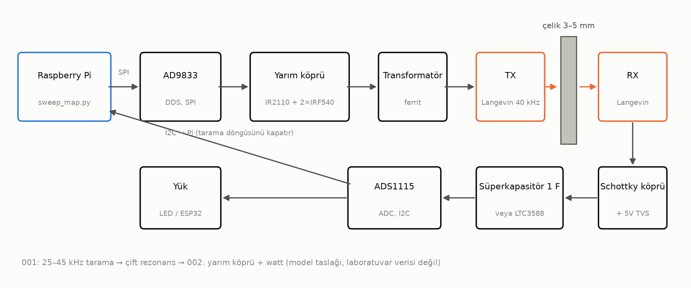
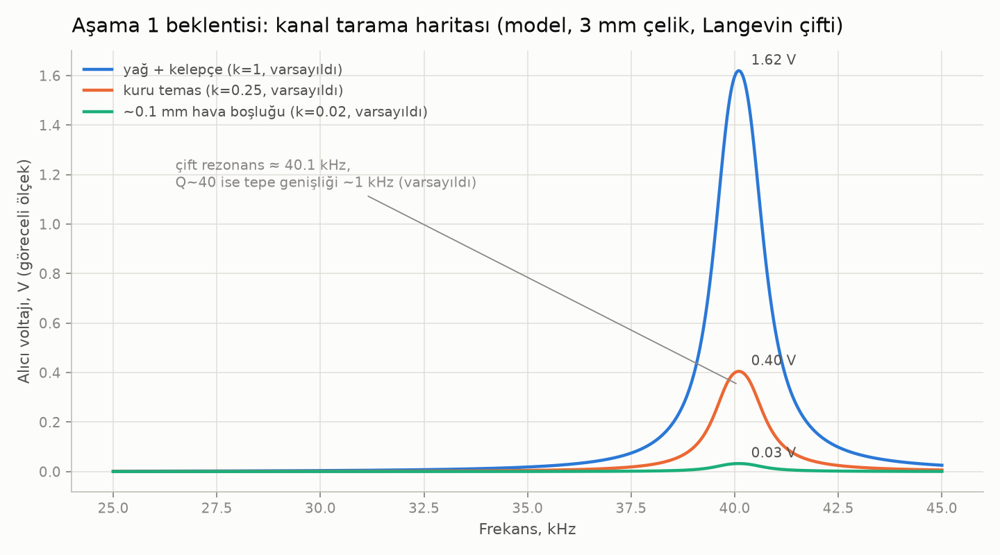
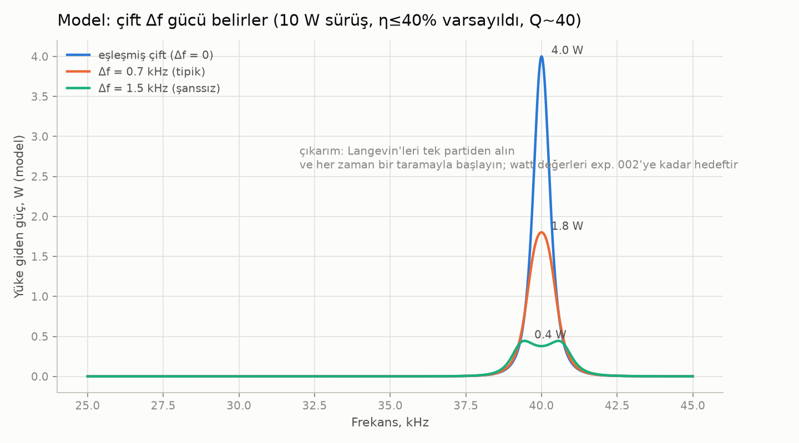
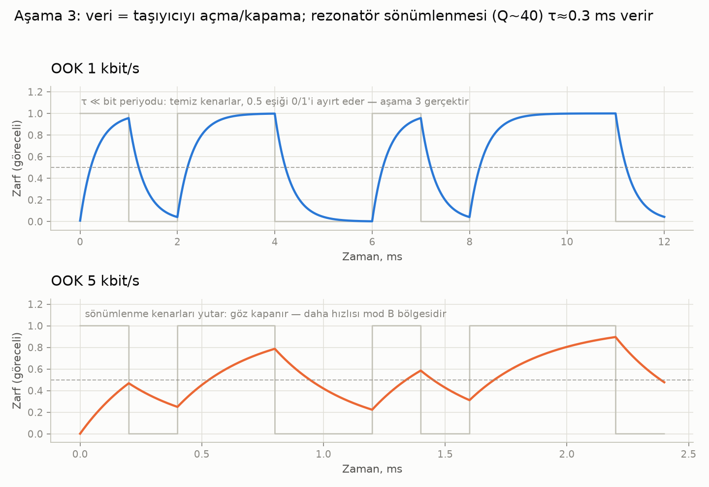
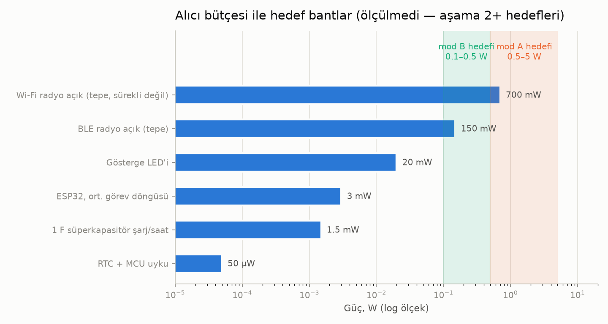
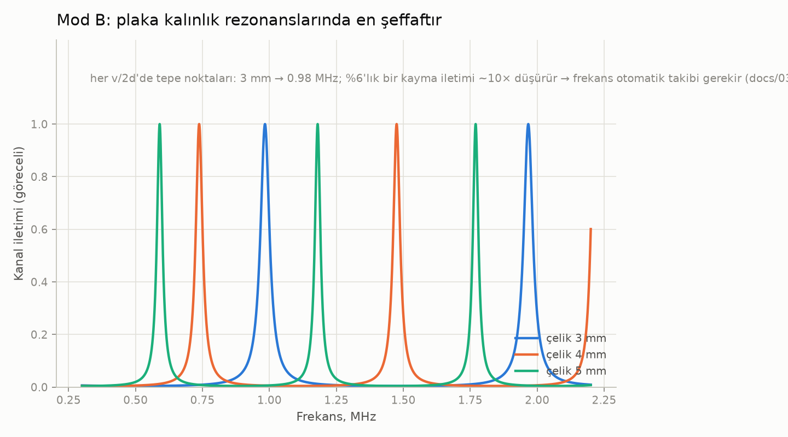

# through-metal-link

> [English (primary)](../../README.md) · [Русский](../ru/README.md) · [Deutsch](../de/README.md) · [Português](../pt/README.md) · [Español](../es/README.md) · [Français](../fr/README.md) · [Italiano](../it/README.md) · [Polski](../pl/README.md) · Türkçe · [Українська](../uk/README.md) · [Tiếng Việt](../vi/README.md) · [中文](../zh/README.md) · [日本語](../ja/README.md) · [한국어](../ko/README.md) · [हिन्दी](../hi/README.md)

Katı metal duvarlar üzerinden ultrasonik güç ve veri aktarımı için açık bir platform — "tek bir delik bile açmadan çelikten geç", garaj seviyesinde araçlarla geliştirildi.

**Hemen deneyin (donanım gerekmez):** `python3 software/sweep-map/sweep_map.py --mock`

**Durum:** aşama 0 — hazırlık · 💰 **[İlk bağımsız yapı için 250$ ödül](https://github.com/zeloras/through-metal-link/issues)** · alışveriş listesi: [QUICKSTART.md](QUICKSTART.md)

[](https://github.com/zeloras/through-metal-link/actions/workflows/ci.yml) [](https://github.com/zeloras/through-metal-link/actions/workflows/reuse.yml) [](CONTRIBUTING.md) [](LICENSES.md)

Belgeler çok dillidir: İngilizce önceliklidir ve standart yollarda bulunur; diğer tüm diller [translations/](..) altında ağacı yansıtır. Herhangi bir dili düzenleyin — CI geri kalanını çevirir ve işler (bkz. [CONTRIBUTING.md](CONTRIBUTING.md)).

<p align="center"></p>

## Fikir tek paragrafta

Radyo dalgaları metalden geçmez (Faraday kafesi), ve bir kablo geçişi delik, sızdırmazlık ve bir hata noktası demektir. Ultrason ise metalden gayet iyi geçer: duvarın iki tarafına yerleştirilen piezo elemanlar, onu güç ve veri için bir kanala dönüştürür. Laboratuvar literatürü fiziği ciddi seviyelerde zaten kanıtladı (RPI: 63.5 mm çelikten 50 W + 12 Mbit/s; NASA JPL: 5 mm titanyumdan ~kW'a kadar) — bunlar özel donanımla elde edilmiş varlık kanıtlarıdır, bu repodaki garaj BOM'u değil. Temel patentlerin süresi doldu, ve henüz açık, tekrar üretilebilir bir platform yok — bu repository bir tane inşa ediyor, aşama 2 ölçüldüğünde **3–5 mm çelikten watt sınıfı güç ve kbit/s veri** ile başlıyor.

## Yol Haritası

| Aşama | Çıktı | Başarı kriteri | Beklenti |
|---|---|---|---|
| 1. Tarama haritası | "Langevin–3 mm çelik–Langevin" kanalının frekans tepkisi | rezonans çifti bulundu, grafik [experiments/001](experiments/001-sweep-map-3mm-steel/README.md) içinde | [sim1](docs/img/sim1-sweep-contacts.png), [sim2](docs/img/sim2-pair-mismatch.png) |
| 2. Watt | rezonansta yüke aktarılan güç | 3 mm çelik üzerinden ≥0.5 W, protokol [experiments/002](experiments/002-watts-3mm-steel/README.md) içinde | [sim4](docs/img/sim4-power-budget.png) |
| 3. Veri | aynı çift üzerinden FSK/OOK | ≥1 kbit/s hatasız | [sim5](docs/img/sim5-ook-datarate.png) |
| 4. Düğüm | kaynakla kapatılmış kutu içinde ESP32 + sensör, yalnızca sesle güçlendirilen ve telemetri verilen | ≥1 sa otonom çalışma | [sim4](docs/img/sim4-power-budget.png) |
| 5. Yayın | repo herkese açık hale gelir, makale/nasıl yapılır | üçüncü bir taraf tarafından çoğaltma | — |

## Depo haritası

python3 software/sweep-map/sweep_map.py --mock
```

**Ne zaman biter (aşamaya göre):** aşama 1 — tarama tepe noktası iki çalıştırma arasında <200 Hz toleransla tekrarlanır ([experiments/001](experiments/001-sweep-map-3mm-steel/README.md)); aşama 2 — 3 mm çelikten bilinen bir yüke ≥0.5 W ve RX tarafından yanan bir LED ([experiments/002](experiments/002-watts-3mm-steel/README.md)).

</details>

<details>
<summary><b>📚 Bir dakikada teori</b> — <a href="docs/00-theory.md">docs/00-theory.md</a></summary>

Piezo TX duvara bastırılır ve içine bir boyuna dalga sürer; diğer taraftaki piezo RX bunu tekrar elektriğe çevirir. Çelikteki ses hızı: ~5900 m/s.

İki çalışma modu:

| Mod | Frekans | Rezonans belirleyen | Verim | Durum |
|---|---|---|---|---|
| **A** — Langevin transdüserler | 40 kHz | transdüser çifti (duvar ≪ λ — bir "zar") | watt, kbit/s | başlangıç modu (aşama 1–4, [ADR-0001](docs/decisions/0001-frequency-mode-choice.md)) |
| **B** — diskler | 0.6–1 MHz | duvarın kalınlık rezonansı ([tarak](docs/img/sim3-thickness-comb.png)) | yüzlerce mW, yüzlerce kbit/s | ilk watt'lardan sonraki dal; otomatik frekans takibi gerektirir |

Ana kayıplar: çift içindeki rezonans uyumsuzluğu (ucuz Langevin transdüserler için ±1 kHz), akustik temas kalitesi (epoksi > gres kuplan + kelepçe > kuru basınç), hizasızlık, sıcaklıkla rezonans kayması. Tümünün cevabı aynıdır: **düzenekteki her değişiklikten önce bir tarama haritası**.

</details>

<details>
<summary><b>📈 Düzenek göstermesi gerekenler: simülatörden beklenti grafikleri</b> — <a href="software/simulator/channel_sim.py">software/simulator/channel_sim.py</a></summary>

Yarı-ampirik bir kanal modeli (FEM değil, **laboratuvar verisi değil** — "taramanın nasıl görünmesi gerektiği ve neye nişan alınması gerektiği" konusunda sezgi). Varsayımlar `channel_sim.py` içinde açıktır (yüklenmiş Q≈40, temas k-faktörleri, zincir η≤40%). Şununla yeniden oluşturun: `python3 channel_sim.py --out ../../docs/img`.

**Aşama 1 — tarama.** ~40 kHz yakınında dar bir tepe noktası; modelin yer tutucu temas çarpanları gres:kuru:boşluk = 1 : 0.25 : 0.02'dir (yani gres ≈4× kuru ve ≈50× hava boşluğu). Tepe noktası olmaması, temas veya çiftle ilgili bir sorun demektir:



**Neden 2 değil de 4 Langevin transdüser.** Q≈40 altında, çift içindeki 1.5 kHz'lik bir rezonans uyumsuzluğu model gücünü ~10× düşürür:



**Aşama 3 — veri.** OOK, rezonatör çınlamasına takılır (model Q~40 → τ≈0.3 ms): 1 kbit/s temizdir, 5 kbit/s'de göz kapalıdır. Daha hızlı gitmek B modunu gerektirir:



**Alıcı güç bütçesi.** Gölgeli bantlar **hedeflerdir** (aşama 2 başarırsa A modu 0.5–5 W; B modu daha düşük). Gerçekçi ilk yükler görev döngülü ESP32 / BLE / LED'dir; Wi-Fi sürekli bir vaat olarak değil, tepe çekim işaretçisi olarak gösterilir:



**Daha sonra için (B modu).** Plaka, kalınlık rezonanslarından oluşan bir tarakta şeffaflaşır — frekansın takip edilmesi gerekir:



</details>

<details>
<summary><b>⚠️ Güvenlik — ilk güç vermeden önce okuyun</b> — <a href="docs/02-safety.md">docs/02-safety.md</a></summary>

1. Aşama 2 sürücüsü çalışır duruma geldiğinde **piezo üzerinde onlarca ila yüzlerce volt** — alıcı taraftaki TVS, ilk güçlendirilmiş çalıştırmadan ÖNCE takılır; kablolarına ellerinizi uzatmayın.
2. **Şebeke** — yalnızca bir masaüstü güç kaynağı / izolasyon üzerinden; ultrasonik temizleyici sürücü kartları şebekeye galvanik olarak bağlıdır.
3. **Kulaklar** — önemli bir güçte, transdüserleri metale bastırılmış halde çalıştırın; asla muhafazasız yüksek güçlü hava kaynaklı ultrason çalıştırmayın.
4. **Isı** — kelepçelenmemiş bir Langevin transdüser güçte dakikalar içinde aşırı ısınır; akımı artırmadan önce kelepçelemeyi unutmayın (yalnızca kısa süreli düşük akımlı elektriksel devreye alma — sürücü README'sine bakın).
5. **Kıymikler** — piezoseramik kırılgandır: aşırı sıkılmış bir cıvata veya bir darbe kıymikler demektir; herhangi bir mekanik çalışma için güvenlik gözlüğü takın.

</details>

docs/            teori, öncül teknikler, güvenlik, uygulamalar, karar günlüğü (ADR)
docs/img/        beklenti grafikleri (software/simulator/channel_sim.py tarafından üretilir)
hardware/        BOM, sürücü (half-bridge), alıcı (doğrultucu/hasatçı)
firmware/        düğüm yazılımı (ESP32 — 4. aşamaya kadar stub)
software/        ölçüm betikleri (frekans-tepisi tarama haritası) ve kanal simülatörü
experiments/     deney protokolleri — şablondan, bir dizin = bir deney
data/            ham kayıtlar (büyük dosyalar git'te tutulmaz)
```

</details>

## İlkeler

1. **Sıfırdan tekrar üretilebilirlik.** Havyası ve ~210$'ı olan herkes, yalnızca bu repodan yola çıkarak sonucu tekrar üretebilir.
2. **Her deney bir protokoldür.** "Yaklaşık olarak çalıştı" yoktur: [experiments/TEMPLATE.md](experiments/TEMPLATE.md) zorunludur.
3. **Patent hijyeni.** Süresi dolmuş katmanın üzerine inşa ediyoruz ([docs/01-prior-art.md](docs/01-prior-art.md)); kararlar [docs/decisions/](docs/decisions/0001-frequency-mode-choice.md) içinde kayıt altına alınır.
4. **Önce ölçüm, sonra görüş.** Kanal hakkında herhangi bir sonuca varmadan önce bir tarama haritası.

## Lisanslar ve patentler

Kod — Apache-2.0, donanım — CERN-OHL-W v2, dokümantasyon — CC-BY-4.0; tam metinler [LICENSES/](../../LICENSES) içinde. Herkes bunu çatallayıp üzerine inşa edebilir, ticari kullanım dahil; patent koruması lisanslardaki yetki ve misilleme maddelerinin yanı sıra bir önceki sanat stratejisinden gelir. Tam plan ve savunmacı yayınlama protokolü: [LICENSES.md](LICENSES.md); katkı kuralları: [CONTRIBUTING.md](CONTRIBUTING.md).
