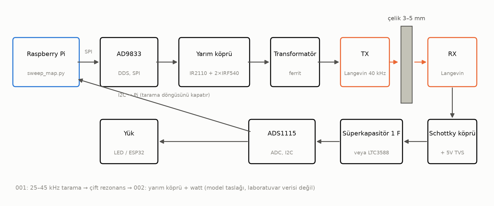
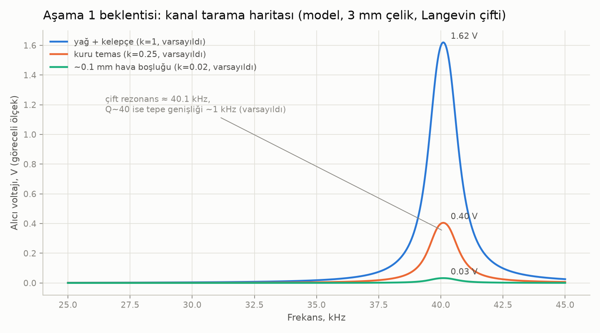
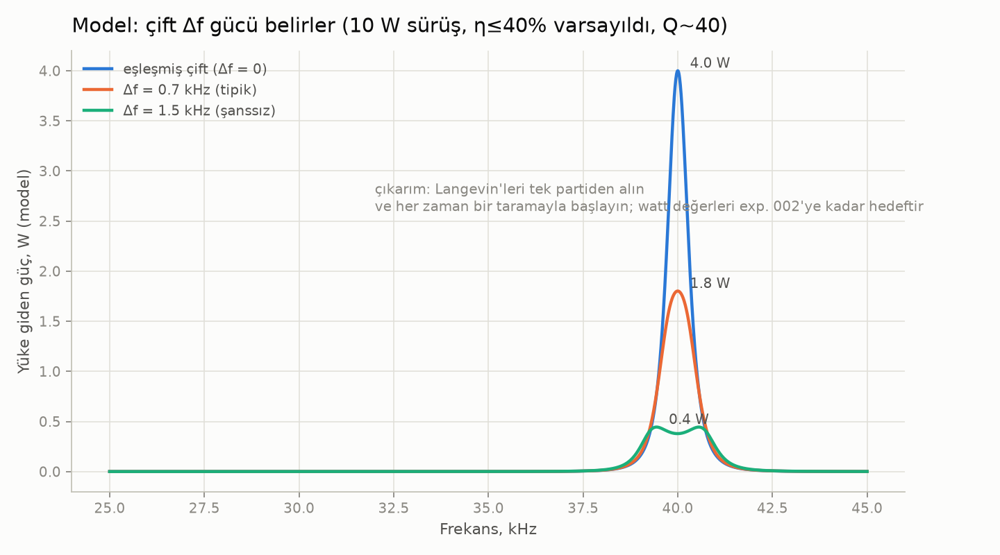
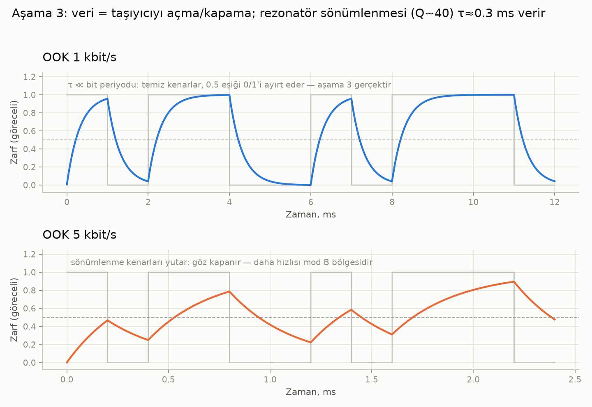
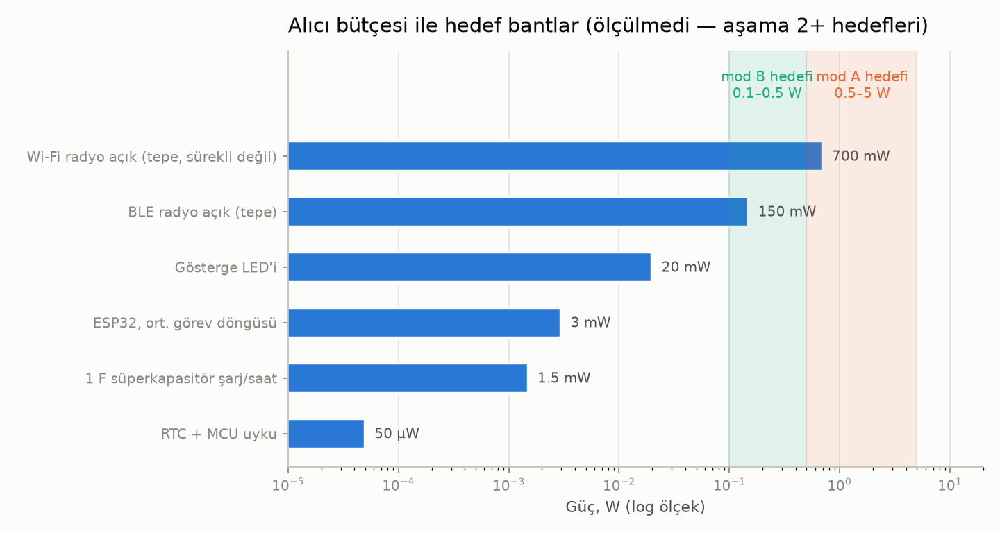
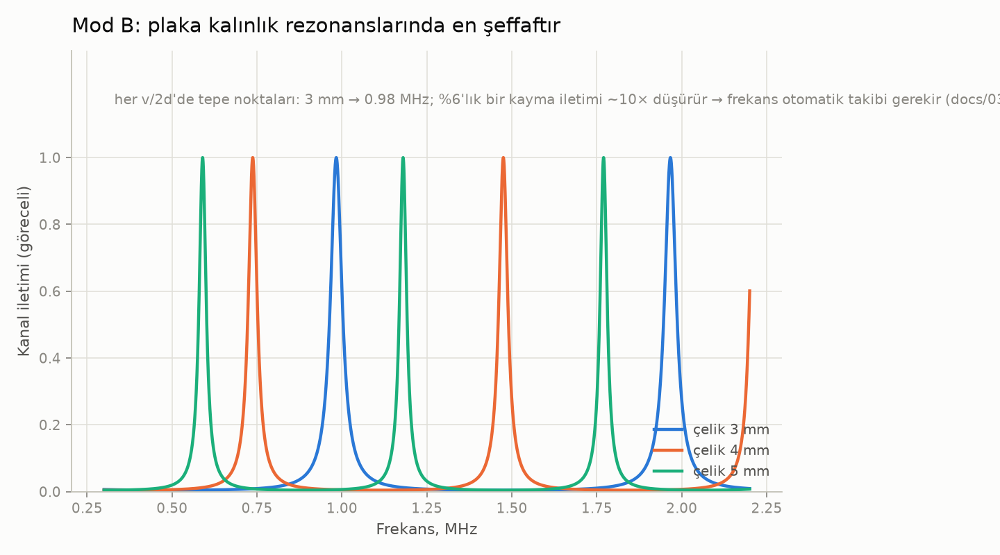

# through-metal-link

> [English (primary)](../../README.md) · [Русский](../ru/README.md) · [Deutsch](../de/README.md) · [Português](../pt/README.md) · [Español](../es/README.md) · [Français](../fr/README.md) · [Italiano](../it/README.md) · [Polski](../pl/README.md) · Türkçe · [Українська](../uk/README.md) · [Tiếng Việt](../vi/README.md) · [中文](../zh/README.md) · [日本語](../ja/README.md) · [한국어](../ko/README.md) · [हिन्दी](../hi/README.md)

Katı metal duvarlardan ultrasonik güç ve veri aktarımı için açık bir platform — "tek bir delik bile açmadan çelikten geçen", garaj düzeyinde araçlarla inşa edilmiştir.

**Hemen deneyin (donanım gerekmez):** `python3 software/sweep-map/sweep_map.py --mock`

**İzlenecek yollar:**
- **A — kuru çalıştırma:** sahte tarama + [simülatör](../../software/simulator/channel_sim.py) (tezgâh yok)
- **B — aşama 1 inşası:** [QUICKSTART.md](QUICKSTART.md) → [experiments/001](experiments/001-sweep-map-3mm-steel/README.md)
- **C — donanımsız katkı:** önceki teknikler / belgeler / çeviriler / ADR yorumları ([CONTRIBUTING.md](CONTRIBUTING.md))

**Durum:** aşama 0 — hazırlık · **henüz donanım doğrulaması yok** (yalnızca simülatör; ilk inşa için ödül) · 💰 **[$250 ödül](https://github.com/zeloras/through-metal-link/issues/5)** · alışveriş listesi: [QUICKSTART.md](QUICKSTART.md)

[](https://github.com/zeloras/through-metal-link/actions/workflows/ci.yml) [](https://github.com/zeloras/through-metal-link/actions/workflows/reuse.yml) [](CONTRIBUTING.md) [](LICENSES.md)

Belgeler çok dillidir: İngilizce birincildir ve kanonik yollarda bulunur; diğer her dil ağacı [translations/](..) altında yansıtır. Herhangi bir dili düzenleyin — CI geri kalanını çevirir ve işler ([CONTRIBUTING.md](CONTRIBUTING.md)'ye bakın).



## Fikir tek paragrafta

Radyo dalgaları metalden geçmez (Faraday kafesi) ve bir kablo geçişi bir delik, bir sızdırmazlık ve bir arıza noktası demektir. Öte yandan ultrason, metalden gayet iyi geçer: duvarın iki tarafında birer piezo eleman, onu güç ve veri için bir kanala dönüştürür. Laboratuvar literatürü fiziği ciddi seviyelerde zaten kanıtladı (RPI: 63.5 mm çelikten 50 W + 12 Mbit/s; NASA JPL: 5 mm titanyumdan ~kW'a kadar) — bunlar özel donanımla varlık kanıtlarıdır, bu deponun garaj BOM'u değildir. Temel patentlerin süresi doldu ve henüz açık, tekrarlanabilir bir platform yok — bu depo bir tane inşa ediyor, aşama 2 ölçüldüğünde **3–5 mm çelikten watt sınıfı güç ve kbit/s veri** ile başlıyor.

## Yol haritası

| Aşama | Teslimat | Başarı ölçütü | Beklenti |
|---|---|---|---|
| 1. Tarama haritası | "Langevin–3 mm çelik–Langevin" kanalının frekans tepkisi | rezonans çifti bulundu, grafik [experiments/001](experiments/001-sweep-map-3mm-steel/README.md) içinde | [sim1](docs/img/sim1-sweep-contacts.png), [sim2](docs/img/sim2-pair-mismatch.png) |
| 2. Watt | rezonansta yüke giden güç | 3 mm çelikten ≥0.5 W, protokol [experiments/002](experiments/002-watts-3mm-steel/README.md) içinde | [sim4](docs/img/sim4-power-budget.png) |
| 3. Veri | aynı çift üzerinden FSK/OOK | ≥1 kbit/s hatasız | [sim5](docs/img/sim5-ook-datarate.png) |
| 4. Düğüm | kaynakla kapatılmış kutuda ESP32 + sensör, yalnızca sesle güçlendirilmiş ve telemetri yapılan | ≥1 sa otonom çalışma | [sim4](docs/img/sim4-power-budget.png) |
| 5. Yayın | ilk bağımsız replikasyon + makale/nasıl-yapılır + Zenodo anlık görüntüsü | üçüncü taraf tekrarı belgelendi | — |

## Depo haritası

Aşağıdaki her blok, çalışmaya yeterli bir özet ve tam belgeye bir bağlantı içerir.

### 🛒 Sıfırdan çalışan bir düzeneğe: ne alınacak ve hangi sırayla — [QUICKSTART.md](QUICKSTART.md)

**Bütçe:** ~$210 asgari, ~$300 rahat (bir Pi'niz, havyanız ve bir tezgâh güç kaynağınız varsa ~$120 düşürün). Üç sepet: aletler (~$120), düzenek elektroniği (~$70, [tam BOM](hardware/bom/bom-stage1.csv)), mekanik (~$20). İsteğe bağlı ama güçlükle tavsiye edilir: bir USB osiloskop (~$60–80).

**Kritik yol — AliExpress kargo (3–4 hafta):** elektronikleri ilk gün sipariş edin. Önemli karar: **aynı partiden 4 Langevin transdüser** alın — tarama en iyi çifti seçecek ([neden](docs/img/sim2-pair-mismatch.png)).

**Kargo gelirken:** donanım olmadan boru hattını kuru çalıştırın —

```bash
python3 software/sweep-map/sweep_map.py --mock
```

**Aşamaya göre bittiğinde:** aşama 1 — tarama tepe noktası iki çalıştırmada <200 Hz içinde tekrarlanır ([experiments/001](experiments/001-sweep-map-3mm-steel/README.md)); aşama 2 — 3 mm çelikten bilinen bir yüke ≥0.5 W ve RX tarafından yanan bir LED ([experiments/002](experiments/002-watts-3mm-steel/README.md)).

### 📚 Bir dakikada teori — [docs/00-theory.md](docs/00-theory.md)

Piezo TX duvara bastırılır ve içine bir boyuna dalga sürer; diğer taraftaki piezo RX onu tekrar elektriğe dönüştürür. Çelikte ses hızı: ~5900 m/s.

İki çalışma modu:

| Mod | Frekans | Rezonans kaynağı | Verim | Durum |
|---|---|---|---|---|
| **A** — Langevin transdüserler | 40 kHz | transdüser çifti (duvar ≪ λ — bir "zar") | watt, kbit/s | başlangıç modu (aşamalar 1–4, [ADR-0001](docs/decisions/0001-frequency-mode-choice.md)) |
| **B** — diskler | 0.6–1 MHz | duvarın kalınlık rezonansı ([tarak](docs/img/sim3-thickness-comb.png)) | yüzlerce mW, yüzlerce kbit/s | ilk watt'lardan sonra dal; otomatik frekans izleme gerektirir |

Ana kayıplar: çift içindeki rezonans uyumsuzluğu (ucuz Langevin transdüserler için ±1 kHz), akustik temas kalitesi (epoksi > gres kuple + kelepçe > kuru basınç), hizalama hatası, sıcaklıkla rezonans kayması. Hepsinin cevabı aynı: **kurulumdaki her değişiklikten önce bir tarama haritası**.

### 📈 Düzeneğin göstermesi gerekenler: simülatörden beklenti grafikleri — [software/simulator/channel_sim.py](../../software/simulator/channel_sim.py)

Yarı-ampirik bir kanal modeli (FEM değil, **laboratuvar verisi değil** — "taramanın nasıl görünmesi gerektiği ve neye nişan alınması gerektiği" hakkında sezgi). Varsayımlar `channel_sim.py` içinde açıktır (yüksek Q≈40, temas k-faktörleri, zincir η≤40%). Yeniden üretmek için: `python3 channel_sim.py --out ../../docs/img`.

**Aşama 1 — tarama.** ~40 kHz yakınında dar bir tepe; modelin yer tutucu temas çarpanları gres:kuru:boşluk = 1 : 0.25 : 0.02 (yani gres ≈4× kuru ve ≈50× hava boşluğu). Tepe yoksa temas veya çift ile ilgili bir sorun var:



**Neden 4 Langevin transdüser, 2 değil.** Q≈40 altında, çift içinde 1.5 kHz rezonans uyumsuzluğu model gücünü ~10× düşürür:



**Aşama 3 — veri.** OOK rezonatör zangıllamasına takılır (model Q~40 → τ≈0.3 ms): 1 kbit/s temiz, 5 kbit/s'de göz kapalı. Daha hızlı gitmek mod B gerektirir:



**Alıcı güç bütçesi.** Gölgeli bantlar **hedeflerdir** (mod A 0.5–5 W eğer aşama 2 gerçekleşirse; mod B daha düşük). Gerçekçi ilk yükler görev-döngülü ESP32 / BLE / LED; Wi-Fi bir tepe-tüketim işareti olarak gösterilir, sürekli bir vaat değil:



**Sonra için (mod B).** Plaka bir kalınlık rezonans tarağında şeffaflaşır — frekansın izlenmesi gerekir:



### ⚠️ Güvenlik — ilk güç verilmeden önce okuyun — [docs/02-safety.md](docs/02-safety.md)

1. **Piezo üzerinde onlarca ila yüzlerce volt** — aşama 2 sürücüsü devreye girdiğinde; alıcı tarafındaki TVS ilk güçlü çalıştırmadan ÖNCE takılır; uçlardan ellerinizi uzak tutun.
2. **Şebeke** — yalnızca bir tezgâh güç kaynağı / izolasyon üzerinden; ultrasonik-temizleyici sürücü kartları şebekeye galvanik olarak bağlıdır.
3. **Kulaklar** — önemli güç seviyesinde transdüserleri metale bastırılmış halde çalıştırın; yüksek güçlü havada ultrasonu hiçbir zaman muhafazasız çalıştırmayın.
4. **Isı** — kelepçelenmemiş bir Langevin transdüser güçte dakikalar içinde aşırı ısınır; akımı artırmadan önce kelepçeleyin (yalnızca kısa düşük-akımlı elektriksel devreye alma — sürücü README'sine bakın).
5. **Kıymıklar** — piezoseramik kırılgandır: aşırı sıkılmış bir cıvata veya bir darbe kıymık demektir; herhangi bir mekanik iş için güvenlik gözlüğü takın.

İlk sürücü güç verme: tezgâh gücü akım limiti 0.2 A; tam sıra [hardware/driver/](hardware/driver/README.md) ve [docs/02-safety.md](docs/02-safety.md) içinde.

### 🧭 Önceki teknikler ve patent hijyeni — [docs/01-prior-art.md](docs/01-prior-art.md)

Her teknik karar bir "özgür" kaynağa (süresi dolmuş patentler, makaleler) dayanmalıdır. Temel: **US5982297** (Aerospace Corp — duvar-içi piezo çifti için temel reçete), **US7902943** (Caltech/JPL — Sherrit's feed-through), **US9361877** (Oklahoma Üniv. — tam bir alıcı-verici sistemi); hepsi ölü. Önemli makaleler: Lawry 2013 (63.5 mm çelikten 50 W + 12.4 Mbit/s), Sherrit/NASA (100 W lamba), Yang 2015 (derleme).

Hâlâ yaşarken kopyalanmaması gerekenler: RPI'nin OFDM tahsisi ve tam-dubleks şeması ve Drexel'in uyumlu transdüserleri (US, ~2032–2033'e kadar — aşamalar 1–4 hiçbirini gerektirmez), artıca 2026-08 aramasının eklediği aileler: **US8594572B1** (US Donanması — çıplak güç kanalının kendisini kapsar; US, 2032'ye kadar; Welle 1997 önceki-teknik cevaptır), **EP3723304B1** (ABB — veri spektrumu *altındaki* güç spektrumu; DE/GB, 2039'a kadar; planlanan aynı-taşıyıcı yük-modülasyonu uplink bunun dışında kalır), **Ultrapower** (içbükey/dışbükey dizili boru-içi sensör veya duvardan geçen bir çubuk; US, 2035'e kadar — biz düz pedler kullanıyoruz ve çubuk yok). İddia okumaları, durumlar ve tasarım etrafından dolanmalar: [docs/01-prior-art.md](docs/01-prior-art.md).

Mimari kararlar [docs/decisions/](docs/decisions/0001-frequency-mode-choice.md) içinde kaydedilir (ADR).

### 🔌 Donanım ve ürün yazılımı — hardware/, firmware/

- [hardware/bom/bom-stage1.csv](hardware/bom/bom-stage1.csv) — aşama 1 alışveriş listesi.
- [hardware/schematics/](hardware/schematics/README.md) — **devre şemaları** (koddan üretilir): sürücü, alıcı, Pi pin çıkışı, hasat düğümü.
- [hardware/driver/](hardware/driver/README.md) — TX sürücüsü: IR2110 half-bridge + 2×IRF540, eşleştirme transformatörü (Langevin transdüser kapasitif bir yüktür!). KiCad kartı, breadboard prototipi doğrulandıktan sonra gelir.
- [hardware/receiver/](hardware/receiver/README.md) — alıcı, aşama aşama: Schottky köprü → ADC (aşama 1) → yük (aşama 2) → LTC3588 + süperkapasitör + ESP32 (aşama 4).
- [firmware/node-esp32/](firmware/node-esp32/README.md) — aşama 4 düğümü (taslak): derin uyku, sensör okuması, BLE reklam, ortalama 1–5 mW bütçe.

### 💻 Yazılım: ölçümler ve simülatör — software/

- [software/sweep-map/sweep_map.py](../../software/sweep-map/sweep_map.py) — aşama 1 iş atı: DDS tarama → ADC okumaları → CSV + frekans-tekisi grafiği. Donanımsız çalıştırma için `--mock` var. Pi üzerinde: `raspi-config` → SPI ve I2C etkinleştir; `pip install spidev smbus2 matplotlib`.
- [software/simulator/channel_sim.py](../../software/simulator/channel_sim.py) — beklenti grafiklerinin üreteci (`pip install numpy matplotlib`).
- [software/simulator/material_map.py](../../software/simulator/material_map.py) — aynı kanal modeli duvar malzemeleri arasında — titanyum, alüminyum, cam, seramik, plastik, beton; çalışma ve kararlar: [docs/06-materials.md](docs/06-materials.md).
- [data/](data/README.md) — ham günlükler; CSV/PNG git dışında kalır, yalnızca seçilmiş grafikler deney dizini içinde git'e girer.

### 🗺️ Nerede uygulanır: bariyerler, kanallar, nişler — [docs/04-hybrid-channels.md](docs/04-hybrid-channels.md), [docs/05](docs/05-applications-map.md)

Evrensel bir kanal yoktur — platform fiziği bariyere eşler: piezo-akustik (birincil: temaslı çelik/alüminyum — watt ve kbit/s), EMAT (kirli/sıcak metal, temas yok — veri), düşük frekans manyetik (dewar vakum sandviç duvarları — bit/s). Dürüst çıkmaz sokaklar: kauçuk kaplı/kompozit duvarlar, yolda kabarcıklanan sıvı.

Niş önceliği: **(1)** laboratuvar vakum odaları ve kriyostatlar — açık-kaynak-donanım kitlesi, sertifika yok; **(2)** fermantasyon tankları — yürüme mesafesinde bir kanıtlama alanı; **(3)** sızdırmaz batarya paketleri — amiral gemisi durum (paket içine bir geçiş olmadan termal-kaçak tespiti). Alıcı keşfi ve otomatik-ayarlama protokolü (bir Qi analoğu): [docs/03-discovery-protocol.md](docs/03-discovery-protocol.md).

### 📁 Dizin yapısı

```
docs/            teori, önceki teknikler, güvenlik, uygulamalar, karar günlüğü (ADR)
docs/img/        beklenti grafikleri (software/simulator/channel_sim.py tarafından üretilir)
hardware/        BOM, sürücü (half-bridge), alıcı (doğrultucu/hasat edici)
firmware/        düğüm ürün yazılımı (ESP32 — aşama 4'e kadar taslak)
software/        ölçüm betikleri (frekans-tekisi tarama haritası) ve kanal simülatörü
experiments/     deney protokolleri — şablondan, bir dizin = bir deney
data/            ham günlükler (büyük dosyalar git dışında kalır)
```

## İlkeler

1. **Sıfırdan tekrarlanabilirlik.** Havyası ve ~$210'u olan herkes sonucu yalnızca bu depodan tekrarlayabilir.
2. **Her deney bir protokoldür.** "Biraz çalıştı" yok: [experiments/TEMPLATE.md](experiments/TEMPLATE.md) zorunludur.
3. **Patent hijyeni.** Süresi dolmuş katman üzerine inşa ediyoruz ([docs/01-prior-art.md](docs/01-prior-art.md)); kararlar [docs/decisions/](docs/decisions/0001-frequency-mode-choice.md) içinde kaydedilir.
4. **Önce ölçüm, sonra görüş.** Kanal hakkında herhangi bir sonuçtan önce bir tarama haritası.

## Lisanslar ve patentler

Kod — Apache-2.0, donanım — CERN-OHL-W v2, belgeler — CC-BY-4.0; tam metinler [LICENSES/](../../LICENSES) içinde. Herkes bunu çatallayıp üzerine inşa edebilir, ticari dahil; patent koruması lisanslardaki hibe ve misilleme maddelerinden artı bir önceki-teknik stratejisinden gelir. Tam şema ve savunmacı-yayın protokolü: [LICENSES.md](LICENSES.md); katkı kuralları: [CONTRIBUTING.md](CONTRIBUTING.md).
