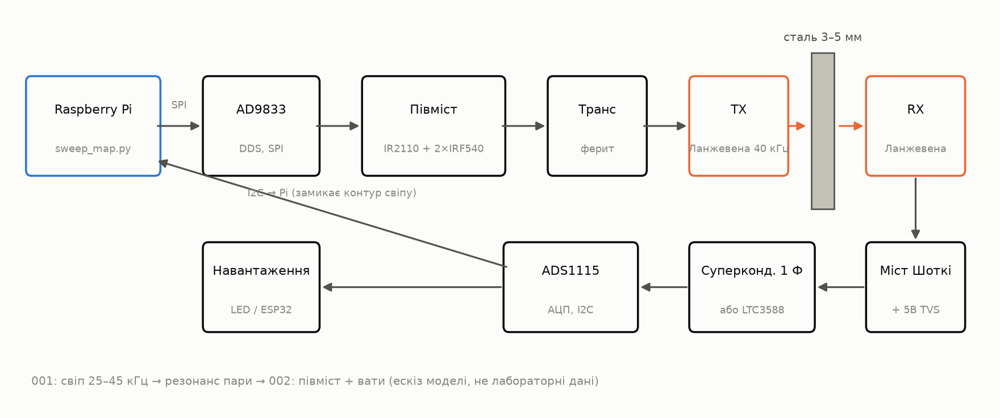
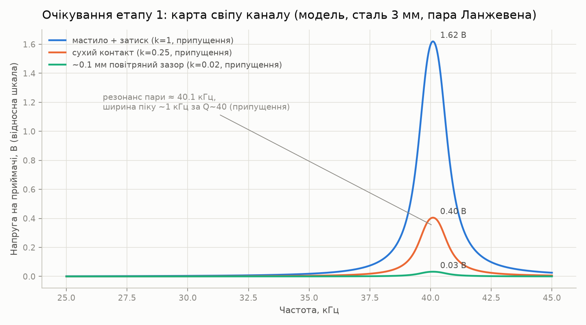
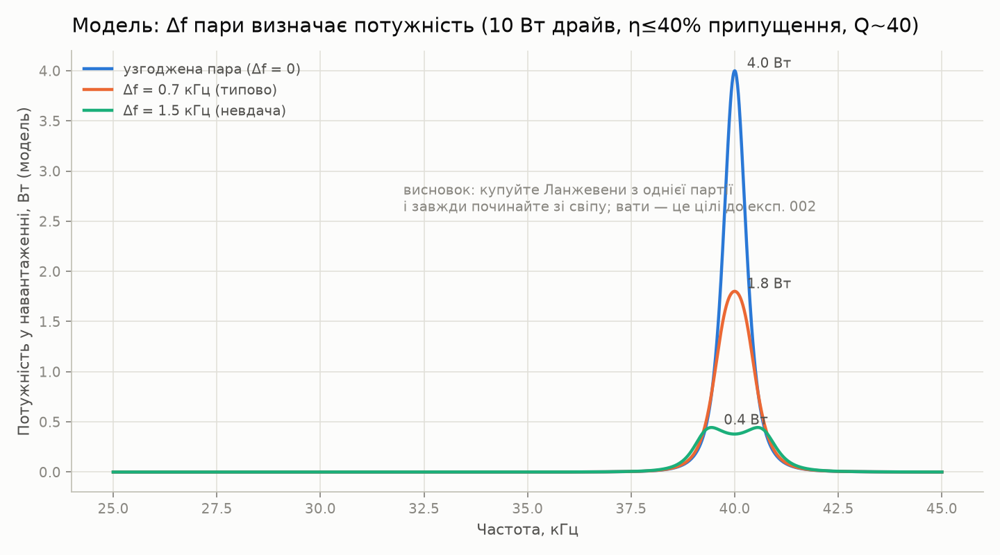
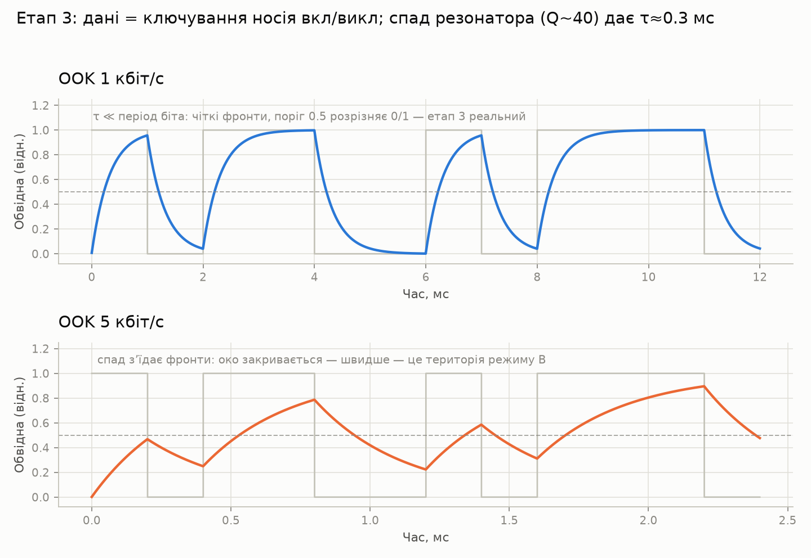
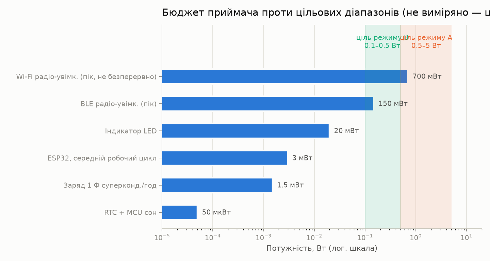
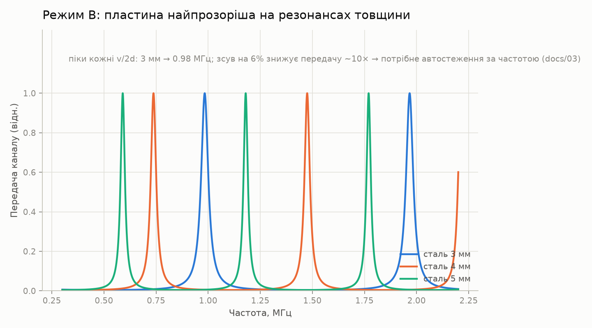

# через-метал-посилання

> [English (primary)](../../README.md) · [Русский](../ru/README.md) · [Deutsch](../de/README.md) · [Português](../pt/README.md) · [Español](../es/README.md) · [Français](../fr/README.md) · [Italiano](../it/README.md) · [Polski](../pl/README.md) · [Türkçe](../tr/README.md) · Українська · [Tiếng Việt](../vi/README.md) · [中文](../zh/README.md) · [日本語](../ja/README.md) · [한국어](../ko/README.md) · [हिन्दी](../hi/README.md)

Відкрита платформа для ультразвукового передавання енергії та даних крізь суцільнометалеві стінки — «крізь сталь без жодного отвору», створена гаражними засобами.

**Спробуйте зараз (без заліза):** `python3 software/sweep-map/sweep_map.py --mock`

**Статус:** етап 0 — підготовка · 💰 **[нагорода $250 за першу незалежну збірку](https://github.com/zeloras/through-metal-link/issues)** · список покупок: [QUICKSTART.md](QUICKSTART.md)

[](https://github.com/zeloras/through-metal-link/actions/workflows/ci.yml) [](https://github.com/zeloras/through-metal-link/actions/workflows/reuse.yml) [](CONTRIBUTING.md) [](LICENSES.md)

Документація багатомовна: англійська є основною і знаходиться за канонічними шляхами; кожна інша мова віддзеркалює дерево в [translations/](..). Редагуйте будь-яку мову — CI перекладає і фіксує решту (див. [CONTRIBUTING.md](CONTRIBUTING.md)).

<p align="center"></p>

## Ідея в одному абзаці

Радіохвилі не проходять крізь метал (клітка Фарадея), а кабельна проходка означає отвір, герметизацію та точку відмови. Ультразвук, натомість, чудово поширюється крізь метал: п'єзоелемент з кожного боку стінки перетворює її на канал для живлення та даних. Лабораторна література вже довела фізику на серйозних рівнях (RPI: 50 Вт + 12 Мбіт/с крізь 63,5 мм сталі; NASA JPL: до ~кВт крізь 5 мм титану) — це докази реалізованості на спеціалізованому обладнанні, а не на базі гаражного BOM цього репозиторію. Базові патенти вже втратили чинність, а відкритої відтворюваної платформи досі не існує — цей репозиторій створює таку, починаючи з **потужності на рівні ват та даних на рівні кбіт/с крізь сталь завтовшки 3–5 мм** щойно етап 2 буде виміряно.

## Дорожня карта

| Етап | Результат | Критерій успіху | Очікування |
|---|---|---|---|
| 1. Карта розгортки | частотна характеристика каналу «Ланжевен – 3 мм сталь – Ланжевен» | знайдена парна резонансна частота, графік у [experiments/001](experiments/001-sweep-map-3mm-steel/README.md) | [sim1](docs/img/sim1-sweep-contacts.png), [sim2](docs/img/sim2-pair-mismatch.png) |
| 2. Вати | потужність у навантаженні на резонансі | ≥0,5 Вт через 3 мм сталі, протокол у [experiments/002](experiments/002-watts-3mm-steel/README.md) | [sim4](docs/img/sim4-power-budget.png) |
| 3. Дані | FSK/OOK через ту саму пару | ≥1 кбіт/с без помилок | [sim5](docs/img/sim5-ook-datarate.png) |
| 4. Вузол | ESP32 + датчик у завареній коробці, живлення та телеметрія лише звуком | ≥1 год автономної роботи | [sim4](docs/img/sim4-power-budget.png) |
| 5. Публікація | репозиторій стає публічним, стаття/інструкція | відтворення третьою стороною | — |

## Мапа репозиторію

python3 software/sweep-map/sweep_map.py --mock
```

**Готовно, коли (за стадіями):** стадія 1 — пік свіп-сканування відтворюється між двома прогонами з точністю до <200 Гц ([experiments/001](experiments/001-sweep-map-3mm-steel/README.md)); стадія 2 — ≥0,5 Вт у відому нагрузку через 3 мм сталі й запалений LED зі сторони RX ([experiments/002](experiments/002-watts-3mm-steel/README.md)).

</details>

<details>
<summary><b>📚 Теорія за хвилину</b> — <a href="docs/00-theory.md">docs/00-theory.md</a></summary>

П'єзо TX притиснуто до стінки, і він збуджує в ній поздовжню хвилю; п'єзо RX на іншому боці перетворює її назад на електрику. Швидкість звуку в сталі: ~5900 м/с.

Два режими роботи:

| Режим | Частота | Резонанс задається | Дає | Статус |
|---|---|---|---|---|
| **A** — перетворювачі Ланжевена | 40 кГц | парою перетворювачів (стінка ≪ λ — «мембрана») | вати, кбіт/с | стартовий режим (стадії 1–4, [ADR-0001](docs/decisions/0001-frequency-mode-choice.md)) |
| **B** — диски | 0,6–1 МГц | товщинним резонансом стінки ([гребінка](docs/img/sim3-thickness-comb.png)) | сотні мВт, сотні кбіт/с | гілка після перших ват; потребує автоматичного стеження за частотою |

Основні втрати: розузгодження резонансу в парі (±1 кГц для дешевих перетворювачів Ланжевена), якість акустичного контакту (епоксид > мастило-суміш + затиск > сухий притиск), перекоси, дрейф резонансу з температурою. Відповідь на всі ці проблеми одна: **свіп-карта перед кожною зміною налаштувань**.

</details>

<details>
<summary><b>📈 Що стенд має показати: очікувані графіки з симулятора</b> — <a href="software/simulator/channel_sim.py">software/simulator/channel_sim.py</a></summary>

Напівемпірична модель каналу (не FEM, **не лабораторні дані** — інтуїція для «яким має виглядати свіп і на що цілитися»). Припущення прописані явно у `channel_sim.py` (завантажена Q≈40, коефіцієнти контакту, ККД ланцюга η≤40%). Згенерувати заново: `python3 channel_sim.py --out ../../docs/img`.

**Стадія 1 — свіп.** Вузький пік поблизу ~40 кГц; модельні орієнтовні множники контакту — мастило:сухо:зазор = 1 : 0,25 : 0,02 (тобто мастило ≈4× сухого і ≈50× повітряного зазору). Немає піку — проблема з контактом або парою:



**Чому 4 перетворювачі Ланжевена, а не 2.** За Q≈40 розузгодження резонансу в парі на 1,5 кГц знижує модельну потужність ~у 10 разів:



**Стадія 3 — дані.** OOK натикається на дзвоніння резонатора (модель Q~40 → τ≈0,3 мс): 1 кбіт/с — чисто, на 5 кбіт/с око закрите. Щоб швидше — потрібен режим B:



**Енергетичний бюджет приймача.** Затінені смуги — **цілі** (режим A 0,5–5 Вт, якщо стадія 2 вдасться; режим B нижче). Реалістичні перші навантаження — ESP32 / BLE / LED у режимі з паузами; Wi-Fi показано як маркер пікової потужності, а не як безперервна обіцянка:



**На потім (режим B).** Пластина стає прозорою на гребінці товщинних резонансів — частоту треба відстежувати:



</details>

<details>
<summary><b>⚠️ Безпека — прочитайте перед першим вмиканням</b> — <a href="docs/02-safety.md">docs/02-safety.md</a></summary>

1. **Десятки–сотні вольт на п'єзо**, щойно драйвер стадії 2 під живленням — TVS на боці приймача ставиться ДО першого вмикання; не чіпайте виводи руками.
2. **Мережа** — лише через лабораторний блок живлення / ізоляцію; плати драйверів ультразвукових мийок мають гальванічний зв'язок із мережею.
3. **Вуха** — при значній потужності працюйте з перетворювачами, притиснутими до металу; ніколи не запускайте потужний ультразвук у повітрі без кожуха.
4. **Нагрів** — незатиснутий перетворювач Ланжевена перегрівається за хвилини під потужністю; затисніть перед підвищенням струму (коротке низькострумове електричне налаштування — див. README драйвера).
5. **Уламки** — п'єзокераміка крихка: перетягнутий болт або удар означає уламки; одягайте захисні окуляри для будь-яких механічних робіт.

</details>

docs/            теорія, попередній рівень техніки, безпека, застосування, журнал рішень (ADR)
docs/img/        очікувані графіки (згенеровані software/simulator/channel_sim.py)
hardware/        BOM, драйвер (півміст), приймач (випрямляч/збирач)
firmware/        прошивка вузла (ESP32 — заглушка до етапу 4)
software/        скрипти вимірювань (карта розгортки АЧХ) та симулятор каналу
experiments/     протоколи експериментів — із шаблону, один каталог = один експеримент
data/            необроблені логи (великі файли не потрапляють у git)
```

</details>

## Принципи

1. **Відтворюваність з нуля.** Будь-хто з паяльником і ~$210 може відтворити результат лише за цим репозиторієм.
2. **Кожен експеримент — це протокол.** Ніякого «ніби працювало»: [experiments/TEMPLATE.md](experiments/TEMPLATE.md) є обов'язковим.
3. **Патентна гігієна.** Ми будуємо на основі протермінованого прошарку ([docs/01-prior-art.md](docs/01-prior-art.md)); рішення фіксуються в [docs/decisions/](docs/decisions/0001-frequency-mode-choice.md).
4. **Спочатку вимірювання, потім думки.** Карта свіпу перед будь-якими висновками про канал.

## Ліцензії та патенти

Код — Apache-2.0, апаратне забезпечення — CERN-OHL-W v2, документація — CC-BY-4.0; повні тексти в [LICENSES/](../../LICENSES). Будь-хто може форкнути та розвивати цей проєкт, зокрема в комерційних цілях; патентний захист забезпечується наданням прав та положеннями про реталіацію в ліцензіях, а також стратегією попереднього рівня техніки. Повна схема та протокол оборонної публікації: [LICENSES.md](LICENSES.md); правила внеску: [CONTRIBUTING.md](CONTRIBUTING.md).
