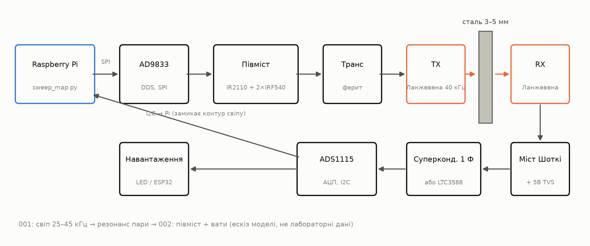
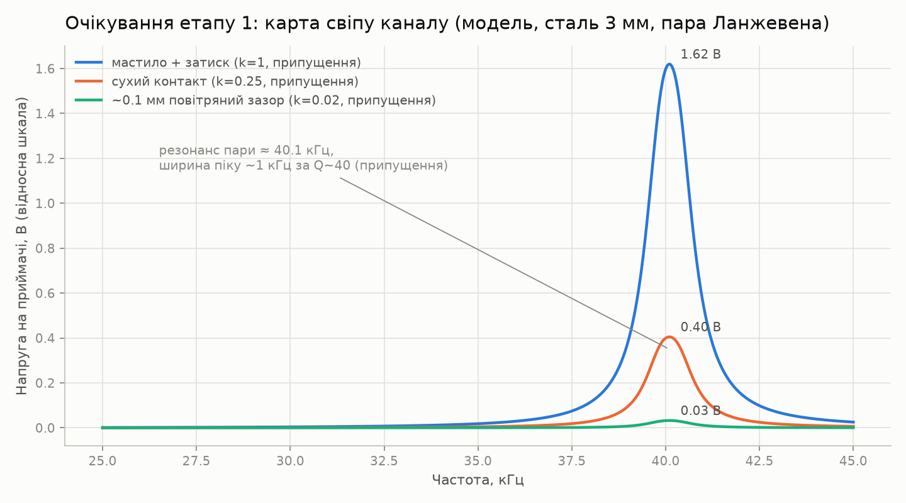
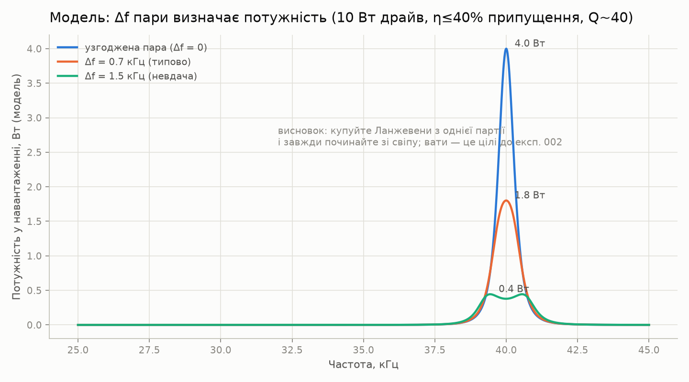
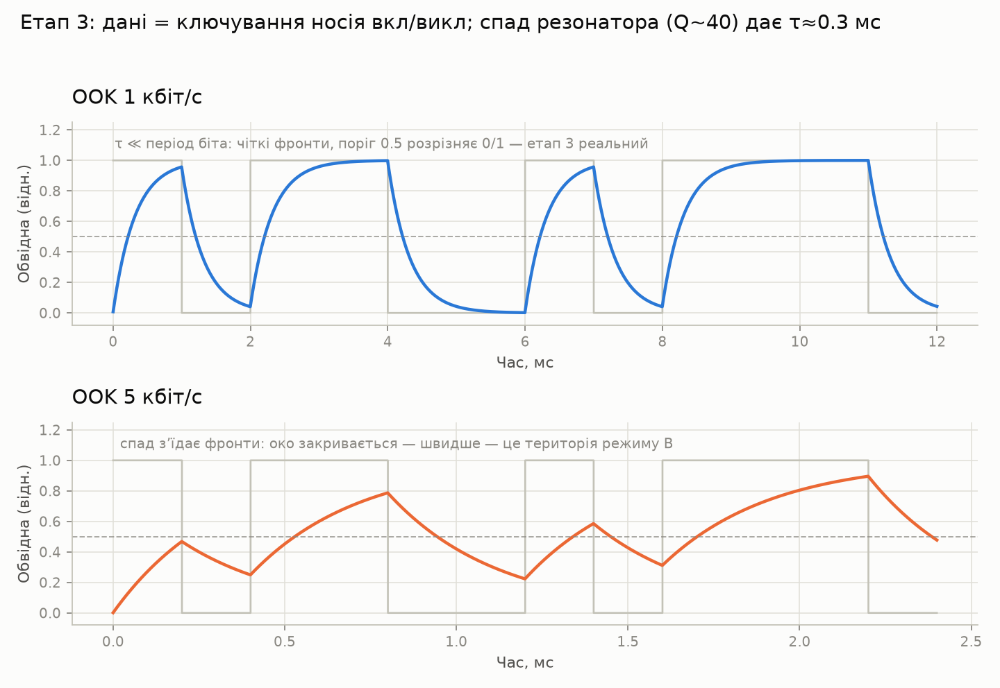
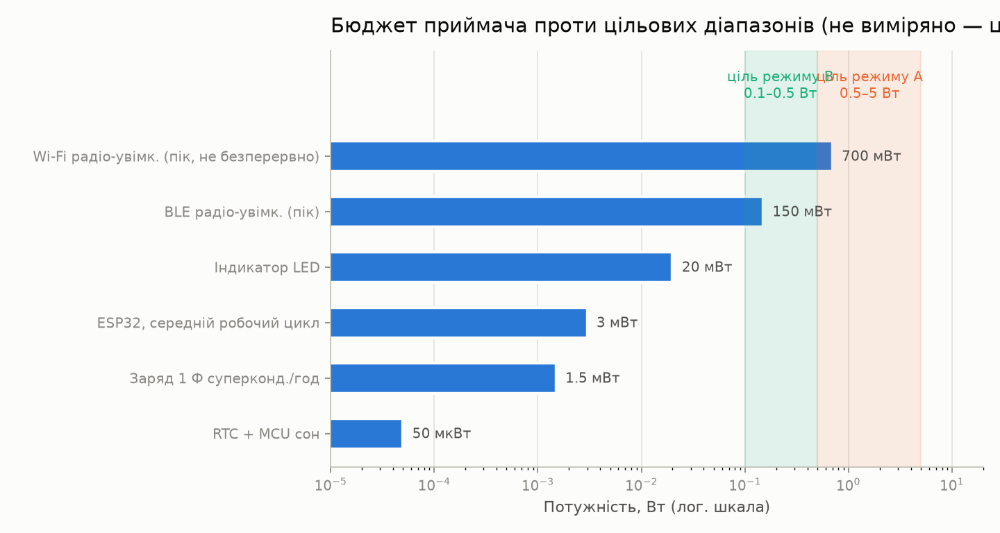
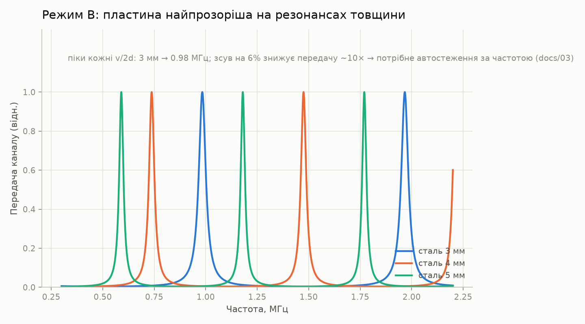

# through-metal-link

> [English (primary)](../../README.md) · [Русский](../ru/README.md) · [Deutsch](../de/README.md) · [Português](../pt/README.md) · [Español](../es/README.md) · [Français](../fr/README.md) · [Italiano](../it/README.md) · [Polski](../pl/README.md) · [Türkçe](../tr/README.md) · Українська · [Tiếng Việt](../vi/README.md) · [中文](../zh/README.md) · [日本語](../ja/README.md) · [한국어](../ko/README.md) · [हिन्दी](../hi/README.md)

Відкрита платформа для ультразвукової передачі енергії та даних через суцільні металеві стінки — «крізь сталь без жодного отвору», побудована гаражними засобами.

**Спробуйте зараз (без заліза):** `python3 software/sweep-map/sweep_map.py --mock`

**Шляхи входу:**
- **A — сухий прогін:** макет свіпу + [симулятор](../../software/simulator/channel_sim.py) (без стенду)
- **B — збірка етапу 1:** [QUICKSTART.md](QUICKSTART.md) → [experiments/001](experiments/001-sweep-map-3mm-steel/README.md)
- **C — внесок без заліза:** попередні рішення / документи / переклади / коментарі до ADR ([CONTRIBUTING.md](CONTRIBUTING.md))

**Статус:** етап 0 — підготовка · **поки без апаратної перевірки** (лише симулятор; нагорода за першу збірку) · 💰 **[$250 нагорода](https://github.com/zeloras/through-metal-link/issues/5)** · список покупок: [QUICKSTART.md](QUICKSTART.md)

[](https://github.com/zeloras/through-metal-link/actions/workflows/ci.yml) [](https://github.com/zeloras/through-metal-link/actions/workflows/reuse.yml) [](CONTRIBUTING.md) [](LICENSES.md)

Документація багатомовна: англійська — основна і живе за канонічними шляхами; кожна інша мова віддзеркалює дерево в [translations/](..). Редагуйте будь-яку мову — CI перекладає і комітить решту (див. [CONTRIBUTING.md](CONTRIBUTING.md)).



## Ідея в одному абзаці

Радіохвилі не проходять крізь метал (клітка Фарадея), а кабельне проходження означає отвір, герметизацію та точку відмови. Ультразвук, натомість, поширюється крізь метал цілком нормально: п'єзоелемент з кожного боку стінки перетворює її на канал для живлення та даних. Лабораторна література вже довела фізику на серйозних рівнях (RPI: 50 Вт + 12 Мбіт/с крізь 63,5 мм сталі; NASA JPL: до ~кВт крізь 5 мм титану) — це докази існування на спеціалізованому обладнанні, а не гаражна специфікація цього репозиторію. Базові патенти закінчилися, і досі не існує відкритої, відтворюваної платформи — цей репозиторій будує таку, починаючи з **потужності класу ватів і даних кбіт/с крізь 3–5 мм сталі** після вимірювань етапу 2.

## Дорожня карта

| Етап | Результат | Критерій успіху | Очікування |
|---|---|---|---|
| 1. Карта свіпу | частотна характеристика каналу «Ланжевен — 3 мм сталі — Ланжевен» | знайдено резонанс пари, графік у [experiments/001](experiments/001-sweep-map-3mm-steel/README.md) | [sim1](docs/img/sim1-sweep-contacts.png), [sim2](docs/img/sim2-pair-mismatch.png) |
| 2. Вати | потужність у навантаження на резонансі | ≥0,5 Вт крізь 3 мм сталі, протокол у [experiments/002](experiments/002-watts-3mm-steel/README.md) | [sim4](docs/img/sim4-power-budget.png) |
| 3. Дані | FSK/OOK на тій самій парі | ≥1 кбіт/с без помилок | [sim5](docs/img/sim5-ook-datarate.png) |
| 4. Вузол | ESP32 + датчик у завареній коробці, живлення і телеметрія лише звуком | ≥1 год автономної роботи | [sim4](docs/img/sim4-power-budget.png) |
| 5. Публікація | перше незалежне відтворення + стаття/інструкція + знімок Zenodo | задокументоване відтворення третіми особами | — |

## Карта репозиторію

Кожен блок нижче — це стислий опис, достатній для роботи, плюс посилання на повний документ.

### 🛒 Від нуля до робочого стенду: що купувати і в якому порядку — [QUICKSTART.md](QUICKSTART.md)

**Бюджет:** ~$210 мінімум, ~$300 комфортно (відніміть ~$120, якщо вже маєте Pi, паяльник і лабораторний блок живлення). Три кошики: інструменти (~$120), електроніка стенду (~$70, [повний BOM](hardware/bom/bom-stage1.csv)), механіка (~$20). Опціонально, але настійно рекомендовано: USB-осцилограф (~$60–80).

**Критичний шлях — доставка з AliExpress (3–4 тижні):** замовляйте електроніку в перший же день. Ключове рішення: купіть **4 перетворювачі Ланжевена з однієї партії** — свіп обере найкращу пару ([чому](docs/img/sim2-pair-mismatch.png))).

**Поки їде:** сухий прогін конвеєра без заліза —

```bash
python3 software/sweep-map/sweep_map.py --mock
```

**Готово, коли (за етапами):** етап 1 — пік свіпу відтворюється між двома прогонами з точністю <200 Гц ([experiments/001](experiments/001-sweep-map-3mm-steel/README.md)); етап 2 — ≥0,5 Вт у відоме навантаження крізь 3 мм сталі та запалений світлодіод зі боку RX ([experiments/002](experiments/002-watts-3mm-steel/README.md)).

### 📚 Теорія за хвилину — [docs/00-theory.md](docs/00-theory.md)

П'єзо TX притиснуто до стінки, і він збуджує в ній поздовжню хвилю; п'єзо RX на іншому боці перетворює її назад в електрику. Швидкість звуку в сталі: ~5900 м/с.

Два режими роботи:

| Режим | Частота | Резонанс задається | Дає | Статус |
|---|---|---|---|---|
| **A** — перетворювачі Ланжевена | 40 кГц | парою перетворювачів (стінка ≪ λ — «мембрана») | вати, кбіт/с | стартовий режим (етапи 1–4, [ADR-0001](docs/decisions/0001-frequency-mode-choice.md)) |
| **B** — диски | 0,6–1 МГц | товщинним резонансом стінки ([гребінка](docs/img/sim3-thickness-comb.png)) | сотні мВт, сотні кбіт/с | відгалуження після перших ватів; потребує автоматичного стеження за частотою |

Основні втрати: розузгодження резонансів у парі (±1 кГц для дешевих перетворювачів Ланжевена), якість акустичного контакту (епоксид > мастило-суміш + струбцина > сухий тиск), перекіс, дрейф резонансу з температурою. Відповідь на всі ці проблеми одна: **карта свіпу перед кожною зміною налаштувань**.

### 📈 Що має показати стенд: графіки очікувань від симулятора — [software/simulator/channel_sim.py](../../software/simulator/channel_sim.py)

Напівемпірична модель каналу (не FEM, **не лабораторні дані** — інтуїція для «яким має бути свіп і куди цілитись»). Припущення задані явно в `channel_sim.py` (навантажена Q≈40, коефіцієнти контакту, ККД ланцюга ≤40%). Згенерувати заново: `python3 channel_sim.py --out ../../docs/img`.

**Етап 1 — свіп.** Вузький пік біля ~40 кГц; модельні коефіцієнти контакту: мастило:сухо:зазор = 1 : 0,25 : 0,02 (тобто мастило ≈4× сухого і ≈50× повітряного зазору). Немає піку — проблема з контактом або парою:



**Чому 4 перетворювачі Ланжевена, а не 2.** За Q≈40 розузгодження резонансу в парі на 1,5 кГц знижує модельну потужність ~10×:



**Етап 3 — дані.** OOK наштовхується на дзвоніння резонатора (модель Q~40 → τ≈0,3 мс): 1 кбіт/с — чисто, на 5 кбіт/с око закрите. Швидше — потрібен режим B:



**Енергетичний бюджет приймача.** Затінені смуги — **цілі** (режим A 0,5–5 Вт, якщо етап 2 вдасться; режим B нижче). Реалістичні перші навантаження — ESP32 / BLE / LED у циклічному режимі; Wi-Fi показано як маркер пікового споживання, а не безперервної обіцянки:



**На потім (режим B).** Пластина стає прозорою на гребінці товщинних резонансів — частоту треба відстежувати:



### ⚠️ Безпека — прочитайте перед першим увімкненням — [docs/02-safety.md](docs/02-safety.md)

1. **Десятки до сотень вольт на п'єзо** щойно драйвер етапу 2 під живленням — TVS на боці приймача ставиться ДО першого увімкнення; не чіпайте виводи руками.
2. **Мережа** — лише через лабораторний блок живлення / розв'язку; плати драйверів ультразвукових мийок гальванічно прив'язані до мережі.
3. **Вуха** — при нетривіальній потужності працюйте з перетворювачами, притиснутими до металу; ніколи не запускайте потужний ультразвук у повітрі без кожуха.
4. **Нагрів** — незатиснутий перетворювач Ланжевена перегрівається за хвилини під потужністю; затисніть перед підняттям струму (лише коротка низькострумова електрична перевірка — див. README драйвера).
5. **Уламки** — п'єзокераміка крихка: перетягнутий болт або удар означають уламки; надягайте захисні окуляри для будь-яких механічних робіт.

Перше увімкнення драйвера: обмеження струму лабораторного БЖ 0,2 А; повна послідовність у [hardware/driver/](hardware/driver/README.md) та [docs/02-safety.md](docs/02-safety.md).

### 🧭 Попередні рішення та патентна гігієна — [docs/01-prior-art.md](docs/01-prior-art.md)

Кожне технічне рішення має простежуватись до «вільного» джерела (патенти, що закінчилися, статті). Фундамент: **US5982297** (Aerospace Corp — базовий рецепт п'єзопари крізь стінку), **US7902943** (Caltech/JPL — feed-through Шерріта), **US9361877** (Університет Оклахоми — повна трансиверна система); усі мертві. Ключові статті: Lawry 2013 (50 Вт + 12,4 Мбіт/с крізь 63,5 мм сталі), Sherrit/NASA (лампа на 100 Вт), Yang 2015 (огляд).

Не копіювати, поки ще живі: OFDM-розподіл RPI та повнодуплексна схема, а також конформні перетворювачі Drexel (США, до ~2032–2033 — етапи 1–4 не потребують жодного з них), плюс сім'ї, додані пошуком 2026-08: **US8594572B1** (ВМС США — читається на сам канал живлення; США, до 2032; Welle 1997 — попереднє рішення як відповідь), **EP3723304B1** (ABB — спектр потужності *нижче* спектру даних; DE/GB, до 2039; запланований аплінк з модуляцією навантаження на тій самій несучій залишається поза ним), **Ultrapower** (датчик у трубі з опуклими/увігнутими решітками або стрижень крізь стінку; США, до 2035 — ми використовуємо плоскі подушки без стрижня). Аналіз формул, статуси та обхідні рішення: [docs/01-prior-art.md](docs/01-prior-art.md).

Архітектурні рішення зафіксовані в [docs/decisions/](docs/decisions/0001-frequency-mode-choice.md) (ADR).

### 🔌 Апаратне забезпечення та прошивка — hardware/, firmware/

- [hardware/bom/bom-stage1.csv](hardware/bom/bom-stage1.csv) — список покупок етапу 1.
- [hardware/schematics/](hardware/schematics/README.md) — **принципові схеми** (згенеровані з коду): драйвер, приймач, розпіновка Pi, вузол-збирач.
- [hardware/driver/](hardware/driver/README.md) — TX-драйвер: півміст IR2110 + 2×IRF540, узгоджувальний трансформатор (перетворювач Ланжевена — ємнісне навантаження!). Плата KiCad з'явиться після перевірки макета на макетній платі.
- [hardware/receiver/](hardware/receiver/README.md) — приймач, етап за етапом: міст Шотткі → ADC (етап 1) → навантаження (етап 2) → LTC3588 + суперконденсатор + ESP32 (етап 4).
- [firmware/node-esp32/](firmware/node-esp32/README.md) — вузол етапу 4 (заглушка): глибокий сон, зчитування датчика, BLE-маяк, бюджет 1–5 мВт у середньому.

### 💻 Програмне забезпечення: вимірювання та симулятор — software/

- [software/sweep-map/sweep_map.py](../../software/sweep-map/sweep_map.py) — робочий кінь етапу 1: свіп DDS → зчитування ADC → CSV + графік частотної характеристики. Має `--mock` для запуску без заліза. На Pi: `raspi-config` → увімкнути SPI та I2C; `pip install spidev smbus2 matplotlib`.
- [software/simulator/channel_sim.py](../../software/simulator/channel_sim.py) — генератор графіків очікувань (`pip install numpy matplotlib`).
- [software/simulator/material_map.py](../../software/simulator/material_map.py) — та сама модель каналу для різних матеріалів стінки — титан, алюміній, скло, кераміка, пластики, бетон; дослідження та висновки: [docs/06-materials.md](docs/06-materials.md).
- [data/](data/README.md) — сирі логи; CSV/PNG не потрапляють у git, лише відібрані графіки йдуть у git у директорії експерименту.

### 🗺️ Де це застосувати: бар'єри, канали, ніші — [docs/04-hybrid-channels.md](docs/04-hybrid-channels.md), [docs/05](docs/05-applications-map.md)

Універсального каналу не існує — платформа підбирає фізику до бар'єра: п'єзоакустика (основне: сталь/алюміній з контактом — вати і кбіт/с), EMAT (брудний/гарячий метал, без контакту — дані), низькочастотна магнітрика (вакуумні сендвіч-стінки дюарів — біти/с). Чесні тупики: гумовидні/композитні стінки, бульбашкова рідина на шляху.

Пріоритет ніш: **(1)** лабораторні вакуумні камери та кріостати — аудиторія open-source-hardware, без сертифікацій; **(2)** бродильні чани — полігон у кроковій доступності; **(3)** герметичні акумуляторні батареї — флагманський кейс (виявлення теплового розгону без проникнення в батарею). Протокол виявлення приймача та автоналаштування (аналог Qi): [docs/03-discovery-protocol.md](docs/03-discovery-protocol.md).

### 📁 Структура директорій

```
docs/            теорія, попередні рішення, безпека, застосування, журнал рішень (ADR)
docs/img/        графіки очікувань (генеруються software/simulator/channel_sim.py)
hardware/        BOM, драйвер (півміст), приймач (випрямляч/збирач)
firmware/        прошивка вузла (ESP32 — заглушка до етапу 4)
software/        скрипти вимірювань (карта частотного свіпу) та симулятор каналу
experiments/     протоколи експериментів — із шаблону, одна директорія = один експеримент
data/            сирі логи (великі файли не потрапляють у git)
```

## Принципи

1. **Відтворюваність з нуля.** Будь-хто з паяльником і ~$210 може відтворити результат лише з цього репозиторію.
2. **Кожен експеримент — це протокол.** Без «нібито працювало»: [experiments/TEMPLATE.md](experiments/TEMPLATE.md) обов'язковий.
3. **Патентна гігієна.** Будуємо на шарі патентів, що закінчилися ([docs/01-prior-art.md](docs/01-prior-art.md)); рішення зафіксовані в [docs/decisions/](docs/decisions/0001-frequency-mode-choice.md).
4. **Спочатку вимірювання, потім думки.** Карта свіпу перед будь-якими висновками про канал.

## Ліцензії та патенти

Код — Apache-2.0, апаратне забезпечення — CERN-OHL-W v2, документація — CC-BY-4.0; повні тексти в [LICENSES/](../../LICENSES). Будь-хто може форкати і будувати на цьому, зокрема комерційно; патентний захист забезпечується грантами та клаузулами реталіації в ліцензіях плюс стратегією попередніх рішень. Повна схема та протокол оборонної публікації: [LICENSES.md](LICENSES.md); правила внеску: [CONTRIBUTING.md](CONTRIBUTING.md).
