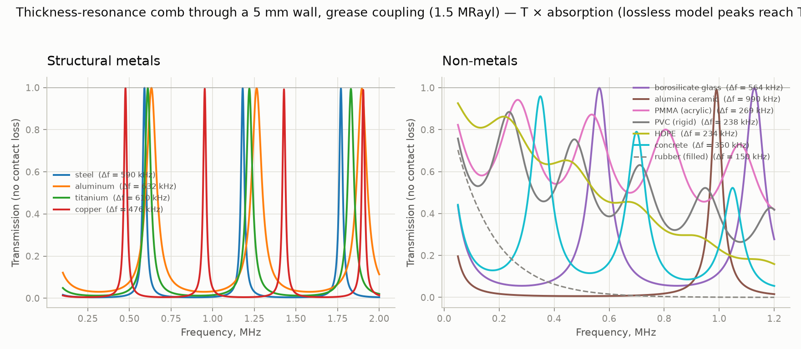
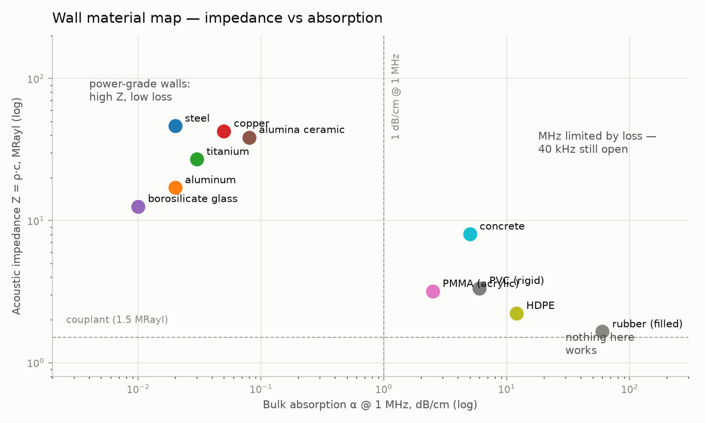
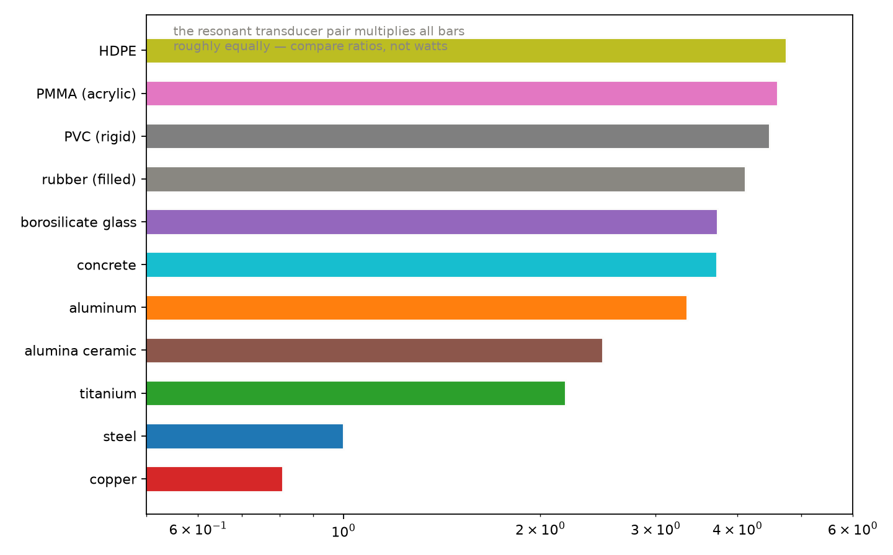
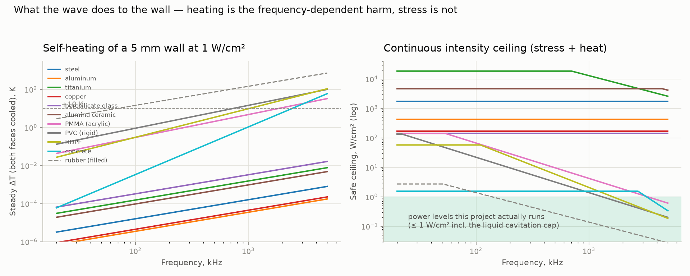
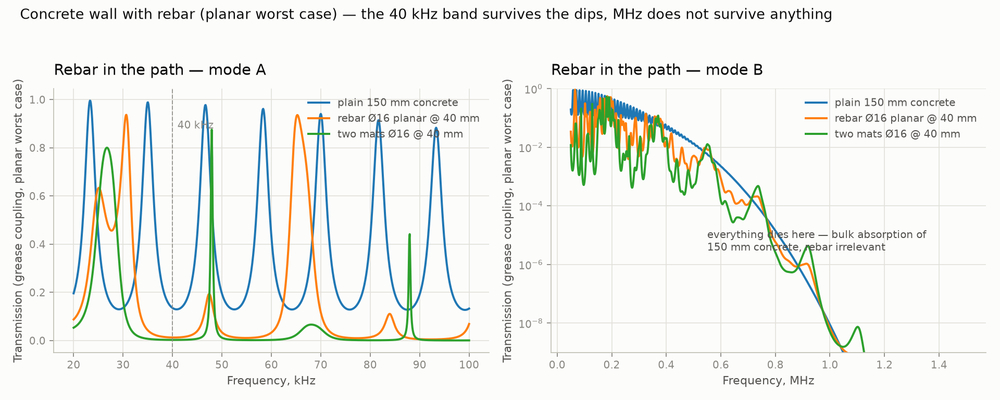

# Матеріали стінок окрім сталі: які стінки пропускають живлення та дані

> [English (primary)](../../../docs/06-materials.md) · [Русский](../../ru/docs/06-materials.md) · [Deutsch](../../de/docs/06-materials.md) · [Português](../../pt/docs/06-materials.md) · [Español](../../es/docs/06-materials.md) · [Français](../../fr/docs/06-materials.md) · [Italiano](../../it/docs/06-materials.md) · [Polski](../../pl/docs/06-materials.md) · [Türkçe](../../tr/docs/06-materials.md) · Українська · [Tiếng Việt](../../vi/docs/06-materials.md) · [中文](../../zh/docs/06-materials.md) · [日本語](../../ja/docs/06-materials.md) · [한국어](../../ko/docs/06-materials.md) · [हिन्दी](../../hi/docs/06-materials.md)

Решта цього репозиторію припускає сталь. Ця сторінка ставить простіше, масштабніше запитання: **для яких матеріалів стінок двотрансдукерний канал узагалі працює**, і в якому режимі? Це симуляційне дослідження (у стилі `--mock`, без лабораторних даних — інтуїція щодо того, що заслуговує на апаратний експеримент), побудоване на тій самій напівемпіричній моделі, що й [channel_sim](../../../software/simulator/channel_sim.py), і розширене об'ємним поглинанням.

Згенерувати: `python3 software/simulator/material_map.py` (потрібні numpy + matplotlib). Модель та припущення: [../software/simulator/material_map.py](../../../software/simulator/material_map.py).

## Модель за одну хвилину

Три величини визначають, чи стінка взагалі придатна, і для якої потужності:

1. **Контраст імпедансу та фаза** — модель плити Fabry–Perot без втрат, ідентична до [channel_sim](../../../software/simulator/channel_sim.py):
   T(f) = 1 / (1 + ((r − 1/r)/2)² · sin(2πfd/c)²), r = Z_wall / Z_couplant, couplant Z = 1.5 MRayl (grease).
   На резонансі півхвилі (f = c/2d) симетрична плита без втрат повністю прозора *незалежно від r*; контраст r визначає, наскільки **широкими** є зубці гребінця (допуск до похибки частоти), швидкість звуку c визначає, наскільки вони віддалені (Δf = c/2d).
2. **Об'ємне поглинання**, невидиме для моделі без втрат і вирішальне для пластиків, бетону та гуми:
   A(f) = 10^(−α(f)·d/10), α(f) = α₁ₘₕᶻ · (f/1 MHz)^γ [dB/cm, в один бік, поздовжня хвиля],
   де α₁ₘₕᶻ — значення на 1 MHz.
   γ ≈ 1 = в'язкісні/релаксаційні втрати; γ > 2 = розсіяння на неоднорідностях (заповнювач бетону).
3. **Доза, яку стінка приймає назад** — див. розділ [нижче](#the-dose-what-the-wave-does-to-the-wall-frequency-by-frequency): напруження σ = √(2·I·Z), яке *не залежить* від частоти, та самонагрів ΔT ∝ α(f)·I, який залежить.

**Припущення, stated where the code states them:** типові довідникові властивості (поздовжня хвиля, ~20 °C); реальні зразки варіюються — зерно, наповнювачі, заповнювачі, твердіння. Усе нижче — це рейтинг, а не datasheet.

| Стінка | ρ, кг/m³ | c_L, m/s | Z, MRayl | α @1 MHz, dB/cm | comb Δf @5 mm, kHz | λ @40 kHz, mm | T(40 kHz, 3 mm) | примітка |
|---|---|---|---|---|---|---|---|---|
| steel | 7850 | 5900 | 46.3 | 0.02 | 590 | 148 | 0.21 | дрібнозерниста конструкційна |
| aluminum | 2700 | 6320 | 17.1 | 0.02 | 632 | 158 | 0.69 | клас 6061 |
| titanium | 4430 | 6100 | 27.0 | 0.03 | 610 | 152 | 0.45 | Ti-6Al-4V |
| copper | 8960 | 4760 | 42.6 | 0.05 | 476 | 119 | 0.17 | щільна, дуже високий Z |
| borosilicate glass | 2230 | 5640 | 12.6 | 0.01 | 564 | 141 | 0.77 | дуже низькі втрати |
| alumina ceramic | 3890 | 9900 | 38.5 | 0.08 | 990 | 248 | 0.51 | швидкий звук, низькі втрати |
| PMMA (acrylic) | 1180 | 2690 | 3.2 | 2.5 | 269 | 67 | 0.95 | прозора, ліміт поглинання на MHz |
| PVC (rigid) | 1400 | 2380 | 3.3 | 6 | 238 | 60 | 0.92 | більші втрати, ніж PMMA |
| HDPE | 950 | 2340 | 2.2 | 12 | 234 | 58 | 0.98 | м'яка, втратна |
| concrete | 2300 | 3500 | 8.1 | 5 | 350 | 88 | 0.77 | домінує розсіяння на заповнювачі; варіюється на порядки |
| rubber (filled) | 1100 | 1500 | 1.6 | 60 | 150 | 38 | 0.85 | чесний глухий кут |

## Графіки

**Режим B (MHz) — гребінь товщини для кожного матеріалу.** Ліворуч: конструкційні метали; праворуч: неметали. Усі стінки 5 мм, контакт через мастило. Піки моделі без втрат досягають T = 1 на точних резонансах; реальні піки нижчі через контактні втрати, а поглинання відсікає втратні матеріали одразу:

**Карта матеріалів** — дві осі, які визначають усе: імпеданс (складність контакту) проти поглинання на 1 MHz (життєздатність на MHz). Високий Z + низький α — це енергетичний кут; низький Z + високий α — це «40 kHz ще відкрито, MHz мертвий»; кут гуми — глухий кут на кожній частоті, на яку ми цілимо:

**Проксі зв'язку режиму A (40 kHz)** — та сама модель передачі, обчислена на 40 kHz через стінку 3 мм, нормована до сталі. *Рейтинг, а не вати:* резонансна пара Ланжевена множить кожен стовпчик приблизно однаково, а модель не враховує навантаження трансдукера всередині; цей множник — територія stage-2 ([experiments/002](../experiments/002-watts-3mm-steel/README.md)):

## Що каже свіп

- **На 40 kHz низько-Z стінки (пластики, гумове покриття) з'єднуються *легше*, ніж сталь** — через мастило вони майже узгоджені за імпедансом, тож гребінь широкий, а передача за прохід висока. Те, що вбиває пластики на вищих частотах — це **об'ємне поглинання**, а не контакт чи імпеданс. Матеріальна драбина на 40 kHz тому перевернута відносно інтуїції: HDPE/PMMA/PVC > скло/бетон > алюміній > alumina > титан > сталь > мідь — із серйозним застереженням, що число гуми на 40 kHz екстраполює α лінійно вниз від 1 MHz, чого в'язкопружність не гарантує.
- **Режим B чітко ділить матеріали.** Метали, скло та alumina беруть MHz з нехтовним поглинанням (α ≤ 0.1 dB/cm); гребінь *гострий* для високоз-стінок (сталь, alumina — потрібне відстеження частоти, урок ~6% ⇒ ~10× з [00-theory](00-theory.md)) і *широкий* для скла/PMMA (толерантні, але PMMA платить ~1.3 dB в один бік на 1 MHz через 5 мм — лише клас мВт).
- **Бетон — матеріал для 40 kHz, а не для MHz.** Розсіяння на заповнювачі (λ на 1 MHz ≈ 3.5 мм ≈ розмір заповнювача) піднімає γ до ~2.5 і вбиває MHz; практика ультразвукової швидкості імпульсу (40–80 kHz через шляхи ≥1 м) — це точно режим A.
- **Ніша батарейних пакетів ([05](05-applications-map.md)) акустично сприятлива:** алюмінієва стінка 2–3 мм має проксі зв'язку ~3× від сталі та нехтовне поглинання — флагманський випадок водночас є найпростішим.
- **Частотна драбина, яку варто планувати в режимі B** (стінка 5 мм, перший гребінь): PVC/HDPE ≈ 235 kHz, PMMA ≈ 270, мідь ≈ 480, сталь ≈ 590, титан ≈ 610, алюміній ≈ 630, скло ≈ 560, alumina ≈ 990. Тонша стінка ⇒ пропорційно вище.

## Доза: що хвиля робить зі стінкою, частота за частотою

Передача відповідає на «скільки проходить»; цей розділ відповідає на зворотне запитання — **скільки хвилі залишається в стінці, і чи це шкодить їй?** Шкода хвилі в стінці має рівно два обличчя:

- **Напруження** σ = √(2·I·Z) — імпульс плоскої хвилі; *не залежить від частоти*. Порівнюйте з межею втоми при високоцикловому навантаженні (метали), межею міцності на згин/розтяг (кераміка, скло, бетон, гума).
- **Самонагрів** ΔT = α(f)·I·d²/(8k), усталений режим, обидві поверхні охолоджені — *залежить від частоти* через α(f), і саме тут частота кусає: кожен ізоляційний матеріал має коліно, вище якого кожна додаткова октава частоти множить відкладене тепло.

На 1 W/cm² (вже більше, ніж цює цей проект: мета stage-2 — 0.5–5 W, розподілені на ~19 cm² поверхні трансдукера, тобто 0.03–0.26 W/cm²):

| Стінка | σ @1 W/cm², MPa | межа σ_e, MPa | запас напруження | ΔT @40 kHz, K | ΔT @1 MHz, K | ΔT @5 MHz, K | стеля @40 kHz, W/cm² | стеля @1 MHz, W/cm² |
|---|---|---|---|---|---|---|---|---|
| steel | 0.96 | 200 | 208× | ~0 | ~0 | ~0 | ~1700 | ~1700 |
| aluminum | 0.58 | 60 | 103× | ~0 | ~0 | ~0 | ~420 | ~420 |
| titanium | 0.74 | 500 | 680× | ~0 | ~0 | ~0 | ~18000 | ~6500 |
| copper | 0.92 | 60 | 65× | ~0 | ~0 | ~0 | ~170 | ~170 |
| borosilicate glass | 0.50 | 30 | 60× | ~0 | ~0 | ~0 | ~140 | ~140 |
| alumina ceramic | 0.88 | 300 | 342× | ~0 | ~0 | ~0 | ~4700 | ~4700 |
| PMMA (acrylic) | 0.25 | 15 | 60× | 0.2 | 9.5 | 65 | ~100 | 2.1 |
| PVC (rigid) | 0.26 | 15 | 58× | 0.6 | 28.8 | 199 | ~33 | 0.7 |
| HDPE | 0.21 | 8 | 38× | 0.15 | 19.2 | 215 | ~58 | 1.0 |
| concrete | 0.40 | 2.5 | 6× | ~0 | 2.1 | 118 | 1.6 | 1.6 |
| rubber (filled) | 0.18 | 1.5 | 8× | 11.5 | 288 | 1440 | 1.7 | 0.07 |

«Стеля» = безперервна інтенсивність, за якої стінка залишається в межах 20% своєї межі втоми/міцності та під +20 K самонагріву (усталений режим, обидві поверхні при температурі оточення). Робота в імпульсному режимі гріє менше; стінка, закріплена лише з одного боку — звичайний випадок, повітря з одного боку — нагрівається до 4× більше на вільній поверхні. Ці числа — перший наближення, а не гарантія проєктування. Одна конвенційна ремарка: значення α — це інтенсивність-dB (10·log₁₀, конвенція дозиметрії — спад на 3 dB вдвічі зменшує I); література з pulse-echo NDT, що цитує amplitude-dB (20·log₁₀), описує ТЕ Ж саме α числами, вдвічі більшими — перевіряйте, яку конвенцію використовує джерело, перед тим як копіювати його числа в цю таблицю.

Що каже свіп дози:

- **Висновок про сталь з [00-theory](00-theory.md) лишається в силі та узагальнюється**: кожен конструкційний метал несе 1 W/cm² із запасами 65–680× за напруженням та мікрокельвінами самонагріву. Метали нечутливі до частоти за шкодою — їхні втрати замалі, щоб нагрітися на будь-якій потужності, яку ми можемо зв'язати.
- **Частотна шкода для полімерів — теплова, а не механічна.** Запас напруження PMMA — комфортні 60× навіть на 1 W/cm², але коліно нагріву сидить прямо біля 1 MHz: безневинний (~0.2 K) на 40 kHz, +9.5 K на 1 MHz, +65 K на 5 MHz — територія розм'якшення при кількох W/cm². PVC перетинає лінію +10 K вже на ~0.35 W/cm² @ 1 MHz; гума поглинає ~288 K на W·cm⁻² на 1 MHz (і ~12 K навіть на 40 kHz) — гістерезисний нагрів — *та* причина, чому стінки з еластомерним покриттям гинуть, а не гребінь. HDPE ділить різницю і пам'ятає свою точку плавлення: +215 K на W·cm⁻² на 5 MHz.
- **Маленький запас бетону — розтягнений, не тепловий**: 0.40 MPa хвильового напруження проти ~2.5 MPa статичної міцності на розтяг (втома ще нижча) залишає лише ~6× запасу на 1 W/cm². Режим 40–80 kHz лишається нормальним при проєктній густині потужності; концентровані промені з кілька W/cm² у бетон слід уникати, MHz тим паче (розсіяння гріє межі заповнювача).
- **Підсумок для roadmap:** при густинах потужності режиму A (≤0.3 W/cm²) жоден твердий матеріал у таблиці не під загрозою — запаси напруження ≥11× (найменший — розтягнена втома бетону 11×; усе інше ≥15×) та нагрів ≤0.2 K для кожного інженерного твердого матеріалу (гума, виняток, на який ніхто не цілить, ~3.5 K). Карта шкоди виправдовує план проєкту нарощувати потужність: перші реальні матеріальні межі з'являються *вище* за цілі stage-2, спершу в рідинах (кавітація, правило ≤1 W/cm² з [00-theory](00-theory.md)), потім у розтягненій втомі бетону, потім у полімерах на MHz. Частини, які реально потребують нагляду при високій потужності, залишаються п'єзокераміка та лінія склеювання — [02-safety](02-safety.md) — а не стінка.

## Висновок за матеріалом

| Стінка | Режим A — потужність 40 kHz | Режим B — потужність/дані MHz | Висновок |
|---|---|---|---|
| steel | ✓✓ еталон | ✓ гострий гребінь — відстежувати частоту | базовий рівень |
| aluminum | ✓✓ (проксі ~3× сталь) | ✓ помірно гострий гребінь | найкраща конструкційна стінка (батареї!) |
| titanium | ✓✓ | ✓ помірно гострий, низькі втрати | корозійні/гарячі ніші, дрони, корпуси |
| copper | ✓ (найскладніший зв'язок серед металів) | ✓ | ніші: герметичні шинопроводи/електрохімічні комірки |
| borosilicate glass | ✓✓ | ✓ найширший гребінь — найбільш толерантний | лабораторні вікна, оглядові отвори |
| alumina ceramic | ✓✓ | ✓ найшвидші гребені (990 kHz @ 5 мм), низькі втрати | гарячі/ізолюючі технологічні стінки |
| PMMA | ✓ широкосмуговий | ⚠ клас мВт ≤ ~0.5 MHz | резервуари, корпуси; не силова стінка на MHz |
| PVC / HDPE | ✓ тонкі стінки | ✗ поглинання | низькосортні корпуси, вузли з легкими даними |
| concrete | ✓ 40–80 kHz (практика UPV) | ✗ розсіяння | фундаменти, труби — лише режим A |
| rubber (filled) | ⚠ екстраполяція моделі невалідована | ✗ | емпірично глухий кут — [04](04-hybrid-channels.md) |

Низько-Z пластикова стінка має більше простору для *толерантних до роз'єднання* каналів режиму A, але дає менше абсолютного запасу потужності проти поглинання, щойно ви піднімаєтесь вище ~200 kHz; міряйте, перш ніж обіцяти щось.

## Бетон з арматурою — багатошаровий випадок

Реальний бетон ніколи не буває чистим: арматурні сітки лежать на глибині захисного шару, і наведена вище 1D-модель однієї плити їх не бачить. `chart_rebar` / `rebar_table` розширюють модель на загальні шари ([`stack_transmission`](../../../software/simulator/material_map.py), точна багатошарова рекурсія з поглинанням на кожен шар, захищена у self-check). Модельована геометрія: конструкційна стінка 150 мм, одна сталева сітка планарно-еквівалентної товщини Ø16 мм на глибині захисного шару 40 мм; *планарна* модель — найгірший випадок — реальний стрижень затінює лише частину променя, яку він перетинає, тож сприймайте це як огинаючі провали, а не прогнози:

| Шар (150 мм бетону) | T(40 kHz) | T(100 kHz) | T(1 MHz) |
|---|---|---|---|
| чистий 150 мм | 0.135 | 0.133 | 8.9e-09 |
| арматура Ø16 @ 40 мм | 0.013 | 0.069 | 6.6e-09 |
| дві сітки Ø16 @ 40 мм | 0.003 | 0.001 | 5.1e-09 |

Що каже модель шарів:

- **Одна планарна сітка під променем коштує ×10 на рівно 40 kHz** (інтерференція смуги загородження від сталевого шару), але провал вузький: на 100 kHz той самий шар втрачає лише ×2. Практичне читання для ніші трубопроводів/автоклавів: *частотний свіп близько 40–120 kHz, а не фіксована частота*, — це те, що проводить канал режиму A крізь арматуру — і провали зсуваються з глибиною захисного шару, тож свіп також ідентифікує геометрію (основа оцінки глибини арматури).
- **Друга сітка (сітка-міш) — майже вбивця стінки в цьому найгіршому випадку** (×45 вниз і широкосмугово плоско біля 40–100 kHz): щільна арматура на шляху — це чесний індикатор «оберіть інше місце на стінці», а не задача обробки сигналів.
- **Режим B крізь конструкційний бетон мертвий з арматурою чи без** (рівень 1e-8 на 1 MHz: 5 dB/cm × 15 cm). Арматура взагалі не входить у історію на MHz.
- Застереження, за порядком важливості: припущення планарного шару (найгірший випадок — стрижень Ø16 блокує менше половини перерізу променя 40–50 мм), хвиля паралельна осі арматурного стрижня, та 1D-поширення (без дифракції навколо стрижня). Правильний апаратний експеримент — скануючий стенд на реальній плиті: зняти T(x, y) на 40/80/120 kHz над сіткою арматури та зіставити позиції провалів планарної моделі з кроком сітки.

## Що має виміряти апаратне дослідження

Перед тим, як довіряти будь-якій конкретній плиті: метод двох товщин для кожного матеріалу (дві плити d та 2d за тих самих умов контакту) для витягнення реальних α(f) та c — цей єдиний набір даних замінює кожен рядок таблиці вище. Натуральні бонусні проходи в межах існуючих протоколів: повторити свіп експерименту [001](../experiments/001-sweep-map-3mm-steel/README.md) на плиті PMMA 5 мм, боросилікатній або 99% alumina плиті, та бетонному блоці відомого класу; очікуйте *нижчий, але ширший* пік для пластиків, гострий гребінь для кераміки, та чутливий до температури контакт усюди. Під час силового експерименту [002](../experiments/002-watts-3mm-steel/README.md), прикріпіть IR-термометр (або тонку термопару) до дальньої поверхні кожного типу стінки — виміряний ΔT за відомої вхідної потужності — це те єдине число, яке валідує або вбиває колонку нагріву таблиці дози. Нічого на цій сторінці не виміряно — це карта того, що виміряти першим.
