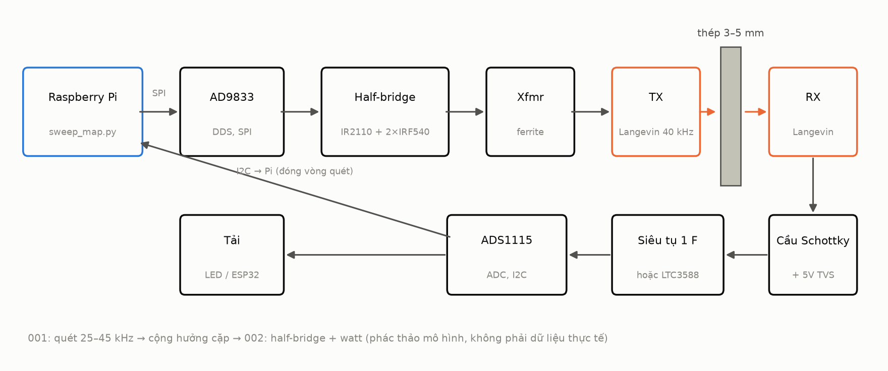
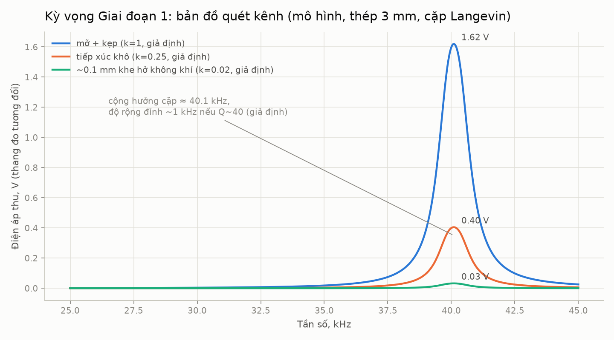
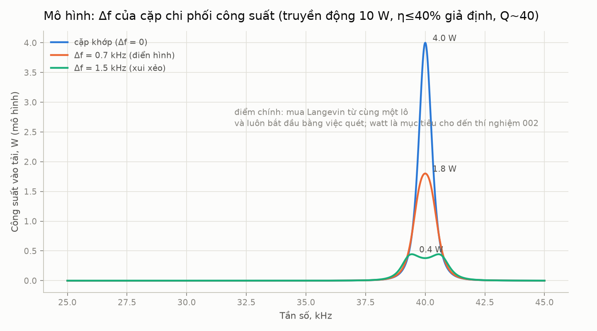
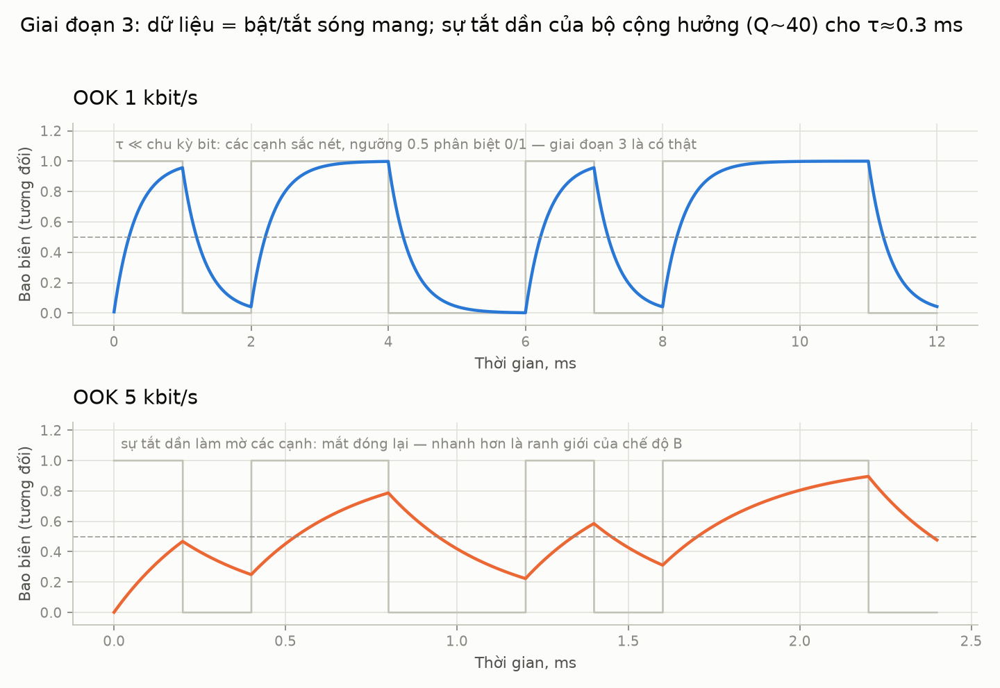
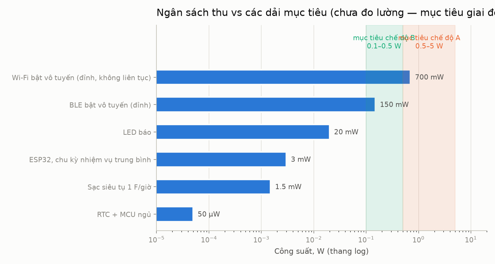
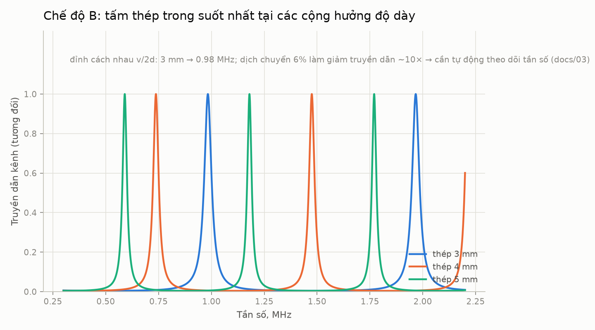

# through-metal-link

> [English (primary)](../../README.md) · [Русский](../ru/README.md) · [Deutsch](../de/README.md) · [Português](../pt/README.md) · [Español](../es/README.md) · [Français](../fr/README.md) · [Italiano](../it/README.md) · [Polski](../pl/README.md) · [Türkçe](../tr/README.md) · [Українська](../uk/README.md) · Tiếng Việt · [中文](../zh/README.md) · [日本語](../ja/README.md) · [한국어](../ko/README.md) · [हिन्दी](../hi/README.md)

Một nền tảng mở cho truyền tải điện năng và dữ liệu siêu âm xuyên qua vách kim loại đặc — "xuyên thép mà không cần một lỗ khoan nào", được chế tạo bằng các công cụ cấp độ gara.

**Thử ngay bây giờ (không cần phần cứng):** `python3 software/sweep-map/sweep_map.py --mock`

**Trạng thái:** giai đoạn 0 — chuẩn bị · 💰 **[tiền thưởng $250 cho bản dựng độc lập đầu tiên](https://github.com/zeloras/through-metal-link/issues)** · danh sách mua sắm: [QUICKSTART.md](QUICKSTART.md)

[](https://github.com/zeloras/through-metal-link/actions/workflows/ci.yml) [](https://github.com/zeloras/through-metal-link/actions/workflows/reuse.yml) [](CONTRIBUTING.md) [](LICENSES.md)

Tài liệu đa ngôn ngữ: Tiếng Anh là ngôn ngữ chính và nằm ở các đường dẫn gốc; mọi ngôn ngữ khác phản chiếu cây thư mục dưới [translations/](..). Chỉnh sửa bất kỳ ngôn ngữ nào — CI sẽ dịch và commit phần còn lại (xem [CONTRIBUTING.md](CONTRIBUTING.md)).

<p align="center"></p>

## Ý tưởng trong một đoạn văn

Sóng vô tuyến không xuyên qua kim loại (lồng Faraday), và việc xuyên cáp qua vách nghĩa là một lỗ, một lớp kín, và một điểm dễ hỏng. Ngược lại, siêu âm truyền qua kim loại rất tốt: một phần tử piezo ở mỗi bên vách biến nó thành một kênh cho cả điện năng lẫn dữ liệu. Các tài liệu phòng thí nghiệm đã chứng minh vật lý ở mức đáng kể (RPI: 50 W + 12 Mbit/s qua 63.5 mm thép; NASA JPL: lên tới ~kW qua 5 mm titan) — đây là các bằng chứng về tính khả thi với phần cứng chuyên dụng, không phải BOM garage của repo này. Các bằng sáng chế nền tảng đã hết hạn, và chưa có nền tảng mở, có thể tái lập nào tồn tại — kho lưu trữ này đang xây dựng một nền tảng như vậy, bắt đầu ở mức **điện năng hàng watt và dữ liệu kbit/s qua thép 3–5 mm** sau khi giai đoạn 2 được đo lường.

## Lộ trình

| Giai đoạn | Sản phẩm bàn giao | Tiêu chí thành công | Dự kiến |
|---|---|---|---|
| 1. Bản đồ quét | đáp ứng tần số của kênh "Langevin – thép 3 mm – Langevin" | tìm được cặp cộng hưởng, biểu đồ trong [experiments/001](experiments/001-sweep-map-3mm-steel/README.md) | [sim1](docs/img/sim1-sweep-contacts.png), [sim2](docs/img/sim2-pair-mismatch.png) |
| 2. Công suất | công suất tải tại cộng hưởng | ≥0,5 W qua 3 mm thép, quy trình trong [experiments/002](experiments/002-watts-3mm-steel/README.md) | [sim4](docs/img/sim4-power-budget.png) |
| 3. Dữ liệu | FSK/OOK qua cùng cặp đó | ≥1 kbit/s không lỗi | [sim5](docs/img/sim5-ook-datarate.png) |
| 4. Nút | ESP32 + cảm biến trong hộp hàn kín, cấp nguồn và truyền dữ liệu chỉ bằng âm thanh | ≥1 giờ hoạt động tự chủ | [sim4](docs/img/sim4-power-budget.png) |
| 5. Công bố | repo công khai, bài viết/hướng dẫn | tái tạo bởi bên thứ ba | — |

## Bản đồ kho lưu trữ

python3 software/sweep-map/sweep_map.py --mock
```

**Xong khi nào (theo từng giai đoạn):** giai đoạn 1 — đỉnh quét tái lặp lại qua hai lần chạy với sai số <200 Hz ([experiments/001](experiments/001-sweep-map-3mm-steel/README.md)); giai đoạn 2 — ≥0.5 W vào một tải đã biết xuyên qua 3 mm thép và một đèn LED sáng từ phía RX ([experiments/002](experiments/002-watts-3mm-steel/README.md)).

</details>

<details>
<summary><b>📚 Lý thuyết trong một phút</b> — <a href="docs/00-theory.md">docs/00-theory.md</a></summary>

Piezo TX được ép sát vào vách và phát một sóng dọc vào đó; piezo RX ở phía bên kia chuyển nó trở lại thành điện. Vận tốc âm thanh trong thép: ~5900 m/s.

Hai chế độ hoạt động:

| Chế độ | Tần số | Cộng hưởng xác định bởi | Đầu ra | Trạng thái |
|---|---|---|---|---|
| **A** — Đầu dò Langevin | 40 kHz | cặp đầu dò (vách ≪ λ — một "màng") | watt, kbit/s | chế độ khởi đầu (giai đoạn 1–4, [ADR-0001](docs/decisions/0001-frequency-mode-choice.md)) |
| **B** — đĩa | 0.6–1 MHz | cộng hưởng theo bề dày của vách ([lược đồ](docs/img/sim3-thickness-comb.png)) | hàng trăm mW, hàng trăm kbit/s | rẽ nhánh sau những watt đầu tiên; cần theo dõi tần số tự động |

Các tổn hao chính: sự sai lệch cộng hưởng trong cặp (±1 kHz đối với đầu dò Langevin rẻ tiền), chất lượng tiếp xúc âm thanh (epoxy > mỡ dẫn âm + kẹp > áp lực khô), lệch góc, trôi cộng hưởng theo nhiệt độ. Cách giải quyết cho tất cả đều giống nhau: **lập bản đồ quét trước mỗi thay đổi đối với thiết lập**.

</details>

<details>
<summary><b>📈 Hệ thống sẽ hiển thị gì: các biểu đồ kỳ vọng từ bộ mô phỏng</b> — <a href="software/simulator/channel_sim.py">software/simulator/channel_sim.py</a></summary>

Mô hình kênh bán thực nghiệm (không phải FEM, **không phải dữ liệu lab** — trực giác về "quét trông như thế nào và hướng tới điều gì"). Các giả định được nêu rõ trong `channel_sim.py` (Q tải ≈40, hệ số k tiếp xúc, chuỗi η≤40%). Tạo lại bằng: `python3 channel_sim.py --out ../../docs/img`.

**Giai đoạn 1 — quét.** Một đỉnh hẹp gần ~40 kHz; các hệ số tiếp xúc giữ chỗ của mô hình là mỡ:khô:khe hở = 1 : 0.25 : 0.02 (tức là mỡ ≈4× khô và ≈50× khe hở không khí). Không có đỉnh nghĩa là có vấn đề với tiếp xúc hoặc cặp đầu dò:



**Tại sao 4 đầu dò Langevin, chứ không phải 2.** Dưới Q≈40, sự sai lệch cộng hưởng 1.5 kHz trong cặp làm giảm công suất mô hình ~10×:



**Giai đoạn 3 — dữ liệu.** OOK gặp phải hiện tượng cộng hưởng vang (mô hình Q~40 → τ≈0.3 ms): 1 kbit/s rất sạch, ở 5 kbit/s mắt đã đóng. Để đi nhanh hơn cần chế độ B:



**Dự toán công suất thu.** Các dải tô bóng là **mục tiêu** (chế độ A 0.5–5 W nếu giai đoạn 2 thành công; chế độ B thấp hơn). Các tải thực tế đầu tiên là ESP32 / BLE / LED chu kỳ nhiệm vụ; Wi-Fi được hiển thị như một điểm đánh dấu tiêu thụ đỉnh, không phải một cam kết liên tục:



**Dành cho sau này (chế độ B).** Tấm thép trở nên trong suốt tại một lược đồ các cộng hưởng bề dày — tần số phải được theo dõi:



</details>

<details>
<summary><b>⚠️ An toàn — đọc trước khi cấp nguồn lần đầu</b> — <a href="docs/02-safety.md">docs/02-safety.md</a></summary>

1. **Hàng chục đến hàng trăm volt trên piezo** ngay khi driver giai đoạn 2 trực tuyến — TVS ở phía thu phải được lắp TRƯỚC lần chạy cấp nguồn đầu tiên; không chạm tay vào các dây dẫn.
2. **Điện lưới** — chỉ thông qua nguồn bench / cách ly; bo mạch driver của máy siêu âm được nối điện trực tiếp với điện lưới.
3. **Tai** — ở công suất không nhỏ, chỉ vận hành đầu dò khi đã ép sát vào kim loại; không bao giờ chạy siêu âm công suất cao trong không khí mà không có vỏ bọc.
4. **Nhiệt** — một đầu dò Langevin không được kẹp sẽ quá nhiệt trong vài phút ở mức công suất; kẹp lại trước khi tăng dòng điện (chỉ được khởi động điện bằng dòng thấp trong thời gian ngắn — xem README của driver).
5. **Mảnh vỡ** — gốm áp điện giòn: một bu-lông siết quá chặt hoặc một cú va đập sẽ tạo ra mảnh vỡ; đeo kính an toàn cho bất kỳ thao tác cơ khí nào.

docs/            lý thuyết, kỹ thuật trước đây, an toàn, ứng dụng, nhật ký quyết định (ADR)
docs/img/        đồ thị kỳ vọng (được tạo bởi software/simulator/channel_sim.py)
hardware/        BOM, driver (half-bridge), receiver (chỉnh lưu/thu năng lượng)
firmware/        firmware nút (ESP32 — stub cho đến giai đoạn 4)
software/        script đo lường (bản đồ quét đáp ứng tần số) và trình mô phỏng kênh
experiments/     giao thức thí nghiệm — từ mẫu, một thư mục = một thí nghiệm
data/            nhật ký thô (tệp lớn không đưa vào git)
```

</details>

## Nguyên lý

1. **Khả năng tái lập từ con số không.** Bất kỳ ai có một mỏ hàn và khoảng $210 đều có thể tái lập kết quả chỉ từ repo này.
2. **Mỗi thí nghiệm là một giao thức.** Không có kiểu "nó hoạt động được một chút": [experiments/TEMPLATE.md](experiments/TEMPLATE.md) là bắt buộc.
3. **Vệ sinh bằng sáng chế.** Chúng tôi xây dựng dựa trên lớp đã hết hạn ([docs/01-prior-art.md](docs/01-prior-art.md)); các quyết định được ghi lại tại [docs/decisions/](docs/decisions/0001-frequency-mode-choice.md).
4. **Đo lường trước, ý kiến sau.** Có bản đồ quét trước khi đưa ra bất kỳ kết luận nào về kênh truyền.

## Giấy phép và bằng sáng chế

Mã nguồn — Apache-2.0, phần cứng — CERN-OHL-W v2, tài liệu — CC-BY-4.0; văn bản đầy đủ tại [LICENSES/](../../LICENSES). Bất kỳ ai cũng có thể fork và phát triển dựa trên dự án này, kể cả mục đích thương mại; bảo vệ bằng sáng chế đến từ các điều khoản cấp quyền và phản đòn trong giấy phép cùng chiến lược sáng chế trước. Toàn bộ sơ đồ và giao thức công bố phòng ngự: [LICENSES.md](LICENSES.md); quy tắc đóng góp: [CONTRIBUTING.md](CONTRIBUTING.md).
