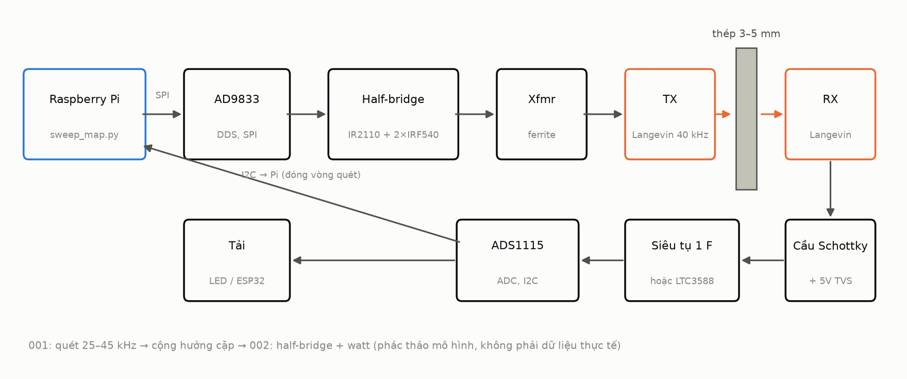
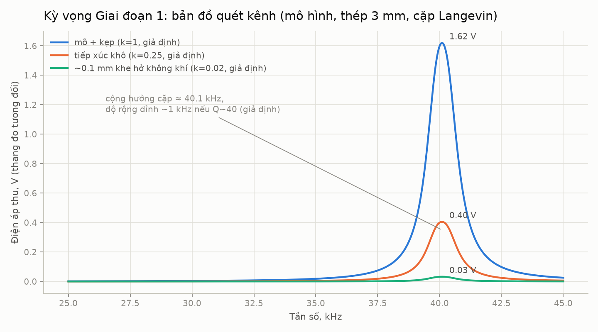
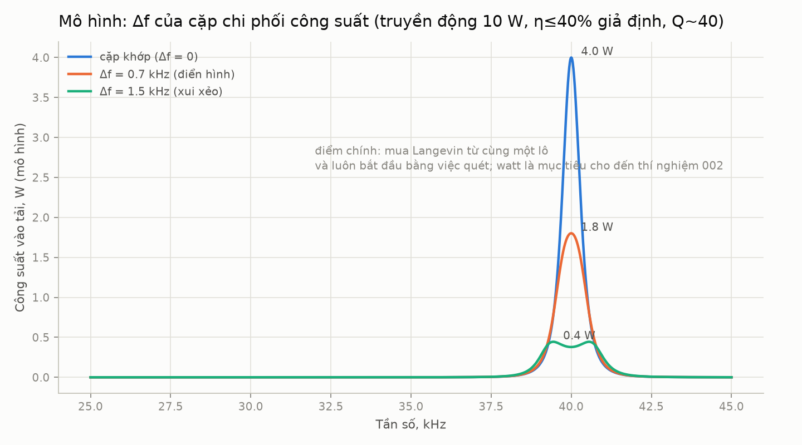
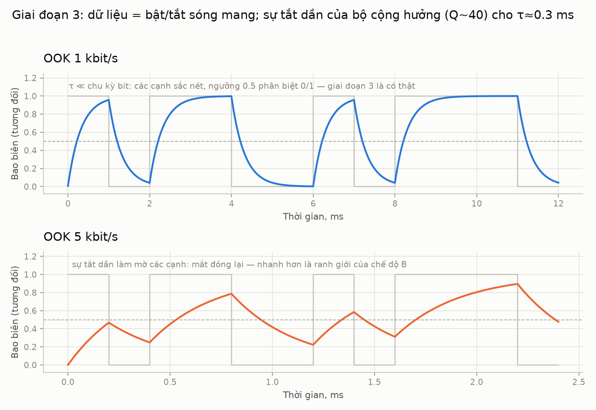
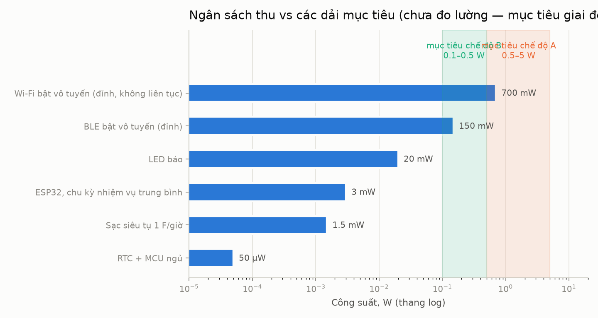
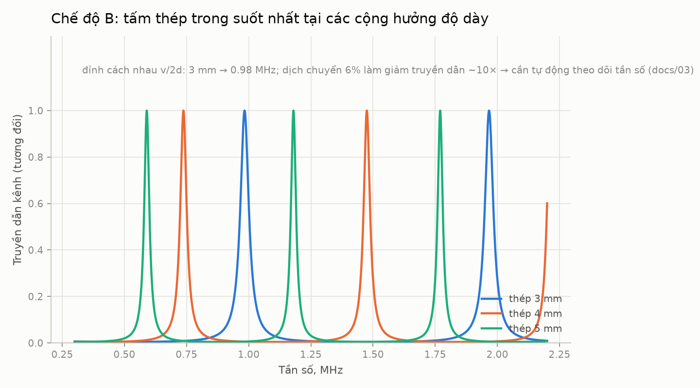

# through-metal-link

> [English (primary)](../../README.md) · [Русский](../ru/README.md) · [Deutsch](../de/README.md) · [Português](../pt/README.md) · [Español](../es/README.md) · [Français](../fr/README.md) · [Italiano](../it/README.md) · [Polski](../pl/README.md) · [Türkçe](../tr/README.md) · [Українська](../uk/README.md) · Tiếng Việt · [中文](../zh/README.md) · [日本語](../ja/README.md) · [한국어](../ko/README.md) · [हिन्दी](../hi/README.md)

Một nền tảng mở cho truyền tải siêu âm công suất và dữ liệu xuyên qua vách kim loại đặc — "xuyên thép mà không cần một lỗ nào", được xây dựng bằng phương tiện cấp xưởng tự chế.

**Thử ngay (không cần phần cứng):** `python3 software/sweep-map/sweep_map.py --mock`

**Các hướng đi:**
- **A — chạy giả lập:** quét mô phỏng + [mô phỏng kênh](../../software/simulator/channel_sim.py) (không cần bàn thí nghiệm)
- **B — dựng giai đoạn 1:** [QUICKSTART.md](QUICKSTART.md) → [experiments/001](experiments/001-sweep-map-3mm-steel/README.md)
- **C — đóng góp không cần phần cứng:** kỹ thuật trước / tài liệu / bản dịch / bình luận ADR ([CONTRIBUTING.md](CONTRIBUTING.md))

**Trạng thái:** giai đoạn 0 — chuẩn bị · **chưa có kiểm chứng phần cứng** (chỉ mô phỏng; phần thưởng cho bản dựng đầu tiên) · 💰 **[thưởng $250](https://github.com/zeloras/through-metal-link/issues/5)** · danh sách mua sắm: [QUICKSTART.md](QUICKSTART.md)

[](https://github.com/zeloras/through-metal-link/actions/workflows/ci.yml) [](https://github.com/zeloras/through-metal-link/actions/workflows/reuse.yml) [](CONTRIBUTING.md) [](LICENSES.md)

Tài liệu đa ngôn ngữ: tiếng Anh là ngôn ngữ chính và nằm ở các đường dẫn chuẩn; mọi ngôn ngữ khác phản chiếu cây thư mục dưới [translations/](..). Chỉnh sửa bất kỳ ngôn ngữ nào — CI dịch và commit phần còn lại (xem [CONTRIBUTING.md](CONTRIBUTING.md)).



## Ý tưởng trong một đoạn văn

Sóng vô tuyến không xuyên qua kim loại (lồng Faraday), và việc luồn cáp qua vách nghĩa là một lỗ, một lớp kín, và một điểm dễ hỏng. Ngược lại, siêu âm truyền qua kim loại rất tốt: một phần tử piezo ở mỗi mặt vách biến nó thành một kênh cho cả công suất lẫn dữ liệu. Tài liệu phòng thí nghiệm đã chứng minh vật lý ở mức nghiêm túc (RPI: 50 W + 12 Mbit/s xuyên 63,5 mm thép; NASA JPL: tới ~kW xuyên 5 mm titan) — đó là bằng chứng tồn tại với phần cứng chuyên dụng, không phải BOM xưởng tự chế của repo này. Các bằng sáng chế nền tảng đã hết hạn, và chưa có nền tảng mở, tái lập nào tồn tại — repo này đang xây dựng một cái, bắt đầu ở **công suất cấp watt và dữ liệu kbit/s xuyên 3–5 mm thép** khi giai đoạn 2 được đo lường.

## Lộ trình

| Giai đoạn | Kết quả bàn giao | Tiêu chí thành công | Dự kiến |
|---|---|---|---|
| 1. Bản đồ quét | đáp ứng tần số của kênh "Langevin–3 mm thép–Langevin" | tìm được cặp cộng hưởng, biểu đồ trong [experiments/001](experiments/001-sweep-map-3mm-steel/README.md) | [sim1](docs/img/sim1-sweep-contacts.png), [sim2](docs/img/sim2-pair-mismatch.png) |
| 2. Watt | công suất vào tải tại cộng hưởng | ≥0,5 W xuyên 3 mm thép, giao thức trong [experiments/002](experiments/002-watts-3mm-steel/README.md) | [sim4](docs/img/sim4-power-budget.png) |
| 3. Dữ liệu | FSK/OOK trên cùng cặp | ≥1 kbit/s không lỗi | [sim5](docs/img/sim5-ook-datarate.png) |
| 4. Nút | ESP32 + cảm biến trong hộp hàn kín, cấp nguồn và đo lường chỉ bằng âm thanh | ≥1 giờ hoạt động tự trị | [sim4](docs/img/sim4-power-budget.png) |
| 5. Xuất bản | nhân bản độc lập đầu tiên + bài viết/hướng dẫn + bản chụp Zenodo | tái hiện bên thứ ba được ghi nhận | — |

## Sơ đồ kho lưu trữ

Mỗi khối dưới đây là một tóm tắt đủ để làm việc, kèm liên kết tới tài liệu đầy đủ.

### 🛒 Từ con số không đến dàn thí nghiệm hoạt động: mua gì và theo thứ tự nào — [QUICKSTART.md](QUICKSTART.md)

**Ngân sách:** ~$210 tối thiểu, ~$300 thoải mái (giảm ~$120 nếu bạn đã có Pi, mỏ hàn, và nguồn cấp bàn). Ba giỏ: dụng cụ (~$120), điện tử dàn (~$70, [BOM đầy đủ](hardware/bom/bom-stage1.csv)), cơ khí (~$20). Tùy chọn nhưng rất khuyến nghị: oscilloscope USB (~$60–80).

**Đường tới hạn — giao hàng AliExpress (3–4 tuần):** đặt mua điện tử ngay ngày đầu tiên. Quyết định then chốt: mua **4 đầu đổi Langevin từ cùng một lô** — lần quét sẽ chọn cặp tốt nhất ([lý do](docs/img/sim2-pair-mismatch.png)).

**Trong lúc chờ hàng:** chạy giả lập toàn bộ quy trình mà không cần phần cứng —

```bash
python3 software/sweep-map/sweep_map.py --mock
```

**Xong khi (theo giai đoạn):** giai đoạn 1 — đỉnh quét tái lập qua hai lần chạy trong sai số <200 Hz ([experiments/001](experiments/001-sweep-map-3mm-steel/README.md)); giai đoạn 2 — ≥0,5 W vào tải đã biết xuyên 3 mm thép và đèn LED sáng từ phía RX ([experiments/002](experiments/002-watts-3mm-steel/README.md)).

### 📚 Lý thuyết trong một phút — [docs/00-theory.md](docs/00-theory.md)

Piezo TX được ép sát vào vách và phát sóng dọc vào trong; piezo RX ở mặt kia biến nó trở lại thành điện. Vận tốc âm trong thép: ~5900 m/s.

Hai chế độ hoạt động:

| Chế độ | Tần số | Cộng hưởng xác định bởi | Cho ra | Trạng thái |
|---|---|---|---|---|
| **A** — đầu đổi Langevin | 40 kHz | cặp đầu đổi (vách ≪ λ — "màng") | watt, kbit/s | chế độ khởi đầu (giai đoạn 1–4, [ADR-0001](docs/decisions/0001-frequency-mode-choice.md)) |
| **B** — đĩa | 0,6–1 MHz | cộng hưởng bề dày vách ([lược](docs/img/sim3-thickness-comb.png)) | hàng trăm mW, hàng trăm kbit/s | nhánh sau khi có watt đầu tiên; cần theo dõi tần số tự động |

Các tổn thất chính: lệch cộng hưởng trong cặp (±1 kHz với đầu Langevin rẻ), chất lượng tiếp xúc âm (epoxy > chất kết hợp mỡ + kẹp > ép khô), lệch trục, trôi cộng hưởng theo nhiệt độ. Câu trả lời cho tất cả là giống nhau: **bản đồ quét trước mỗi thay đổi thiết lập**.

### 📈 Dàn thí nghiệm nên cho thấy gì: biểu đồ dự kiến từ mô phỏng — [software/simulator/channel_sim.py](../../software/simulator/channel_sim.py)

Mô hình kênh bán thực nghiệm (không phải FEM, **không phải dữ liệu phòng thí nghiệm** — chỉ để xây dựng trực giác về "quét nên trông thế nào và nhắm vào đâu"). Các giả thiết được nêu rõ trong `channel_sim.py` (Q nạp ≈40, hệ số tiếp xúc, hiệu suất chuỗi η≤40%). Tạo lại bằng: `python3 channel_sim.py --out ../../docs/img`.

**Giai đoạn 1 — quét.** Một đỉnh hẹp gần ~40 kHz; các hệ số tiếp xúc giả định trong mô hình là mỡ:không:khe hở = 1 : 0,25 : 0,02 (tức là mỡ ≈4× khô và ≈50× khe khí). Không có đỉnh nghĩa là vấn đề ở tiếp xúc hoặc cặp:



**Tại sao 4 đầu Langevin, chứ không phải 2.** Với Q≈40, lệch cộng hưởng 1,5 kHz trong cặp làm công suất mô hình giảm ~10×:



**Giai đoạn 3 — dữ liệu.** OOK vấp phải hiện tượng vang của cộng hưởng (mô hình Q~40 → τ≈0,3 ms): 1 kbit/s sạch, ở 5 kbit/s mắt dữ liệu đã đóng. Muốn nhanh hơn phải dùng chế độ B:



**Ngân sách công suất phía thu.** Các dải tô đậm là **mục tiêu** (chế độ A 0,5–5 W nếu giai đoạn 2 thành công; chế độ B thấp hơn). Các tải thực tế đầu tiên là ESP32 / BLE / LED chu kỳ nhiệm vụ; Wi-Fi được vẽ như điểm đánh dấu tiêu thụ đỉnh, không phải cam kết liên tục:



**Cho sau này (chế độ B).** Tấm vách trở nên trong suốt tại một lược cộng hưởng bề dày — tần số phải được theo dõi:



### ⚠️ An toàn — đọc trước khi cấp điện lần đầu — [docs/02-safety.md](docs/02-safety.md)

1. **Hàng chục đến hàng trăm volt trên piezo** khi driver giai đoạn 2 hoạt động — TVS phía thu phải được lắp TRƯỚC lần cấp điện đầu tiên; không chạm tay vào dây dẫn.
2. **Điện lưới** — chỉ qua nguồn cấp bàn / cách ly; board driver của máy siêu âm được nối galvanic với điện lưới.
3. **Tai** — ở công suất đáng kể, chỉ vận hành đầu đổi khi đã ép vào kim loại; không chạy siêu âm công suất cao trong không khí mà không có vỏ che.
4. **Nhiệt** — đầu Langevin không kẹp sẽ quá nhiệt trong vài phút ở công suất; kẹp trước khi tăng dòng (chỉ chạy thử điện dòng thấp ngắn — xem README của driver).
5. **Mảnh vỡ** — gốm piezo giòn: bu-lông siết quá chặt hoặc va đập sẽ tạo mảnh vỡ; đeo kính bảo hộ cho mọi thao tác cơ khí.

Cấp điện driver lần đầu: giới hạn dòng nguồn bàn 0,2 A; trình tự đầy đủ trong [hardware/driver/](hardware/driver/README.md) và [docs/02-safety.md](docs/02-safety.md).

### 🧭 Kỹ thuật trước và vệ sinh bằng sáng chế — [docs/01-prior-art.md](docs/01-prior-art.md)

Mọi quyết định kỹ thuật phải truy ngược được đến một nguồn "tự do" (bằng sáng chế hết hạn, bài báo). Nền tảng: **US5982297** (Aerospace Corp — công thức cơ bản cho cặp piezo xuyên vách), **US7902943** (Caltech/JPL — feed-through của Sherrit), **US9361877** (Univ. Oklahoma — hệ thống thu phát hoàn chỉnh); đều đã hết hạn. Bài báo then chốt: Lawry 2013 (50 W + 12,4 Mbit/s xuyên 63,5 mm thép), Sherrit/NASA (đèn 100 W), Yang 2015 (tổng quan).

Không được sao chép khi còn sống: phân bổ OFDM và sơ đồ full-duplex của RPI cùng đầu đổi conformal của Drexel (Mỹ, đến ~2032–2033 — giai đoạn 1–4 không cần cái nào), cộng thêm các họ mà lần tìm kiếm 2026-08 bổ sung: **US8594572B1** (Hải quân Mỹ — đọc trên chính kênh công suất trần; Mỹ, đến 2032; Welle 1997 là đáp án kỹ thuật trước), **EP3723304B1** (ABB — phổ công suất *dưới* phổ dữ liệu; DE/GB, đến 2039; sơ đồ uplink điều biến tải cùng sóng mang dự kiến nằm ngoài phạm vi), **Ultrapower** (cảm biến trong ống với mảng lồi/lõm, hoặc thanh xuyên vách; Mỹ, đến 2035 — chúng tôi dùng đệm phẳng và không có thanh). Đọc claim, trạng thái và cách né thiết kế: [docs/01-prior-art.md](docs/01-prior-art.md).

Quyết định kiến trúc được ghi lại trong [docs/decisions/](docs/decisions/0001-frequency-mode-choice.md) (ADR).

### 🔌 Phần cứng và firmware — hardware/, firmware/

- [hardware/bom/bom-stage1.csv](hardware/bom/bom-stage1.csv) — danh sách mua sắm giai đoạn 1.
- [hardware/schematics/](hardware/schematics/README.md) — **sơ đồ mạch** (sinh từ code): driver, thu, chân Pi, nút thu hoạch.
- [hardware/driver/](hardware/driver/README.md) — driver TX: half-bridge IR2110 + 2×IRF540, biến áp ghép (đầu Langevin là tải điện dung!). Board KiCad sẽ làm sau khi nguyên mẫu breadboard kiểm tra xong.
- [hardware/receiver/](hardware/receiver/README.md) — phía thu, từng giai đoạn: cầu Schottky → ADC (giai đoạn 1) → tải (giai đoạn 2) → LTC3588 + siêu tụ + ESP32 (giai đoạn 4).
- [firmware/node-esp32/](firmware/node-esp32/README.md) — nút giai đoạn 4 (stub): deep sleep, đọc cảm biến, quảng cáo BLE, ngân sách 1–5 mW trung bình.

### 💻 Phần mềm: đo lường và mô phỏng — software/

- [software/sweep-map/sweep_map.py](../../software/sweep-map/sweep_map.py) — công cụ chủ lực giai đoạn 1: quét DDS → đọc ADC → CSV + biểu đồ đáp ứng tần số. Có `--mock` để chạy không cần phần cứng. Trên Pi: `raspi-config` → bật SPI và I2C; `pip install spidev smbus2 matplotlib`.
- [software/simulator/channel_sim.py](../../software/simulator/channel_sim.py) — trình tạo biểu đồ dự kiến (`pip install numpy matplotlib`).
- [software/simulator/material_map.py](../../software/simulator/material_map.py) — cùng mô hình kênh qua các vật liệu vách — titan, nhôm, kính, gốm, nhựa, bê tông; nghiên cứu và kết luận: [docs/06-materials.md](docs/06-materials.md).
- [data/](data/README.md) — log thô; CSV/PNG không đưa vào git, chỉ các biểu đồ được tuyển chọn mới vào git trong thư mục của thí nghiệm.

### 🗺️ Áp dụng ở đâu: rào cản, kênh, ngách — [docs/04-hybrid-channels.md](docs/04-hybrid-channels.md), [docs/05](docs/05-applications-map.md)

Không có kênh phổ dụng — nền tảng ghép vật lý với rào cản: piezo-âm (chính: thép/nhôm có tiếp xúc — watt và kbit/s), EMAT (kim loại bẩn/nóng, không tiếp xúc — dữ liệu), từ trường tần số thấp (vách sandwich chân không của dewar — bit/s). Ngõ cụt thành thật: vách lót cao su/composite, chất lỏng sủi bọt trên đường truyền.

Ưu tiên ngách: **(1)** buồng chân không và cryostat phòng thí nghiệm — khán giả phần cứng mã nguồn mở, không cần chứng nhận; **(2)** bồn lên men — bãi thử nghiệm trong tầm đi bộ; **(3)** khối pin kín — trường hợp旗舰 (phát hiện nhiệt cháy mà không xuyên vào khối). Giao thức khám phá thu và tự chỉnh (tương tự Qi): [docs/03-discovery-protocol.md](docs/03-discovery-protocol.md).

### 📁 Bố cục thư mục

```
docs/            lý thuyết, kỹ thuật trước, an toàn, ứng dụng, nhật ký quyết định (ADR)
docs/img/        biểu đồ dự kiến (do software/simulator/channel_sim.py tạo)
hardware/        BOM, driver (half-bridge), thu (chỉnh lưu/thu hoạch)
firmware/        firmware nút (ESP32 — stub đến giai đoạn 4)
software/        script đo lường (bản đồ quét đáp ứng tần số) và mô phỏng kênh
experiments/     giao thức thí nghiệm — từ mẫu, một thư mục = một thí nghiệm
data/            log thô (file lớn không đưa vào git)
```

## Nguyên tắc

1. **Tái lập từ con số không.** Bất kỳ ai có mỏ hàn và ~$210 đều có thể tái lập kết quả chỉ từ repo này.
2. **Mọi thí nghiệm là một giao thức.** Không có "nó chạy cũng tạm": [experiments/TEMPLATE.md](experiments/TEMPLATE.md) là bắt buộc.
3. **Vệ sinh bằng sáng chế.** Chúng tôi xây trên tầng đã hết hạn ([docs/01-prior-art.md](docs/01-prior-art.md)); quyết định được ghi trong [docs/decisions/](docs/decisions/0001-frequency-mode-choice.md).
4. **Đo lường trước, ý kiến sau.** Một bản đồ quét trước mọi kết luận về kênh.

## Giấy phép và bằng sáng chế

Code — Apache-2.0, phần cứng — CERN-OHL-W v2, tài liệu — CC-BY-4.0; văn bản đầy đủ trong [LICENSES/](../../LICENSES). Bất kỳ ai cũng có thể fork và xây dựng trên nền này, kể cả thương mại; bảo vệ bằng sáng chế đến từ các điều khoản cấp quyền và phản đòn trong giấy phép cộng với chiến lược kỹ thuật trước. Toàn bộ sơ đồ và giao thức xuất bản phòng thủ: [LICENSES.md](LICENSES.md); quy tắc đóng góp: [CONTRIBUTING.md](CONTRIBUTING.md).
