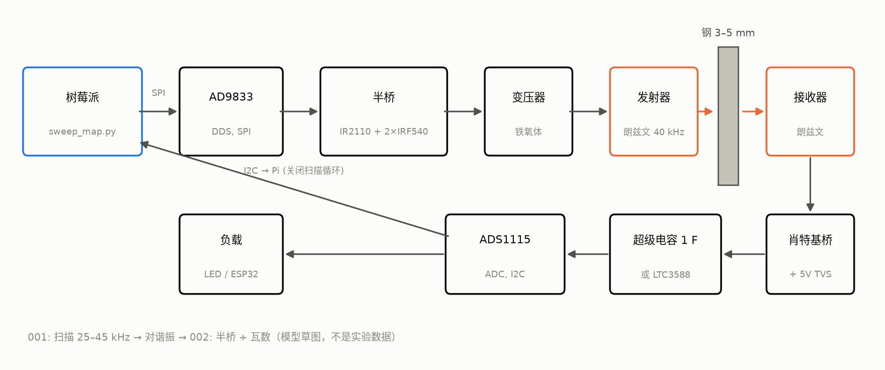
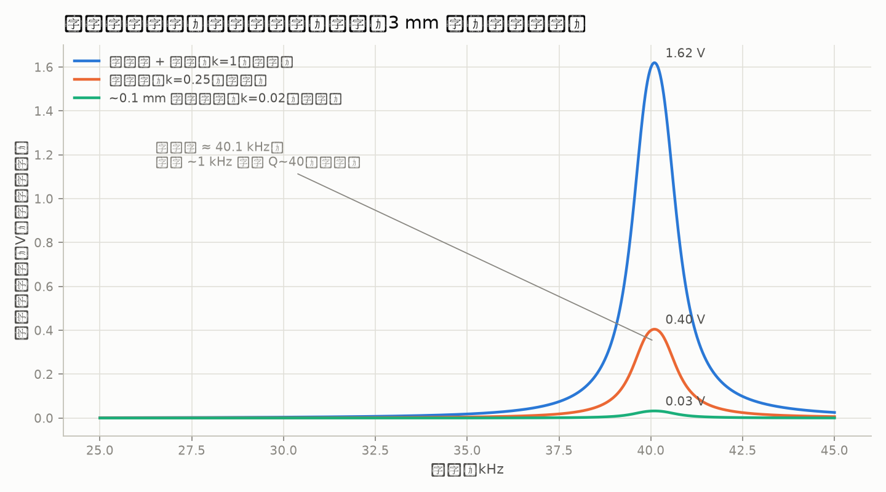
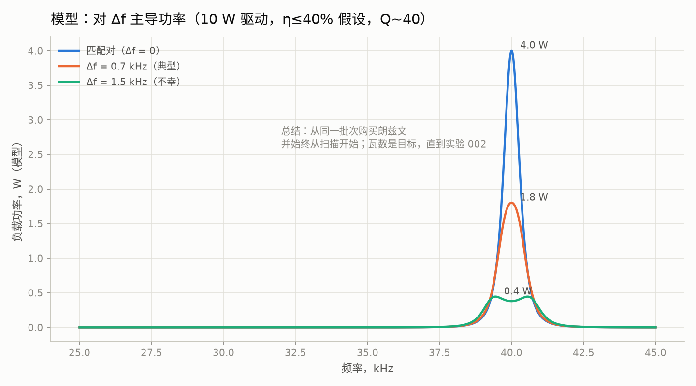
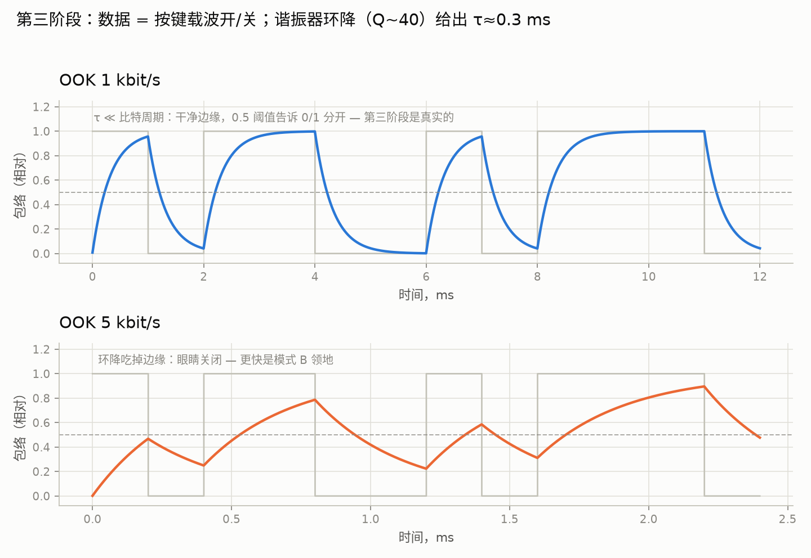
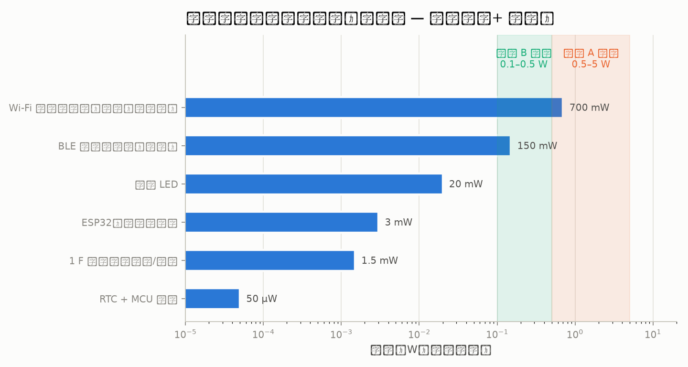
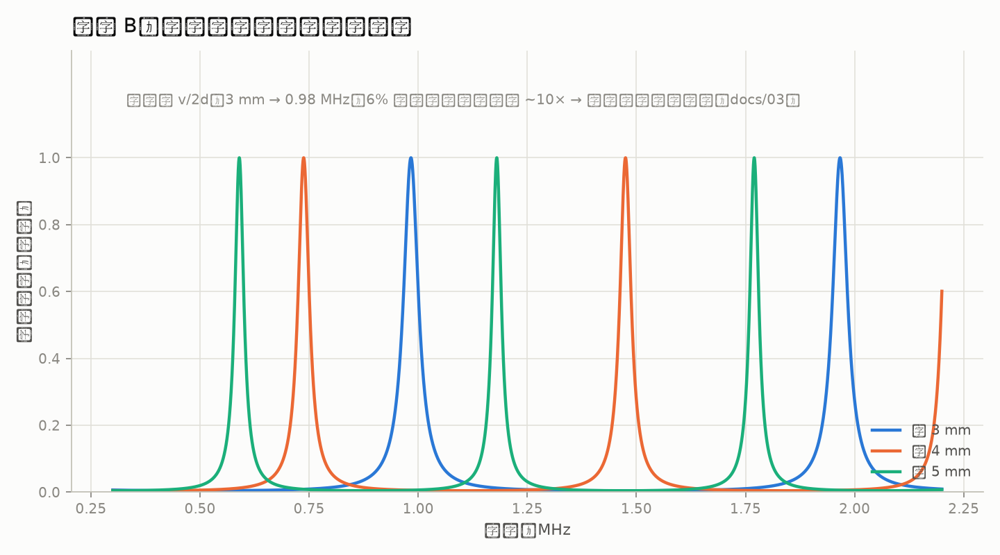

# through-metal-link

> [English (primary)](../../README.md) · [Русский](../ru/README.md) · [Deutsch](../de/README.md) · [Português](../pt/README.md) · [Español](../es/README.md) · [Français](../fr/README.md) · [Italiano](../it/README.md) · [Polski](../pl/README.md) · [Türkçe](../tr/README.md) · [Українська](../uk/README.md) · [Tiếng Việt](../vi/README.md) · 中文 · [日本語](../ja/README.md) · [한국어](../ko/README.md) · [हिन्दी](../hi/README.md)

一个用于通过固体金属壁进行超声波功率与数据传输的开放平台——"穿过钢板，不留一个孔"，用车库级手段打造。

**立即体验（无需硬件）：** `python3 software/sweep-map/sweep_map.py --mock`

**状态：** 阶段 0 — 准备中 · 💰 **[首个独立构建可获 $250 悬赏](https://github.com/zeloras/through-metal-link/issues)** · 采购清单：[QUICKSTART.md](QUICKSTART.md)

[](https://github.com/zeloras/through-metal-link/actions/workflows/ci.yml) [](https://github.com/zeloras/through-metal-link/actions/workflows/reuse.yml) [](CONTRIBUTING.md) [](LICENSES.md)

文档是多语言的：英语为主语言，存放在规范路径下；其他每种语言在 [translations/](..) 下镜像整棵目录树。编辑任意语言——CI 会翻译并提交其余语言（详见 [CONTRIBUTING.md](CONTRIBUTING.md)）。

<p align="center"></p>

## 一段话概述

无线电波无法穿透金属（法拉第笼效应），而电缆穿墙意味着开孔、密封件和一个故障点。超声波则不然，它在金属中传播毫无问题：在墙壁两侧各放一个压电元件，就能把金属壁变成一条同时传输电力和数据的通道。实验室文献早已在相当高的量级上验证了物理可行性（RPI：50 W + 12 Mbit/s 穿透 63.5 mm 钢板；NASA JPL：最高约 kW 穿透 5 mm 钛板）——这些是使用专用硬件的存在性验证，并非本仓库的家用级 BOM。基础专利已经过期，而目前还没有一个开放、可复现的平台——本仓库正在构建这样一个平台，起步目标是在第二阶段完成测量后实现 **瓦级功率和 kbit/s 数据穿透 3–5 mm 钢板**。

## 路线图

| 阶段 | 交付物 | 成功标准 | 预期 |
|---|---|---|---|
| 1. 扫频图谱 | "Langevin–3 mm 钢板–Langevin" 通道的频率响应 | 找到配对谐振，图表见 [experiments/001](experiments/001-sweep-map-3mm-steel/README.md) | [sim1](docs/img/sim1-sweep-contacts.png), [sim2](docs/img/sim2-pair-mismatch.png) |
| 2. 功率 | 谐振时输入负载的功率 | 穿过 3 mm 钢板 ≥0.5 W，方案见 [experiments/002](experiments/002-watts-3mm-steel/README.md) | [sim4](docs/img/sim4-power-budget.png) |
| 3. 数据 | 在同一换能器对上实现 FSK/OOK | ≥1 kbit/s 无误码 | [sim5](docs/img/sim5-ook-datarate.png) |
| 4. 节点 | ESP32 + 传感器置于焊接密封盒中，仅靠声波供电与遥测 | ≥1 小时自主运行 | [sim4](docs/img/sim4-power-budget.png) |
| 5. 发表 | 仓库公开，文章/教程 | 第三方可复现 | — |

## 仓库地图

python3 software/sweep-map/sweep_map.py --mock
```

**完成标志（按阶段）：** 阶段 1 —— 两次运行的扫频峰值复现误差在 <200 Hz 以内（[experiments/001](experiments/001-sweep-map-3mm-steel/README.md)）；阶段 2 —— 通过 3 毫米钢壁向已知负载输出 ≥0.5 W，并且 RX 侧的 LED 点亮（[experiments/002](experiments/002-watts-3mm-steel/README.md)）。

</details>

<details>
<summary><b>📚 一分钟理论</b> — <a href="docs/00-theory.md">docs/00-theory.md</a></summary>

压电 TX 紧贴在壁上，向其中发射纵波；另一侧的压电 RX 将其转换回电能。钢中的声速：约 5900 m/s。

两种工作模式：

| 模式 | 频率 | 谐振由...决定 | 产出 | 状态 |
|---|---|---|---|---|
| **A** — 朗之万换能器 | 40 kHz | 换能器对（壁厚 ≪ λ —— “膜”模式） | 瓦特、kbit/s | 起步模式（阶段 1–4，[ADR-0001](docs/decisions/0001-frequency-mode-choice.md)） |
| **B** — 圆片 | 0.6–1 MHz | 壁的厚度谐振（[梳状](docs/img/sim3-thickness-comb.png)） | 数百 mW、数百 kbit/s | 在达到首个瓦特后分支；需要自动频率跟踪 |

主要损耗：换能器对内的谐振失配（便宜的朗之万换能器为 ±1 kHz）、声接触质量（环氧树脂 > 导热脂耦合剂 + 夹具 > 干压）、不对齐、谐振随温度漂移。应对所有这些的答案都是一样的：**每次更改设置前都要做一次扫频图**。

</details>

<details>
<summary><b>📈 装置应该展示什么：来自模拟器的预期图</b> — <a href="software/simulator/channel_sim.py">software/simulator/channel_sim.py</a></summary>

半经验信道模型（不是 FEM，**也不是实验室数据** —— 用于建立“扫频应该长什么样以及目标是什么”的直觉）。假设在 `channel_sim.py` 中明确列出（加载 Q≈40，接触 k 因子，链路 η≤40%）。重新生成：`python3 channel_sim.py --out ../../docs/img`。

**阶段 1 —— 扫频。** 在 ~40 kHz 附近有一个窄峰；模型的占位接触乘数为 脂:干:气隙 = 1 : 0.25 : 0.02（即脂 ≈4× 干压，≈50× 气隙）。没有峰值意味着接触或换能器对有问题：



**为什么是 4 个朗之万换能器，而不是 2 个。** 在 Q≈40 下，换能器对内 1.5 kHz 的谐振失配会使模型功率下降约 10 倍：



**阶段 3 —— 数据。** OOK 遇到谐振器振铃（模型 Q~40 → τ≈0.3 ms）：1 kbit/s 很干净，在 5 kbit/s 时眼图闭合。要更快就需要模式 B：



**接收端功率预算。** 阴影带是**目标**（如果阶段 2 达标，模式 A 为 0.5–5 W；模式 B 更低）。现实的首批负载是占空比运行的 ESP32 / BLE / LED；Wi-Fi 显示为峰值功耗标记，而不是持续的承诺：



**稍后（模式 B）。** 钢板在厚度谐振梳处变得透明 —— 必须跟踪频率：



</details>

<details>
<summary><b>⚠️ 安全 —— 首次通电前必读</b> — <a href="docs/02-safety.md">docs/02-safety.md</a></summary>

1. **压电片上有几十到几百伏电压** 一旦阶段 2 驱动器通电 —— 接收端的 TVS 必须在首次通电运行前装好；不要用手碰引线。
2. **市电** —— 只能通过台式电源 / 隔离器连接；超声波清洗机驱动板与市电是电连接的。
3. **耳朵** —— 在非小功率下，换能器必须紧贴金属操作；绝不能在没有外壳的情况下运行高功率空气超声。
4. **发热** —— 未夹紧的朗之万换能器在通电后几分钟内就会过热；在提高电流前先夹紧（仅限短暂的低电流电气调试 —— 见驱动器 README）。
5. **碎片** —— 压电陶瓷很脆：螺栓拧得太紧或受到冲击都会产生碎片；进行任何机械操作时请佩戴安全眼镜。

</details>

docs/            理论、先有技术、安全、应用、决策日志 (ADR)
docs/img/        期望图（由 software/simulator/channel_sim.py 生成）
hardware/        BOM、驱动器（半桥）、接收器（整流器/能量收集）
firmware/        节点固件（ESP32 — 阶段 4 前为桩代码）
software/        测量脚本（频率响应扫频图）与通道仿真器
experiments/     实验方案 — 基于模板，一个目录 = 一个实验
data/            原始日志（大文件不纳入 git）
```

</details>

## 原则

1. **从零开始的可复现性。** 任何人只要有一把烙铁和大约 $210，就能仅凭本仓库复现结果。
2. **每个实验都是一份协议。** 不存在"好像能用"这种说法：[experiments/TEMPLATE.md](experiments/TEMPLATE.md) 是强制性的。
3. **专利合规。** 我们基于已过期的专利层进行构建（[docs/01-prior-art.md](docs/01-prior-art.md)）；决策记录在 [docs/decisions/](docs/decisions/0001-frequency-mode-choice.md) 中。
4. **测量优先，观点其次。** 在对信道下任何结论之前，先做一次扫频映射。

## 许可证与专利

代码 — Apache-2.0，硬件 — CERN-OHL-W v2，文档 — CC-BY-4.0；完整文本见 [LICENSES/](../../LICENSES)。任何人都可以 fork 并在此基础上构建，包括商业用途；专利保护来自许可证中的授权与反制条款，以及现有技术策略。完整方案与防御性公开协议：[LICENSES.md](LICENSES.md)；贡献规则：[CONTRIBUTING.md](CONTRIBUTING.md)。
