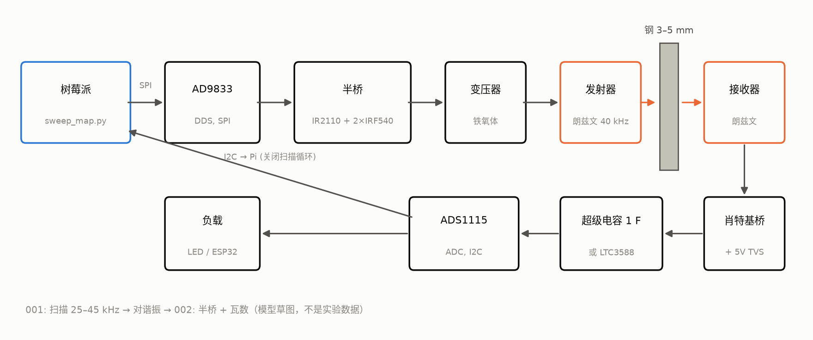
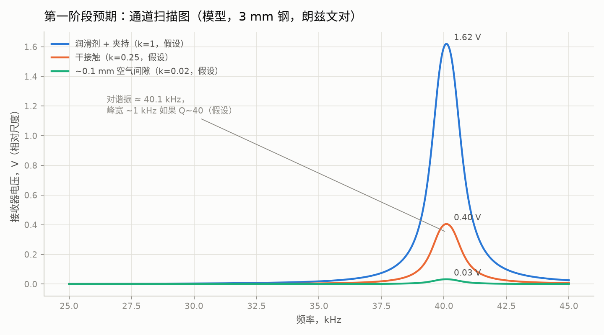
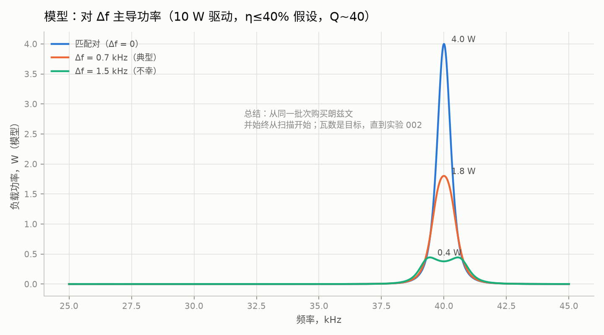
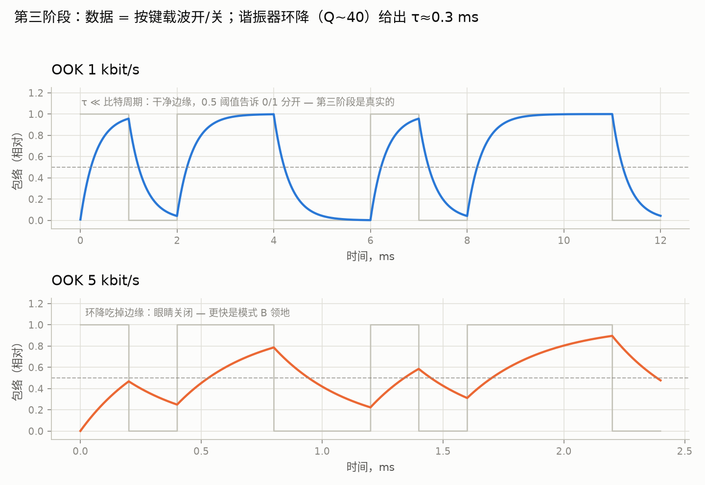
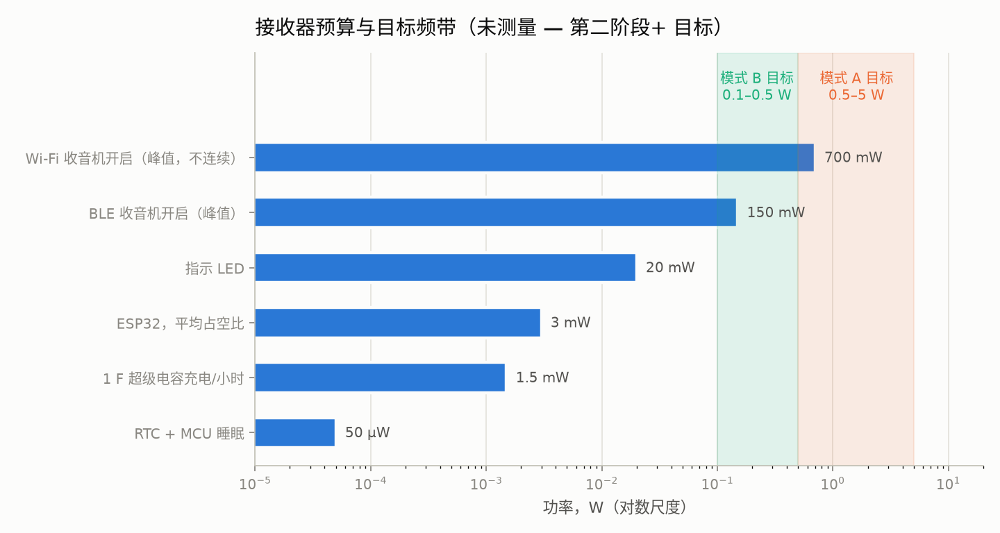
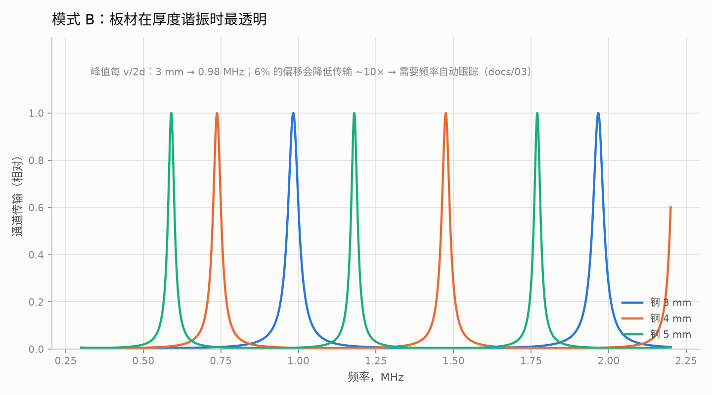

# through-metal-link

> [English (primary)](../../README.md) · [Русский](../ru/README.md) · [Deutsch](../de/README.md) · [Português](../pt/README.md) · [Español](../es/README.md) · [Français](../fr/README.md) · [Italiano](../it/README.md) · [Polski](../pl/README.md) · [Türkçe](../tr/README.md) · [Українська](../uk/README.md) · [Tiếng Việt](../vi/README.md) · 中文 · [日本語](../ja/README.md) · [한국어](../ko/README.md) · [हिन्दी](../hi/README.md)

一个用于通过固体金属壁进行超声波功率与数据传输的开放平台——"穿过钢板，不留一个孔"，用车库级手段搭建。

**立即体验（无需硬件）：** `python3 software/sweep-map/sweep_map.py --mock`

**入门路径：**
- **A — 干跑：** 模拟扫频 + [仿真器](../../software/simulator/channel_sim.py)（无需实验台）
- **B — 搭建阶段 1：** [QUICKSTART.md](QUICKSTART.md) → [experiments/001](experiments/001-sweep-map-3mm-steel/README.md)
- **C — 无硬件贡献：** 现有技术 / 文档 / 翻译 / ADR 评论（[CONTRIBUTING.md](CONTRIBUTING.md)）

**状态：** 阶段 0 — 准备中 · **尚无硬件验证**（仅仿真器；首个搭建者有赏金）· 💰 **[$250 赏金](https://github.com/zeloras/through-metal-link/issues/5)** · 采购清单：[QUICKSTART.md](QUICKSTART.md)

[](https://github.com/zeloras/through-metal-link/actions/workflows/ci.yml) [](https://github.com/zeloras/through-metal-link/actions/workflows/reuse.yml) [](CONTRIBUTING.md) [](LICENSES.md)

文档是多语言的：英文为主语言，位于规范路径下；其他每种语言在 [translations/](..) 下镜像整个目录树。编辑任何语言——CI 会翻译并提交其余语言（参见 [CONTRIBUTING.md](CONTRIBUTING.md)）。



## 一段话讲清原理

无线电波穿不过金属（法拉第笼），而电缆穿墙意味着一个孔、一个密封件和一个故障点。超声波则不同，它在金属中传播毫无问题：在壁的两侧各放一个压电元件，就能把它变成一条功率和数据的通道。实验室文献已经在很高水平上验证了物理可行性（RPI：50 W + 12 Mbit/s 穿过 63.5 mm 钢板；NASA JPL：最高约 kW 穿过 5 mm 钛板）——这些是使用专用硬件的存在性证明，而非本仓库的车库级 BOM。基础专利已过期，但目前还没有一个开放、可复现的平台——本仓库正在构建这样一个平台，目标是在阶段 2 完成测量后实现 **瓦级功率和 kbit/s 数据穿过 3–5 mm 钢板**。

## 路线图

| 阶段 | 交付物 | 成功标准 | 预期 |
|---|---|---|---|
| 1. 扫频图 | "Langevin–3 mm 钢板–Langevin" 通道的频率响应 | 找到配对谐振，图表见 [experiments/001](experiments/001-sweep-map-3mm-steel/README.md) | [sim1](docs/img/sim1-sweep-contacts.png), [sim2](docs/img/sim2-pair-mismatch.png) |
| 2. 瓦级 | 谐振时输入负载的功率 | ≥0.5 W 穿过 3 mm 钢板，协议见 [experiments/002](experiments/002-watts-3mm-steel/README.md) | [sim4](docs/img/sim4-power-budget.png) |
| 3. 数据 | 在同一对换能器上实现 FSK/OOK | ≥1 kbit/s 无误码 | [sim5](docs/img/sim5-ook-datarate.png) |
| 4. 节点 | ESP32 + 传感器放入焊接密封盒，仅靠声波供电和遥测 | ≥1 小时自主运行 | [sim4](docs/img/sim4-power-budget.png) |
| 5. 发表 | 首次独立复现 + 文章/教程 + Zenodo 快照 | 有文档记录的第三方复现 | — |

## 仓库地图

以下每个区块都是一个足以开始工作的摘要，并附完整文档链接。

### 🛒 从零到可用的实验装置：买什么、按什么顺序买 — [QUICKSTART.md](QUICKSTART.md)

**预算：** 最低约 $210，舒适约 $300（如果你已有 Pi、烙铁和台式电源，可省约 $120）。三个购物篮：工具（约 $120）、实验电子件（约 $70，[完整 BOM](hardware/bom/bom-stage1.csv)）、机械件（约 $20）。可选但强烈推荐：USB 示波器（约 $60–80）。

**关键路径 — AliExpress 发货（3–4 周）：** 第一天就下单电子件。关键决策：**从同一批次购买 4 个 Langevin 换能器**——扫频会挑出最佳配对（[原因](docs/img/sim2-pair-mismatch.png)）。

**等待发货期间：** 无硬件干跑整个流程——

```bash
python3 software/sweep-map/sweep_map.py --mock
```

**完成标准（按阶段）：** 阶段 1 — 两次运行的扫频峰值复现误差 <200 Hz（[experiments/001](experiments/001-sweep-map-3mm-steel/README.md)）；阶段 2 — ≥0.5 W 输入已知负载穿过 3 mm 钢板，且接收端 LED 点亮（[experiments/002](experiments/002-watts-3mm-steel/README.md)）。

### 📚 一分钟理论 — [docs/00-theory.md](docs/00-theory.md)

压电发射端紧贴壁面，向其中驱动纵波；另一侧的压电接收端将其转回电信号。钢中声速：约 5900 m/s。

两种工作模式：

| 模式 | 频率 | 谐振由谁决定 | 产出 | 状态 |
|---|---|---|---|---|
| **A** — Langevin 换能器 | 40 kHz | 换能器对（壁厚 ≪ λ——"膜"模式） | 瓦级，kbit/s | 起步模式（阶段 1–4，[ADR-0001](docs/decisions/0001-frequency-mode-choice.md)） |
| **B** — 圆片 | 0.6–1 MHz | 壁的厚度谐振（[梳齿](docs/img/sim3-thickness-comb.png)） | 数百 mW，数百 kbit/s | 首瓦级之后分支；需要自动频率跟踪 |

主要损耗来源：配对内谐振失配（廉价 Langevin 换能器 ±1 kHz）、声接触质量（环氧 > 脂类耦合剂 + 夹具 > 干压）、对准偏差、温度引起的谐振漂移。应对方法都一样：**每次更改装置前先做一张扫频图**。

### 📈 实验装置应展示什么：来自仿真器的预期图 — [software/simulator/channel_sim.py](../../software/simulator/channel_sim.py)

半经验通道模型（非 FEM，**非实验数据**——用于建立"扫频应该长什么样、目标在哪里"的直觉）。假设在 `channel_sim.py` 中明确列出（加载 Q≈40，接触 k 因子，链路 η≤40%）。重新生成：`python3 channel_sim.py --out ../../docs/img`。

**阶段 1 — 扫频。** 在约 40 kHz 附近出现窄峰；模型中的占位接触乘数为 脂类:干压:气隙 = 1 : 0.25 : 0.02（即脂类约为干压的 4 倍、气隙的 50 倍）。没有峰意味着接触或配对有问题：



**为什么买 4 个 Langevin 换能器，而不是 2 个。** 在 Q≈40 下，配对内 1.5 kHz 的谐振失配使模型功率下降约 10 倍：



**阶段 3 — 数据。** OOK 受到谐振器振铃限制（模型 Q≈40 → τ≈0.3 ms）：1 kbit/s 干净，5 kbit/s 时眼图已闭合。要更快需要模式 B：



**接收端功率预算。** 阴影带是**目标**（模式 A 0.5–5 W，前提是阶段 2 成功；模式 B 更低）。现实的首批负载是占空比运行的 ESP32 / BLE / LED；Wi-Fi 仅作为峰值功耗标记显示，不是持续承诺：



**后续（模式 B）。** 钢板在一组厚度谐振频率处变得透明——频率需要跟踪：



### ⚠️ 安全 — 首次上电前必读 — [docs/02-safety.md](docs/02-safety.md)

1. **压电元件上有数十到数百伏电压**——阶段 2 驱动器上线后，接收端的 TVS 必须在首次上电前装好；手不要碰引线。
2. **市电**——只通过台式电源 / 隔离供电；超声波清洗机驱动板与市电直接相连。
3. **耳朵**——在非小功率下，换能器必须紧贴金属运行；切勿在无外壳情况下运行大功率空气超声。
4. **发热**——未夹紧的 Langevin 换能器在功率下几分钟内过热；升电流前先夹紧（仅允许短暂低电流电气调试——见驱动器 README）。
5. **碎片**——压电陶瓷易碎：螺栓过紧或撞击意味着碎片；任何机械操作都请佩戴护目镜。

驱动器首次上电：台式电源限流 0.2 A；完整步骤见 [hardware/driver/](hardware/driver/README.md) 和 [docs/02-safety.md](docs/02-safety.md)。

### 🧭 现有技术与专利合规 — [docs/01-prior-art.md](docs/01-prior-art.md)

每个技术决策都必须可追溯到一个"自由"来源（过期专利、论文）。基础：**US5982297**（Aerospace Corp——穿壁压电对的基本配方）、**US7902943**（Caltech/JPL——Sherrit 的馈通结构）、**US9361877**（俄克拉荷马大学——完整的收发系统）；均已失效。关键论文：Lawry 2013（50 W + 12.4 Mbit/s 穿过 63.5 mm 钢板）、Sherrit/NASA（100 W 灯泡）、Yang 2015（综述）。

仍有效、不可复制：RPI 的 OFDM 分配和全双工方案以及 Drexel 的共形换能器（美国，至约 2032–2033——阶段 1–4 均不需要），加上 2026-08 检索新增的专利族：**US8594572B1**（美国海军——覆盖裸功率通道本身；美国，至 2032；Welle 1997 是现有技术应对）、**EP3723304B1**（ABB——功率谱位于数据谱*下方*；DE/GB，至 2039；计划中的同载波负载调制上行链路不在其范围内）、**Ultrapower**（管内传感器配凸/凹阵列，或穿壁杆；美国，至 2035——我们使用平面垫片且无杆）。权利要求解读、状态和规避设计：[docs/01-prior-art.md](docs/01-prior-art.md)。

架构决策记录在 [docs/decisions/](docs/decisions/0001-frequency-mode-choice.md)（ADR）中。

### 🔌 硬件与固件 — hardware/, firmware/

- [hardware/bom/bom-stage1.csv](hardware/bom/bom-stage1.csv) — 阶段 1 采购清单。
- [hardware/schematics/](hardware/schematics/README.md) — **电路原理图**（由代码生成）：驱动器、接收端、Pi 引脚定义、能量收集节点。
- [hardware/driver/](hardware/driver/README.md) — TX 驱动器：IR2110 半桥 + 2×IRF540，匹配变压器（Langevin 换能器是容性负载！）。KiCad 板子在面包板原型验证通过后再做。
- [hardware/receiver/](hardware/receiver/README.md) — 接收端，逐阶段：肖特基桥式整流 → ADC（阶段 1）→ 负载（阶段 2）→ LTC3588 + 超级电容 + ESP32（阶段 4）。
- [firmware/node-esp32/](firmware/node-esp32/README.md) — 阶段 4 节点（桩）：深度睡眠、传感器读数、BLE 广播，平均功耗 1–5 mW。

### 💻 软件：测量与仿真器 — software/

- [software/sweep-map/sweep_map.py](../../software/sweep-map/sweep_map.py) — 阶段 1 主力工具：DDS 扫频 → ADC 读数 → CSV + 频率响应图。支持 `--mock` 无硬件运行。在 Pi 上：`raspi-config` → 启用 SPI 和 I2C；`pip install spidev smbus2 matplotlib`。
- [software/simulator/channel_sim.py](../../software/simulator/channel_sim.py) — 预期图生成器（`pip install numpy matplotlib`）。
- [software/simulator/material_map.py](../../software/simulator/material_map.py) — 同一通道模型跨壁材分析——钛、铝、玻璃、陶瓷、塑料、混凝土；研究与结论：[docs/06-materials.md](docs/06-materials.md)。
- [data/](data/README.md) — 原始日志；CSV/PNG 不进 git，仅精选图放入实验目录中进 git。

### 🗺️ 用在哪里：壁垒、通道、利基 — [docs/04-hybrid-channels.md](docs/04-hybrid-channels.md), [docs/05](docs/05-applications-map.md)

没有万能通道——平台将物理特性与壁垒匹配：压电声学（主要：钢/铝接触式——瓦级和 kbit/s）、EMAT（脏/热金属，非接触——数据）、低频磁场（杜瓦真空夹层壁——bit/s）。诚实的死路：橡胶衬里/复合壁、路径中有气泡液体。

利基优先级：**(1)** 实验室真空腔和低温恒温器——开源硬件受众，无需认证；**(2)** 发酵罐——步行距离内的验证场；**(3)** 密封电池包——旗舰场景（无需穿壁即可检测热失控）。接收端发现与自动调谐协议（类似 Qi）：[docs/03-discovery-protocol.md](docs/03-discovery-protocol.md)。

### 📁 目录结构

```
docs/            理论、现有技术、安全、应用、决策日志（ADR）
docs/img/        预期图（由 software/simulator/channel_sim.py 生成）
hardware/        BOM、驱动器（半桥）、接收端（整流/能量收集）
firmware/        节点固件（ESP32——阶段 4 前为桩）
software/        测量脚本（频率响应扫频图）和通道仿真器
experiments/     实验协议——基于模板，一个目录 = 一个实验
data/            原始日志（大文件不进 git）
```

## 原则

1. **从零复现。** 任何有烙铁和约 $210 的人都能仅凭本仓库复现结果。
2. **每个实验都是协议。** 不接受"好像能用"：[experiments/TEMPLATE.md](experiments/TEMPLATE.md) 是强制性的。
3. **专利合规。** 我们在过期层之上构建（[docs/01-prior-art.md](docs/01-prior-art.md)）；决策记录在 [docs/decisions/](docs/decisions/0001-frequency-mode-choice.md)。
4. **测量优先，观点其次。** 在对通道下任何结论之前先做扫频图。

## 许可证与专利

代码 — Apache-2.0，硬件 — CERN-OHL-W v2，文档 — CC-BY-4.0；全文见 [LICENSES/](../../LICENSES)。任何人可以 fork 并在此基础上构建，包括商业用途；专利保护来自许可证中的授权和报复条款以及现有技术策略。完整方案和防御性发布协议：[LICENSES.md](LICENSES.md)；贡献规则：[CONTRIBUTING.md](CONTRIBUTING.md)。
